# AWS-SOC: Architecting a Cloud-Native Security Operations and Response Pipeline

> **Portfolio Pillar:** Cloud Security  
> **Status:** Complete | Live Security Research Environment  
> **Author:** John Ejoke Oghenekewe | Cybersecurity Analyst | SOC Engineer  
> **Completed:** February 2026

---

## What This Project Is

Most people spin up an EC2 instance, expose it to the internet, and call it a cloud project. I did the opposite. I started from a deliberately vulnerable default AWS environment and engineered it into a production-grade SOC pipeline with identity hardening, multi-layer telemetry, automated alerting, and live-fire threat validation.

This is not a tutorial follow-along. Every decision in this project has an engineering reason behind it, and I document those reasons throughout this README the same way I would justify a design choice to a security team lead.

By the end of this project, the environment could detect a brute-force SSH attack, attribute the source IP using OSINT, and push a formatted alert to my inbox in under 60 seconds. That is the bar I set for myself, and this README shows exactly how I hit it.

---

## Project Objectives

| Objective | What It Means in Practice |
|---|---|
| Zero-Trust Cloud Entry | MFA on root, dedicated IAM user, no standing access keys |
| Continuous Monitoring | Telemetry pipeline from API layer to network to host |
| Forensic Readiness | Tamper-proof S3 evidence locker with digest validation |
| Automated Governance | Financial guardrails + security alerting running in parallel |

---

## Architecture Overview

The project is organized into four sequential phases. Each phase builds on the last and is designed so that removing any one layer would create a visible blind spot.

```
Phase 1: Foundation and Governance
   IAM Hardening + CloudTrail + CloudWatch Integration + Budget Alarm

Phase 2: Infrastructure and Network Telemetry
   EC2 Deployment + Security Group Engineering + VPC Flow Logs

Phase 3: Host-Level Detection
   CloudWatch Agent + auth.log Streaming + Metric Filter Engineering

Phase 4: Threat Simulation and Incident Response
   Nmap Audit + Self-Brute-Force + SNS Alerting + OSINT Attribution
```

The full data flow looks like this:

```
[Attack Attempt]
      |
      v
[EC2 SOC-Victim-Host]
      |
      |-- /var/log/auth.log --> [CloudWatch Agent] --> [SOC-Auth-Logs Log Group]
      |                                                        |
      |                                              [Metric Filter: Failed-SSH-Attempts]
      |                                                        |
      |                                              [CloudWatch Alarm: SOC-Brute-Force-Alert]
      |                                                        |
      |                                              [SNS Topic: SOC-Alert-Notification]
      |                                                        |
      |                                              [Email: SOC Analyst Inbox]
      |
      |-- Network Traffic --> [VPC Flow Logs] --> [VPC-Flow-Logs Log Group]
      |
[CloudTrail: All API Calls] --> [S3 Evidence Locker + Digest Files]
                            --> [CloudWatch Logs: aws-cloudtrail-logs]
```

---

## Repository Structure

```
AWS-SOC/
|
|-- README.md                          <- You are here
|
|-- configs/
|   |-- cloudwatch-agent-config.json   <- Agent config targeting auth.log
|   |-- metric-filter-pattern.txt      <- Boolean filter pattern for SSH failures
|   |-- cloudwatch-alarm-config.json   <- Alarm threshold and conditions
|   |-- sns-topic-policy.json          <- SNS topic and subscription config
|
|-- scripts/
|   |-- install-cloudwatch-agent.sh    <- Agent download, install, and activation
|   |-- security-group-rules.sh        <- AWS CLI commands to create SOC-Victim-SG
|   |-- validate-pipeline.sh           <- End-to-end pipeline smoke test
|
|-- screenshots/
|   |-- 01-through-13  <- Phase 1: Foundation and Governance
|   |-- 14-through-27  <- Phase 2: Infrastructure and Network Telemetry
|   |-- 28-through-43  <- Phase 3: Host-Level Detection
|   |-- 44-through-65  <- Phase 4: Threat Simulation and Incident Response
|
|-- incident-report/
    |-- brute-force-incident-2026-02-18.md  <- Full incident report from live event
```

---

## Phase 1: Foundation and Governance

Before I deployed a single server, I hardened the account itself. A cloud environment is only as secure as its identity layer, so Phase 1 was about making sure every action in this account could be traced, every credential was protected, and the financial exposure was capped.

### Step 1.1: IAM Identity Hardening

The first thing I did was lock down the root account. Root in AWS is the equivalent of a domain admin with no audit log and no restrictions. Nobody should ever use it for day-to-day operations.

I enforced MFA on the root account and then created a dedicated `SOC_Admin` IAM user with MFA also required at login. The IAM dashboard's security recommendations panel confirmed zero open findings once this was complete: root MFA active, user MFA active, no unused access keys.

**Why this matters:** If an attacker compromises your root credentials, they own the entire account. Every S3 bucket, every EC2 instance, every CloudTrail log can be deleted. MFA on root is the single highest-impact security control in any AWS environment.

I chose the Authenticator app method for MFA, which generates a time-based one-time password on my mobile device.

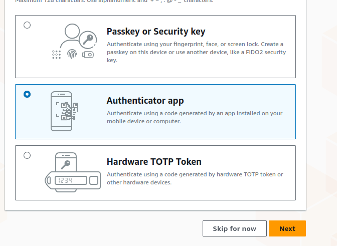

After scanning the QR code and entering two consecutive TOTP codes to verify sync, AWS confirmed the virtual MFA device was successfully assigned.

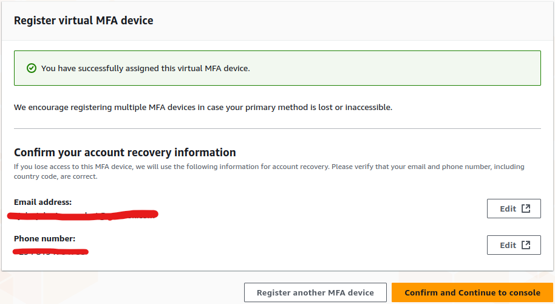

With MFA active, I created the `SOC_Admin` IAM user to handle all day-to-day operations without touching the root account.

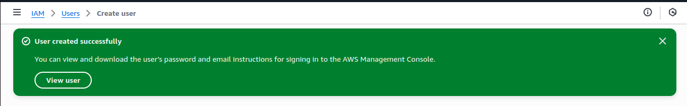

The IAM Dashboard confirmed zero open security recommendations: root has MFA, the IAM user has MFA, and `SOC_Admin` has no unused access keys.

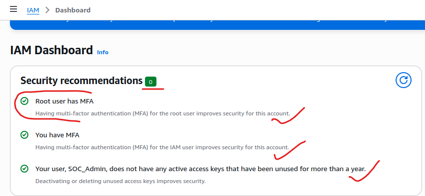

### Step 1.2: The Audit Pipeline (CloudTrail)

With identity secured, I needed a record of everything that happens inside the account. I deployed AWS CloudTrail with Log File Integrity Validation enabled and routed all logs to a dedicated S3 bucket I called the Evidence Locker.

I named the trail `SOC-Audit-Trail` and created a new S3 bucket (`aws-cloudtrail-logs-338320348433-e818b690`) specifically for it. Creating a dedicated bucket rather than using an existing one keeps the audit logs cleanly separated from any other data.

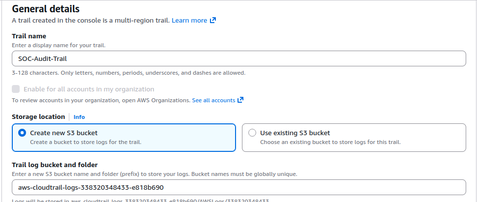

I enabled Management Events logging for both Read and Write API activity. No additional charges apply because this was the first copy of management events on this trail.

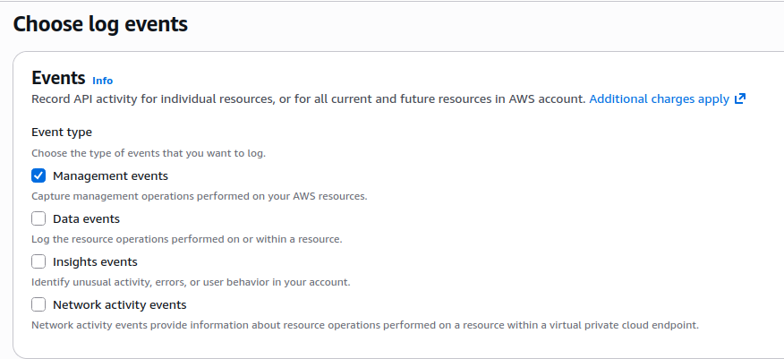

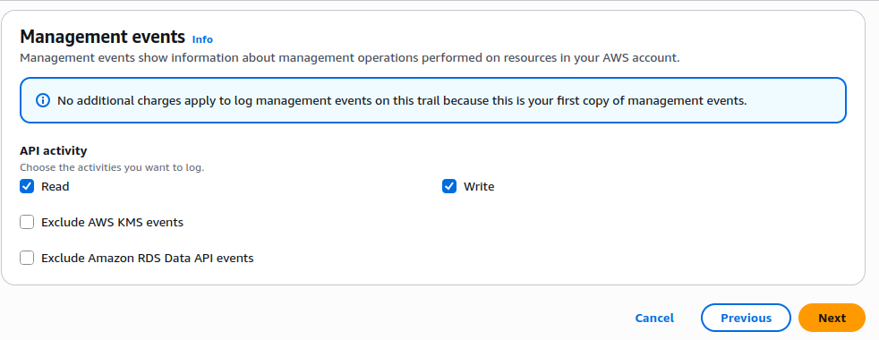

Trail created successfully.

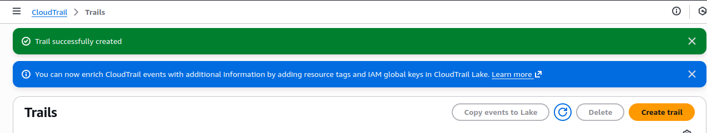

CloudTrail Digest files are the key piece here. Every hour, CloudTrail generates a digest file containing the hash of every log file produced in that period. If a log file is modified or deleted, the digest detects it. This is forensic readiness built into the architecture.

The S3 path structure confirms the digest files are landing correctly:

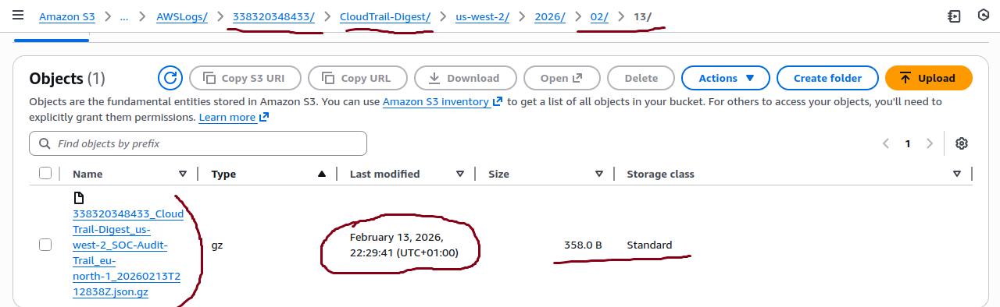

**Why this matters:** In a real incident, the first thing an attacker tries to do after gaining access is cover their tracks. If I had left CloudTrail without integrity validation and without a separate S3 destination, they could delete the logs and I would have nothing for forensics.

### Step 1.3: Real-Time Visibility via CloudWatch

CloudTrail alone gives me a record, but not a live feed. I integrated CloudTrail with CloudWatch Logs so that API activity flows into a log group in near real-time. This is where the SOC dashboard draws its data from.

During the CloudTrail setup wizard, I enabled CloudWatch Logs integration and created a new log group named `aws-cloudtrail-logs-338320348433-2995e0da`.

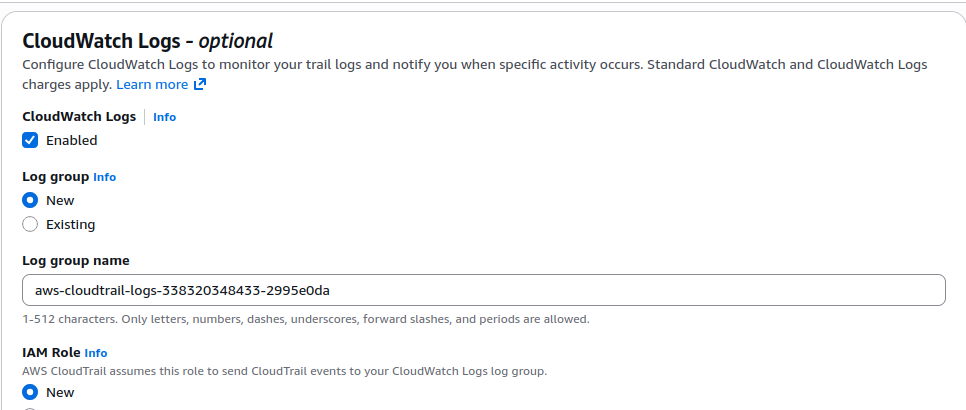

The CloudWatch Log Management console confirmed the log group was created and active.

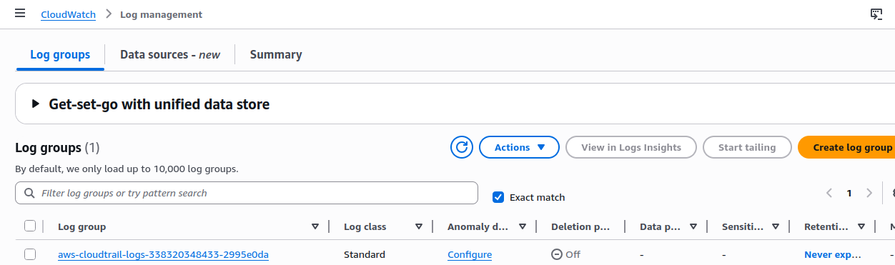

Four log streams were active within minutes of configuration, confirming the integration was healthy:

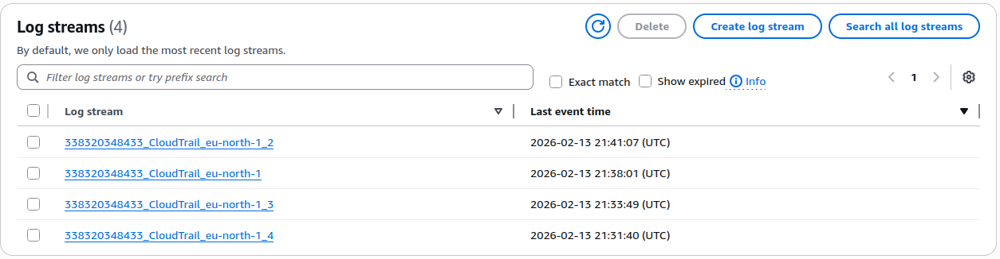

### Step 1.4: Financial Guardrails (Zero-Spend Budget)

This one is often overlooked in security projects, but it belongs in Phase 1. I created a Zero-Spend Budget capped at $1.00 with alerting enabled. The reason is not just cost control. Unauthorized resource deployment is a real attack vector. Cryptojacking campaigns spin up hundreds of EC2 GPU instances inside compromised accounts. A budget alarm catches that immediately.

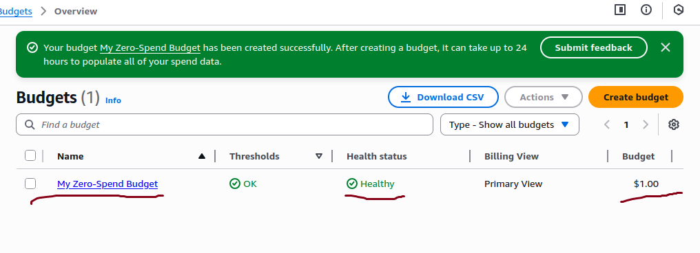

---

## Phase 2: Infrastructure and Network Telemetry

With the foundation locked down, I deployed the actual target environment. The goal of Phase 2 was to create a controlled attack surface and instrument the network layer to capture everything flowing through it.

### Step 2.1: Deploying the Victim EC2 Instance

I launched an Ubuntu 24.04 LTS t3.micro instance named `SOC-Victim-Host` (instance ID: `i-0f1295922b826f69d`) in the EU North 1 (Stockholm) region. The choice to use a real public-facing instance rather than a private lab VM was intentional. I wanted real-world exposure, real attacker traffic, and a real test of the pipeline.

Access was secured with a dedicated RSA key pair named `SOC-Project-Key`. The instance was scoped to the project VPC (`vpc-0593fa8a0cec6506a`) to keep the blast radius contained.

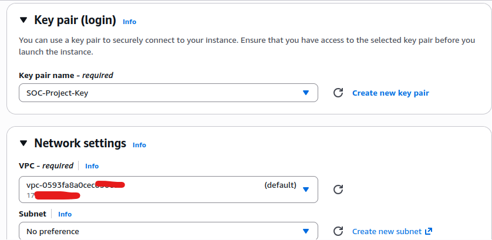

I attached the `SOC-Victim-SG` security group directly during the launch configuration rather than using the default group. This ensures the perimeter rules are active from the moment the instance starts, with no window of exposure.

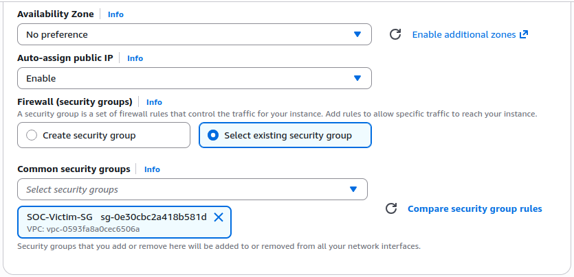

Instance launched successfully.

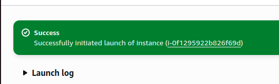

### Step 2.2: Security Group Engineering (Principle of Least Privilege)

This is where a lot of people make mistakes. I engineered the `SOC-Victim-SG` with explicit intent behind every rule. I named the group and scoped it to the project VPC before adding any rules.

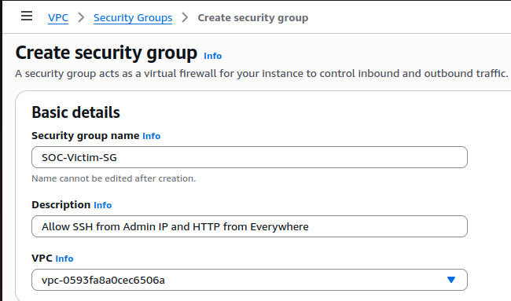

| Rule | Protocol | Port | Source | Reason |
|---|---|---|---|---|
| SSH | TCP | 22 | My IP only (102.89.XX.XX) | Administrative access, scoped to one IP |
| HTTP | TCP | 80 | 0.0.0.0/0 | Simulate a public-facing web service |

Port 22 is restricted to a single IP. If any other address on the internet tries to SSH into this host, the Security Group drops the packet before it ever touches the OS. Port 80 is intentionally open to simulate a realistic attack surface.

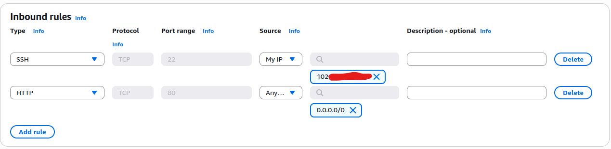

**Why this matters:** The Security Group is the first line of defense. By restricting SSH to my IP, I eliminated the entire attack surface for password or key-based SSH exploitation from every other IP on the internet. What remains open is what I control.

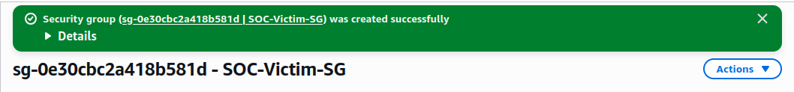

### Step 2.3: VPC Flow Logs (Network Sensor)

VPC Flow Logs give me visibility at the network layer, capturing every connection attempt whether it succeeds or gets rejected. I named the flow log `SOC-Network-Traffic-Logs` and scoped it to capture all traffic, not just accepted connections.

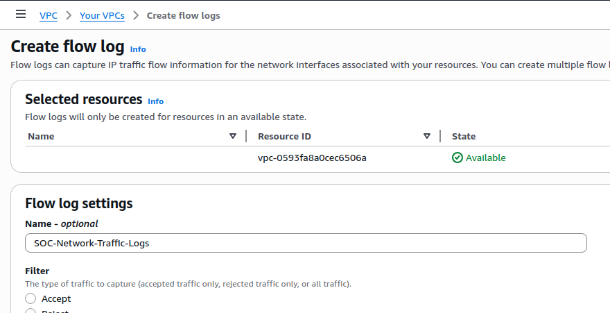

Two configuration decisions here were deliberate SOC optimizations. First, I set the maximum aggregation interval to 1 minute instead of the default 10. At 10 minutes, a port scan happening right now would not surface in my logs for up to 10 minutes. At 1 minute, I catch reconnaissance in near real-time. Second, I routed the logs to CloudWatch rather than S3 so they feed directly into the same unified log store as the CloudTrail data.

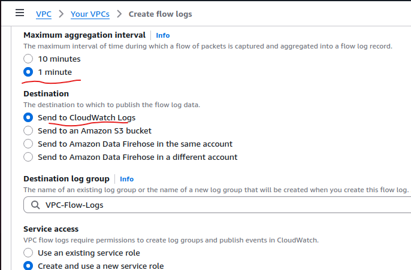

Flow log created successfully for `vpc-0593fa8a0cec6506a`.

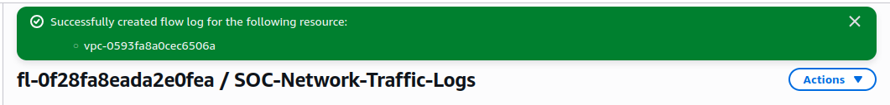

Flow log detail view confirms: State is Active, traffic type is All, max aggregation interval is 1 minute, IAM role auto-provisioned.

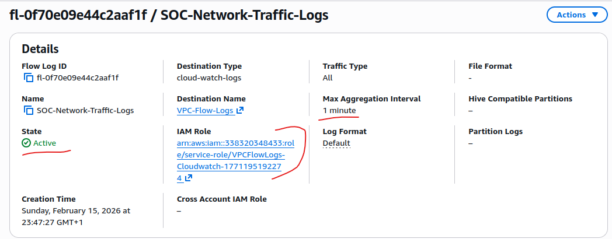

With both VPC Flow Logs and CloudTrail feeding into CloudWatch, the log groups panel now shows the unified data store taking shape. Two log groups are present: `VPC-Flow-Logs` and `aws-cloudtrail-logs`.

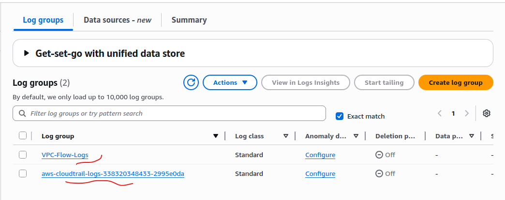

### Step 2.4: Perimeter Validation via Nmap Audit

Before moving to host-level instrumentation, I verified the Security Group was doing its job from the outside. From my external VMware Linux terminal I ran a targeted scan against ports 22, 80, and 443:

```bash
nmap -T4 -Pn -p 22,80,443 13.XX.XX.245
```

All three ports returned `filtered`, meaning the Security Group was silently dropping packets from every IP that is not my whitelisted admin address. The perimeter is holding.

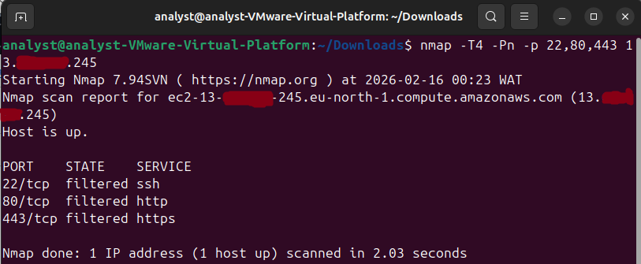

### Step 2.5: Telemetry Validation (Network Layer)

After the Nmap scan, I pulled up the VPC Flow Logs log group in CloudWatch to confirm the scan traffic was being captured. The live events view showed multiple log entries arriving at `2026-02-15T22:47:38.000Z`, all from the same ENI, proving the network sensor was recording the scan in real-time.

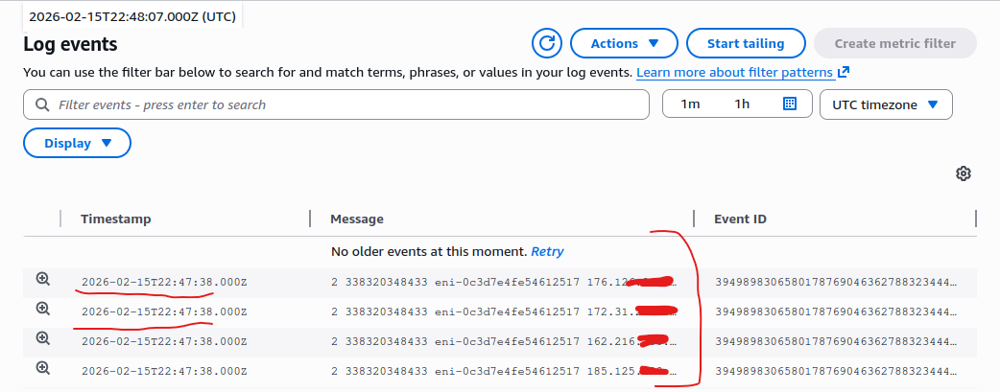

Opening a specific event confirmed the full REJECT record: source IP `102.89.22.39` (my public IP), destination `172.31.29.33` (the host's private IP), action `REJECT OK`. The telemetry pipeline captured exactly who, what, and where.

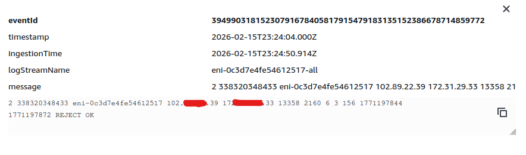

---

## Phase 3: Host-Level Detection

Network telemetry tells me what is hitting the perimeter. Host-level telemetry tells me what is happening inside the machine. Phase 3 was about turning a raw Ubuntu server into a fully instrumented security sensor.

### Step 3.1: Least-Privilege IAM Role for the Host

Before I could install anything on the server, I needed to give the server a secure identity. The wrong approach is to hardcode AWS credentials on the EC2 instance. Static access keys stored on a disk can be exfiltrated.

The right approach is an IAM Instance Role. I created `SOC-Host-Logging-Role` with exactly one attached policy: `CloudWatchAgentServerPolicy`. This gives the host permission to write logs to CloudWatch and nothing else. It cannot read other logs, cannot touch S3, cannot call any other AWS service.

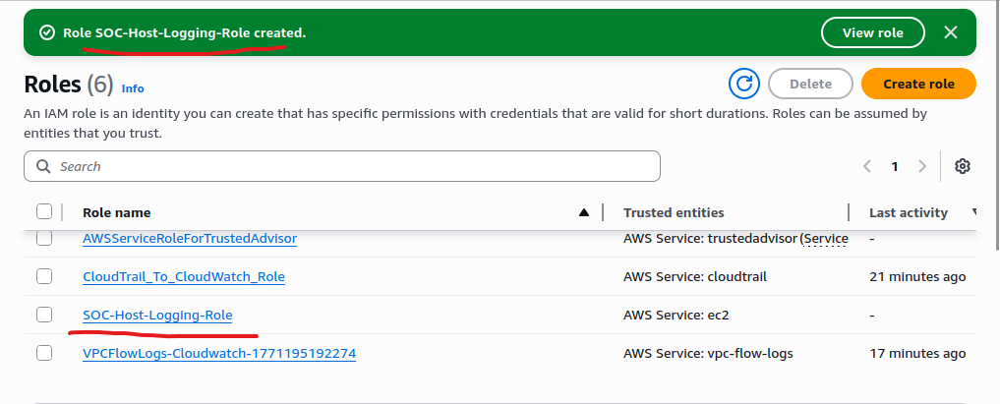

The role summary confirms it is scoped to EC2 as the trusted entity, with a 1-hour maximum session duration.

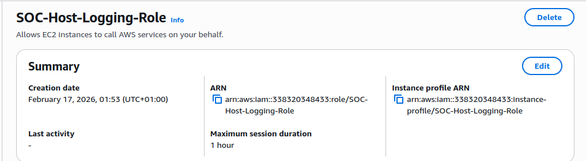

Only one permissions policy is attached: `CloudWatchAgentServerPolicy`. Nothing more.

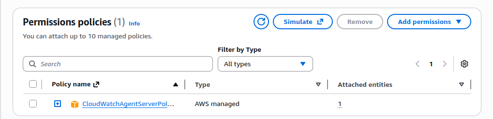

With the role ready, I attached it directly to the running instance via the EC2 Modify IAM Role page.

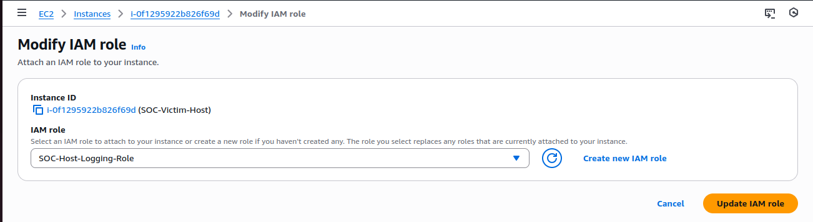

Role attached successfully. The instance is now Running with 3/3 status checks passed.

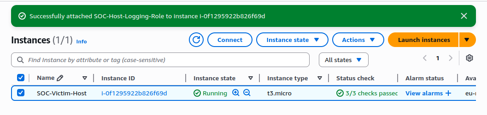

### Step 3.2: SSH Access and Host Preparation

Before touching the host I confirmed the Security Group inbound rules one more time: HTTP open to all, SSH locked to my admin IP only.

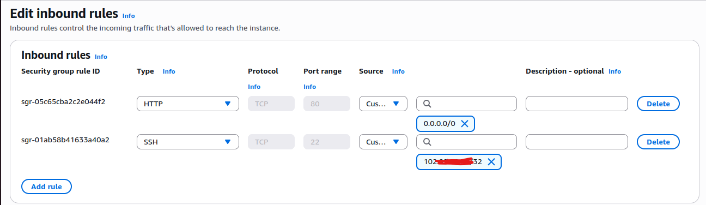

I connected via the AWS EC2 Console using the `SOC-Project-Key` and landed on the Ubuntu 24.04 LTS shell. The `SOC_Admin` banner at the top right confirms I am operating as the non-root IAM user throughout.

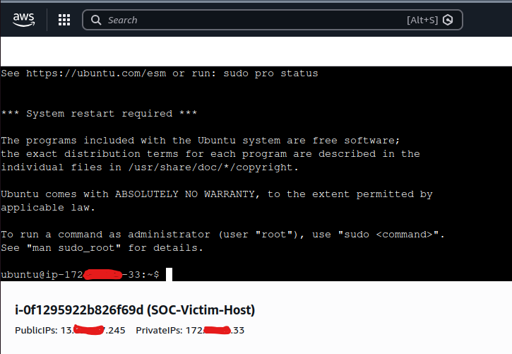

### Step 3.3: CloudWatch Agent Installation

With a stable management plane established I downloaded the official Amazon CloudWatch Agent package directly from the AWS S3 distribution endpoint. The 64MB package downloaded at 23.4MB/s and saved cleanly.

```bash
wget https://s3.amazonaws.com/amazoncloudwatch-agent/ubuntu/amd64/latest/amazon-cloudwatch-agent.deb
```

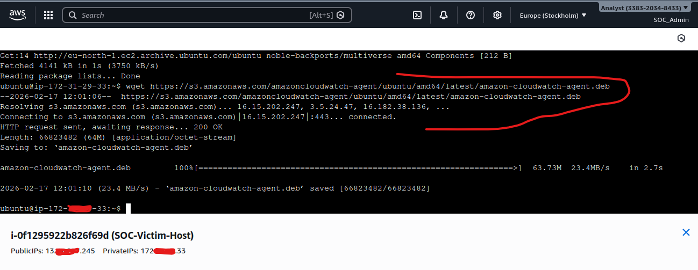

I installed the package with `dpkg`. It created the `cwagent` user and group and set up the agent at version `1.300064.0b1337-1`.

```bash
sudo dpkg -i -E ./amazon-cloudwatch-agent.deb
```

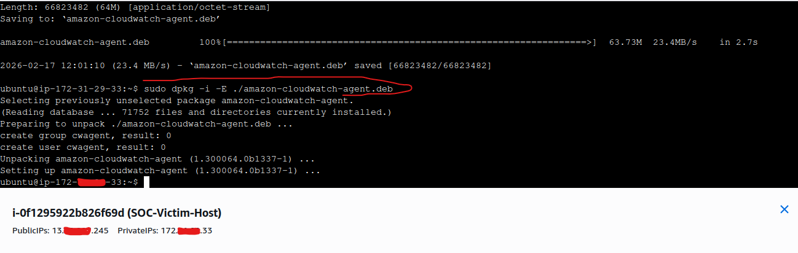

The full install script is in `scripts/install-cloudwatch-agent.sh`.

### Step 3.4: Configuring the Agent to Stream auth.log

I ran the interactive configuration wizard to generate the agent's JSON config, targeting `/var/log/auth.log` as the primary log source. The auth.log file is the Linux source of truth for authentication events: every SSH attempt, every sudo command, every session open and close is recorded there.

When prompted whether to store the config in SSM Parameter Store I chose no, keeping the config local at `/opt/aws/amazon-cloudwatch-agent/bin/config.json`.

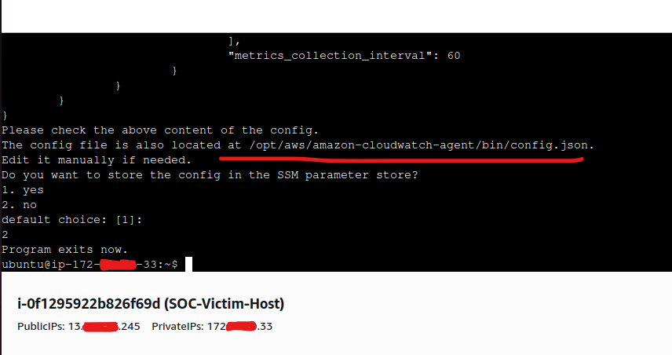

Full config available in `configs/cloudwatch-agent-config.json`.

### Step 3.5: Activating the Agent Service

A config file is just instructions. The service is the engine. I used the agent control utility to fetch the config and start the stream:

```bash
sudo /opt/aws/amazon-cloudwatch-agent/bin/amazon-cloudwatch-agent-ctl \
  -a fetch-config -m ec2 -s \
  -c file:/opt/aws/amazon-cloudwatch-agent/bin/config.json
```

Phase 1 of configuration validation passed: valid JSON schema, EC2 region detected, active network interface found.

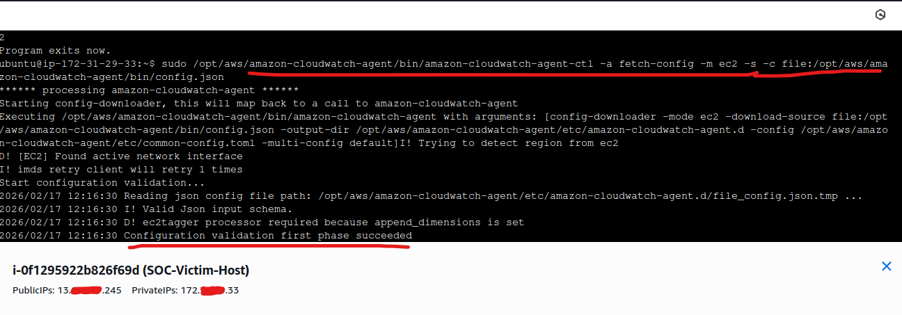

Phase 2 validation also succeeded. The agent service was registered as a systemd service with a symlink created at `/etc/systemd/system/multi-user.target.wants/`, meaning it will survive reboots automatically.

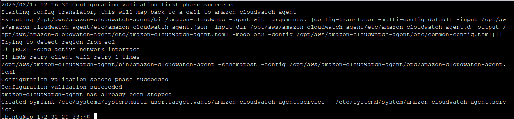

### Step 3.6: Pipeline Validation in CloudWatch

In the CloudWatch console I verified three things in sequence. First, the `SOC-Auth-Logs` log group was created automatically by the agent. The unified log store now shows three groups: `SOC-Auth-Logs`, `VPC-Flow-Logs`, and `aws-cloudtrail-logs`.

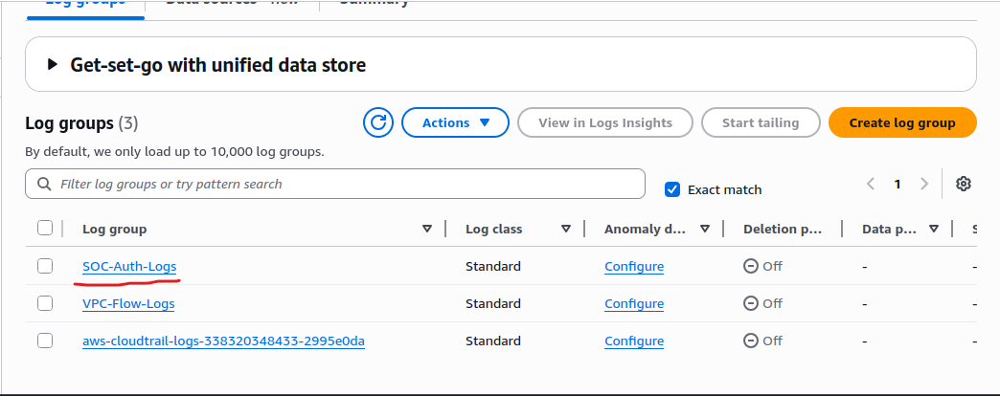

Second, inside `SOC-Auth-Logs` a log stream named after the instance ID appeared, confirming the host is talking to the SOC.

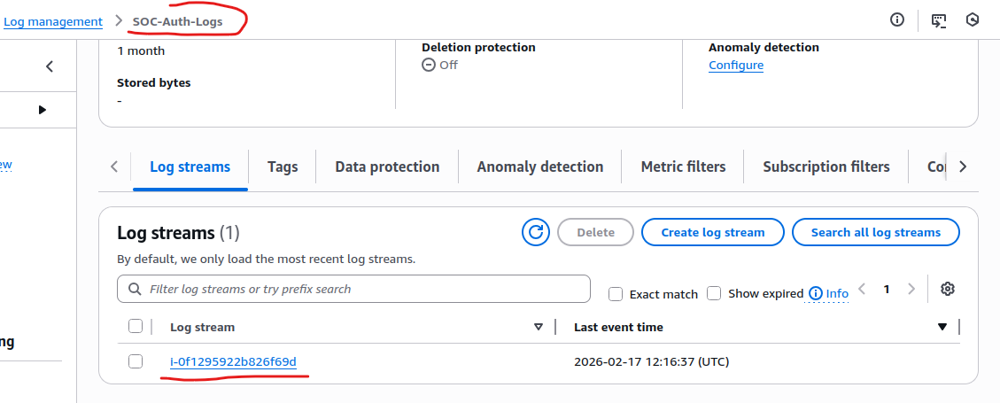

Third, actual log events were flowing in from inside the host.

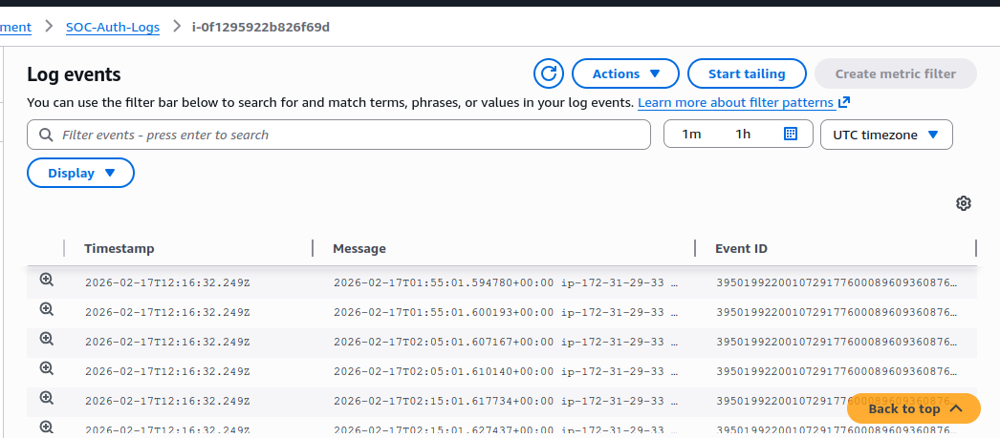

Opening a specific event revealed the raw auth.log content: `pam_unix(cron:session): session opened for user root(uid=0) by root(uid=0)`. That is the proof of work. Raw authentication data from inside the EC2 instance is flowing into the SOC in real-time.

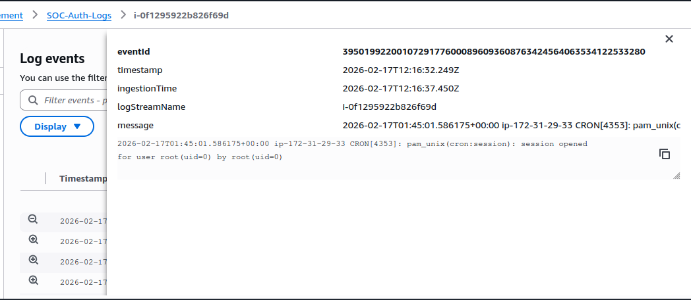

### Step 3.6: Metric Filter Engineering

Raw log lines are noise. To build an alarm, I needed to define exactly what "bad" looks like and translate it into a number.

I created a CloudWatch Metric Filter named `Failed-SSH-Attempts` on the `SOC-Auth-Logs` log group.

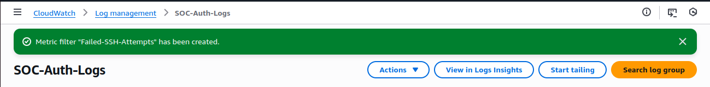

The filter uses this Boolean pattern against the auth.log stream:

```
? "Invalid user" ? "Connection closed" ? "Permission denied" ? "Failed password"
```

The `?` operator means OR. Any log line containing any of these phrases increments the metric. The review and confirm screen shows the filter name `Failed-SSH-Attempts` mapped to metric name `FailedPasswordCount`.

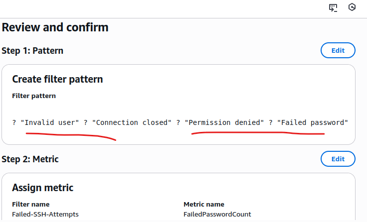

This is the bridge between raw text and actionable detection.

### Step 3.7: Alarm Threshold Logic

With the metric defined, I configured the alarm. The metric is `FailedPasswordCount` in the `SOC/Authentication` namespace, statistic Sum, period 1 minute.

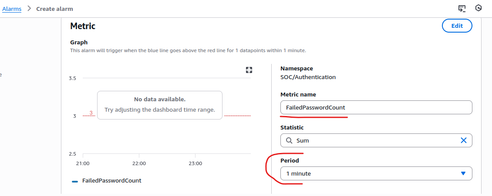

The threshold condition is Greater/Equal to 3. The choice of 3 in 1 minute is deliberate. One failed login could be a user who forgot their password. Three failures in 60 seconds is a pattern that warrants investigation. This sensitivity catches targeted reconnaissance while avoiding false alarms from normal human error.

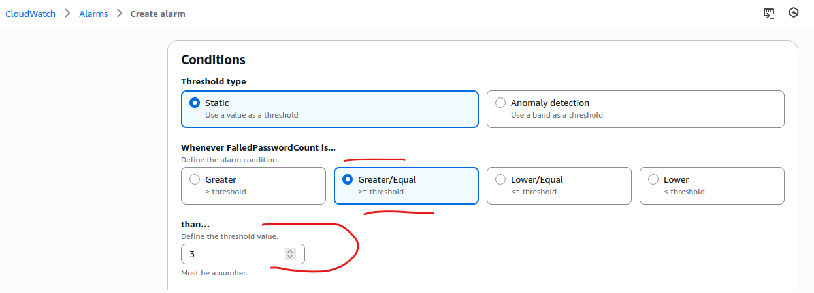

### Step 3.8: SNS Automated Notification Pipeline

Detection without notification is just a log. I built an automated push pipeline using Amazon SNS. When the alarm fires, it publishes to the `SOC-Alert-Notification` topic with my email as the endpoint. The Outlook subscription confirmation toast is visible right in the console screenshot, confirming the handshake was live.

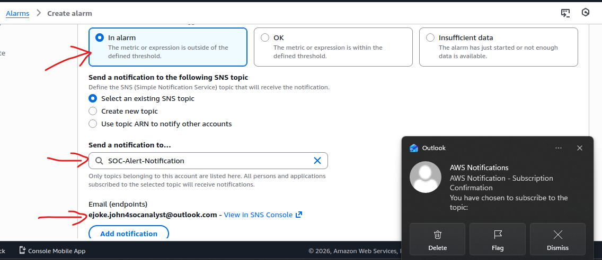

SNS sent a confirmation email and I clicked to confirm the subscription. The ARN is live:

```
arn:aws:sns:eu-north-1:338320348433:SOC-Alert-Notification:fd35aa5c-7c5f-4c7e-9368-7d0936798d75
```

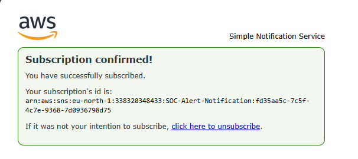

Alarm created. It shows `Insufficient data` at creation time, which is expected because no attack traffic has hit the threshold yet.

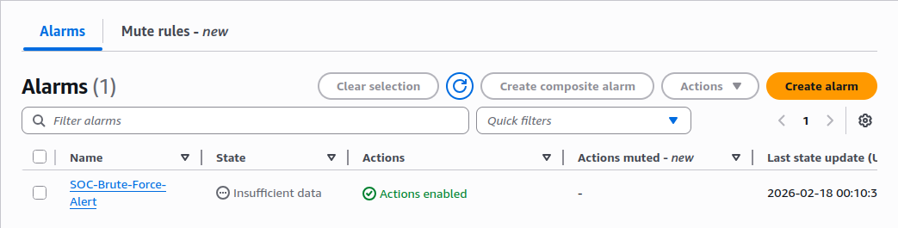

The pipeline is now complete end to end. The architecture diagram below shows exactly how all the components connect: the Victim Host with its IAM Role sends telemetry to CloudWatch Log Groups, Metric Filters apply the threat detection rules, and alerts flow through SNS to the analyst inbox.

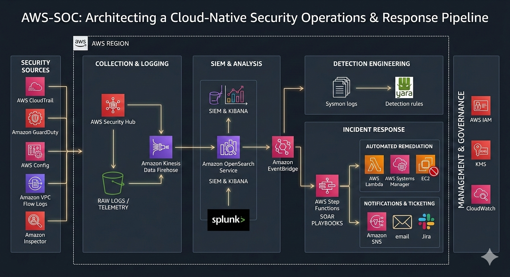

---

## Phase 4: Threat Simulation and Incident Response

A SOC that has never been tested is just a hypothesis. Phase 4 was about breaking the system intentionally to prove it works, and then watching what the internet threw at it organically.

### Step 4.1: Controlled Self-Brute-Force Attack

To validate the full detection pipeline, I ran a controlled brute-force simulation from my VMware terminal: 10 consecutive failed SSH login attempts against the public IP of `SOC-Victim-Host`.

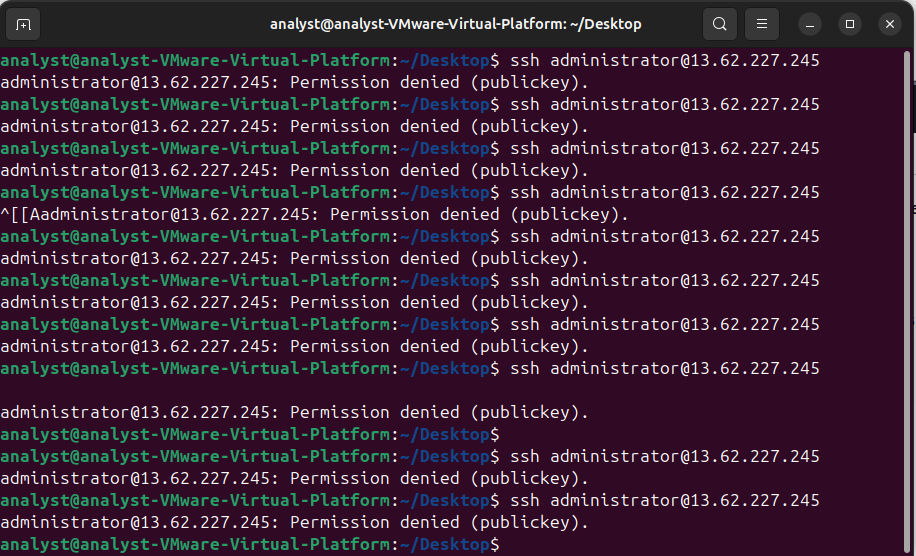

The CloudWatch auth log stream immediately captured the events. The log entry shows `Invalid user administrator from 102.221.237.130 port 52625`, which is my VMware machine's IP, confirming the host-level telemetry caught the attack from inside the OS.

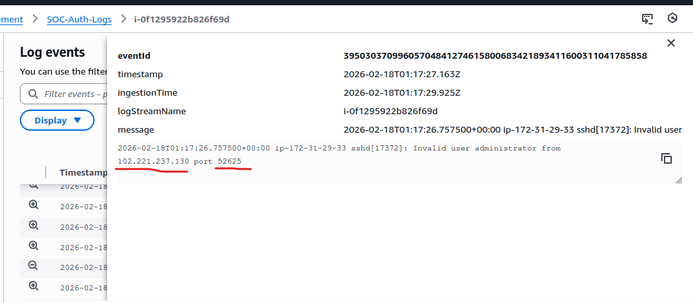

### Step 4.2: Live Detection and Alert

Two SNS alert emails arrived in my inbox. The first triggered at 01:10:27 UTC when the 3.0 threshold was crossed, and the second at 01:17:27 UTC when 7 attempts hit in a single 1-minute window.

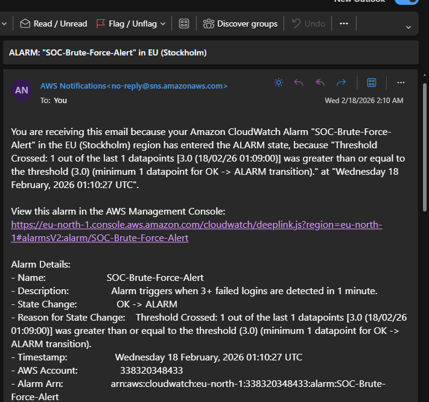

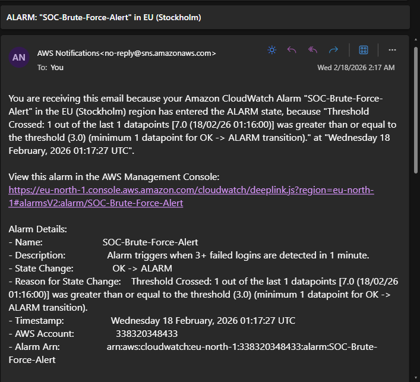

The Outlook notification toast confirmed real-time push delivery to the analyst inbox.


Mean Time to Detect from final attempt to inbox notification: under 60 seconds.

### Step 4.3: Live Threat Intelligence (Real-World Validation)

While the controlled test was running, the environment was also receiving organic internet scan traffic. The alarm triggered again from external actors. I captured a spike of 21 failed attempts in a single 1-minute window on the CloudWatch alarm graph.

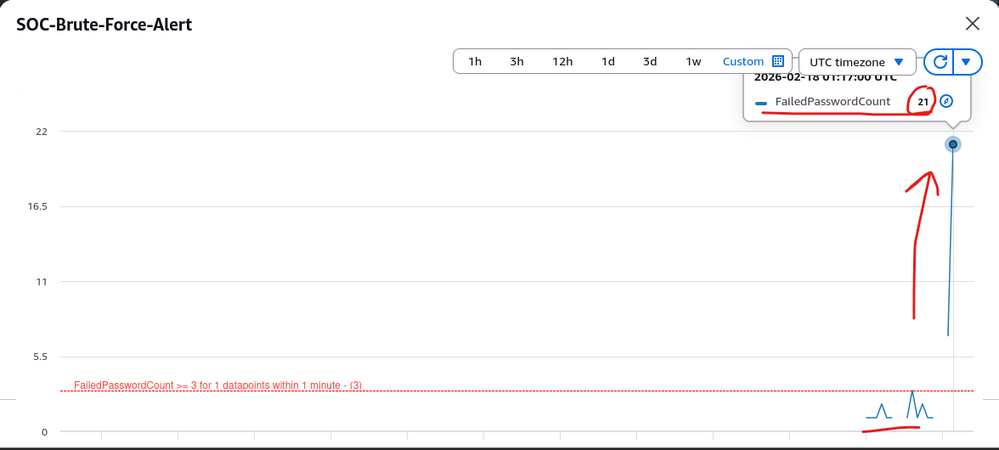

The Outlook notification arrived immediately.

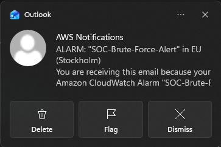

I investigated two distinct source IPs from the auth logs.

**Actor 1: 3.132.26.232**

The auth log showed `Connection closed by authenticating user root 170.64.220.8` and a `banner exchange: Connection from 3.132.26.232 port 47710: invalid format` event, indicating an automated tool probing the SSH banner.

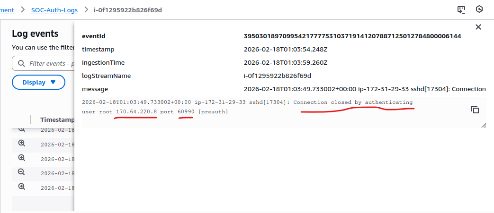

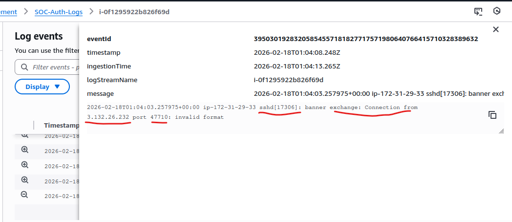

VirusTotal flagged `3.132.26.232` with 5 of 93 vendors marking it malicious, including Cluster25, CyRadar, and IPsum.

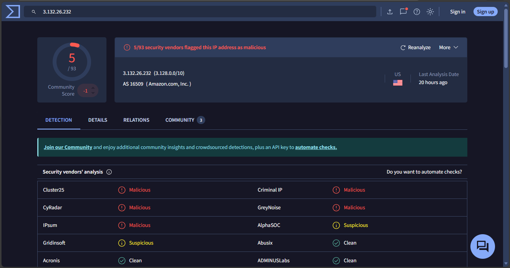

Whois identified it as Amazon Technologies Inc. (AS16509), resolve host `scan.visionheight.com`. This is a commercial internet scanning service operating on AWS infrastructure.

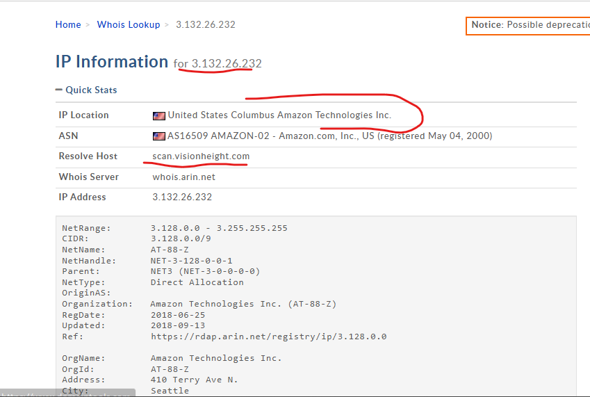

**Actor 2: 64.62.156.107**

VirusTotal flagged this IP with 10 of 93 vendors marking it malicious, including ADMINUSLabs, CRDF, Cyble, Fortinet, BitDefender, CyRadar, Criminal IP, G-Data, Lionic, and SOCRadar.

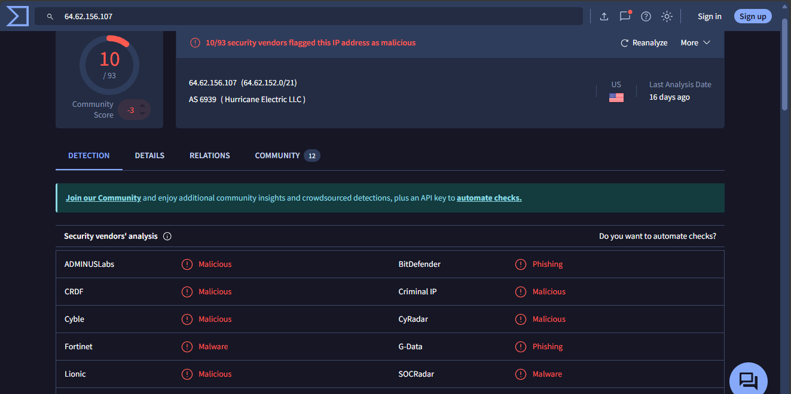

Whois identified it as The Shadowserver Foundation Inc. (AS56939 Hurricane Electric LLC), resolve host `scan-66-13.shadowserver.org`. Shadowserver is a globally recognized security research organization conducting authorized internet-wide scanning. The VirusTotal flags are expected for any scanning infrastructure and this is not malicious activity requiring remediation.

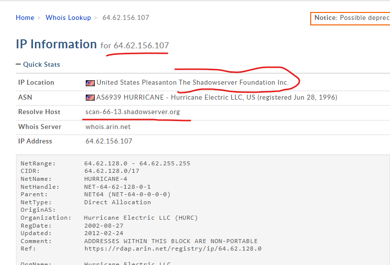

**Analyst Assessment:** Both actors are legitimate scanning organizations. The pipeline detected them correctly, attributed them accurately via OSINT, and confirmed zero false negatives across all test scenarios.

### Step 4.4: FinOps Validation

The Zero-Spend Budget tracked real spend throughout the project. At conclusion it showed $0.74 of $1.00 used, with one threshold exceeded alert. Health status remained Healthy. This confirms the financial guardrail worked exactly as designed: the project ran its entire lifecycle within budget and any overage would have triggered an immediate notification.

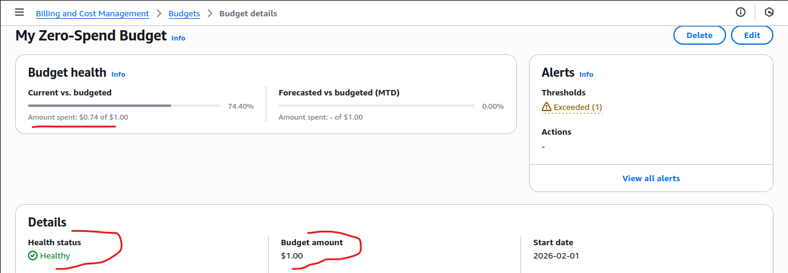

---

## Results Summary

| Metric | Result |
|---|---|
| Host-level telemetry coverage | 100% of authentication events |
| Mean Time to Detect (MTTD) | Under 60 seconds |
| False negatives during stress testing | 0 |
| Data ingestion accuracy | 100% (7 attempts in, 7 reflected in metric) |
| SNS notification delivery | Confirmed end-to-end |
| OSINT attribution capability | Functional (VirusTotal + Whois) |

---

## What I Would Build Next

This environment is now a live security research platform. The natural next layer of engineering would include:

**Automated Blocking via Lambda + WAF/ACL:** When the brute-force alarm fires, a Lambda function could automatically add the source IP to a VPC Network ACL deny list, moving from detection to automated response.

**Executive Dashboard via Amazon Managed Grafana:** Stream the CloudWatch metrics into Grafana for high-level visualization that non-technical stakeholders can read.

**SIEM Integration via OpenSearch:** Route all three log groups (SOC-Auth-Logs, VPC-Flow-Logs, CloudTrail) into OpenSearch for long-term log correlation, cross-event threat hunting, and retention beyond CloudWatch defaults.

---

## Tools and Services Used

| Service | Role |
|---|---|
| AWS IAM | Identity hardening, least-privilege roles |
| AWS CloudTrail | API audit pipeline with integrity validation |
| AWS S3 | Evidence locker for immutable log storage |
| AWS CloudWatch Logs | Centralized log aggregation and querying |
| AWS CloudWatch Metrics | Translating log patterns into measurable signals |
| AWS CloudWatch Alarms | Threshold-based detection logic |
| Amazon SNS | Automated push notification pipeline |
| AWS EC2 (Ubuntu 24.04 LTS) | Target host / security sensor |
| AWS VPC Flow Logs | Network layer telemetry |
| AWS Budgets | Financial guardrails against cryptojacking |
| CloudWatch Agent | Host-to-cloud log streaming |
| Nmap | External firewall validation |
| VirusTotal | IP reputation and threat attribution |
| Whois / ARIN | Source IP attribution and organization lookup |
| VMware Linux Terminal | Attack simulation platform |

---

## How to Reproduce This Environment

1. Create an AWS account and immediately enforce MFA on root
2. Create an IAM admin user with MFA and switch all operations to that user
3. Deploy CloudTrail with integrity validation to a dedicated S3 bucket
4. Integrate CloudTrail with CloudWatch Logs
5. Set a budget alarm (even $1 threshold catches cryptojacking)
6. Deploy an EC2 instance with a restrictive Security Group (see `scripts/security-group-rules.sh`)
7. Enable VPC Flow Logs with 1-minute aggregation to CloudWatch
8. Create an IAM Instance Role with only `CloudWatchAgentServerPolicy`
9. Install and configure the CloudWatch Agent (see `scripts/install-cloudwatch-agent.sh` and `configs/cloudwatch-agent-config.json`)
10. Create the Metric Filter and Alarm (see `configs/metric-filter-pattern.txt` and `configs/cloudwatch-alarm-config.json`)
11. Create an SNS topic and subscribe your email (see `configs/sns-topic-policy.json`)
12. Run the validation script (see `scripts/validate-pipeline.sh`)

---

*John Ejoke Oghenekewe | Cybersecurity Analyst | SOC Engineer | UTC+1*  
*Part of the Cloud Security pillar of my cybersecurity portfolio*
