# Architecting a Secure 2-Tier E-Commerce Infrastructure on AWS

**John Ejoke Oghenekewe** | Cybersecurity Analyst | SOC Engineer | UTC+1

---

## What I Built and Why It Matters

Most entry-level cloud deployments I have seen make the same mistake: they throw the application and the database onto a single server, call it done, and move on. That architecture is a single point of failure and a serious security liability. A single compromised process gains access to everything.

I did not build that.

What I engineered here is a hardened, decoupled 2-Tier Architecture on AWS, deploying PrestaShop 8.1.5 as a production-grade e-commerce platform where the web layer and the data layer are physically separated, independently secured, and connected only through a deliberate, locked-down channel. Every decision in this project was made with a security rationale behind it.

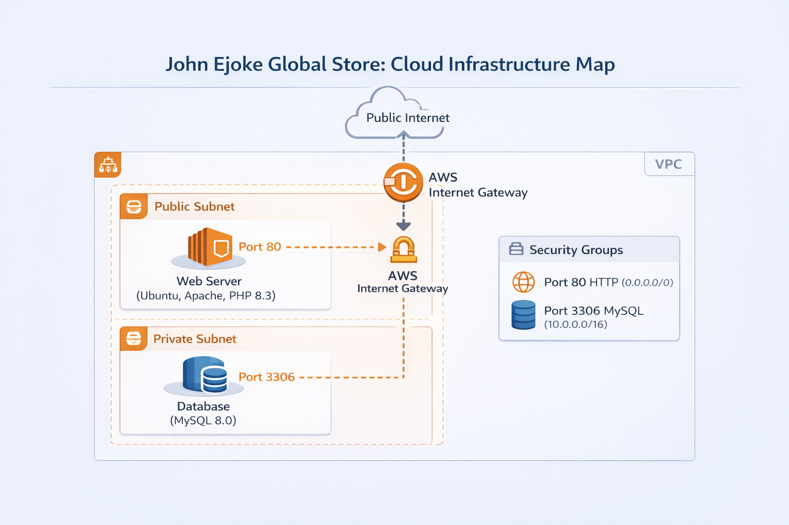

The diagram above shows the full architecture. The web server sits in a public subnet, reachable by users on Port 80. The database sits in a private subnet, invisible to the internet, reachable only from the web tier on Port 3306. Traffic flows through an AWS Internet Gateway. Security Groups act as stateful firewalls at every boundary. This is not an accident. This is the design.

**Live URLs (at time of deployment):**
- Public Store: `http://16.16.204.66/prestashop/index.php`
- Admin Panel: `http://16.16.204.66/prestashop/admin201xpyjv8vnw4dbv5vt`

---

## Project Architecture: The 4-Phase Strategy

I structured this deployment into four sequential phases. Each phase had to be complete and verified before the next one began. You do not build on an insecure foundation.

- **Phase 1: Network and Security Guardrails** -- I configured the virtual firewalls before any compute or database resources existed. Security comes first.
- **Phase 2: The Data Vault (RDS Provisioning)** -- I deployed a managed MySQL instance with a private-access-only policy.
- **Phase 3: The Web Interface (EC2 Deployment)** -- I provisioned the Linux application server, hardened the OS, and installed the LAMP stack.
- **Phase 4: Application Orchestration** -- I deployed PrestaShop, established the database handshake, and validated the live environment.

---

## Phase 1: Network and Security Guardrails

Before I provisioned a single server or database, I built the security perimeter. This is the correct order of operations. You define who is allowed in before you open the doors, not after.

I deployed two distinct Security Groups, each with a specific role and a specific scope.

---

### PrestaShop-Web-SG: The Public Perimeter

I created this Security Group to act as the perimeter firewall for the web tier. It has exactly two inbound rules and nothing else.

The first thing I configured was the name and description. Clear naming is part of governance. When an auditor or teammate looks at this security group six months from now, they should be able to understand its purpose from the name alone.

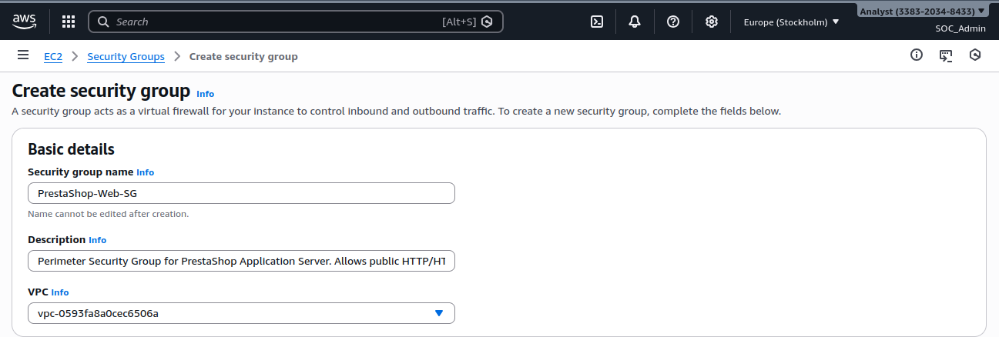

I then set the inbound rules. HTTP on Port 80 is open to the world so that customers can reach the storefront. SSH on Port 22 is locked to my management IP only. This is not optional. SSH open to 0.0.0.0/0 is an invitation to brute-force attacks.

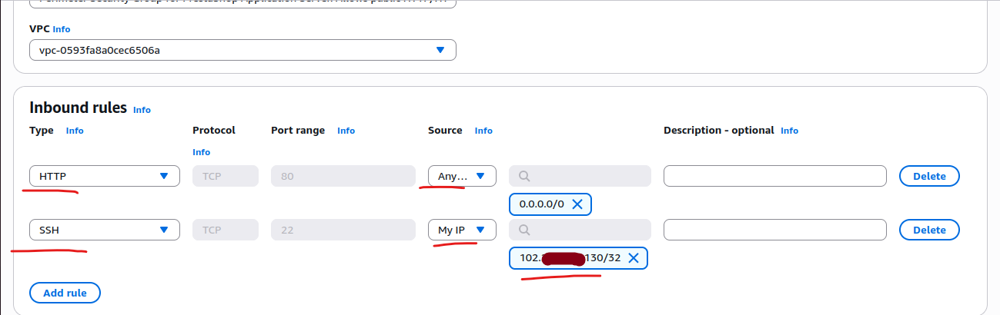

The green banner confirmed the security group was created successfully. PrestaShop-Web-SG is live and assigned its unique security group ID, which I will reference in the database tier.

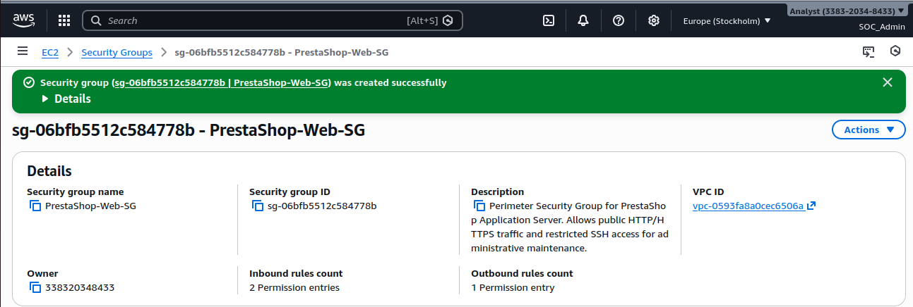

---

### PrestaShop-DB-SG: The Data Vault Gate

The database security group has one job: block everything except MySQL traffic arriving from the web tier. Not from an IP address. From the security group itself.

I named and described this group clearly before configuring it. The description explicitly states that this is an internal data layer group enforcing MySQL isolation via security group chaining.

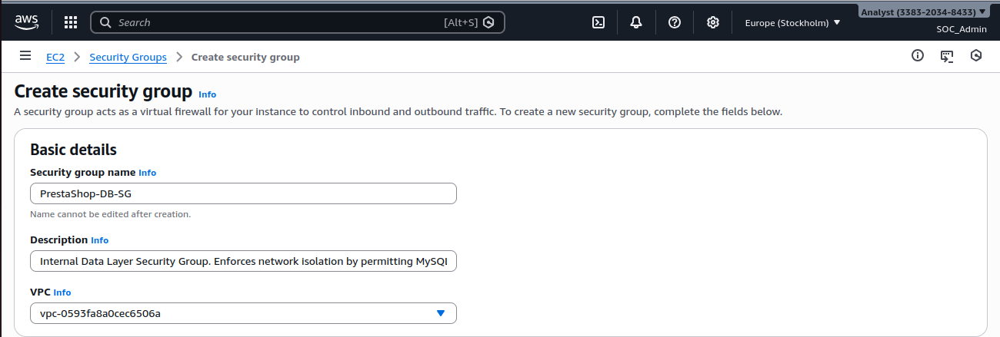

The creation was confirmed with the green banner and the security group ID assigned.

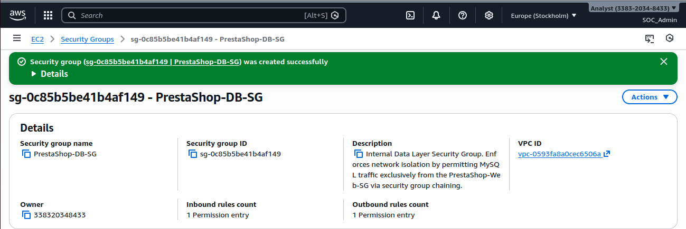

With both groups created, I wired the final lock. The DB SG inbound rule is Type: MYSQL/Aurora, Protocol: TCP, Port: 3306, Source: the security group ID of PrestaShop-Web-SG. I am not typing an IP range. I am referencing the web security group directly. This is security group chaining. It means only EC2 instances carrying the PrestaShop-Web-SG tag can reach the database, regardless of what IP address they happen to have.

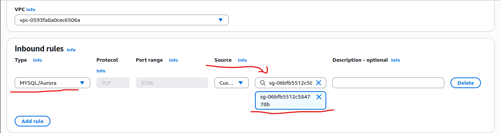

The engineering logic here is important. By chaining security groups instead of using IP ranges, I eliminated the risk of misconfiguration if the web server IP changes. The trust relationship is between the security groups, not the addresses. The data vault is completely invisible to the public internet. Phase 1 is closed.

---

## Phase 2: The Data Vault (RDS Provisioning)

With the security perimeter in place, I provisioned the managed MySQL database. Every setting in this phase was a deliberate choice. I did not click through defaults.

---

### Full Configuration and MySQL Engine

I opened RDS and selected Full Configuration. Easy Create is not appropriate here. Full Configuration means I own every decision, and that is the correct posture for a security-conscious deployment. I selected MySQL as the engine because PrestaShop is built on MySQL. Using a different engine introduces compatibility risk with no security benefit.

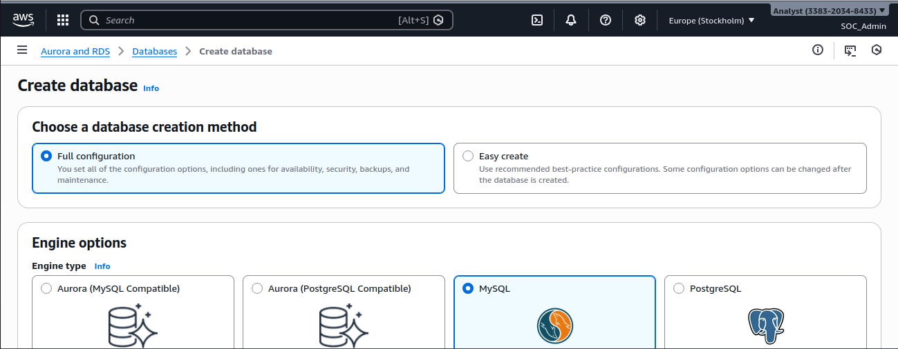

---

### Sandbox Template and Single-AZ Deployment

For the template I selected Sandbox. This is a lab environment and I am not paying for Multi-AZ standby instances I do not need. The security and network controls I am demonstrating here apply equally to a production deployment. Only the availability tier changes. For production, Multi-AZ is mandatory. I will address that in the future enhancements section.

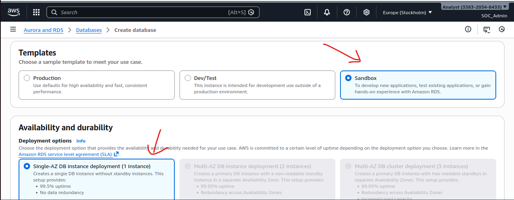

---

### Instance Identifier and Credentials

I named the DB instance `prestashop-database`. Descriptive, unambiguous, no guesswork required. For the master username I used `admin` and set credentials management to Self Managed. In a production environment you route this through AWS Secrets Manager so credentials are rotated automatically and never hardcoded. For this build, self-managed is intentional.

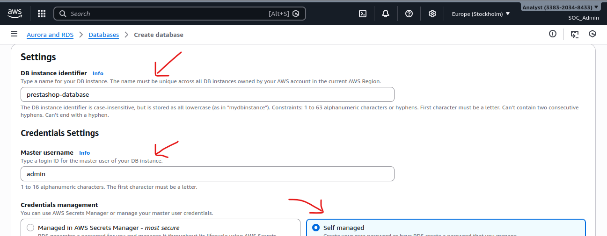

I entered a strong master password. The AWS strength indicator confirmed it. For database authentication I selected Password Authentication, which is the correct baseline for a PrestaShop deployment.

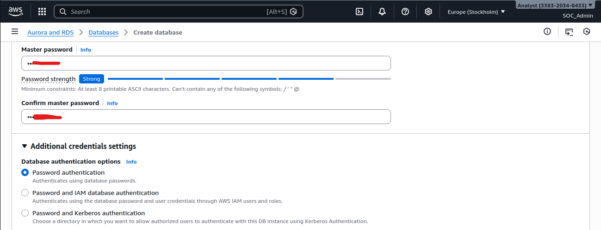

---

### Connectivity: Keeping the Database Off the Internet

I set the compute resource option to "Don't connect to an EC2 compute resource." I am managing the connection manually through the security group rules I built in Phase 1, not through the automated wizard. The database is placed in the Default VPC, giving it three subnets and three availability zones.

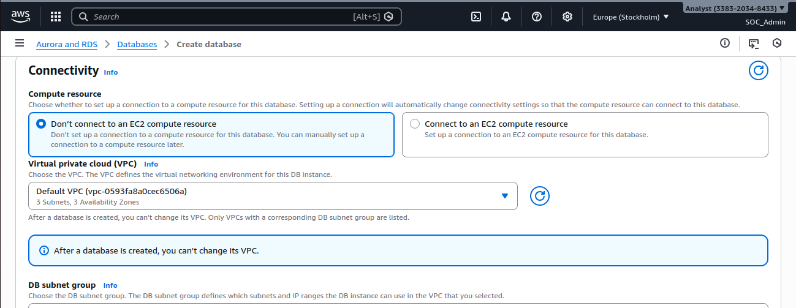

Public Access is set to No. This is non-negotiable. A database with a public IP address is an exposed database. With Public Access disabled, RDS assigns no public IP and the instance is reachable only from within the VPC. I then attached PrestaShop-DB-SG. That combination means the database has no public face and only accepts connections from the web tier through the chained security group rule.

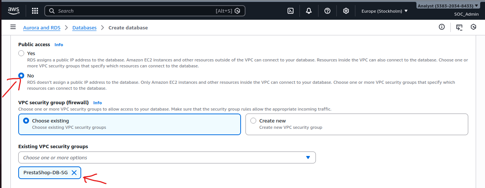

---

### Additional Configuration: Naming the Schema

In the Additional Configuration section I set the initial database name to `prestashop`. If you skip this field, RDS creates the instance but leaves you without a database inside it. PrestaShop's installer expects a named database at connection time. I set it explicitly and aligned the parameter group to `default.mysql8.4` to match the engine version.

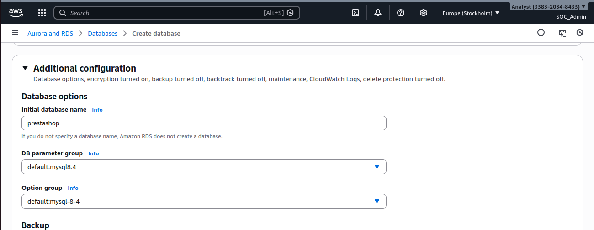

---

### Database Live and Available

After submitting the configuration, RDS provisioned the instance. The green banner appeared and the status column updated to Available. The identifier `prestashop-database` is live, running MySQL, sitting inside the VPC, not exposed to the internet, and protected by the security group I locked down in Phase 1.

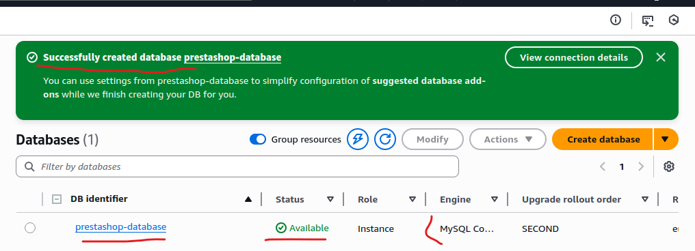

Phase 2 is complete. The data vault is provisioned and secured. The web tier does not exist yet, which means the database is currently unreachable by anything. That is exactly where I want it to be at this stage.

---

## Phase 3: The Web Interface (EC2 Deployment)

With the data vault secured and waiting, I turned to the compute layer. This phase covers provisioning the application server, establishing secure administrative access, hardening the OS baseline, and installing the LAMP stack.

---

### Ubuntu AMI Selection

I selected Ubuntu Server 24.04 LTS. LTS distributions receive five years of security patches and are production-stable. I am not running a hobbyist distro on infrastructure I am going to document and publish. The AMI is Canonical's official image at `ami-073130f74f5ffb161`, SSD-backed, HVM virtualization.

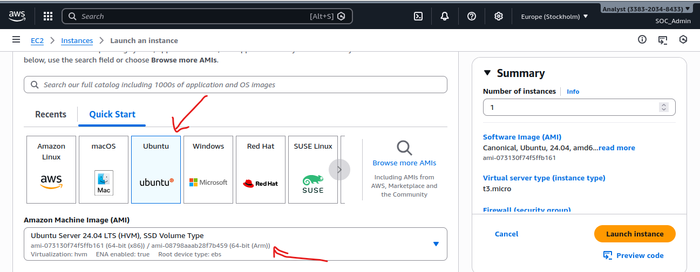

---

### Instance Type and Key Pair

I selected t3.micro as the instance type. This is free tier eligible and appropriate for a PrestaShop deployment at this scale. For the key pair I reused SOC-Project-Key, the RSA key pair I generated for my AWS-SOC project. Reusing a verified key pair follows the principle of credential hygiene. I am not creating redundant PEM files to manage and potentially lose.

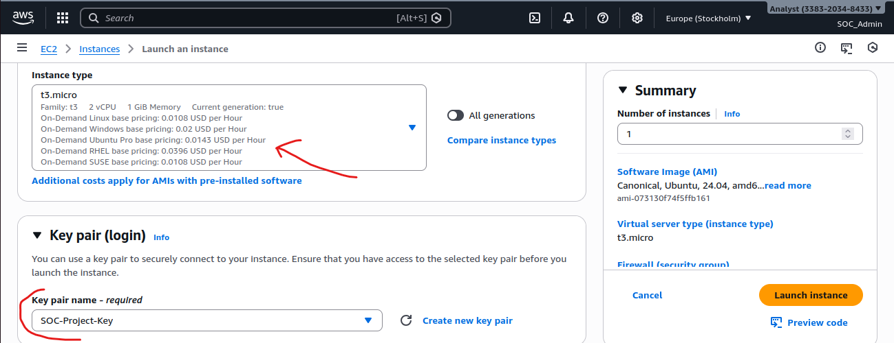

---

### Network Settings and Security Group Binding

In the Network Settings section I selected "Select existing security group" and attached PrestaShop-Web-SG. The instance inherits exactly the rules I engineered in Phase 1: Port 80 open for customer traffic, Port 22 restricted to my management IP. Auto-assign Public IP is enabled so the instance can serve as the external face of the application.

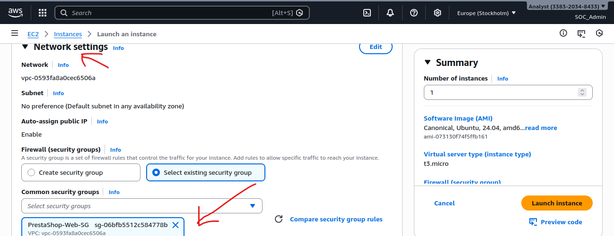

---

### Launch Confirmed

AWS confirmed the launch with the green success banner and the instance ID `i-05135a0fced370de1`.

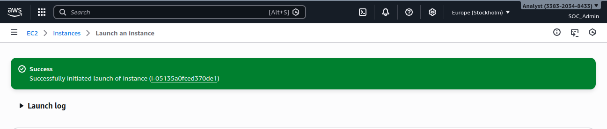

I then watched the instance reach Running state in the dashboard. The name PrestaShop-W... (truncated) confirms it is the correct instance. t3.micro, Running, Initializing status checks.

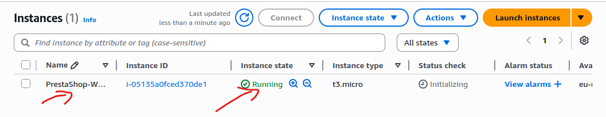

---

### Key Permission Hardening and SSH Entry

Before I could SSH into the instance, I had to harden the PEM file permissions. The SSH client will reject a key file that is too permissive. I ran `chmod 600 SOC-Project-Key.pem` to restrict access to owner-read-only. The `ls -l` output confirmed `-rw-------`, then I connected using `ssh -i SOC-Project-Key.pem ubuntu@16.16.204.66`.

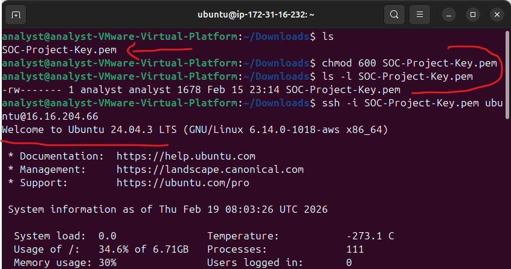

The SSH welcome screen confirmed a clean handshake. Ubuntu 24.04.3 LTS, GNU/Linux 6.14.0-1018-aws x86_64. I am in.

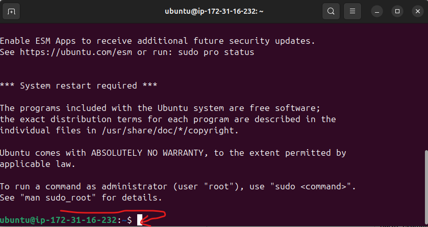

---

### OS Baseline Hardening

The first thing I ran on every new server is the full update and upgrade cycle. This patches all system binaries, libraries, and the Linux kernel against known vulnerabilities before I install anything on top. Running a web application on an unpatched OS is not a security posture. It is an open invitation.

```bash
sudo apt update && sudo apt upgrade -y
```

The terminal output confirmed all packages upgraded, service restarts deferred, no containers needing restart, no outdated hypervisor binaries. The OS baseline is secured.

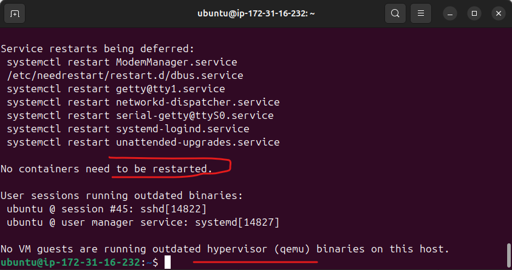

---

### LAMP Stack Installation

With the OS hardened, I installed the full LAMP stack: Apache2, MySQL client, PHP 8.3, and the required PHP extensions. PHP 8.3 is the current stable release and PrestaShop 8.1.5 requires it. The extensions I installed include GD for image processing, cURL for outbound HTTP requests, and Mbstring for multibyte string handling. All three are mandatory for PrestaShop to function correctly.

The terminal output shows `mysql-client-8.0`, `apache2-data`, `php8.3-opcache`, `php8.3-intl`, and the full dependency chain setting up cleanly. This EC2 instance is now an application server.

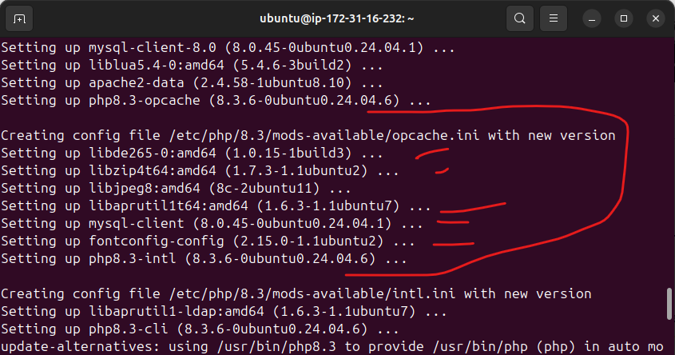

---

### Apache Validation

I navigated to the instance public IP in a browser. The Apache2 Ubuntu Default Page loaded, confirming that the web server is running, Port 80 traffic is reaching the instance through the Web SG, and the LAMP stack is operational. The infrastructure is ready for the application.

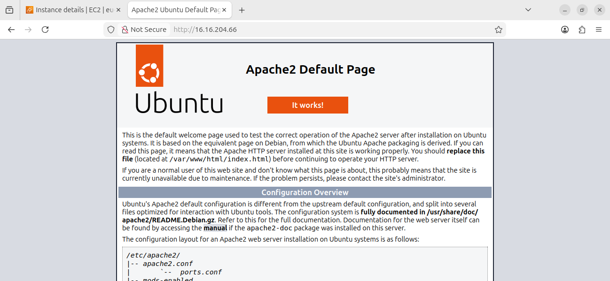

Phase 3 is complete. The application server is provisioned, OS-hardened, LAMP-equipped, and publicly reachable. Phase 4 is where the two tiers meet.

---

## Phase 4: Application Orchestration

This is where the two tiers come together. I deployed PrestaShop onto the web server, pointed its installer at the RDS endpoint, configured the store, hardened the filesystem, and validated the live environment from both the customer and administrator perspectives.

---

### PrestaShop Installer Welcome

I navigated to `http://16.16.204.66/prestashop/install` in the browser. The PrestaShop 8.1.5 Installation Assistant loaded cleanly. English selected as the installation language. The URL confirms the application files are sitting in the correct web root directory.

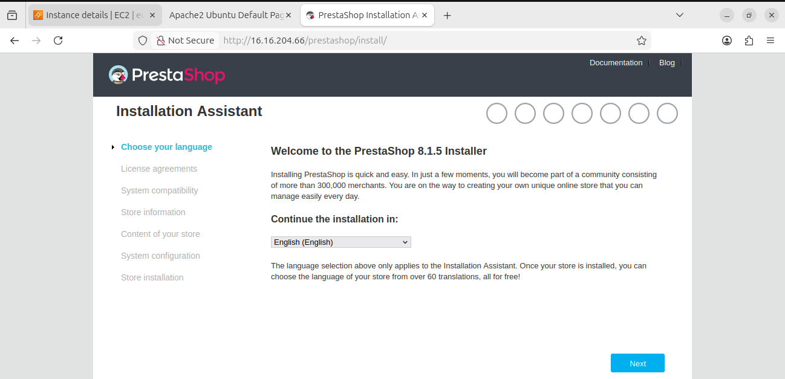

---

### PrestaShop Extraction to Web Root

Before the installer could run, I had to extract the PrestaShop zip archive into `/var/www/html/prestashop`. The terminal output shows the recursive extraction of the full application source tree, including adapter classes, session repositories, grid factories, and the `.htaccess` file. All core files are on disk and the working directory is now `/var/www/html/prestashop`.

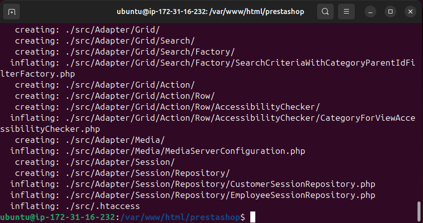

---

### PHP XML Dependency

The installer flagged a missing PHP extension during compatibility checks. I installed `php8.3-xml` immediately. This extension is required for PrestaShop to process XML-based configuration files and module definitions.

```bash
sudo apt install php8.3-xml -y
```

The package resolved cleanly: 1 newly installed, 0 errors.

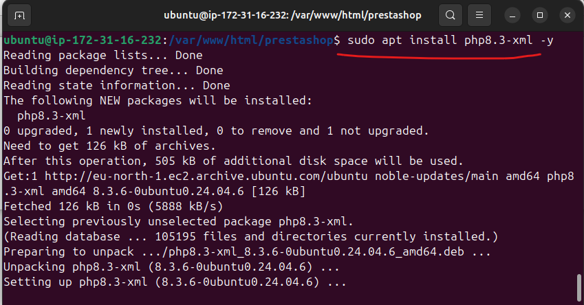

---

### cURL, Mbstring, Rewrite Module, and Apache Restart

I then ran the full dependency completion command in one chain:

```bash
sudo apt install php8.3-curl php8.3-mbstring -y && sudo a2enmod rewrite && sudo systemctl restart apache2
```

This installs the cURL and Mbstring PHP extensions, enables Apache's mod_rewrite module (required for PrestaShop's URL rewriting), and restarts Apache to apply all changes. The terminal confirmed both packages installed and Apache restarted cleanly.

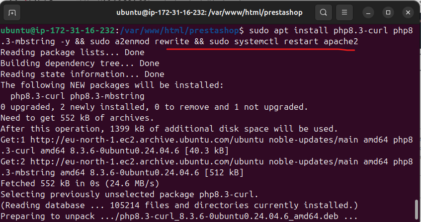

---

### Filesystem Permissions: The Final Permission Lock

With the application files in place, I applied the production filesystem permissions before the installer ran. This is the Principle of Least Privilege applied at the filesystem level.

```bash
sudo chown -R www-data:www-data /var/www/html/prestashop
sudo chmod -R 755 /var/www/html/prestashop
```

The `chown` command transfers ownership to `www-data`, which is the Apache process user. The `chmod 755` sets directories to executable and readable by all, but only writable by the owner. Core application files cannot be modified by an attacker who gains a foothold through the web process. This is the transition from installation state to production state.

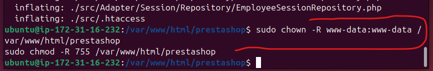

---

### Store Information and Admin Account Provisioning

Back in the installer, I completed the Store Information step. Store name: John Ejoke Global Store. Main activity: Computer Hardware and Software. Country: Nigeria. I then set up the administrative account under my professional email address `ejoke.john4socanalyst@outlook.com`. This is the root administrative user for the entire platform. All subsequent store management actions are authenticated under this identity.

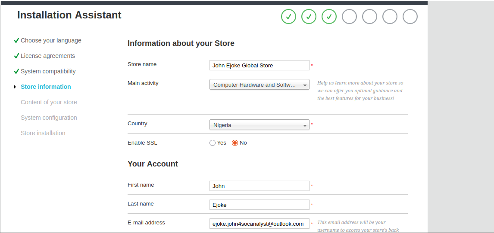

---

### Live Installation Progress: The RDS Handshake

This is the most important screenshot in the entire project. The installer is running at 23%, actively creating database tables inside the RDS instance over Port 3306. The fact that this progress bar is moving is proof that the 2-Tier Architecture is working. The EC2 application layer is talking to the RDS data layer through the chained security group rules I set up in Phase 1. File parameters created. Database tables being built.

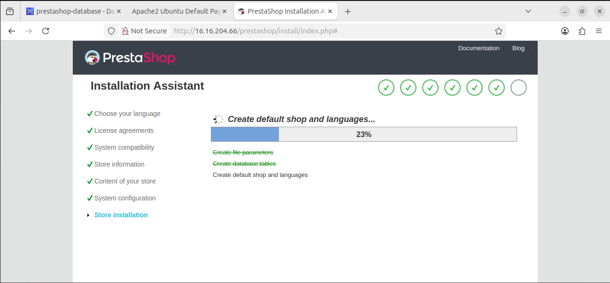

---

### Installation Finished

All seven steps checked. The green banner reads: "Your installation is finished!" Login credentials confirmed. And there it is, the security reminder I was already ahead of: "For security purposes, you must delete the install folder."

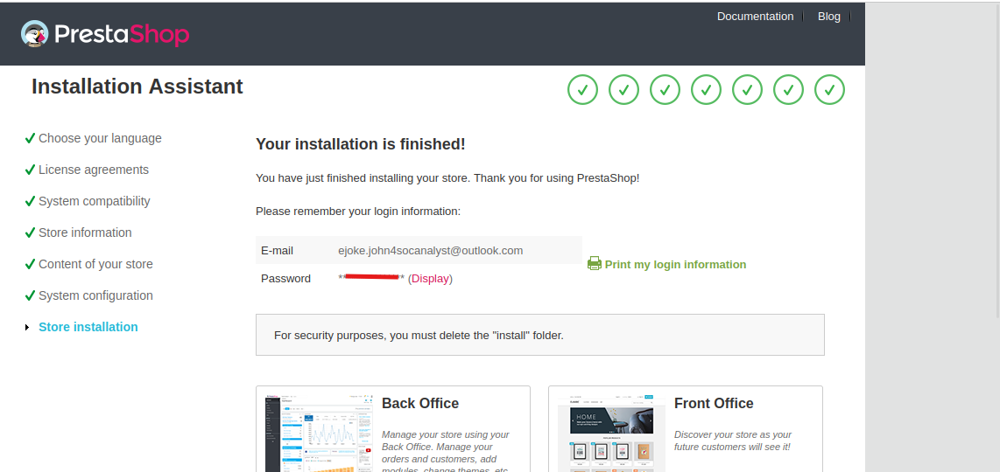

---

### Install Folder Deleted and Confirmed Gone

I ran the purge immediately:

```bash
sudo rm -rf /var/www/html/prestashop/install
```

Then verified:

```bash
ls /var/www/html/prestashop/install
```

Output: `ls: cannot access '/var/www/html/prestashop/install': No such file or directory`

The install directory is gone. This is a mandatory post-deployment security step. The install folder contains scripts that could be used to reinstall or overwrite the application if left in place. Leaving it is not an oversight. It is a vulnerability.

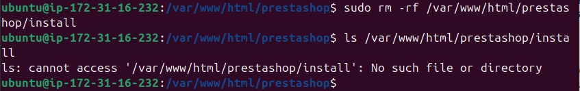

---

### Back Office Login

With the install directory purged, I navigated to the obfuscated admin URL. PrestaShop automatically renames the admin folder to a randomized string during installation, a form of directory obfuscation that removes the predictable attack vector of `/admin`. The login screen loaded with the store name "John Ejoke Global Store" and my credentials pre-populated.

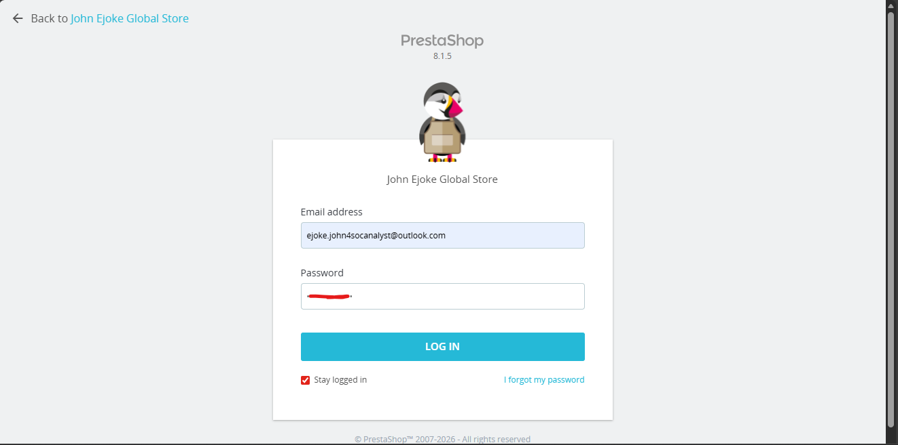

---

### Back Office Dashboard: Administrative Validation

Logged in. The PrestaShop Dashboard is live. Sales panel, activity overview, online visitor count, active shopping carts, pending orders. The date range shows 2026-01-19 to 2026-02-19. Two visits already registered. The administrative session is active, database write permissions are functional, and telemetry is running.

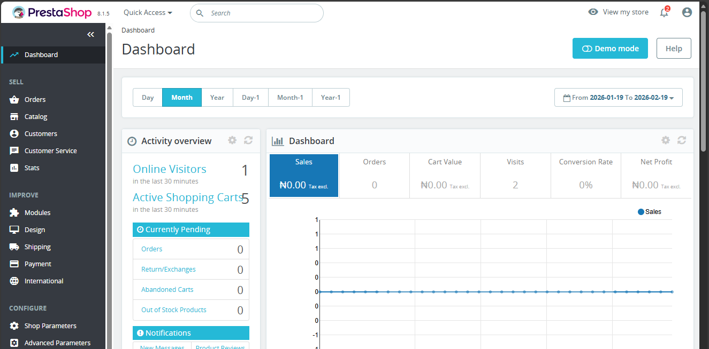

---

### Customer Storefront: Public Validation

I navigated to the public URL. The customer-facing storefront loaded with the full product catalog: Hummingbird Printed T-Shirts, Sweaters, framed prints, mugs. Prices in Naira. The Popular Products grid is rendering correctly, which means Apache is executing PHP, PHP is querying the RDS database over Port 3306, and RDS is returning product data. Every layer of the 2-Tier Architecture is functioning as designed.

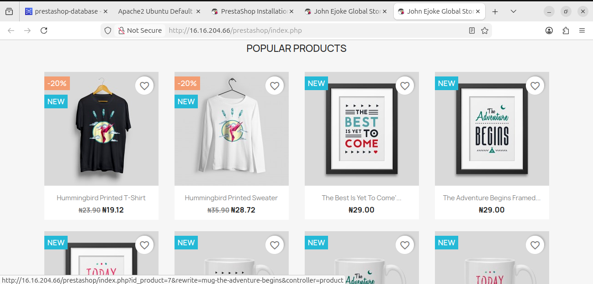

Phase 4 is complete. The store is live.

---

## Security Posture Summary

Here is what I hardened across this entire deployment:

**Network Layer:** Two purpose-built Security Groups with minimum necessary rules. No ports open that do not need to be open. SSH restricted to management IP. Database invisible to the public internet.

**Security Group Chaining:** The database accepts MySQL connections exclusively from instances carrying the Web SG tag. No IP-based rules on the database tier. No static entries that break when IPs change.

**No Public Database Access:** RDS provisioned with Public Access disabled. No public IP assigned. Reachable only from within the VPC.

**OS Baseline:** Full update and upgrade cycle run on first login before any software was installed. All CVEs patched at the kernel and library level before the application went live.

**Filesystem Permissions:** `chown -R www-data` and `chmod -R 755` applied before go-live. The web server process cannot modify core application files. Defense against file-injection attacks.

**Install Folder Purge:** Deleted immediately after installation completed and verified gone with `ls`. No residual attack surface.

**Directory Obfuscation:** Admin panel URL randomized by PrestaShop during installation. The predictable `/admin` path does not exist.

**Key Hardening:** `chmod 600` applied to the PEM file before first SSH connection. The private key is owner-read-only.

---

## Technical Command Reference

| Task | Command | Outcome |
|---|---|---|
| Key hardening | `chmod 600 SOC-Project-Key.pem` | RSA key secured for SSH |
| SSH access | `ssh -i SOC-Project-Key.pem ubuntu@16.16.204.66` | Verified CLI access to EC2 |
| OS patching | `sudo apt update && sudo apt upgrade -y` | System baseline secured |
| LAMP install | `sudo apt install apache2 php8.3 mysql-client-8.0 -y` | Application environment ready |
| PHP extensions | `sudo apt install php8.3-xml php8.3-curl php8.3-mbstring -y` | PrestaShop dependencies satisfied |
| Rewrite module | `sudo a2enmod rewrite && sudo systemctl restart apache2` | URL rewriting enabled |
| File ownership | `sudo chown -R www-data:www-data /var/www/html/prestashop` | Apache process owns app files |
| File permissions | `sudo chmod -R 755 /var/www/html/prestashop` | Principle of Least Privilege applied |
| Install purge | `sudo rm -rf /var/www/html/prestashop/install` | Attack vector eliminated |

---

## What This Architecture Is Missing and What I Would Add Next

I want to be direct with any recruiter reading this: this deployment is solid at the foundational level, but it is not production-complete. I know exactly what it is missing and I know how to build those layers. Here is what the next iteration looks like.

**Application Load Balancer (ALB):** At the entry level this is not optional, it is table stakes. An ALB sits in front of the EC2 instance and distributes traffic, enables health checking, and provides a stable DNS endpoint. Without it, if the EC2 instance goes down, the store goes down. I would place the ALB in the public subnet, move the EC2 instance into a private subnet, and route all inbound traffic through the load balancer. The Web SG would then restrict Port 80 and 443 to the ALB security group only, not the open internet.

**HTTPS and SSL/TLS via ACM:** The store is currently running on HTTP. That is acceptable for a lab proof of concept. For any real deployment, I would provision an SSL certificate through AWS Certificate Manager, attach it to the ALB listener on Port 443, and force HTTP to HTTPS redirection. Customer data in transit must be encrypted.

**AWS WAF:** A Web Application Firewall in front of the ALB would filter SQL injection attempts, cross-site scripting, and known malicious IP ranges before they reach the application layer. PrestaShop's admin panel, even with directory obfuscation, is a high-value target. WAF rules add a detection and blocking layer that security groups alone cannot provide.

**Auto Scaling Group:** One EC2 instance cannot handle traffic spikes. An Auto Scaling Group behind the ALB would spin up additional instances under load and terminate them when demand drops. The architecture I built here is designed to support this. Moving the EC2 into a private subnet and routing through the ALB is the prerequisite, and I have kept that upgrade path open.

**Amazon CloudWatch and AWS Config:** I have no visibility into this environment right now beyond what the AWS console shows me. CloudWatch alarms on CPU, memory, and network metrics would give me operational awareness. AWS Config rules would flag security group changes, public access modifications, and encryption state changes automatically. In production this is not optional. Monitoring and alerting are part of the security posture, not an afterthought.

**RDS Multi-AZ:** I deployed Single-AZ for cost reasons. In production, Multi-AZ is required. If the primary database instance fails, the standby in a separate availability zone takes over automatically. For an e-commerce platform, database downtime is direct revenue loss.

**Secrets Manager Integration:** The database credentials are currently self-managed. In a mature deployment I would store them in AWS Secrets Manager, configure automatic rotation, and have the application retrieve them at runtime using IAM roles. No credentials hardcoded. No credentials in configuration files.

I am currently at the foundation. I know what the full tower looks like and I know how to build it.

---

## Deployment Validation Summary

| Component | Status | Verification |
|---|---|---|
| Web Security Group | Configured | HTTP/SSH rules active, SG ID confirmed |
| DB Security Group | Configured | MySQL locked to Web SG source only |
| RDS MySQL Instance | Available | prestashop-database status: Available |
| EC2 Instance | Running | i-05135a0fced370de1 state: Running |
| Apache Web Server | Operational | Default page confirmed in browser |
| LAMP Stack | Complete | All PHP extensions installed and active |
| PrestaShop Install | Finished | All 7 installer steps checked |
| Install Folder | Purged | ls returns: No such file or directory |
| Admin Panel | Accessible | Dashboard loaded, session active |
| Customer Storefront | Live | Product catalog rendering from RDS data |

---

*John Ejoke Oghenekewe | Cybersecurity Analyst | SOC Engineer | Remote | UTC+1*
*Deployed: February 2026*
