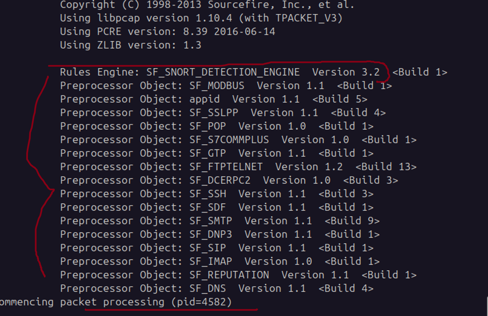
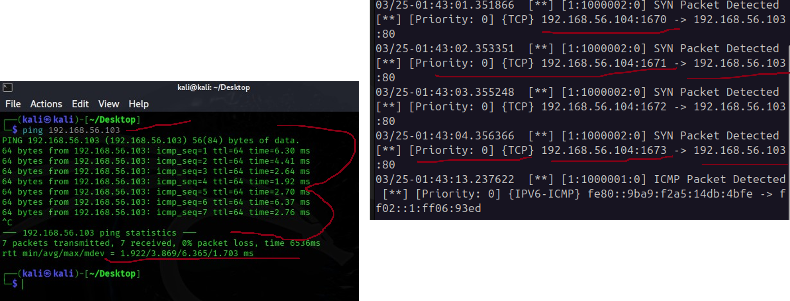
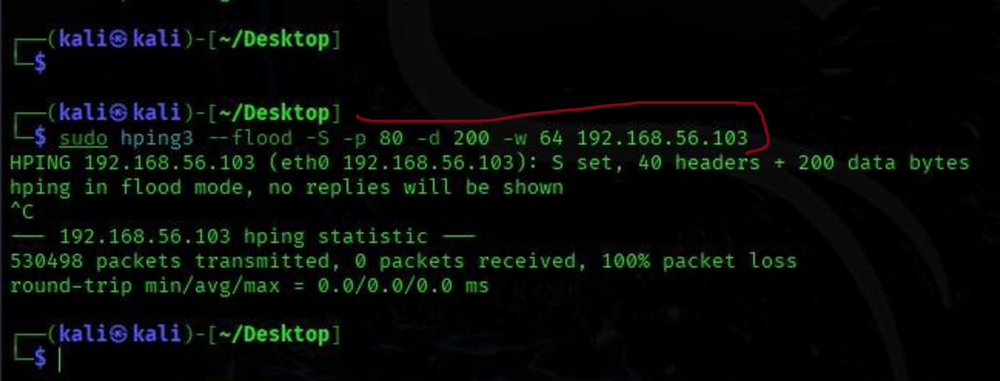
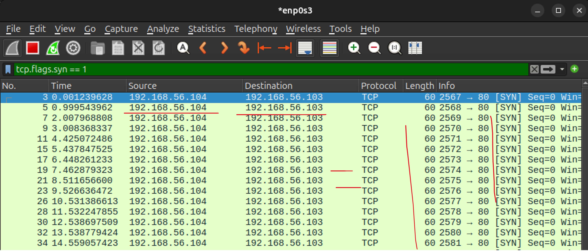
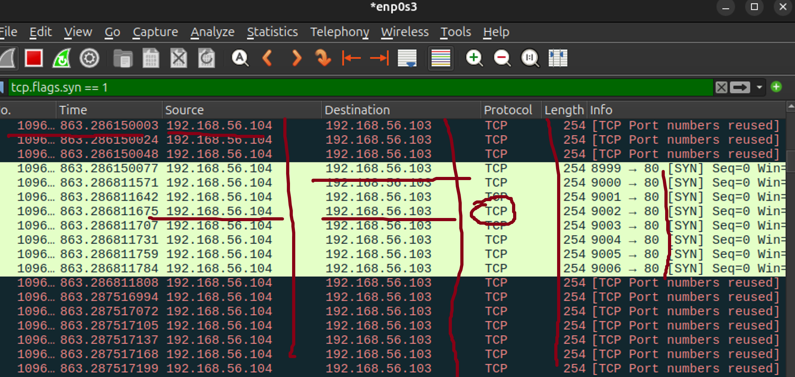

## Cybersecurity Lab: SYN Flood Simulation and Analysis
#### Simulating Network Attacks and Understanding Defensive Strategy | Infrastructure Engineering

Author: John Ejoke Oghenekewe
Role: Cybersecurity Analyst | SOC Engineer

---

## Live Walkthrough

[](https://youtu.be/1NAS-7z1NK8?si=Y-1VsR3d2UENPXYm)

---

## Overview

I built this lab because I wanted to see a network attack with my own eyes. Not a diagram of one. Not a description. The actual packets, the actual load, the actual moment the connection table starts breaking down. The only way to understand what you are defending against is to watch it happen in a controlled environment where you are the one running it.

I set up two virtual machines on VirtualBox, Kali Linux as the attacker and Ubuntu as the target, connected them on an isolated host-only network, and launched a SYN flood from one to the other. I monitored the impact in Wireshark, tracked detection in Snort, observed the CPU and network behaviour under load, and then analysed what a real defensive response would require. This document is that analysis.

**Tools used:** VirtualBox, Kali Linux, Ubuntu, hping3, Wireshark, Snort, iptables

---

## Building the Lab Environment

The setup was intentionally minimal. VirtualBox with a host-only adapter gave me two machines communicating in complete isolation from any outside network. Kali Linux at `192.168.56.104` was the attacker. Ubuntu at `192.168.56.103` was the target.

On the Ubuntu machine I installed Wireshark for live packet capture and Snort as the network intrusion detection engine. I configured Snort's `snort.conf` to set `HOME_NET` to `192.168.56.0/24`, defining the network scope, and wrote custom detection rules in `local.rules` to flag the traffic I was about to generate. The full rule set is in the `rules/` folder of this repository.

---

## Installing Snort and Configuring Detection

With `sudo apt-get install snort` on the Ubuntu machine, Snort was installed and ready. I wrote an alert rule to detect SYN packets hitting port 80 so I could confirm visibility before running the attack:

```
alert tcp any any -> any 80 (msg:"SYN Packet Detected"; flags:S; sid:1000002;)
```

Snort was launched in detection mode:

```
sudo snort -A console -q -c /etc/snort/snort.conf -i enp0s3
```

The screenshot below shows Snort fully initialised, the rules engine loaded, and packet processing commenced. Everything was ready.



---

## Testing Connectivity and Confirming Detection

Before the flood I ran a basic ping from Kali to Ubuntu to confirm the machines could communicate and that Snort was picking up traffic. Seven packets transmitted, seven received, zero loss. On the Ubuntu side Snort immediately started generating alerts, logging the source IP, the port, and the protocol in real time.

The screenshot below shows both sides simultaneously: the ping running on the Kali terminal on the left, and Snort's console on the right lighting up with detections as each packet arrived. The detection pipeline was confirmed.



---

## Executing the SYN Flood

With detection confirmed, I launched the flood from Kali using hping3:

```
sudo hping3 --flood -S -p 80 -d 200 -w 64 192.168.56.103
```

The `--flood` flag fires packets as fast as the machine can produce them with no waiting for replies. The `-S` flag sets the SYN flag in the TCP header, meaning every single packet is the start of a TCP handshake that will never be completed. The target's connection table begins filling with half-open sessions that never time out fast enough, which is exactly how a SYN flood exhausts a system.

The attack ran for just over 16 seconds. The result: 530,498 packets transmitted, 0 received, 100% packet loss. The Ubuntu machine never acknowledged a single one.



---

## Observing the Impact in Wireshark

This is where the project became most instructive. Wireshark was running throughout with the filter `tcp.flags.syn == 1` applied to isolate the SYN traffic. In the opening seconds the packets were sequential and spaced, each one a clean SYN from `192.168.56.104` to `192.168.56.103` on port 80.



As the flood reached full scale the capture changed entirely. By packet 1096 and beyond, TCP port numbers were being reused because the connection table had exhausted its available ports. SYN packets were still arriving at approximately 32,806 per second, now interspersed with port reuse warnings as the system buckled under the volume. There were no ACK responses in the entire capture. Not one handshake was ever completed. The system was alive but functionally unreachable.

Watching the CPU and network metrics during this phase made the impact tangible in a way no textbook description does. The machine was not crashed. It was just overwhelmed, processing requests it could never finish.



---

## Defense Analysis: What This Attack Requires to Stop

This lab was focused on simulation and observation rather than live mitigation, but the analysis of what is required to defend against a SYN flood at different scales is a direct output of what I observed.

At the host level the immediate measures are SYN cookies, which allow a system to handle legitimate connections without allocating resources for incomplete handshakes, rate limiting via iptables to cap the volume of SYN requests processed per second, and direct IP blocking to drop traffic from a known attacker at the firewall level. A Snort drop rule can extend this into the detection layer, intercepting packets before they reach the connection table.

```
sudo sysctl -w net.ipv4.tcp_syncookies=1
sudo iptables -A INPUT -p tcp --syn -m limit --limit 10/s --limit-burst 20 -j ACCEPT
sudo iptables -A INPUT -s 192.168.56.104 -j DROP
drop tcp any any -> any 80 (msg:"SYN Packet Blocked"; flags:S; sid:1000003;)
```

At enterprise scale these host-level controls are necessary but not sufficient. A flood at the volume observed in this lab, scaled up across a real network, requires load balancing to distribute incoming traffic across multiple systems so no single node bears the full weight, upstream scrubbing through a DDoS mitigation provider to filter attack traffic before it reaches the network perimeter, and network segmentation to contain the blast radius if a segment does become overwhelmed. The host is the last line of defense in that architecture, not the first.

What this lab made clear is that the gap between a system being technically online and being functionally available under attack is smaller than most people assume. The Ubuntu machine never went down. It just stopped being useful. That distinction matters enormously when you are thinking about what defense actually needs to achieve.

---

## What I Learned

Running this simulation changed how I think about network attacks. The numbers in a flood statistic, half a million packets in sixteen seconds, are abstract until you watch Wireshark fill in real time and see the port table run out of space. The attack does not announce itself. It just quietly makes the system unusable. Understanding that from the inside is what makes the defensive analysis meaningful rather than mechanical.

---

*John Ejoke Oghenekewe | Cybersecurity Analyst | SOC Engineer*
*GitHub: [github.com/john-ejoke](https://github.com/john-ejoke)*
