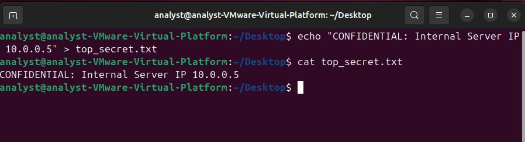
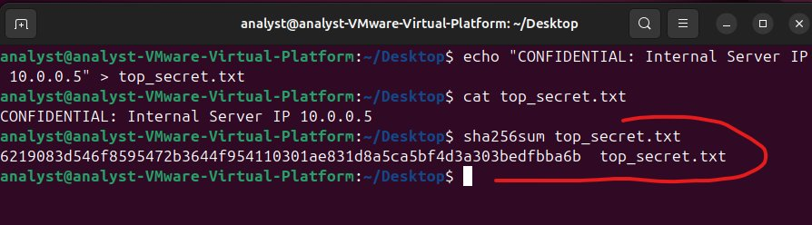
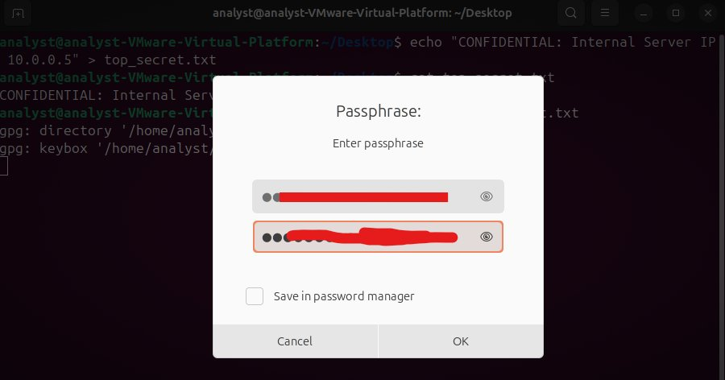
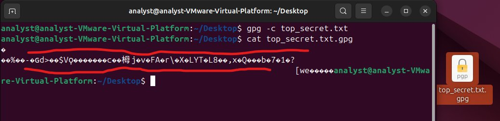
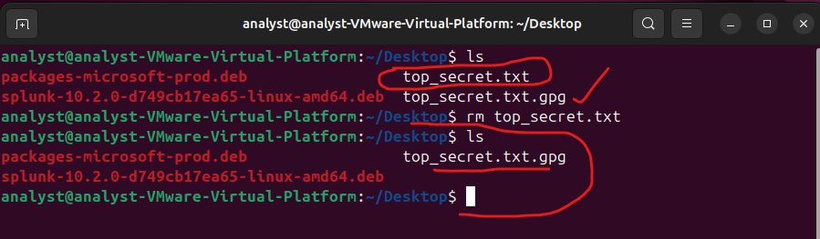
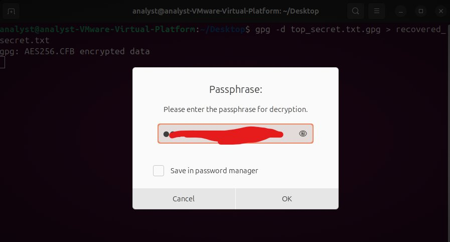
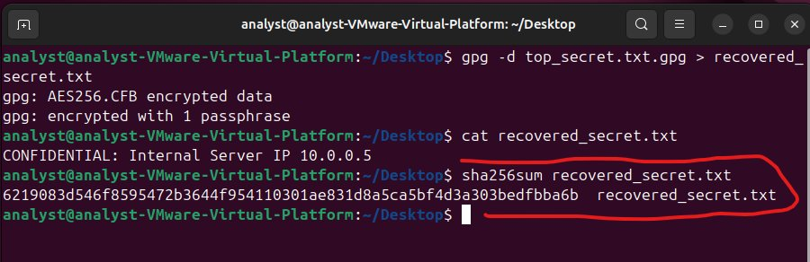

# Data-at-Rest Encryption & Integrity Validation
### Securing Forensic Evidence via AES-256 Symmetric Tunneling

**Author:** John Ejoke Oghenekewe | Cybersecurity Analyst  
**Date:** February 2026  
**Environment:** Ubuntu Desktop on VMware Virtual Platform  
**Lab ID:** LN-2026-02-10-JE  
**Domain:** Infrastructure Engineering

---

---

## What This Project Is About

When a security incident is investigated, forensic logs are collected. Those logs contain sensitive data: internal IP addresses, credentials, telemetry. The problem is that by default, those files sit on disk in plain, human-readable text. If an attacker gets access to that storage, they get everything.

This project engineers a solution to that problem. I built a data-at-rest protection workflow using two industry-standard cryptographic controls: AES-256 encryption via GnuPG for confidentiality, and SHA-256 hashing for integrity verification. The result is a repeatable, audit-ready chain-of-custody protocol that mirrors real SOC operational standards.

---

## The Problem I Was Solving

Post-incident forensic logs stored as cleartext are a liability. A single storage breach or unauthorized access event exposes everything inside them. There is no layer of protection between the data and the adversary.

The goal here was to close that gap by:

- Transforming readable forensic data into unreadable ciphertext the moment it is secured
- Generating a cryptographic fingerprint before and after the process to mathematically prove the data was never altered
- Removing the unencrypted source file so only one secured version of the truth exists

---

## Tools and Technologies

| Tool | Role |
|---|---|
| **GnuPG (GPG)** | AES-256 encryption engine. Wraps the file in a symmetric cryptographic tunnel |
| **SHA-256 (sha256sum)** | Hashing engine. Generates a unique 64-character fingerprint of the file |
| **Ubuntu Linux CLI** | Operating environment. All steps performed via command line for precision and auditability |

---

## The Workflow: Step by Step

### Step 1: Initializing the Forensic Data

I created a plaintext file simulating sensitive forensic telemetry, specifically an internal server IP address that would be considered confidential in a real incident response scenario.

```bash
echo "CONFIDENTIAL: Internal Server IP 10.0.0.5" > top_secret.txt
cat top_secret.txt
```

**Why this matters:** Before applying any controls, I confirmed the data was fully human-readable and therefore vulnerable. This establishes the "before" state.



---

### Step 2: Establishing the Baseline Hash

Before touching the file with any encryption, I generated a SHA-256 hash. This hash is the forensic anchor for the entire workflow.

```bash
sha256sum top_secret.txt
```

**Output:**
```
6219083d546f8595472b3644f954110301ae831d8a5ca5bf4d3a303bedfbba6b  top_secret.txt
```

**Why this matters:** This hash is the "source of truth." Any modification to the file, even changing a single character, would produce a completely different hash. By capturing it before encryption, I can prove later that the data was never tampered with.

> I chose SHA-256 over MD5 or SHA-1 specifically to avoid known collision vulnerabilities. For forensic use, the hash must be collision-resistant and forensic-grade.



---

### Step 3: Enforcing AES-256 Encryption

With the baseline captured, I encrypted the file using GPG with AES-256 in CFB (Cipher Feedback) mode. A high-entropy passphrase was set during this step.

```bash
gpg -c top_secret.txt
```

This produced the encrypted file: `top_secret.txt.gpg`

**Why this matters:** AES-256 is the same encryption standard used by the US government for classified information. The passphrase functions as the symmetric key. Without it, the ciphertext is computationally infeasible to reverse.



---

### Step 4: Validating Confidentiality

I ran a `cat` command on the newly encrypted file to simulate what an attacker or unauthorized user would see if they accessed it.

```bash
cat top_secret.txt.gpg
```

**Result:** The file returned binary ciphertext. Completely unreadable. The confidentiality control is confirmed.



---

### Step 5: Securing the Environment

With the encrypted file confirmed, I removed the original plaintext file. Only one version of this data should exist, and it should be the secured one.

```bash
rm top_secret.txt
ls
```

**Result:** Only `top_secret.txt.gpg` remains in the directory. The single-point-of-truth principle is enforced.

> **Production Note:** In a live environment, I would use `shred -u top_secret.txt` instead of `rm` to perform secure erasure, overwriting the file's disk blocks before deletion to prevent forensic recovery.



---

### Step 6: Data Recovery and Decryption

To prove the data remains accessible to authorized personnel, I decrypted the file using the stored passphrase.

```bash
gpg -d top_secret.txt.gpg > recovered_secret.txt
cat recovered_secret.txt
```

**Output:**
```
CONFIDENTIAL: Internal Server IP 10.0.0.5
```

The original content was recovered cleanly and completely.



---

### Step 7: Integrity Verification

The final step: I generated a SHA-256 hash of the recovered file and compared it against the baseline captured in Step 2.

```bash
sha256sum recovered_secret.txt
```

**Output:**
```
6219083d546f8595472b3644f954110301ae831d8a5ca5bf4d3a303bedfbba6b  recovered_secret.txt
```

**Comparison:**

| State | SHA-256 Hash |
|---|---|
| **Original (Pre-Encryption)** | `6219083d...bedfbba6b` |
| **Recovered (Post-Decryption)** | `6219083d...bedfbba6b` |
| **Result** | **100% MATCH. ZERO TAMPERING.** |



---

## Results: The CIA Triad Demonstrated

| Principle | Control Applied | Outcome |
|---|---|---|
| **Confidentiality** | AES-256 encryption via GnuPG | Plaintext rendered unreadable to unauthorized access |
| **Integrity** | SHA-256 dual-hash comparison | Mathematically proven zero-tampering across full lifecycle |
| **Availability** | Passphrase-authenticated decryption | Authorized recovery confirmed and validated |

---

## Key Technical Observations

**GPG Agent Behavior:** During testing, the `gpg-agent` cached the passphrase for the session duration. In a production SOC environment, I recommend running `gpgconf --kill gpg-agent` between tasks to force manual re-authentication on every decryption attempt.

**Hash Algorithm Selection:** SHA-256 was selected over MD5 and SHA-1. Both older algorithms have demonstrated collision vulnerabilities that would undermine forensic admissibility. SHA-256 remains the forensic standard.

**The Core Principle:** Encryption without a pre-established baseline hash is a blind process. You cannot prove data integrity unless you know what the data looked like before the lock was applied. The hash is not optional. It is the chain of custody.

---

## Skills Demonstrated

- Symmetric cryptography implementation (AES-256)
- Cryptographic hashing and integrity verification (SHA-256)
- Forensic chain-of-custody workflow design
- Linux CLI security operations
- Data-at-rest protection protocol engineering
- SOC-standard evidence handling procedures

---

## Part of a Larger Portfolio

This is one of 20 documented cybersecurity projects covering SOC operations, threat detection, incident response, and security engineering.

---

*Lab Note ID: LN-2026-02-10-JE | Analyst: John Ejoke Oghenekewe*
