# VenomX.exe : Malware Analysis | Static & Dynamic Investigation

> **Ejoke John** | Cybersecurity Analyst | Independent Research Project | May 2025  
> **Environment:** Windows 10 VM · VirtualBox · FLARE VM  
> **Outcome:** AgentTesla infostealer : 56/72 vendors · Telegram C2 · Defender evasion · Scheduled task persistence

---

## What This Project Is

This is a full malware analysis I conducted independently : from receiving a suspicious ZIP file to writing a custom YARA detection rule. I wanted to simulate exactly what an analyst would face during a real incident: an unknown executable, no prior context, and a methodical process to figure out what it does, how it hides, and how to detect it.

I used a combination of static analysis tools to dissect the file without running it, then detonated it in an isolated Windows 10 VM to observe its real behavior. What I found was more sophisticated than I initially expected : the malware used multiple layers of evasion, actively suppressed Windows Defender, and exfiltrated victim data through the Telegram API.

Everything below documents exactly what I did, what I found at each step, and why it mattered.

---

## Table of Contents
- [Lab Setup](#lab-setup)
- [The Sample](#the-sample)
- [Static Analysis](#static-analysis)
  - [Confirming the File Type](#1-confirming-the-file-type)
  - [Generating Hash Values](#2-generating-hash-values)
  - [VirusTotal Intelligence](#3-virustotal-intelligence)
  - [String Extraction](#4-string-extraction)
  - [Uncovering XOR-Obfuscated Strings](#5-uncovering-xor-obfuscated-strings)
  - [Packer and Compiler Detection](#6-packer-and-compiler-detection)
  - [.NET Decompilation](#7-net-decompilation)
  - [PeStudio Deep Inspection](#8-pestudio-deep-inspection)
  - [Detect It Easy Confirmation](#9-detect-it-easy-confirmation)
- [Dynamic Analysis](#dynamic-analysis)
  - [Setting Up and Executing](#setting-up-and-executing)
  - [Process Activity](#1-process-activity)
  - [Defender Exclusion : The Finding I Didn't Expect](#2-defender-exclusion--the-finding-i-didnt-expect)
  - [Persistence via Scheduled Task](#3-persistence-via-scheduled-task)
  - [Registry Modifications](#4-registry-modifications)
  - [ANY.RUN Sandbox Verification](#5-anyrun-sandbox-verification)
- [Indicators of Compromise](#indicators-of-compromise)
- [MITRE ATT&CK Mapping](#mitre-attck-mapping)
- [YARA Detection Rule](#yara-detection-rule)
- [Conclusion](#conclusion)

---

## Lab Setup

Before touching the sample, I built a clean, isolated analysis environment. Getting this right is non-negotiable : one misconfiguration and either the malware escapes, or it detects the sandbox and refuses to run.

Here's exactly how I configured the VM:

- Spun up a fresh **Windows 10 VM in VirtualBox** with a **Host-Only network adapter** : no internet access, no path out
- Disabled **Windows Update** via `services.msc` to prevent patches from changing system behavior mid-analysis
- Disabled **Windows Defender** through both Group Policy (`gpedit.msc`) and Windows Security settings
- Enabled **file extensions** and **hidden files** in File Explorer : malware loves to hide in plain sight
- Took a **clean snapshot** before doing anything : my restore point if things go wrong

**Tools I used throughout this analysis:**

| Tool | What I used it for |
|------|--------------------|
| HxD | Inspecting raw hex to confirm file type |
| Cmder | Running file identification and string commands |
| HashMyFiles | Generating MD5 and SHA-256 hashes |
| VirusTotal | Threat intelligence lookup |
| xorsearch | Finding XOR-encoded hidden strings |
| ExeInfo PE | Detecting packers and inspecting PE structure |
| .NET Reflector v11.1 | Decompiling the .NET assembly |
| PeStudio 9.61 | Full static PE inspection |
| Detect It Easy v3.10 | Confirming compiler and packer fingerprint |
| Process Monitor (ProcMon) | Capturing every system-level action during execution |
| Regshot 1.9.1 | Comparing registry before and after execution |
| Wireshark | Network traffic capture |
| ANY.RUN | Independent sandbox verification |

---

## The Sample

The sample arrived as a password-protected ZIP file named `VenomX.zip` (687 KB). Password-protecting malware samples before sharing them is standard practice : it prevents antivirus tools from scanning and deleting the file before analysis begins.

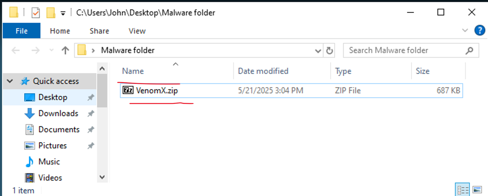

Once extracted, I had `VenomX.exe` at 783 KB. At this point I knew nothing about it. That's where static analysis begins.

---

## Static Analysis

Static analysis means examining the file without running it. The goal is to gather as much intelligence as possible : file structure, embedded strings, network indicators, compiler fingerprints : before ever executing a single instruction.

---

### 1. Confirming the File Type

The very first thing I do with any unknown file is verify its true type, independent of whatever extension it presents. Attackers routinely rename executables to trick users and bypass security tools that rely on file extensions.

**HxD : Hex Editor**

I opened the file in HxD and looked at the first few bytes. At offset `0x00` I immediately saw `4D 5A` : the `MZ` magic bytes that mark every Windows PE file. The string `This program cannot be run in DOS mode` at offset `0x4E` confirmed this is a genuine Windows executable.

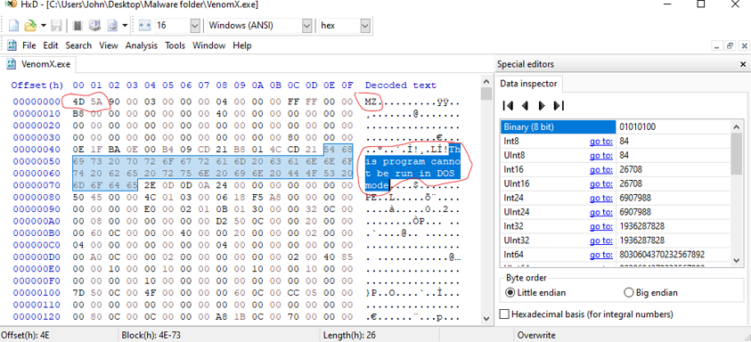

**Cmder : File command across all disguised extensions**

I ran the `file` command against four variants of the sample : `.exe`, `.jpg`, `.pdf`, and `.doc`. Every single one came back identical:

```
PE32 executable (GUI) Intel 80386 Mono/.Net assembly, for MS Windows
```

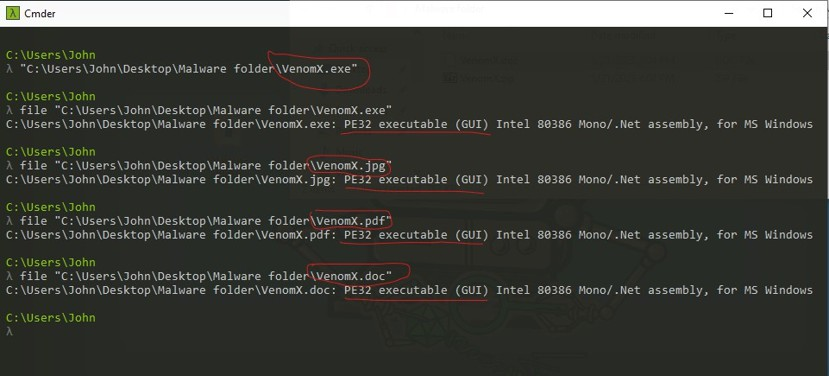

This told me immediately that the same executable was being distributed under three different fake extensions. A target receiving a `.pdf` or `.jpg` from a phishing email has no reason to suspect it's a Windows binary. The `file` command reads the actual file signature and saw through all of them instantly.

---

### 2. Generating Hash Values

I generated cryptographic hashes using HashMyFiles to produce a unique fingerprint for the sample : useful for threat intelligence lookups and for confirming I'm working with the same file throughout the analysis.

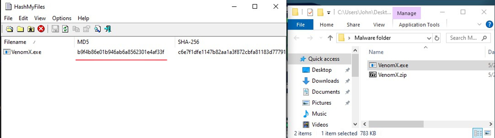

| Hash Type | Value |
|-----------|-------|
| **MD5** | `b9f4b86e01b946ab6a8562301e4af33f` |
| **SHA-1** | `545bc5c8b5e1ccd095787c0cedf21c5fd8325789` |
| **SHA-256** | `c6e7f1dfe1147b82aa1a3f872cbfa81183d777911edc6a4623255b7db6cf0d86` |
| **File size** | 783 KB (801,792 bytes) |

With the MD5 hash ready, I headed to VirusTotal.

---

### 3. VirusTotal Intelligence

I pasted the MD5 hash into VirusTotal to see if this file had been seen before and what the security community knew about it.

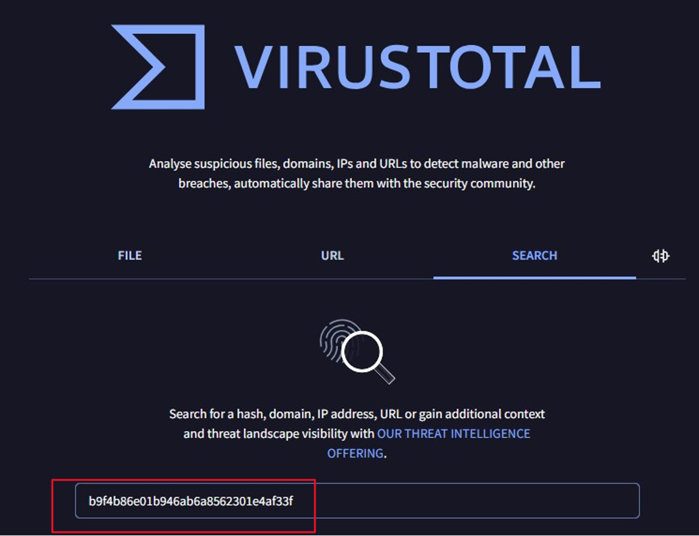

The result stopped me in my tracks.

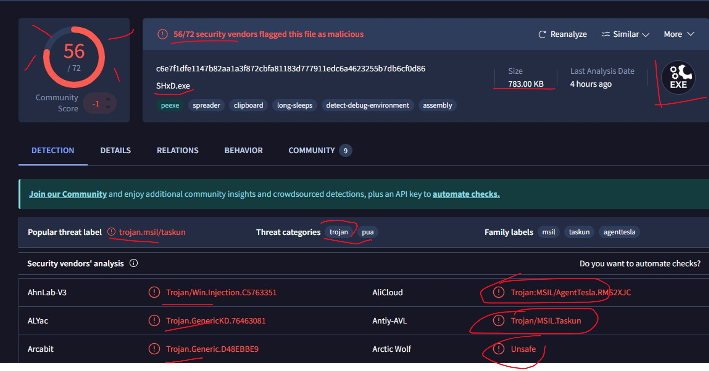

**56 out of 72 security vendors flagged it as malicious.** The community behavior tags told me even more: `clipboard`, `long-sleeps`, `detect-debug-environment`, `spreader`. Each one is significant : clipboard monitoring, sandbox evasion via sleep delays, active anti-debugging, and self-propagation capability. The family labels confirmed: `msil`, `taskun`, `agenttesla`. This is **AgentTesla**.

**The file details panel revealed the malware's true identity:**

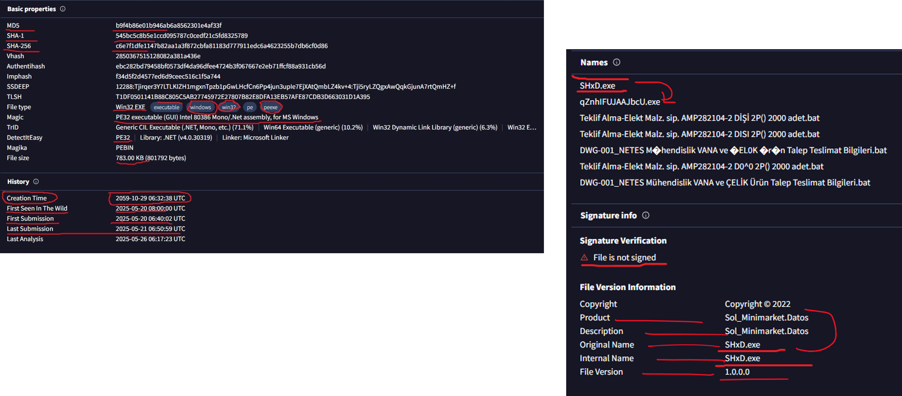

| Property | Value |
|----------|-------|
| Original filename | **SHxD.exe** |
| Product | `Sol_Minimarket.Datos` |
| Compile timestamp | **October 29, 2059** |
| First seen in the wild | May 20, 2025 |
| Digital signature | **Not signed** |

A compile timestamp of 2059 is physically impossible : this is deliberate anti-forensic timestamp manipulation designed to break timeline analysis. The name `Sol_Minimarket.Datos` (Spanish for "Sol Minimarket Data") is the fake identity used to appear legitimate to anyone inspecting the file properties.

**The network communication tab showed the full exfiltration pipeline:**

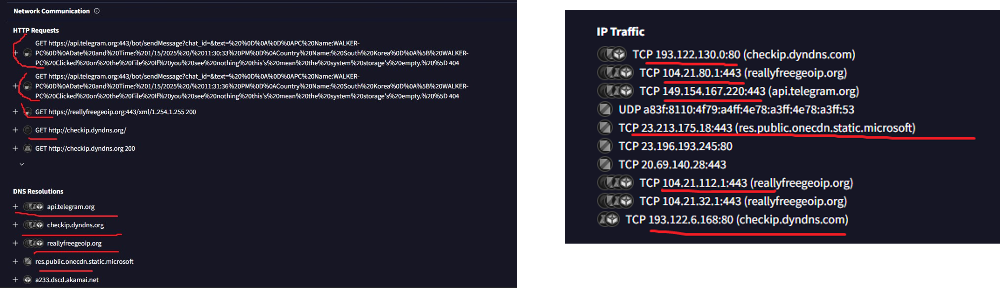

GET requests going to `api.telegram.org` with victim data embedded directly in the URL : hostname, date, time, country, and clipboard contents being sent to whoever controls the Telegram bot. The malware also hit `checkip.dyndns.org` and `reallyfreegeoip.org` to determine the victim's external IP and geolocation first. This is a complete collection and exfiltration pipeline operating over a legitimate API service.

---

### 4. String Extraction

I ran Sysinternals Strings with a minimum length of 8 characters to filter noise and surface meaningful artifacts.

```bash
strings -n 8 "C:\Users\John\Desktop\Malware folder\VenomX.exe"
```

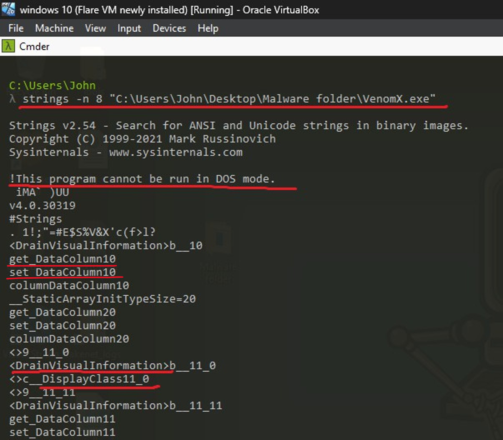

Notable strings recovered: `get_DataColumn`, `set_DataColumn` (structured data access), `DrainVisualInformation` (suggesting UI data harvesting), and `v4.0.30319` (.NET Framework version). The data getter/setter pattern is consistent with a credential harvester that organizes stolen information before sending it out.

---

### 5. Uncovering XOR-Obfuscated Strings

Standard string extraction only finds plaintext. Attackers frequently XOR-encode sensitive strings : like C2 URLs : so they don't appear in a basic strings scan. I used xorsearch to hunt for these hidden strings with `http` as the keyword.

```bash
xorsearch "C:\Users\John\Desktop\Malware folder\VenomX.exe" http
```

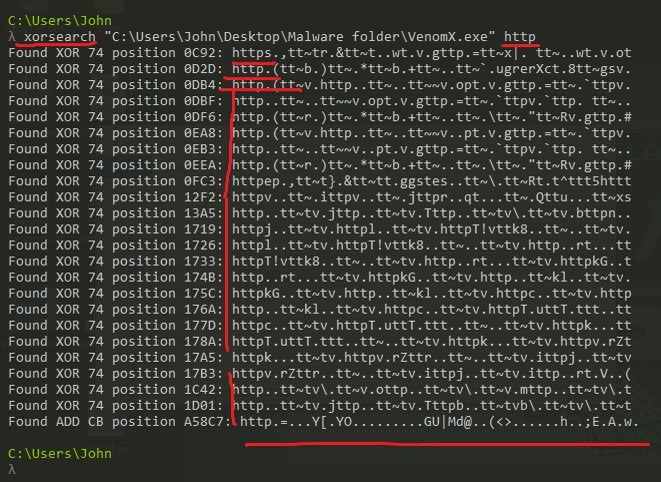

xorsearch found **XOR key 74** applied across dozens of offsets throughout the file, decoding to reveal multiple embedded HTTP strings. The malware's network infrastructure was deliberately hidden : visible only when you specifically look for XOR encoding. This level of obfuscation tells me the author expected analysts to look at the file and designed it to resist exactly what I was doing.

---

### 6. Packer and Compiler Detection

ExeInfo PE confirmed what I suspected from the high entropy : the file's `.text` section contains packed content.

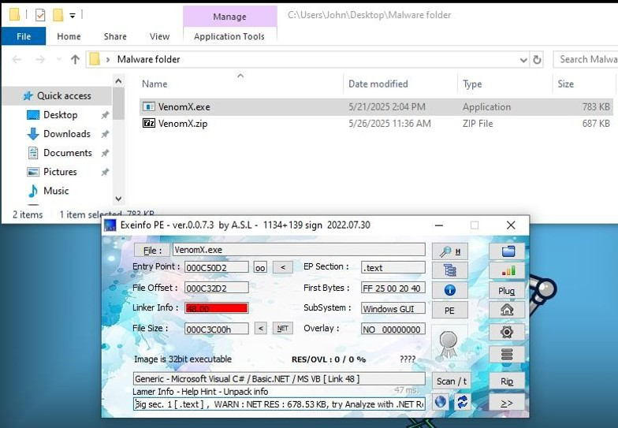

The key output: `Big sec. 1 [.text], WARN: NET RES 678.53 KB : try Analyze with .NET Reflector`. A 678 KB code section is significantly oversized. This points to substantial embedded content packed inside the assembly, and ExeInfo PE's recommendation to use .NET Reflector was exactly the right next step.

---

### 7. .NET Decompilation

I loaded the binary into .NET Reflector v11.1 to decompile the assembly and inspect its internal structure.

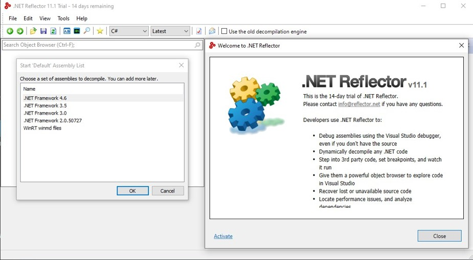

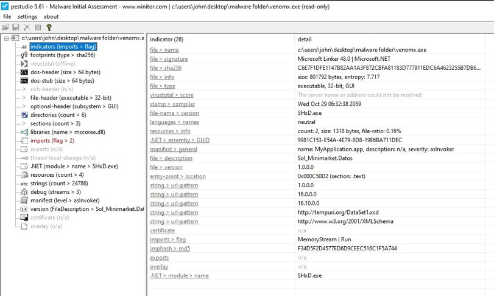

What I found was the malware's cover story laid bare. The assembly is named `SHxD, Version 1.0.0.0` and is structured as a full Spanish-language retail management application : with `Sol_Minimarket.Datos`, `Sol_Minimarket.Entidades`, and `Sol_Minimarket.Negocio` namespaces mimicking a legitimate software project. The presence of `System.Windows.Forms` and `System.Xml` dependencies alongside the data namespaces is consistent with a credential stealer that scrapes form inputs and serializes collected data as XML for transmission.

---

### 8. PeStudio Deep Inspection

PeStudio gave me a comprehensive single-pane view of the file's most important static properties.

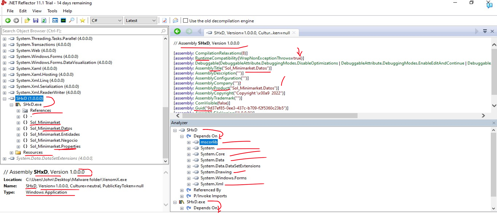

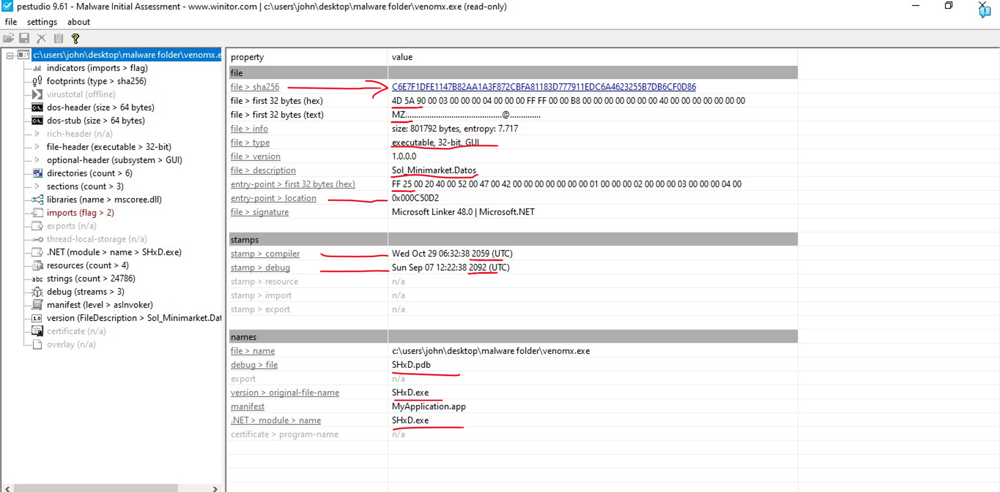

The entropy value of **7.717** was one of the most important numbers in this entire analysis. Normal executable code sits around 5.0–6.5. Random data : like encrypted or compressed content : approaches 8.0. At 7.717, a significant portion of this file is packed or encrypted, meaning there's hidden functionality that won't be visible until runtime.

The URL patterns embedded in the binary also stood out: `http://tempuri.org/DataSet1.xsd` and `http://www.w3.org/2001/XMLSchema`. These are .NET data serialization schema references : the malware structures its harvested data as XML datasets before exfiltrating, consistent with AgentTesla's known method.

| Indicator | Value | Significance |
|-----------|-------|--------------|
| Entropy | **7.717** | Packed or encrypted content |
| Compile timestamp | **2059** | Anti-forensic manipulation |
| Debug timestamp | **2092** | Anti-forensic manipulation |
| Imports flag | `MemoryStream \| Run` | Dynamic in-memory code execution |
| .NET module | `SHxD.exe` | True internal identity |
| Signature | **None** | No trusted publisher |

---

### 9. Detect It Easy Confirmation

DIE v3.10 provided independent confirmation and added one final important detail.

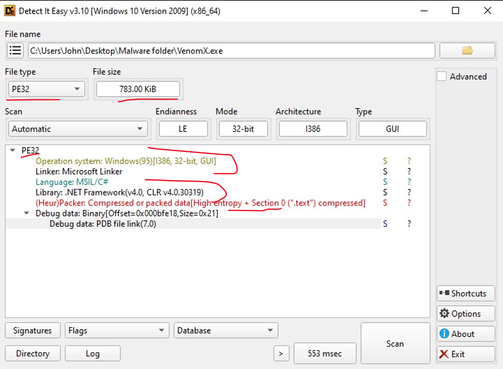

Its heuristic packer detection flagged: **"Compressed or packed data : High entropy + Section 0 (.text) compressed"**. Combined with the `netreactor` tag I later found in ANY.RUN, this confirmed the malware was obfuscated with **.NET Reactor** : a commercial .NET protection tool. The attacker used a paid product to protect their payload, which signals this wasn't an amateur operation.

---

## Dynamic Analysis

With a thorough static picture in place, I detonated the sample and watched what it actually does. ProcMon, Regshot (first shot taken), and Wireshark were all running before execution. I launched VenomX.exe and let it run for approximately 30 minutes before collecting evidence.

---

### Setting Up and Executing

I took the first Regshot snapshot to create a clean registry baseline, confirmed all monitoring tools were capturing, then launched the malware.

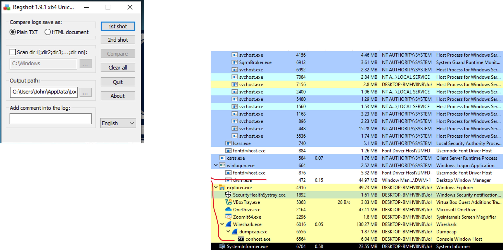

The first thing I noticed was that **Process Hacker showed nothing** : no VenomX.exe process appeared. This wasn't a mistake. The malware was terminating its visible process entry shortly after launch to evade process-monitoring tools. I switched to ProcMon, which operates at the kernel level and can't be fooled the same way.

---

### 1. Process Activity

ProcMon captured the full execution chain that Process Hacker missed entirely.

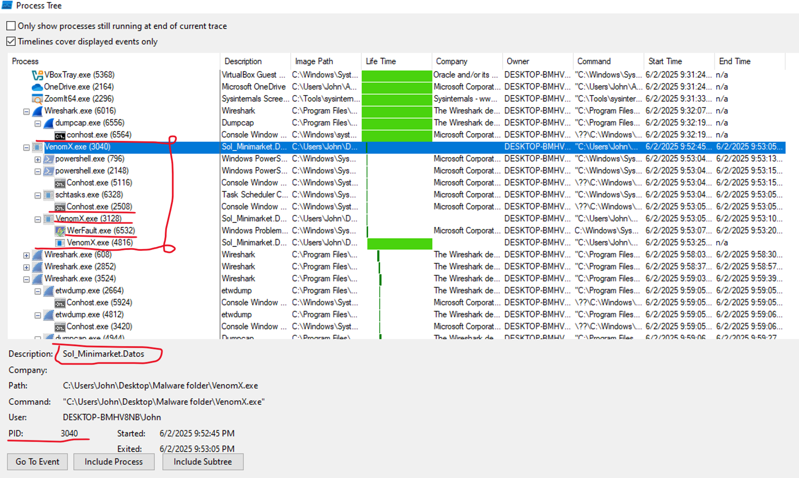

Here's what VenomX.exe (PID 3040) actually spawned:

```
VenomX.exe (PID 3040)  [Sol_Minimarket.Datos]
├── powershell.exe (PID 796)    ←  Defender exclusion command
├── powershell.exe (PID 2148)   ←  Additional PowerShell activity
│   └── Conhost.exe (PID 5116)
├── schtasks.exe (PID 6328)     ←  Scheduled task creation
│   └── Conhost.exe (PID 2508)
├── VenomX.exe (PID 3128)       ←  Child instance
│   └── WerFault.exe (PID 6532) ←  Crash handler triggered
└── VenomX.exe (PID 4816)       ←  Persistent re-spawn (still running)
```

The malware spawned multiple child instances of itself : PIDs 3128 and 4816 both as children of the original process, indicating it was installing itself into a persistent location. Two PowerShell processes and a schtasks instance as direct children told me exactly where to look next.

---

### 2. Defender Exclusion : The Finding I Didn't Expect

This was the most significant discovery of the entire dynamic analysis.

When I clicked on `powershell.exe` (PID 796) in ProcMon to check the command line:

```powershell
"C:\Windows\System32\WindowsPowerShell\v1.0\powershell.exe" Add-MpPreference -Exclus...
```

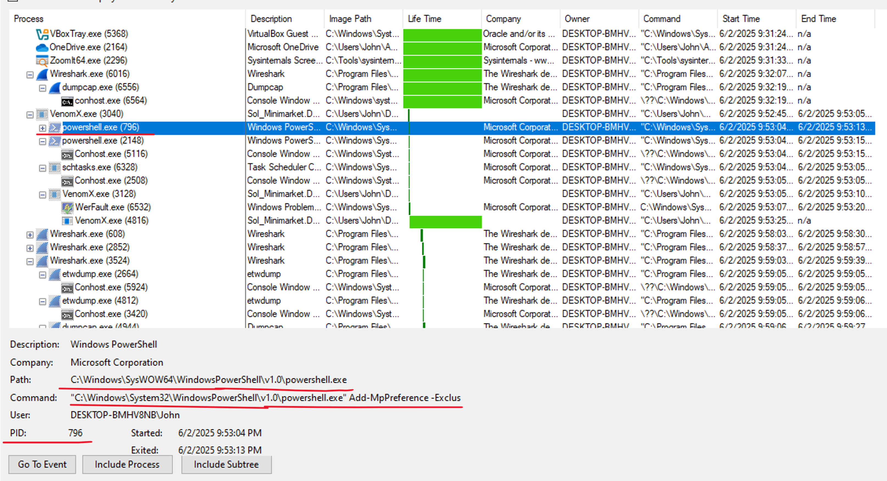

`Add-MpPreference -ExclusionPath` tells Windows Defender to stop scanning a specific path entirely : no alerts, no quarantine, no interference. The malware was using PowerShell, spawned from its own process, to tell Defender to ignore it before dropping its persistent payload into `AppData\Roaming`.

By the time Defender could flag anything, the malware had already instructed it to look the other way. This is fully automated defense suppression built directly into the execution flow : **MITRE ATT&CK T1562.001: Impair Defenses**. I'd read about this technique before, but capturing the exact command in ProcMon during my own analysis made it real in a way that reading about it never does.

---

### 3. Persistence via Scheduled Task

ProcMon captured the exact `schtasks` command:

```
"C:\Windows\System32\schtasks.exe" /Create /TN "Updates\qZnhIFUJAAJbcU" /XML "C:\User...
```

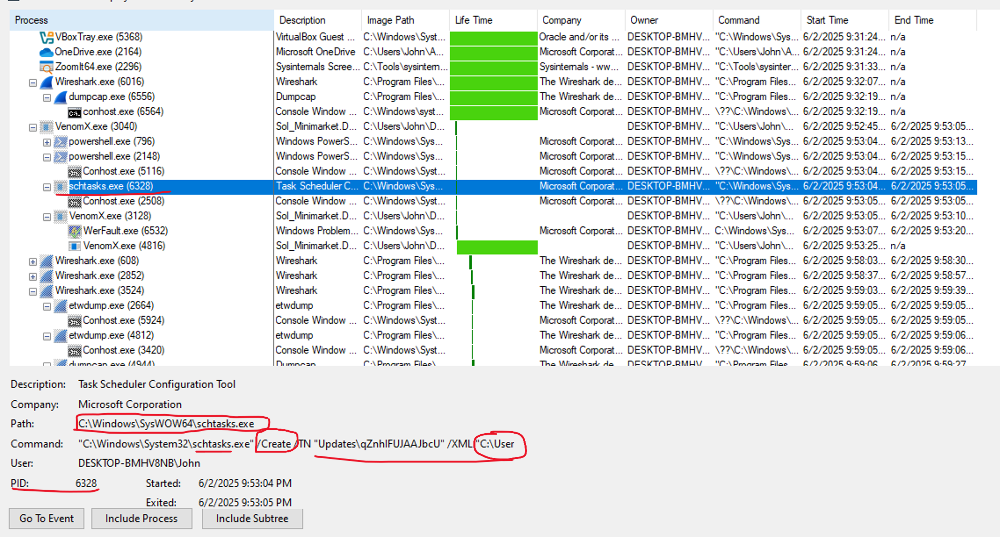

The task name `qZnhIFUJAAJbcU` is randomly generated to look like gibberish in Task Scheduler. Placing it under `\Updates` makes it appear like a Windows update component to a casual observer. I opened Task Scheduler to inspect what had actually been registered:

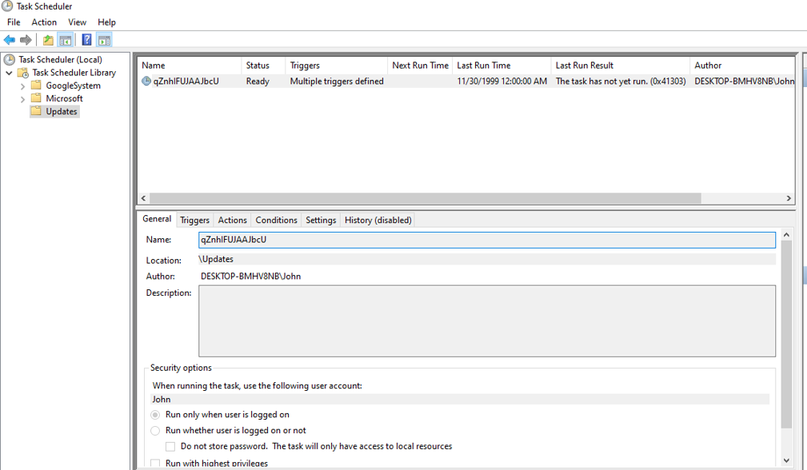

Then the triggers and settings : this is where the aggression of this persistence mechanism became clear:

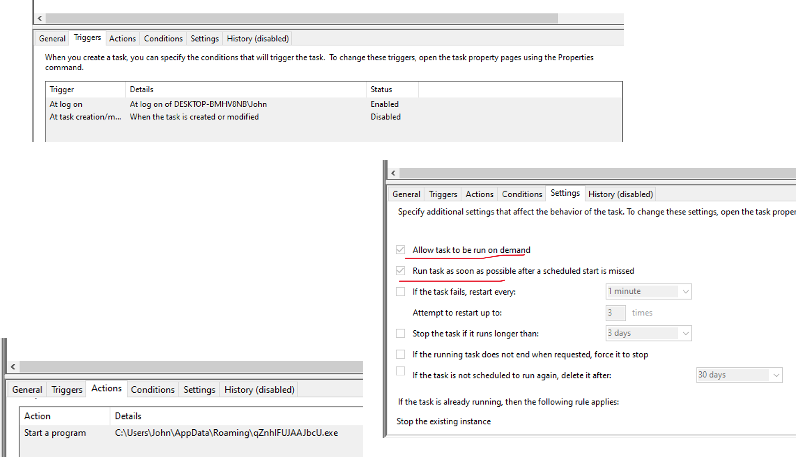

| Setting | Value |
|---------|-------|
| Trigger | At logon of `DESKTOP-BMHV8NB\John` |
| Action | Run `C:\Users\John\AppData\Roaming\qZnhIFUJAAJbcU.exe` |
| Restart if task fails | Every **1 minute**, up to 3 times |

Every time this user logs in, the malware runs. If something kills the process, Task Scheduler restarts it within 60 seconds. Most users who find and terminate the running process will have it back within a minute without knowing why. Combined with the Defender exclusion, this persistence mechanism is designed to be nearly invisible and nearly impossible to remove without knowing exactly what to look for.

---

### 4. Registry Modifications

After taking the second Regshot and comparing it against the baseline:


The diff showed the scheduled task cache entries I expected, but also something I hadn't anticipated:

```
HKLM\SOFTWARE\WOW6432Node\Microsoft\Tracing\VenomX_RASAPI32
HKLM\SOFTWARE\WOW6432Node\Microsoft\Tracing\VenomX_RASMANCS
```

These keys are created under Windows' **Remote Access Service (RAS) tracing** path : the subsystem that handles network connectivity events. By registering here, the malware embedded itself into the networking stack, giving it a mechanism to monitor when a network connection becomes available. This is consistent with the behavior I saw earlier where it checked the victim's external IP before establishing C2 : it needs to know the network is live before attempting to call home.


ProcMon also captured `WerFault.exe` performing registry reads : Windows Error Reporting triggered by a deliberate malware-induced crash, likely as a distraction technique during the analysis window.

---

### 5. ANY.RUN Sandbox Verification

I submitted the sample to ANY.RUN to cross-reference my manual findings independently.

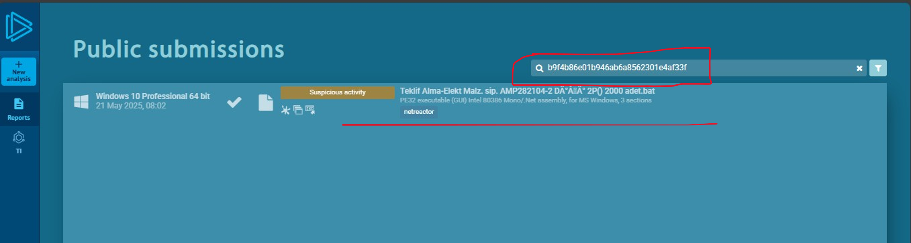

The `netreactor` tag confirmed my suspicion from the DIE analysis : **.NET Reactor** was the obfuscation tool. A commercial paid product used to protect the payload, reinforcing that the malware author invested real resources into this.


ANY.RUN's behavioral findings aligned with everything I'd captured manually : T1053.005 and T1497.003 flagged as Danger, the same schtasks process tree, WerFault triggered by crash. Independent validation from a completely separate analysis environment confirmed I hadn't missed anything significant.

The MITRE impact techniques ANY.RUN surfaced:

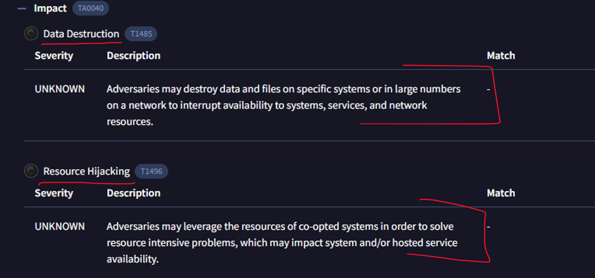

- **T1485 : Data Destruction** and **T1496 : Resource Hijacking** : assessed as potential capabilities consistent with the AgentTesla family rather than observed behaviors in my controlled run.

---

## Indicators of Compromise

### File Indicators

| Type | Value |
|------|-------|
| MD5 | `b9f4b86e01b946ab6a8562301e4af33f` |
| SHA-1 | `545bc5c8b5e1ccd095787c0cedf21c5fd8325789` |
| SHA-256 | `c6e7f1dfe1147b82aa1a3f872cbfa81183d777911edc6a4623255b7db6cf0d86` |
| Filename (delivered) | `VenomX.exe` |
| Filename (internal) | `SHxD.exe` |
| Filename (persistence) | `qZnhIFUJAAJbcU.exe` |
| Spoofed product name | `Sol_Minimarket.Datos` |

### Network Indicators

| Indicator | Type | Purpose |
|-----------|------|---------|
| `api.telegram.org` | C2 domain | Data exfiltration via Telegram Bot API |
| `checkip.dyndns.org` | Domain | External IP lookup pre-C2 |
| `reallyfreegeoip.org` | Domain | Geolocation enrichment |
| `149.154.167.220` | IP | api.telegram.org |
| `104.21.66.1` | IP | reallyfreegeoip.org |
| `193.122.130.0` | IP | checkip.dyndns.com |

### Host-Based Indicators

| Indicator | Type |
|-----------|------|
| `C:\Users\<user>\AppData\Roaming\qZnhIFUJAAJbcU.exe` | Persistence payload |
| `\Updates\qZnhIFUJAAJbcU` | Scheduled task path |
| `HKLM\...\Schedule\TaskCache\Tree\Updates\qZnhIFUJAAJbcU` | Registry : task cache |
| `HKLM\SOFTWARE\WOW6432Node\Microsoft\Tracing\VenomX_RASAPI32` | Registry : RAS tracing |
| `HKLM\SOFTWARE\WOW6432Node\Microsoft\Tracing\VenomX_RASMANCS` | Registry : RAS tracing |
| `Add-MpPreference -ExclusionPath` via `powershell.exe` | Defender suppression |

---

## MITRE ATT&CK Mapping

| Tactic | ID | Technique | Evidence |
|--------|----|-----------|----------|
| Initial Access | T1566 | Phishing | Distributed as fake .jpg, .pdf, .doc |
| Execution | T1053.005 | Scheduled Task | `schtasks /Create` captured in ProcMon |
| Execution | T1059.001 | PowerShell | `powershell.exe` spawned by malware |
| Persistence | T1053.005 | Scheduled Task | Task restarts every 1 min at logon |
| Defense Evasion | T1562.001 | Impair Defenses | `Add-MpPreference -ExclusionPath` via PowerShell |
| Defense Evasion | T1036 | Masquerading | Fake extensions; spoofed product metadata |
| Defense Evasion | T1497.003 | Time-Based Evasion | Long sleep calls confirmed by VirusTotal tag |
| Defense Evasion | T1027 | Obfuscated Files | XOR encoding; .NET Reactor; entropy 7.717 |
| Defense Evasion | T1070.006 | Timestomp | Compile timestamps set to 2059 and 2092 |
| Discovery | T1012 | Query Registry | Registry security setting reads (ANY.RUN) |
| Discovery | T1016 | System Network Config | External IP lookup via checkip.dyndns.org |
| Collection | T1115 | Clipboard Data | `clipboard` tag confirmed on VirusTotal |
| Command & Control | T1071.001 | Web Protocols | HTTPS to api.telegram.org |
| Exfiltration | T1041 | Exfiltration Over C2 | Victim data in Telegram Bot API GET requests |
| Impact | T1485 | Data Destruction | Identified by ANY.RUN |
| Impact | T1496 | Resource Hijacking | Identified by ANY.RUN |

---

## YARA Detection Rule

Once I had a complete behavioral profile, I wrote a custom YARA rule to enable detection of this sample and AgentTesla variants sharing the same characteristics. I deliberately targeted things that are hard for an attacker to change : not just hashes or filenames, which can be trivially modified.

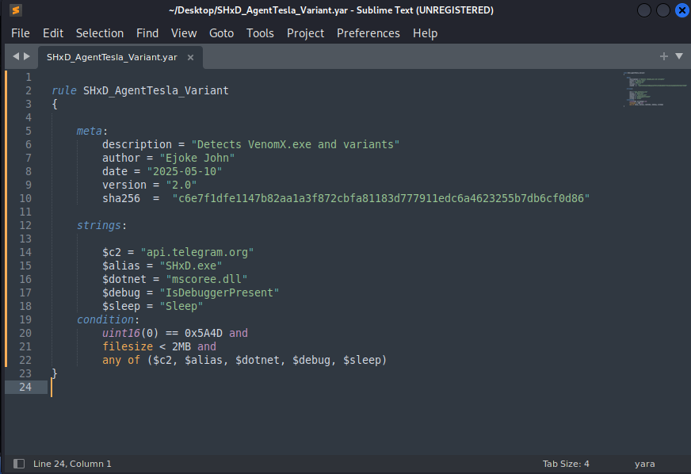

The rule targets four categories of evidence: the hardcoded Telegram C2 domain, the internal `SHxD.exe` identity artifact, the `mscoree.dll` .NET runtime dependency, and the `IsDebuggerPresent`/`Sleep` anti-analysis calls. The condition requires the MZ PE header, file size under 2MB, and either the C2 or identity string alongside at least one supporting indicator : reducing false positives while staying flexible enough to catch variants.

**Test file used for validation:**

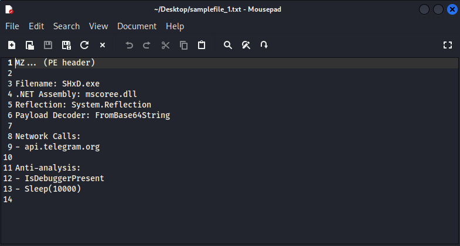

**Test result:**

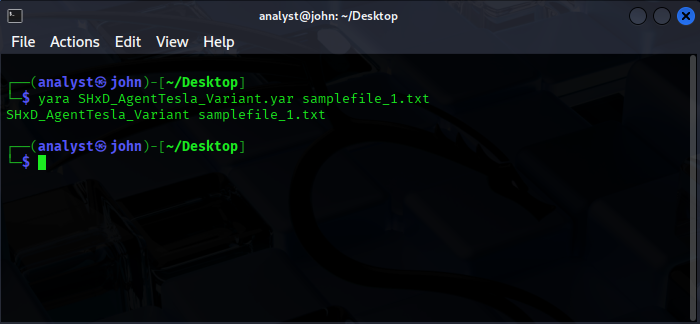

```bash
$ yara SHxD_AgentTesla_Variant.yar samplefile_1.txt
SHxD_AgentTesla_Variant samplefile_1.txt
```

Match confirmed. The full rule with detailed inline comments is in [`/yara/venom_x_detection.yar`](./yara/venom_x_detection.yar).

---

## Conclusion

Going into this I had a suspicious executable and no context. By the end I had a complete behavioral profile of an AgentTesla infostealer : its delivery method, obfuscation layers, evasion techniques, persistence mechanism, C2 infrastructure, and exfiltration method : all documented from evidence I gathered myself.

The finding that surprised me most was the Defender exclusion. I expected persistence. I expected C2 communication. But seeing the malware spawn PowerShell to actively suppress its own detection the moment it ran : and capturing that exact command in ProcMon : was a reminder that modern malware doesn't just evade defenses passively. It actively dismantles them.

The most important lesson from this project is that no single tool tells the full story. Process Hacker missed the malware entirely. VirusTotal gave me intelligence but not behavior. ProcMon showed me behavior but not network intent. ANY.RUN validated everything independently. It took all of them together to build a picture I could trust.

That layered approach : static triage, dynamic monitoring, registry forensics, sandbox verification, detection engineering : is what this project was built to practice. And it's the methodology I'll apply to every sample I analyze going forward.

---

*All analysis was conducted in a fully isolated lab environment. No live systems were involved. Network access was blocked throughout via Host-Only VM networking.*

*Ejoke John : Cybersecurity Analyst | May 2025*  
*[LinkedIn](https://linkedin.com/in/your-profile) · [GitHub](https://github.com/your-username)*
