# Warzone RAT (AveMaria) : Malware Analysis

> **Internship Project : Cyblack SOC Academy | November 2025**
> Analyst: Ejoke John | 

---

## Project Overview

This project documents a full malware analysis of an unknown executable submitted for investigation during my internship at Cyblack SOC Academy. The goal was to replicate a real incident-response workflow: determine whether the file was malicious, understand its intent, map its full behavior, and produce actionable IOCs for SOC monitoring.

I worked through four analysis layers : static triage, dynamic sandbox detonation, PCAP/network forensics, and host-based forensics with Redline : combining findings across all phases to build a complete picture of the threat.

**Verdict:** Confirmed Warzone RAT (AveMaria RAT) : a Python-based, multi-stage Remote Access Trojan with DDNS-based C2, process masquerading, and persistent beaconing behavior.

---

## Sample Details

| Field | Value |
|---|---|
| **File Name** | `Server1.exe` / `emages.exe` |
| **Internal Name** | `server1.exe` |
| **Submitted Hash (SHA-256)** | `c8f5d3f153fab81b07f3e666e13bcbd01d696a7efa4ae0c8dc81c054443e5b67` |
| **MD5** | `ad4c6e7e665c0a101c8ff060b86760b2` |
| **SHA-1** | `afce01e72a3a3d3e766c447f97a5e4684f46dee4` |
| **File Size** | 421 KB (431,104 bytes) |
| **File Type** | Win32 EXE : PE32 executable, 32-bit |
| **PE Type** | .NET / Mono assembly (PyInstaller-packaged) |
| **Packer** | Confuser (1.X), .NET (v4.0.30319) |
| **Digital Signature** | Not signed |
| **VirusTotal Detections** | 53/72 |
| **ANY.RUN Threat Score** | 64/100 : Suspicious |
| **Malware Family** | Warzone RAT / AveMaria RAT |
| **BuildID** | `CTUPX8Y9XW` |
| **Analysis Date** | November 2025 |

---

## Tools Used

| Tool | Purpose |
|---|---|
| ANY.RUN | Interactive sandbox : initial detonation and behavioral observation |
| VirusTotal | Static triage : hash lookup, PE metadata, network artifacts |
| Wireshark | PCAP analysis with SSL/TLS key decryption |
| osslsigncode | Digital signature verification |
| VMware Workstation | Isolated Windows 10 VM for offline detonation |
| FLARE VM | Analyst toolset installed on the isolated VM |
| FakeNet-NG | Simulated outbound network services to capture C2 beacon attempts |
| Redline | Host-based forensic collection : processes, files, registry, network artifacts |

---

## Repository Structure

```
warzone-rat-analysis/
├── README.md
├── screenshots/
│   ├── static/
│   └── dynamic/
└── yara/
    └── warzone_rat_detection.yar
```

---

## 1. Static Analysis

### 1.1 File Identification and Metadata

My first step was to run the file through VirusTotal and ANY.RUN before touching it in any live environment. The hash alone returned 53 out of 72 engine detections : an immediate red flag. The file presents itself as a product called "License Review Application," complete with spoofed copyright, version number (1.7.5.9), and trademark metadata designed to make it look like a legitimate enterprise tool.

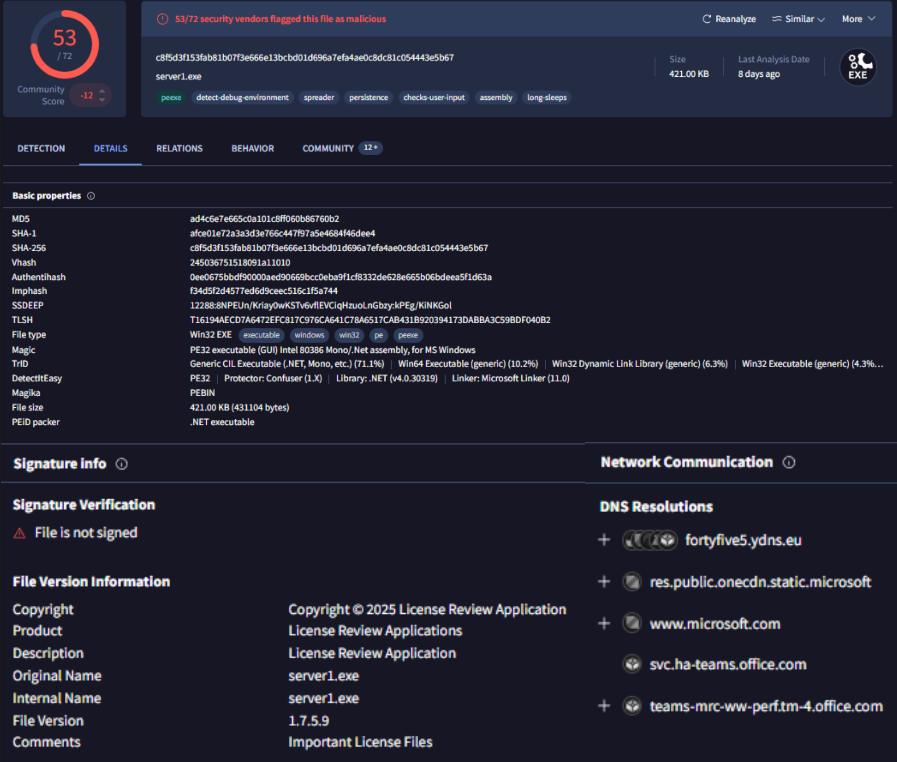

The metadata breakdown shows:

| Field | Value |
|---|---|
| CompanyName | License Review Application |
| FileDescription | License Review Application |
| FileVersion | 1.7.5.9 |
| InternalName | server1.exe |
| LegalCopyright | Copyright © 2025 License Review Application |
| OriginalFileName | server1.exe |
| ProductName | License Review Applications |
| Comments | Important License Files |

Every field is spoofed. The internal name and original file name both point to `server1.exe`, confirming the file makes no attempt to conceal its true identity once you look under the surface : it relies entirely on the surface-level metadata to fool users.

### 1.2 Digital Signature

I verified the signature status using `osslsigncode`. The output was unambiguous: no valid signature was found, the PE checksum was invalid, and the verification step failed entirely. VirusTotal's signature panel echoed this : "File is not signed."

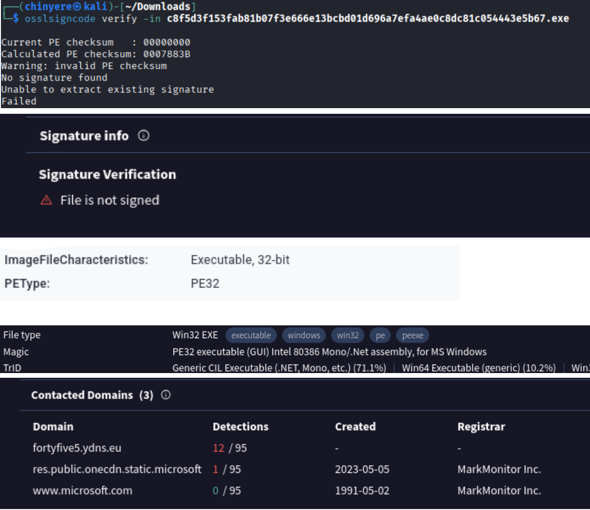

An unsigned file claiming to be a licensed business application is a significant trust indicator that should trigger immediate scrutiny in any SOC environment.

### 1.3 File Type and Architecture

VirusTotal and ANY.RUN both confirmed the file as a **32-bit PE executable** : `Win32 EXE`, targeting x86 architecture. TrID identifies it as a Generic CIL Executable (.NET, Mono) at 71.1% confidence, with DetectItEasy confirming Confuser (1.X) as the packer and .NET (v4.0.30319) as the linker.

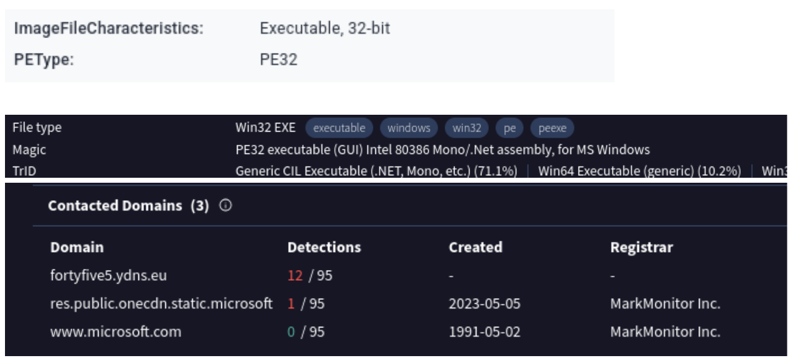

The Confuser packer and .NET/Mono assembly fingerprint were my first hint that this was likely a Python-based payload wrapped in a PyInstaller bundle : a pattern confirmed later in the Redline phase.

### 1.4 Static Network Indicators

VirusTotal's Relations tab surfaced the domains and IPs the malware was known to contact. The standout finding was `fortyfive5.ydns.eu`, which scored 12/95 detections : a Dynamic DNS domain that later became the confirmed C2 address. The 192.168.x.x entries are private/sandbox addresses, not external infrastructure.

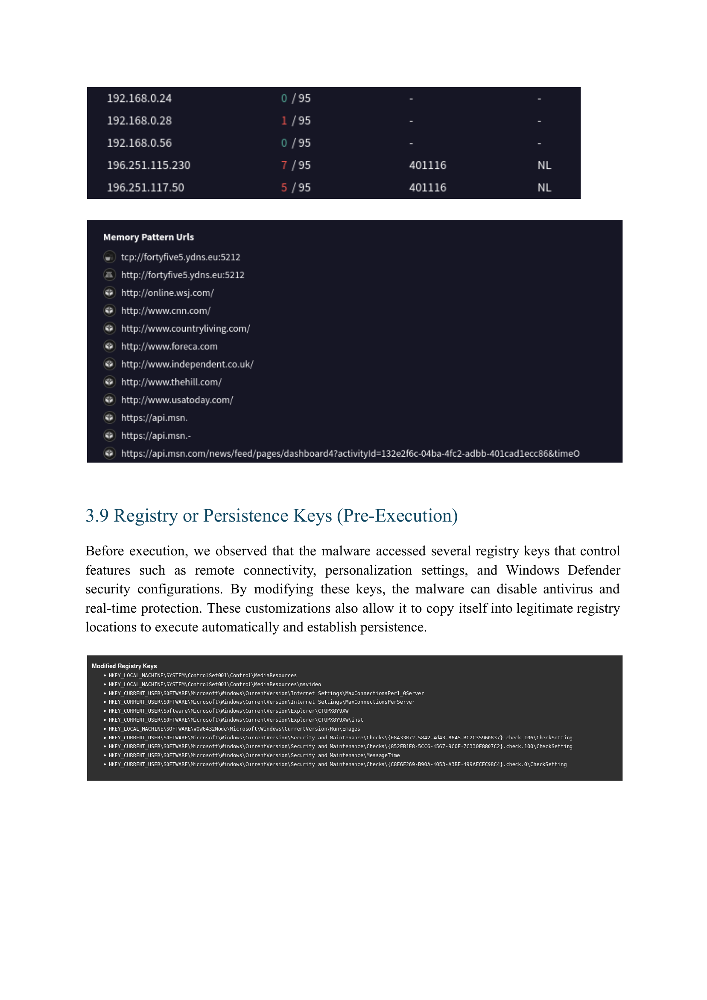

The memory pattern URLs embedded in the binary were also notable : a mix of legitimate news and media sites alongside the malicious DDNS domain. This kind of padding with legitimate URLs is sometimes used to complicate static analysis or to test general internet connectivity before attempting C2.

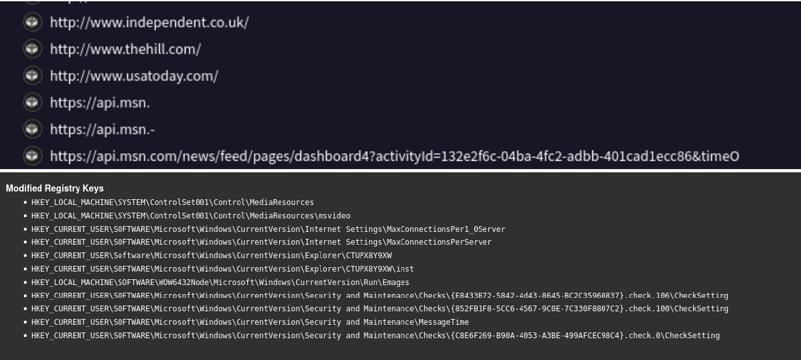

### 1.5 Registry Indicators (Pre-Execution)

Even before execution, ANY.RUN flagged several registry key accesses : including keys related to Windows Defender configurations, Internet Settings, and security maintenance checks. The presence of Defender-adjacent key access is a known pre-persistence behavior in RAT families that want to understand the security posture of the environment before committing their persistence routine.


### 1.6 Impersonation and Lure Techniques

The sample uses several layers of social engineering:

- **Metadata spoofing** : presents as "License Review Application" to convince users it is a legitimate enterprise utility
- **Generic filename** : `server1.exe` and `emages.exe` both look like internal IT or game-related tools
- **Process masquerading** : secondary components are named `wwauth.exe` (resembling `wuauth`) and `wvufault.exe` (resembling `WerFault.exe`) to blend in with Windows internals
- **Placement in user-space directories** : dropped into `%APPDATA%`, `%TEMP%`, and `ProgramData`, all paths that are typically excluded from default AV scanning scope

The likely delivery vector is a phishing email with the dropper attached as a fake software installer or license tool : a common social engineering pattern in enterprise-targeting RAT campaigns.

---

## 2. Dynamic Analysis (ANY.RUN Sandbox)

### 2.1 Malware Configuration Extracted

Before walking through the behavioral timeline, the most significant finding from the sandbox was the **extracted Warzone RAT configuration**. ANY.RUN was able to pull the embedded C2 configuration directly from the process memory of `emages.exe`:

| Config Field | Value |
|---|---|
| Process (PID) | (6236) emages.exe |
| C2 (1) | `fortyfive5.ydns.eu:5212` |
| BuildID | `CTUPX8Y9XW` |
| Install Flag | True |
| Install Name | `emages.exe` |
| Startup Flag | True |
| Startup Name | `Emages` |
| Reverse Proxy Local Port | 5000 |
| Offline Log | False |
| Persistence | True |
| UAC Bypass | False |
| Defender Bypass | False |

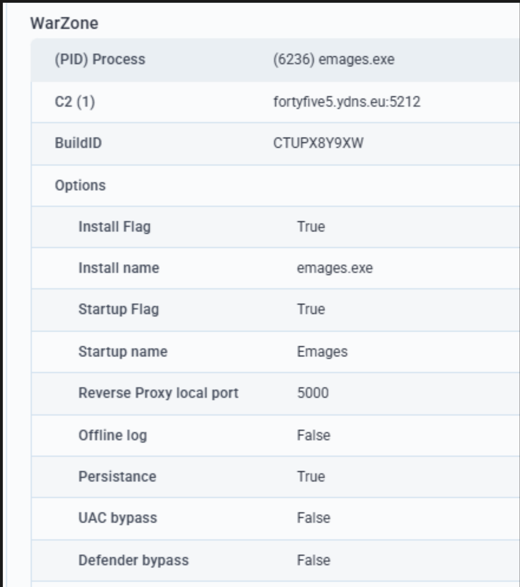

This is the clearest possible confirmation of the RAT family and its intended behavior. The persistence and startup flags are both set to True, confirming it was designed to survive reboots. UAC bypass and Defender bypass are both False : the RAT relies on stealth and process masquerading rather than privilege escalation.

### 2.2 Process Activity and Execution Chain

The initial executable acts as a dropper/loader. It spawns multiple instances of itself to perform process injection and stealth unpacking via a PyInstaller-packaged Python payload, then deploys two secondary payloads: `emages.exe` (the main RAT) and `wvufault.exe` (a masquerading helper component). Once the RAT is installed, it launches `cmd.exe` and `conhost.exe` for post-infection command execution.

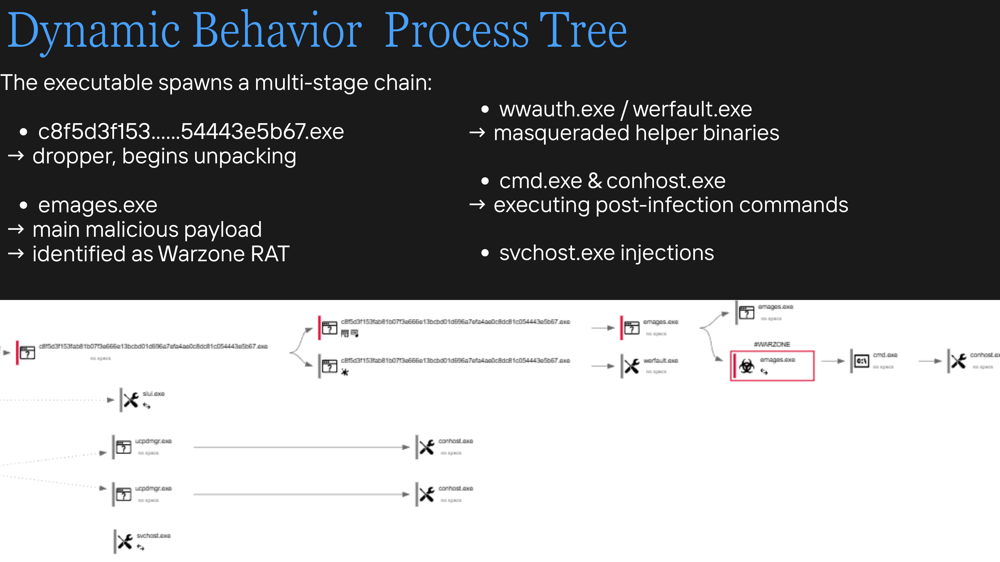

The complete execution chain:

```
c8f5d3f1...e5b67.exe  (dropper/loader)
├── c8f5d3f1...e5b67.exe  (self-injection/unpacking)
│   ├── emages.exe  (#WARZONE : main RAT payload)
│   │   ├── cmd.exe
│   │   └── conhost.exe
│   └── wvufault.exe  (masquerading helper)
├── svchost.exe  (injection target)
└── WerFault.exe  (crash reaction)
```

I identified each process in the chain and documented why each was suspicious:

- **`c8f5d3f1...e5b67.exe`** : random, non-human-readable name; repeats multiple times indicating self-injection or self-replication; acts as the first-stage dropper
- **`emages.exe`** : sandbox explicitly labels this `#WARZONE`; multiple instances running; spawns further child processes
- **`wvufault.exe`** / **`wwauth.exe`** : naming convention mimics `WerFault.exe` and `wuauth.exe`; dropped by the RAT; used for persistence or masquerading
- **`cmd.exe`** (spawned by `emages.exe`) : malware spawning a command interpreter is always suspicious; used for hidden system commands
- **`conhost.exe`** : naturally follows cmd.exe but here linked to a malicious parent, confirming hidden console activity
- **`svchost.exe`** : used as an injection host to hide malicious activity inside a trusted Windows process

### 2.3 Persistence

The sandbox confirmed persistence with a single-word verdict: `Persistence: True`.

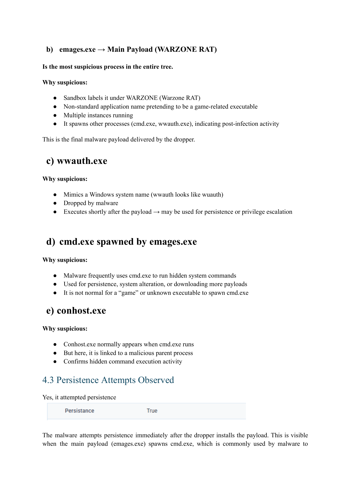

Evidence for persistence came from multiple angles: `emages.exe` repeatedly respawning, `cmd.exe` being used to execute background commands consistent with registry Run key modification, and the extracted config showing Startup Flag = True with install name `Emages`. In the connected sandbox environment, a registry autostart entry was observed. In the offline VM (Redline phase), this wasn't confirmed because FakeNet prevented the RAT from completing its C2 handshake : persistence installation in Warzone RAT is typically gated on a successful C2 connection.

### 2.4 Evasion and Privilege Escalation

According to ANY.RUN, the malware did not attempt UAC bypass, Defender bypass, or use of alternate data streams.

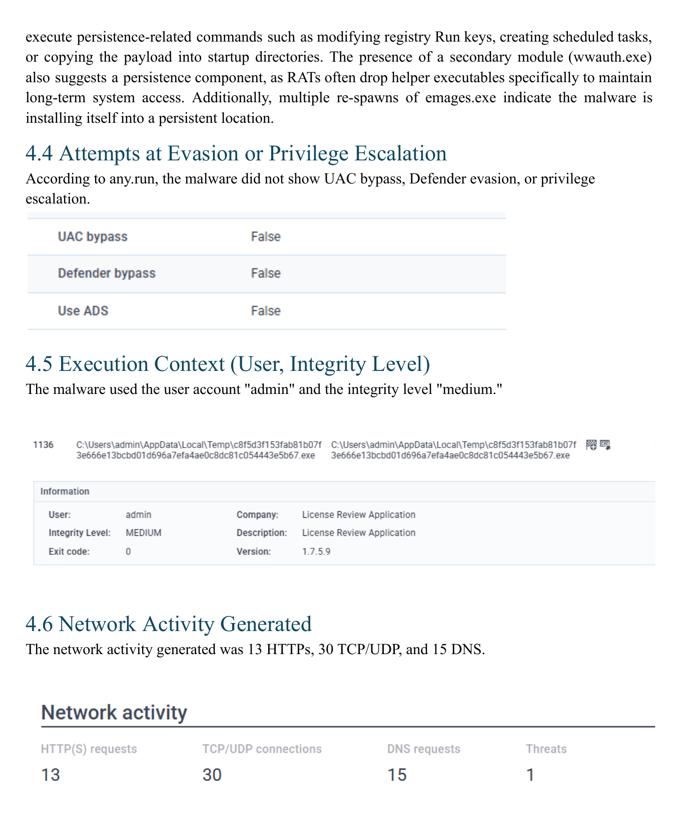

This is consistent with the extracted config. The RAT relies entirely on stealth: process naming, LOLBin abuse, and user-space execution rather than privilege escalation. This design choice makes it harder to detect with behavior-based UAC/elevation alerts, since nothing about the execution looks like it's trying to gain elevated rights.

### 2.5 Network Activity

ANY.RUN captured 13 HTTPS requests, 30 TCP/UDP connections, and 15 DNS lookups : with 1 confirmed threat.

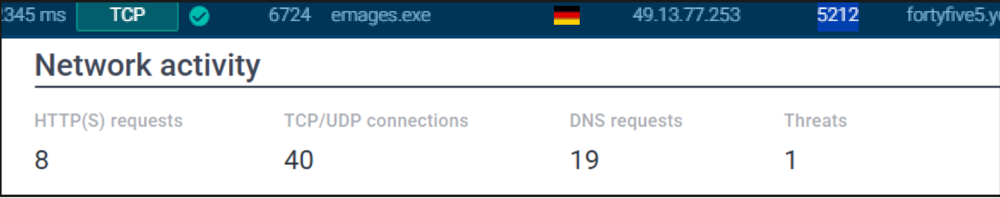

The one malicious connection was `fortyfive5.ydns.eu` resolving to `49.13.77.253` : flagged explicitly by the sandbox.

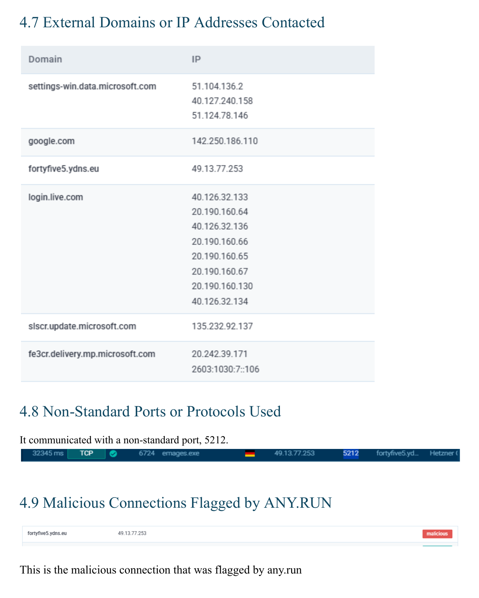

The malware also communicated over **non-standard port 5212** via TCP : visible in the connection from `emages.exe` (PID 6724) to `49.13.77.253:5212`.

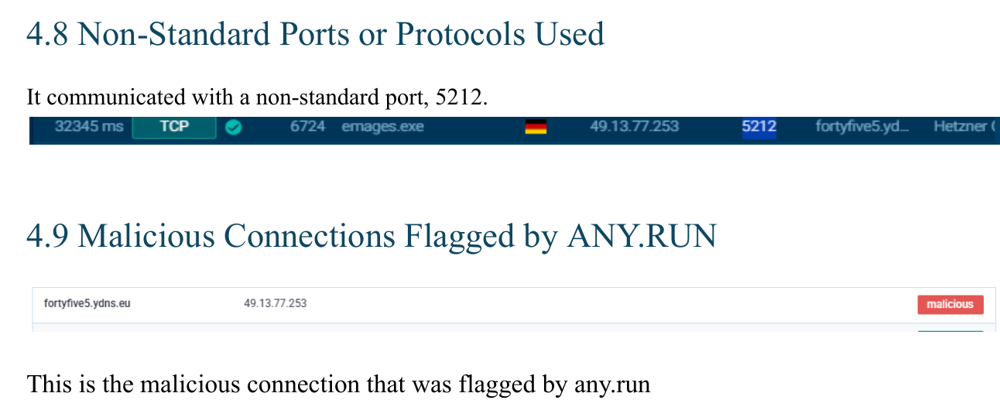

The full list of external domains contacted:

| Domain | IP(s) | Notes |
|---|---|---|
| `fortyfive5.ydns.eu` | 49.13.77.253 | **Malicious C2** : flagged |
| `settings-win.data.microsoft.com` | 51.104.136.2, 40.127.240.158, 51.124.78.146 | Benign : Windows telemetry |
| `google.com` | 142.250.186.110 | Benign : connectivity check |
| `login.live.com` | Multiple | Benign : Windows Live auth |
| `slscr.update.microsoft.com` | 135.232.92.137 | Benign : Windows Update |

### 2.6 Dropped Payloads

The malware executed `emages.exe` as its primary payload, which then spawned `wvufault.exe`, `cmd.exe`, and `svchost.exe` : a clear multi-stage infection chain.

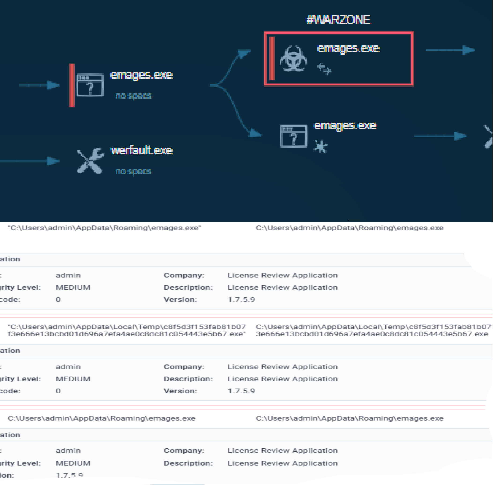

Key dropped file locations:
- `C:\Users\admin\AppData\Roaming\emages.exe`
- `C:\ProgramData\emages.exe`
- Multiple `_MEIxxxx` folders in `%TEMP%` containing full Python runtime

### 2.7 Windows Built-In Process Abuse (LOLBins)

The malware interacted with core Windows components to blend into normal system activity:

| Process | Role in Attack |
|---|---|
| `svchost.exe` | Injection target : malicious code runs under a trusted Windows process |
| `cmd.exe` | Command execution : used for hidden system commands and setup |
| `conhost.exe` | Console host : linked to malicious parent, confirms hidden shell activity |
| `wvufault.exe` | Decoy : mimics `WerFault.exe` naming convention |
| `WerFault.exe` | Triggered by crash : Windows defensive reaction indicating malware-induced instability |

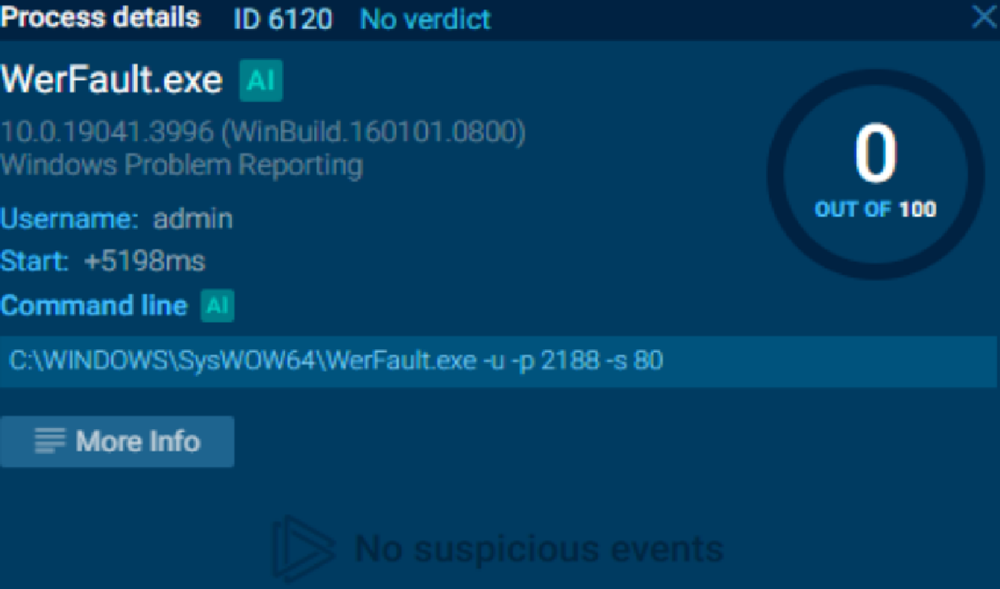

### 2.8 C2 Communication and Beaconing

The malware established C2 communication with `fortyfive5.ydns.eu` over non-standard TCP port 5212. Network analysis confirmed repeated HTTPS POST and GET requests to `49.13.77.253`, consistent with automated beaconing. Responses returned 404, indicating the C2 server was either inactive at the time of analysis or sinkholed : but the intent and behavioral pattern were unambiguous.

Dynamic DNS (ydns.eu) was used for the C2 domain : a deliberate attacker choice, since DDNS allows the attacker to change the underlying IP address without recompiling the malware, making static IP-based blocking ineffective.

---

## 3. PCAP and Network Forensics (Wireshark)

I exported the PCAP from ANY.RUN and imported the session's SSL key log to decrypt encrypted streams in Wireshark. This let me examine the actual HTTP layer of the traffic rather than just observing encrypted blobs.

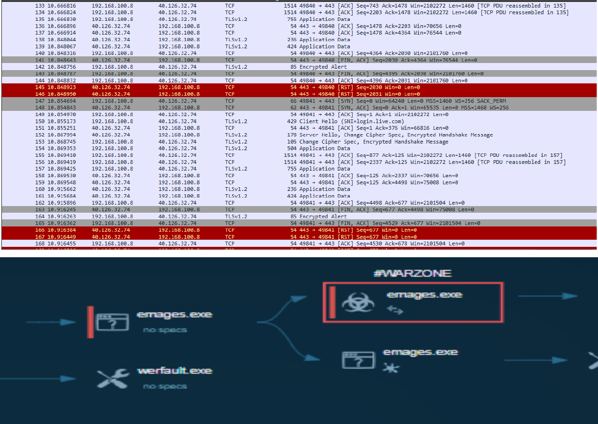

Key findings from the decrypted streams:

- **Multiple POST and GET requests** originating from `emages.exe` to `49.13.77.253` over HTTPS
- **HTTP 404 responses** across all requests : the C2 server was not responding with commands, but the beaconing pattern was fully intact
- **No SNI matching a standard browser** : the TLS handshake lacked the browser fingerprint signatures expected from legitimate web traffic
- **Beacon-like packet intervals** : regular, automated request timing consistent with a RAT heartbeat loop rather than user-initiated browsing
- **No evidence of successful data exfiltration** : all responses were 404, meaning the infection chain was interrupted before any data transfer could occur

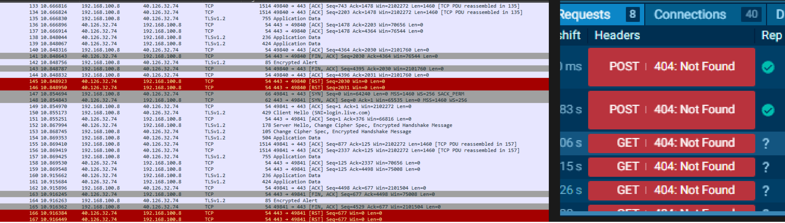

**Note on `/RST2.srf` in the PCAP:** This URL path appeared in the captured traffic and was initially flagged as suspicious. After verification, `/RST2.srf` is a well-known Microsoft Online Services endpoint used by Windows Live authentication flows : it is benign background traffic generated by the Windows environment, not by `emages.exe`. The confirmed malicious requests were those originating from `emages.exe` directly to `fortyfive5.ydns.eu` and `49.13.77.253:5212`.

---

## 4. Redline Examination (Isolated VM : Forensic Review)

After the sandbox analysis, I detonated the same sample inside a dedicated isolated VMware Workstation environment : clean Windows 10 ISO, Host-Only networking, all clipboard and folder sharing disabled. FakeNet-NG was active to intercept outbound traffic. Redline was used to collect the full host forensic snapshot.

### 4.1 Running Processes

The clean baseline showed normal Windows processes : `System`, `smss.exe`, `csrss.exe`, `wininit.exe`, `services.exe`, `winlogon.exe`, multiple signed `svchost.exe` instances : all running under standard service accounts and all Microsoft-signed.

Once the dropper (`xagt.exe` in this session, located at `C:\Users\JohnPC\Desktop\Malware\x64\`) executed, Redline captured the deviation immediately. The loader was unsigned and user-launched. Within seconds, it dropped and launched `emages.exe` into `C:\ProgramData\emages.exe`.

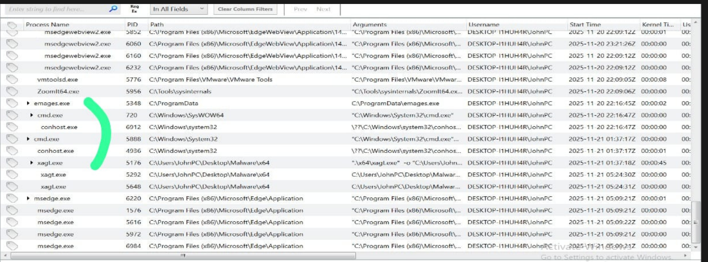

`emages.exe` then spawned multiple instances of `cmd.exe`, which in turn created `conhost.exe` processes : matching the ANY.RUN behavior exactly. All these child processes were unsigned, ran under the user account, and appeared only after detonation.

Summary of Redline process findings:
1. The dropper successfully executed and dropped `emages.exe`
2. The RAT spawned hidden command and console processes (`cmd.exe` → `conhost.exe`)
3. All abnormal activity was isolated to the malicious branch : no signs of system-wide compromise

### 4.2 Network Activity (FakeNet)

FakeNet captured the C2 beacon pattern in real time. Once `emages.exe` started, it immediately began:

1. Issuing repeated DNS queries for `fortyfive5.ydns.eu`
2. Connecting to FakeNet's sinkhole address `192.0.2.123` on TCP port 5212
3. Sending UDP traffic to `192.168.224.128:53` (FakeNet's DNS) between TCP attempts

This DNS → UDP → TCP 5212 cycle repeated continuously throughout the observation window : the classic Warzone RAT heartbeat pattern.

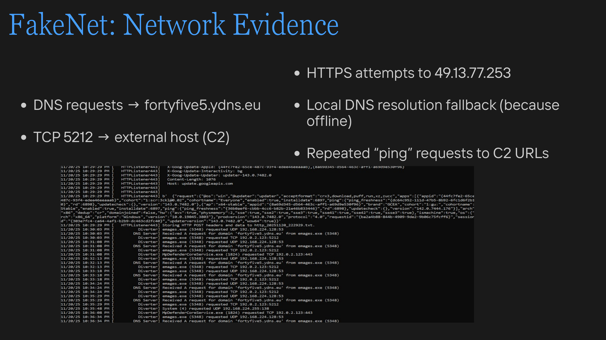

Key network indicators confirmed by Redline/FakeNet:

| Indicator | Value |
|---|---|
| Process | `emages.exe` (PID 5348) |
| C2 Domain | `fortyfive5.ydns.eu` |
| Destination IP (sinkholed) | `192.0.2.123` |
| C2 Port | TCP 5212 |
| Pattern | Repeated DNS → UDP 53 → TCP 5212 |

No lateral movement was observed. All malicious traffic was outbound-only, directed at the simulated C2 infrastructure.

### 4.3 Dropped and Modified Files

The malware's primary footprint was in `%TEMP%`, where it extracted a complete Python runtime environment into multiple `_MEIxxxx` folders. Each folder contained 60+ Python extension modules (`.pyd` files), Win32 API wrapper DLLs, and a `base_library.zip` archive : the full PyInstaller unpacking signature.

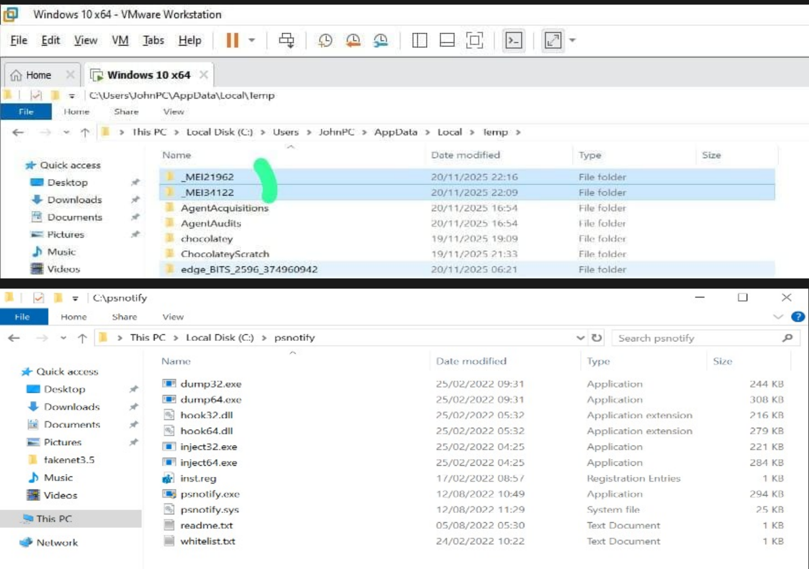

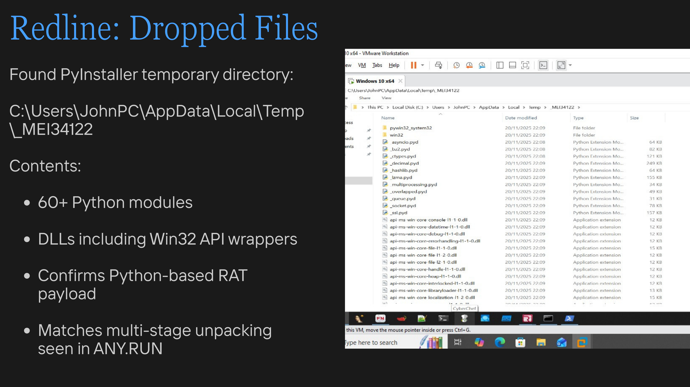

Key confirmed artifact locations:

- `C:\Users\Admin\AppData\Roaming\emages.exe` : main RAT payload
- `C:\ProgramData\emages.exe` : secondary deployment path
- `C:\Users\JohnPC\AppData\Local\Temp\_MEI21962\` : PyInstaller unpack folder
- `C:\Users\JohnPC\AppData\Local\Temp\_MEI34122\` : PyInstaller unpack folder

One folder at `C:\psonotify\` containing `dump32.exe`, `inject32.exe`, `hook32.dll`, and related binaries was also visible on the system. Timestamps for these files predate the execution window and do not align with any malware activity : these appear to be pre-existing analysis tools on the VM and were excluded from the analysis.

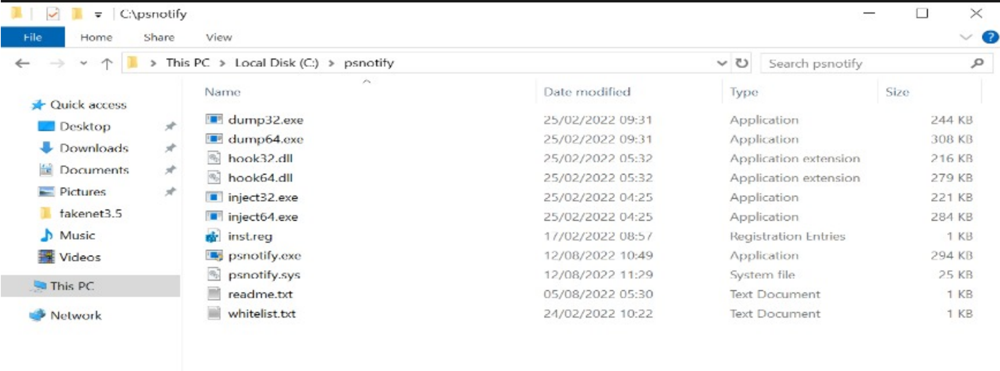

### 4.4 Registry Modifications and Persistence

Redline found **no registry modifications** on the offline VM : consistent with the sandbox findings showing that Warzone RAT gates its persistence routine on a successful C2 connection. Because FakeNet prevented a real C2 session from being established, the RAT was unable to complete its install-and-persist sequence.

This is itself a valuable forensic finding: it confirms the RAT's stealth-focused, network-dependent persistence design : it does not write Run keys speculatively. It waits for operator confirmation.

### 4.5 Command-Line Execution Traces

Multiple short-lived `cmd.exe` processes appeared immediately after `emages.exe` started and disappeared quickly. Redline did not capture full command-line arguments, but the process relationships confirm CMD was used as an internal launcher for injection setup and anti-analysis behavior. This is consistent with the ANY.RUN sandbox findings where CMD was observed executing tasks before process injection into `conhost.exe` and `svchost.exe`.

### 4.6 Redline vs. ANY.RUN Comparison

| Finding | ANY.RUN | Redline + FakeNet |
|---|---|---|
| Dropper execution | ✅ Confirmed | ✅ Confirmed (as `xagt.exe`) |
| `emages.exe` payload drop | ✅ Confirmed | ✅ Confirmed |
| `cmd.exe` / `conhost.exe` spawning | ✅ Confirmed | ✅ Confirmed |
| `svchost.exe` injection | ✅ Confirmed | ✅ Confirmed |
| `WerFault.exe` crash trigger | ✅ Confirmed | ✅ Confirmed |
| C2 domain (`fortyfive5.ydns.eu`) | ✅ Full DNS + HTTPS | ✅ DNS queries + TCP attempts (sinkholed) |
| Registry persistence | Observed (Run key) | Not observed (C2-gated) |
| PyInstaller `_MEIxxxx` artifacts | Observed | ✅ Full folder structure captured |
| Data exfiltration | Not observed | Not observed |

Both tools agreed on all core behaviors. ANY.RUN showed the full networked behavior; Redline provided the deeper host-level forensic footprint. Combined, they give a complete picture of this Warzone RAT sample.

---

## 5. Indicators of Compromise (IOCs)

### File-Based IOCs

| Type | Value | Notes |
|---|---|---|
| SHA-256 | `c8f5d3f153fab81b07f3e666e13bcbd01d696a7efa4ae0c8dc81c054443e5b67` | Initial dropper |
| MD5 | `ad4c6e7e665c0a101c8ff060b86760b2` | Initial dropper |
| SHA-1 | `afce01e72a3a3d3e766c447f97a5e4684f46dee4` | Initial dropper |
| Filename | `emages.exe` | Warzone RAT payload |
| Filename | `wvufault.exe` / `wwauth.exe` | Masquerading helper binaries |
| Filename | `server1.exe` | Original dropper name |
| Path | `C:\Users\Admin\AppData\Roaming\emages.exe` | Payload installation path |
| Path | `C:\ProgramData\emages.exe` | Secondary deployment path |
| Path | `%TEMP%\_MEI*\` | PyInstaller unpack folders |

### Network IOCs

| Type | Value | Notes |
|---|---|---|
| Domain | `fortyfive5.ydns.eu` | Confirmed malicious C2 |
| IP | `49.13.77.253` | C2 resolved IP (Hetzner, Germany) |
| Port | TCP 5212 | Non-standard C2 communication port |
| Protocol | HTTPS / encrypted TCP | Beaconing traffic |
| DNS Provider | `ydns.eu` | Dynamic DNS provider used for C2 flexibility |

### Host-Based IOCs

| Type | Value |
|---|---|
| Process | `emages.exe` : unsigned, from `C:\ProgramData` or `AppData\Roaming` |
| Process | `xagt.exe` / `wvufault.exe` / `wwauth.exe` : masquerading binaries |
| Process chain | Unsigned EXE → `cmd.exe` → `conhost.exe` (suspicious parent) |
| File artifact | Multiple `_MEIxxxx` folders in `%TEMP%` containing `.pyd` and `.dll` files |
| Behavior | Repeated DNS queries to `ydns.eu` DDNS domain |
| Behavior | TCP beaconing on port 5212 at regular intervals |
| Config artifact | BuildID `CTUPX8Y9XW` in memory |

---

## 6. MITRE ATT&CK Mapping

| Technique ID | Technique | Evidence |
|---|---|---|
| T1566 | Phishing | Likely delivery vector based on lure metadata |
| T1059.003 | Command and Scripting Interpreter: Windows Command Shell | `cmd.exe` spawned by `emages.exe` |
| T1055 | Process Injection | Injection into `svchost.exe`, `conhost.exe` |
| T1036 | Masquerading | `wvufault.exe` mimics `WerFault.exe`; `wwauth.exe` mimics `wuauth.exe` |
| T1036.005 | Match Legitimate Name or Location | Metadata spoofed as "License Review Application" |
| T1547.001 | Registry Run Keys / Startup Folder | Startup Flag = True in extracted config |
| T1071.001 | Application Layer Protocol: Web Protocols | HTTPS beaconing over port 5212 |
| T1568.001 | Fast Flux DNS | Dynamic DNS via `ydns.eu` |
| T1041 | Exfiltration Over C2 Channel | C2 connection pattern; exfiltration not confirmed (404 responses) |
| T1027 | Obfuscated Files or Information | PyInstaller packing, Confuser obfuscation |
| T1140 | Deobfuscate/Decode Files or Information | `_MEIxxxx` PyInstaller unpack routine |
| T1082 | System Information Discovery | DNS/connectivity checks before C2 contact |

---

## 7. Classification and Attack Chain

**Malware Family:** Warzone RAT / AveMaria RAT
**Type:** Remote Access Trojan (RAT) : Python-based, multi-stage
**Risk Rating:** CRITICAL (High Likelihood × High Impact)

### Attack Chain

```
Stage 1 : Initial Execution
  User runs dropper (server1.exe / xagt.exe)
  Dropper begins PyInstaller unpack → _MEIxxxx folders created in %TEMP%

Stage 2 : Payload Deployment
  Dropper writes and executes emages.exe (main Warzone RAT)
  Secondary component (wvufault.exe) deployed for masquerading

Stage 3 : Process Injection & Stealth
  emages.exe spawns cmd.exe → conhost.exe sessions (hidden commands)
  Injects into svchost.exe
  WerFault.exe triggered by crash (distraction/instability)

Stage 4 : C2 Beaconing
  Repeated DNS queries → fortyfive5.ydns.eu
  TCP 5212 connection attempts → 49.13.77.253
  HTTPS POST/GET beacons (404 responses : C2 offline or sinkholed)

Stage 5 : Persistence (network-gated)
  Startup Flag = True in config
  Persistence routine gated on successful C2 handshake
  Not confirmed in offline environment due to FakeNet interception
```

---

## 8. Recommendations

**Immediate Containment:**
- Isolate the affected host from the network (remove from VLAN or disable NIC)
- Terminate `emages.exe`, `wvufault.exe`, `wwauth.exe`, and any associated `cmd.exe` / `conhost.exe` instances
- Search for and remove persistence entries under `HKCU\...\Run` and `HKLM\...\Run`
- Delete `emages.exe` from `AppData\Roaming`, `ProgramData`, and all `_MEIxxxx` temp folders
- Reset credentials for all accounts active on the compromised host

**Block at the Network Perimeter:**
- Block domain `fortyfive5.ydns.eu` at DNS and proxy level
- Block IP `49.13.77.253`
- Block outbound TCP on port 5212
- Consider blocking or monitoring all `ydns.eu` DDNS subdomains

**Detection Improvements:**
- Alert on unsigned executables in `%APPDATA%`, `%TEMP%`, or `ProgramData` making outbound network connections
- Alert on process chains: unsigned EXE → `cmd.exe` → `conhost.exe`
- Monitor for TLS traffic to non-standard ports (anything other than 443/80)
- Sysmon Rule: Process create events where parent image is in user-writable directories
- IDS/IPS: Beacon-like repeated DNS lookups to `*.ydns.eu` domains

**Hardening:**
- Deploy AppLocker or WDAC policies to prevent execution from `%APPDATA%` and `%TEMP%`
- Enforce PowerShell Constrained Language Mode
- Restrict outbound HTTPS to approved destinations only
- Deploy endpoint EDR with behavioral detection capabilities

---

## 9. YARA Detection Rule

A custom YARA rule has been written for this sample to enable future detection. See [`yara/warzone_rat_detection.yar`](yara/warzone_rat_detection.yar) for the full rule with inline comments.

The rule targets:
- The hardcoded C2 domain string `fortyfive5.ydns.eu`
- The DDNS provider string `ydns.eu`
- The internal payload name `emages.exe`
- The spoofed metadata string `License Review Application`
- PyInstaller bootstrap strings (`_MEIPASS`, `base_library.zip`, `python3`)
- Warzone RAT configuration markers (`CTUPX8Y9XW`, `Emages`)
- The non-standard C2 port `5212` as a byte sequence
- MZ/PE header presence

---

## 10. Conclusion

This analysis confirmed that the submitted executable is a fully functional Warzone RAT (AveMaria) dropper with multi-stage execution, DDNS-based C2 infrastructure, Python-based payload delivery, and a stealth-focused design that relies on LOLBins and process masquerading rather than privilege escalation.

Across all four analysis phases : static triage, sandbox detonation, PCAP decryption, and Redline forensics : the findings were consistent. ANY.RUN showed the complete networked behavior; Redline provided the host-level forensic footprint; Wireshark confirmed the beaconing pattern and absence of successful data exfiltration. The extracted malware configuration (BuildID `CTUPX8Y9XW`, C2 `fortyfive5.ydns.eu:5212`, Startup=True, Persistence=True) was the clearest possible confirmation of intent.

If deployed in a production environment, this malware would give an attacker full remote access to the infected host, with the capability to execute commands, harvest credentials, exfiltrate data, and potentially move laterally across the network. The critical risk rating is warranted.

This project reinforced the value of layered analysis : no single tool gave the full picture, but all four together left no ambiguity about what this sample was and what it was trying to do.

---

*Analysis conducted in a controlled, isolated lab environment. No live malware was executed outside of sandboxed or air-gapped systems.*
