# Email Header Analysis
### Investigating a Suspicious Phishing Email | SOC Operations | Cyblack Internship

---

## Live Forensic Walkthrough

As part of my work during the Email Header Analysis phase at Cyblack SOC Academy, I completed a live forensic analysis of an email header on video. The walkthrough covers the same methodology documented here: opening the raw header, tracing the originating IP, interpreting authentication results, and reaching a verdict.

**[Watch the live email header forensic analysis (approx. 22 mins)](https://youtu.be/EuG3D6nTctg?si=p3BG3LVA6O81Xcxl)**

---

## Overview

During my internship at Cyblack SOC Academy, I was assigned to investigate a quarantined email that had been flagged by our email gateway. The email appeared to originate from Microsoft, carrying the subject line "Microsoft account unusual sign-in activity" and warning the recipient that someone in Russia had just logged into their account from a new device. My task was to determine whether the message was legitimate, spoofed, or spam, and to present a verdict backed by technical evidence to the executive board.

This project documents my full investigation process: opening the raw header, tracing the originating IP, validating authentication records, mapping the relay path, running threat intelligence checks, and dissecting the email body itself. Every finding pointed in the same direction.

**Verdict: Confirmed Spoofed Phishing Attempt**

**Tools used:** Sublime Text, PhishTool, MXToolbox, Google Admin Toolbox, AbuseIPDB, VirusTotal, WHOIS

---

## The Investigation

### Opening the Raw Header

The first thing I did was open the phishing sample file in Sublime Text and enable the Email Header syntax view. This made the raw header readable and allowed me to work through each field methodically. Email headers are written in reverse chronological order, meaning the first `Received` line you see is closest to the recipient and the last is closest to the sender. Understanding that ordering was the starting point for everything that followed.

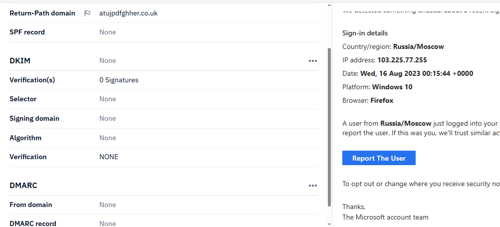

---

### Identifying the Originating IP Address

To find where the email actually came from, I navigated to the last `Received` field in the header, which represents the first server to handle the message. The originating IP address was **89.144.44.41**, coming from a server called `atujpdfghher.co.uk`. This was the first red flag: a `.co.uk` domain sending an email that claimed to be from Microsoft.

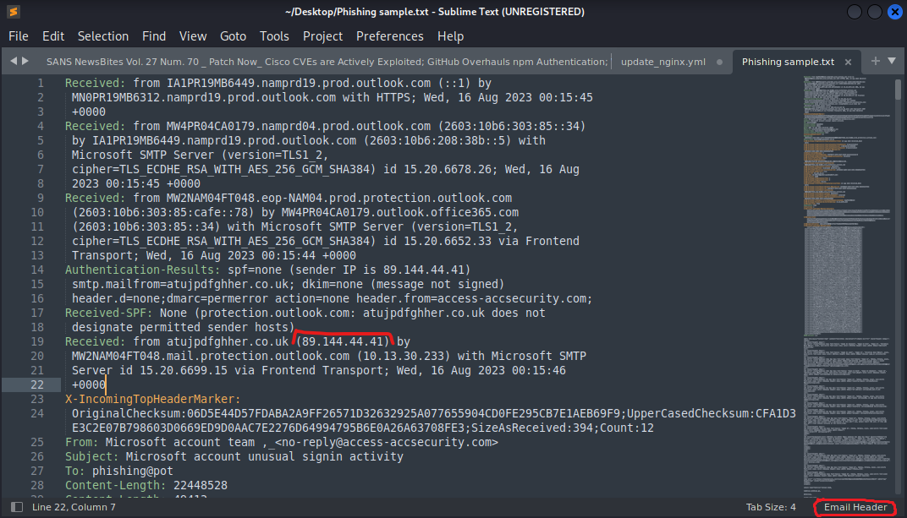

I ran a WHOIS lookup on the IP using `whois.domaintools.com`. The result confirmed the IP belonged to **GHOSTNET GmbH**, a data center hosting provider based in **Frankfurt am Main, Germany**. The sending domain in the header pointed to a `.co.uk` address, but the IP resolved to Germany. That geographic and infrastructure mismatch was already a strong indicator of spoofing.

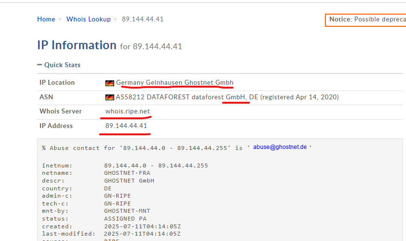

I also checked the IP against **AbuseIPDB**. It had been reported 20 times across 8 distinct sources, first flagged in July 2023. While the current abuse confidence sat at 0%, the report history and the nature of the hosting provider raised enough concern to warrant continued investigation.

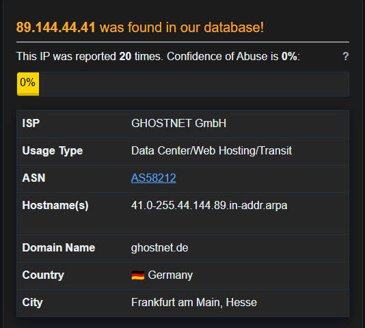

---

### Checking the Sender Domain

The WHOIS check on `atujpdfghher.co.uk` returned something that confirmed the domain was fabricated: it had never been registered. The domain did not exist in any registry.

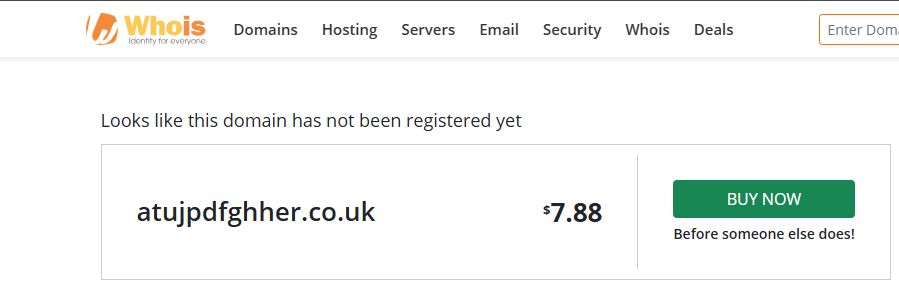

An unregistered domain sending an email claiming to be from Microsoft's security team is not an anomaly. It is a deliberate spoofing technique. The attacker used a throwaway domain with no DNS records, no SPF configuration, and no accountability.

---

### SPF, DKIM, and DMARC Authentication Results

With the IP and domain context established, I examined the authentication fields in the raw header. All three mechanisms failed completely.

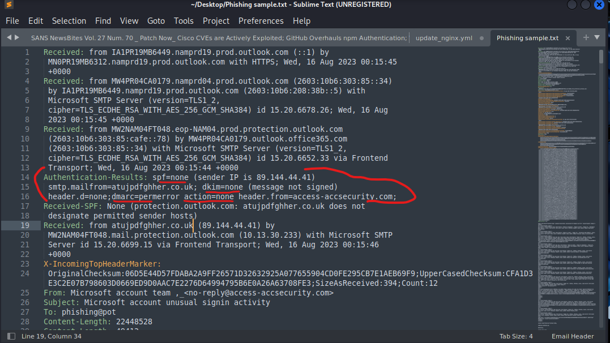

The **SPF** result came back as `none`, meaning `atujpdfghher.co.uk` had published no SPF record in DNS. There was no policy telling receiving servers which IPs were authorized to send mail on its behalf.

The **DKIM** result was also `none`, with zero signatures. The message carried no cryptographic signature, so there was no way to confirm the content had not been altered in transit or that it came from who it claimed.

The **DMARC** result returned `permerror`, a permanent failure caused by a missing or misconfigured DMARC DNS record for the `From` domain, `access-accsecurity.com`. Since both SPF and DKIM had already failed, DMARC had nothing to align against.

I loaded the same header into **PhishTool** to cross-validate. The Authentication tab confirmed the same result independently: SPF record none, DKIM with zero signatures and no signing domain, DMARC record none.

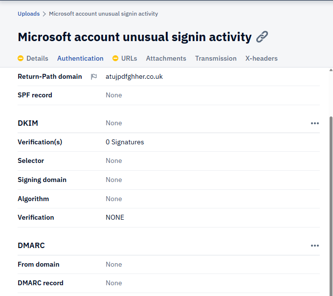

What made this finding land harder was seeing the authentication failures and the rendered email body in the same view. On the left, every authentication field returning none. On the right, a polished Microsoft security alert designed to look completely legitimate. That contrast captures exactly what makes this kind of attack effective: the surface is convincing, but the infrastructure underneath it is empty.

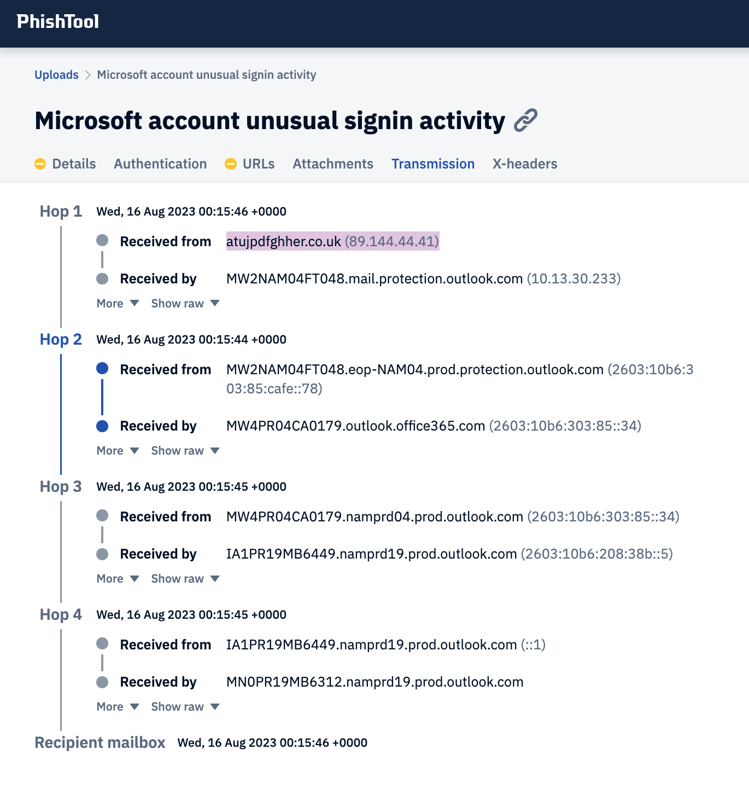

I also ran `access-accsecurity.com` through **MXToolbox**. The result showed no DNS record published, no DMARC record found, and DMARC policy not enabled. This independently confirmed what the raw header had already told me: this domain had no legitimate email infrastructure behind it at all.

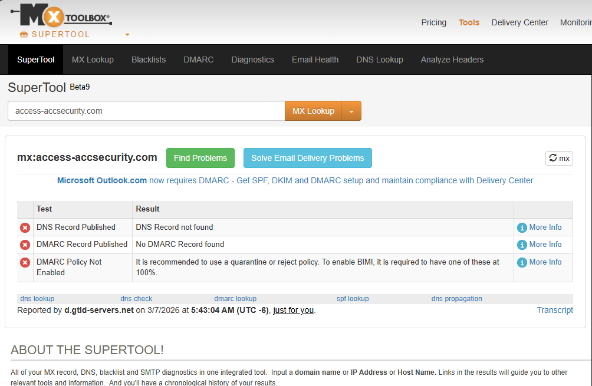

Three tools, three independent confirmations. The email failed every standard authentication mechanism.

---

### PhishTool Details View

Loading the email into PhishTool's Details tab gave me a clear summary of the sender metadata alongside the rendered email body. The display name showed "Microsoft account team" but the actual sender field returned none. The Reply-To was clearly flagged as `solutionteamrecognizd03@gmail.com` and the originating IP 89.144.44.41 was highlighted as Hop 1. The rendered view on the right showed exactly what the recipient would have seen: a convincing Microsoft security alert with a prominent blue "Report The User" button.

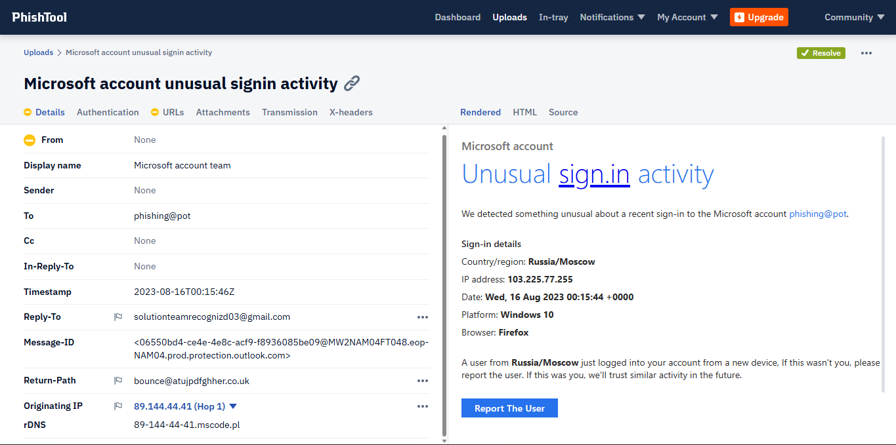

---

### Relay Path and Server Hops

PhishTool's Transmission tab visualized the full relay path. The email passed through four servers before reaching the recipient's mailbox, starting at `atujpdfghher.co.uk` (89.144.44.41) and entering Microsoft's protection gateway before moving through Exchange Online infrastructure to final delivery. The message entered Microsoft's system from outside with no credentials and no authentication. Passing through Microsoft's servers was not evidence of legitimacy; it simply meant their gateway received and routed an inbound external email, which is standard behavior.

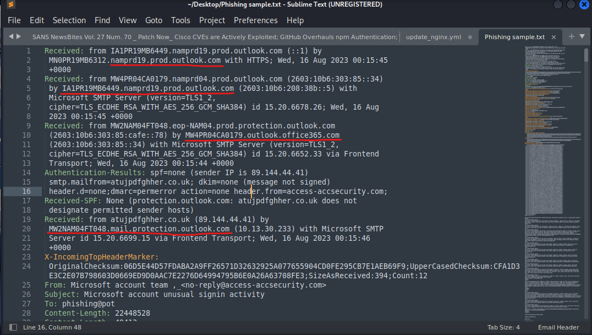

---

### Timestamp Analysis

Running the header through **Google Admin Toolbox** showed the entire delivery completed in approximately 2 seconds. One hop displayed a reading of -2 seconds, which looked unusual but was attributable to clock skew between servers hosted in different regions. There were no meaningful time discrepancies suggesting header manipulation or artificial delay.

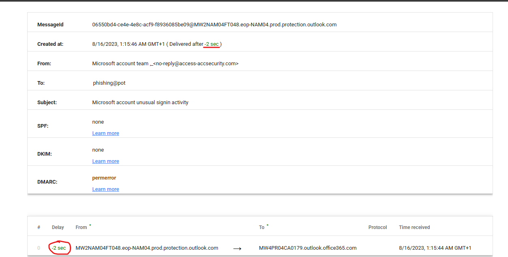

---

### Threat Intelligence: IP and Domain Reputation

With the header analysis complete, I moved into threat intelligence validation to check both the originating IP and the sender domain against external reputation databases.

I ran **89.144.44.41** through VirusTotal. The detection tab returned 0/94, meaning no security vendor had flagged it as malicious at the time of analysis. However, the details tab told a more nuanced story: the IP fell under **ASN 214762**, registered to **MatHost.eu**, with a country designation of Poland and registry under RIPE NCC. This conflicted with what the WHOIS lookup had shown earlier, where the same IP was attributed to GHOSTNET GmbH in Germany. That inconsistency across registries is itself a data point worth noting in any investigation, as it reflects how hosting infrastructure can be layered across multiple providers and jurisdictions.

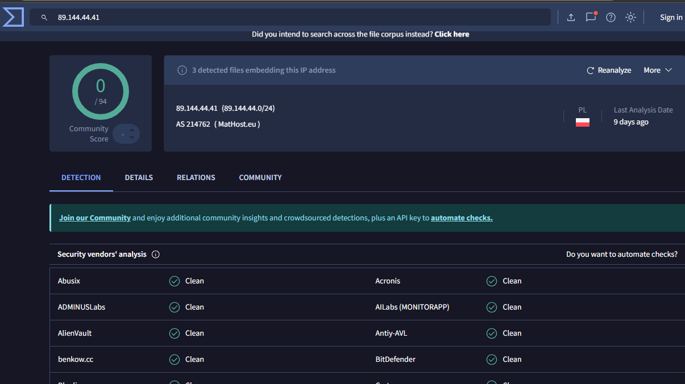

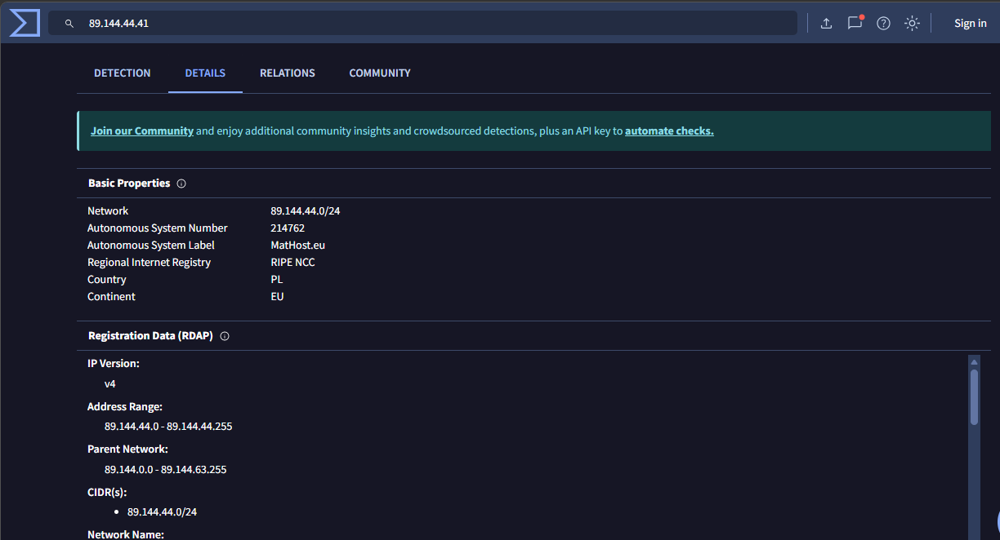

The Relations tab on VirusTotal was the most telling finding from the IP scan. It showed 11 files that had been submitted referencing this IP address, several of them named `Phishing_sample.eml` and `Phishing sample.txt`, including submissions from 2025. This confirmed the IP had been used in multiple phishing campaigns beyond the one I was investigating.

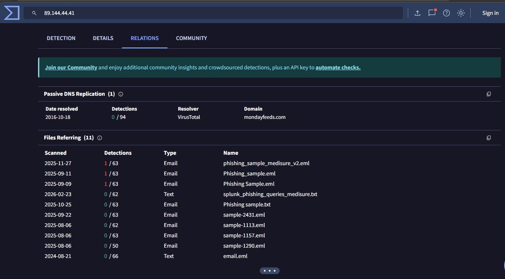

I then scanned the `From` domain, **access-accsecurity.com**, through VirusTotal. The detection result was 0/95 with no vendors flagging it as malicious. But the community score returned -1, indicating that members of the security community had flagged it as suspicious. The details tab showed the domain was first submitted to VirusTotal in March 2023 and had been resubmitted as recently as January 2026, meaning it had remained in circulation and under scrutiny for nearly three years.

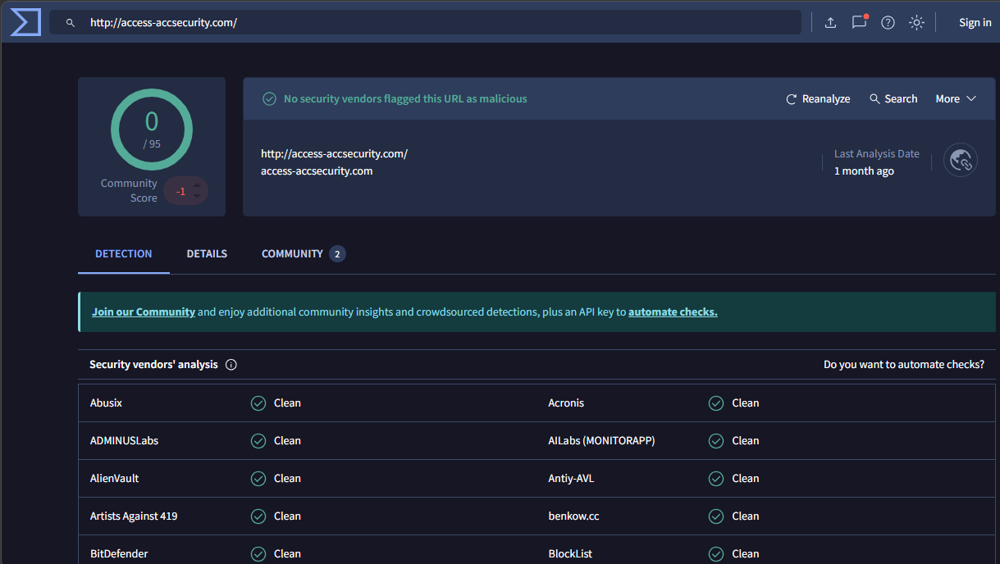

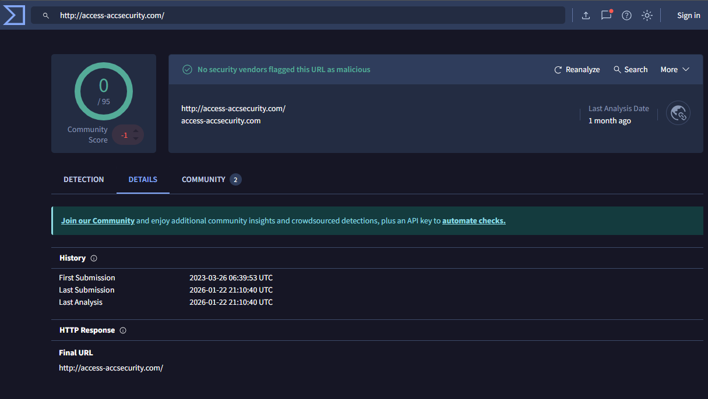

A clean VirusTotal score does not mean a domain is legitimate. It means no automated engine has confirmed it malicious yet. The combination of a negative community score, an unrelated domain name, no email authentication records, and active use in a spoofing campaign tells the real story.

---

### Inside the Email Body

The raw email file gave me visibility beyond the header into the HTML body of the message itself. Several details there reinforced the verdict and revealed the attacker's full methodology.

Every interactive element in the email was a trap. The "Report The User" button was not a Microsoft reporting mechanism. It was a `mailto:` link that would open a compose window addressed directly to `solutionteamrecognizd03@gmail.com`, the attacker's inbox. The "click here to opt out" link at the bottom went to the same Gmail address. A recipient who thought they were reporting unauthorized access or unsubscribing from notifications would actually be initiating contact with the attacker and confirming their email address was active.

There was also a hidden 1x1 pixel image embedded at the bottom of the email, pointing to an external domain `thebandalisty.com`. This is a tracking beacon. When the email is opened, the image loads silently and sends a confirmation signal back to that server, letting the attacker know the email was received and opened. This level of instrumentation suggests the attacker was running an active campaign and monitoring delivery rates.

Finally, the CSS block embedded in the email contained hundreds of randomly generated class names with no styling purpose. This is a deliberate obfuscation technique designed to inflate the size and complexity of the email's code, making it harder for spam filters to fingerprint the template and block it. It is not a mistake or artifact. It is evasion by design.

---

### Sender Identity and Reply-To Mismatch

The `From` field showed: `Microsoft account team <no-reply@access-accsecurity.com>`. The display name said Microsoft. The domain said otherwise. `access-accsecurity.com` has no affiliation with Microsoft. Microsoft's legitimate sending domains are `microsoft.com` and `onmicrosoft.com`. Nothing else.

The `Reply-To` address confirmed the intent: `solutionteamrecognizd03@gmail.com`. Microsoft does not use free consumer email addresses for security communications under any circumstances.

---

## Verdict and Key Findings

After completing the full investigation, the email was classified as a **confirmed spoofed phishing attempt**. The primary objective was credential harvesting through social engineering, with every interactive element in the email body designed to route victim responses directly to the attacker.

The case rested on five converging findings: the originating domain `atujpdfghher.co.uk` was unregistered with no connection to Microsoft; SPF, DKIM, and DMARC all failed across multiple independent tools; the sending IP linked to multiple phishing sample files in VirusTotal's relations database; the `From` domain `access-accsecurity.com` carried a negative community score and no legitimate email infrastructure; and the email body contained a tracking beacon, obfuscated CSS, and attacker-controlled links disguised as legitimate Microsoft actions. No single finding would be decisive in isolation. Together, they left no room for doubt.

---

## What I Learned

This investigation reinforced why email header analysis is a foundational SOC skill. The visible surface of an email, what the recipient sees, is the last thing to trust. The header contains the forensic record of how a message actually traveled and who actually sent it. Learning to read that record, trace IPs, interpret authentication failures, cross-reference threat intelligence, and connect every finding to a verdict is the work of a real analyst. This project is where I put all of that into practice.

---

*John Ejoke Oghenekewe | Cybersecurity Analyst | SOC Engineer*
*GitHub: [github.com/john-ejoke](https://github.com/john-ejoke)*
