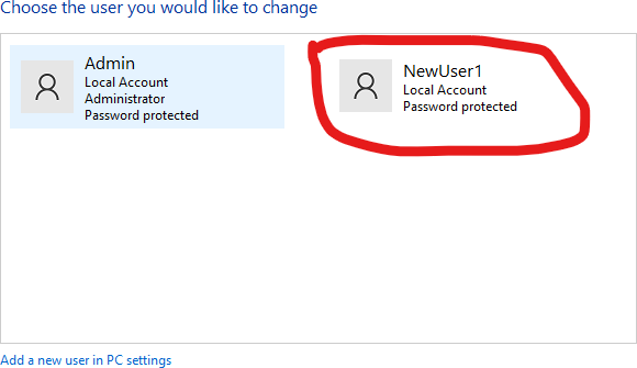
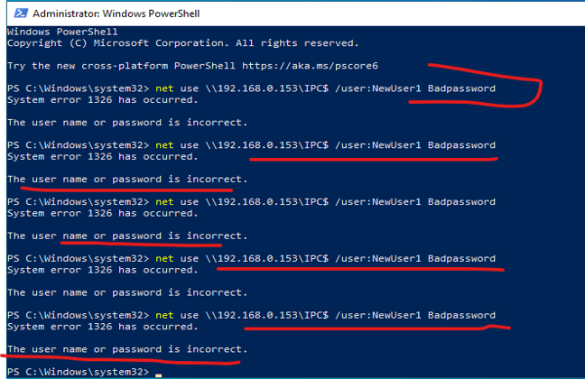
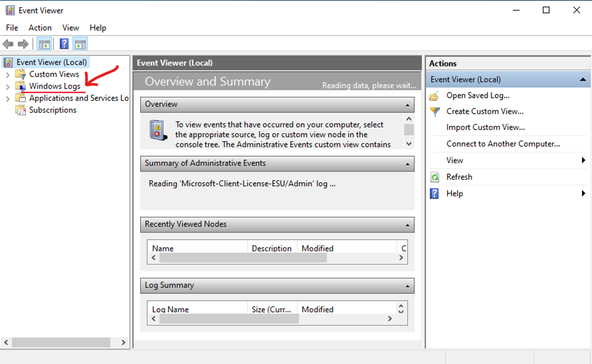
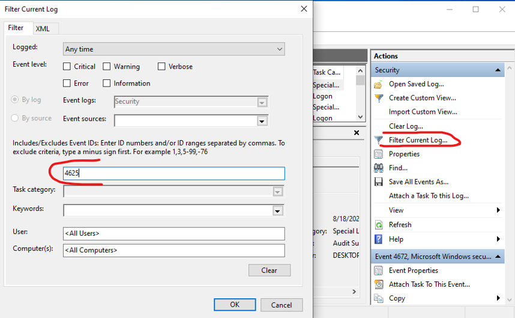
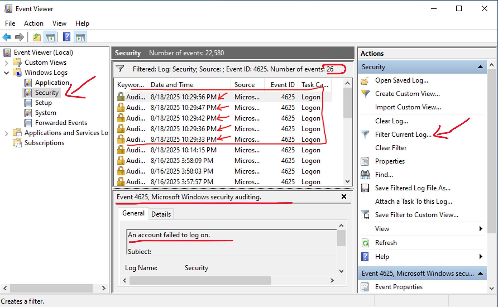
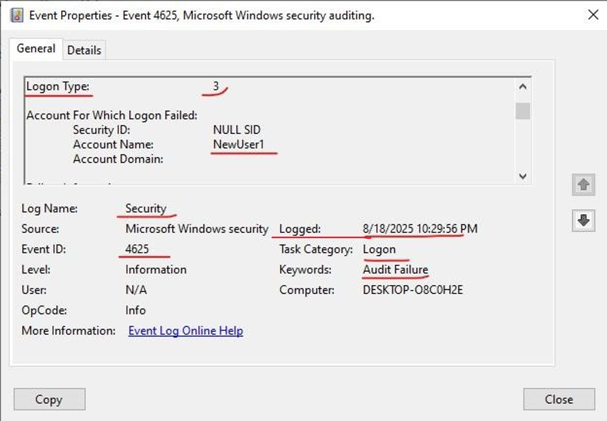
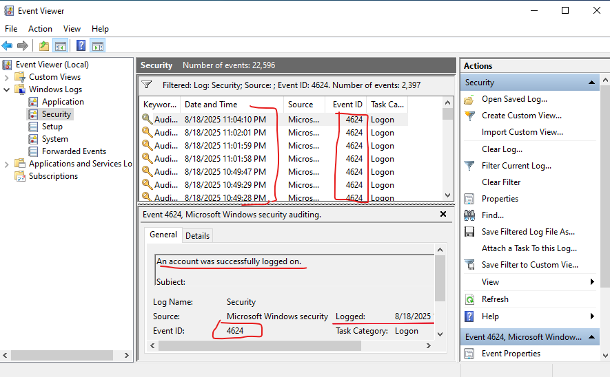
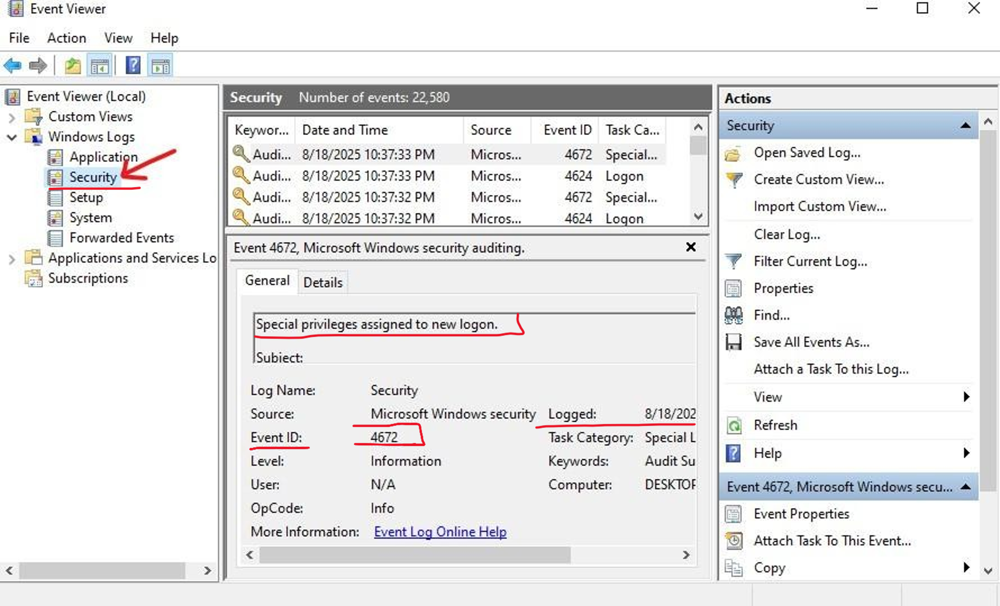

# 🔐 Windows Brute Force Detection Lab
### Detecting Brute-Force Login Attempts: A Forensic Approach to Windows Security Events

---

## What This Project Is About

I built this lab to get hands-on experience with something every SOC analyst will encounter: brute-force login attempts. Rather than just reading about it, I wanted to simulate a real attack, watch it generate logs, and then hunt through those logs the same way an analyst would during an investigation.

The goal was straightforward: simulate the attack, find it in the logs, understand what it looks like, and figure out how to stop it.

---

## My Lab Setup

| Component | Details |
|-----------|---------|
| **OS** | Windows 10 Virtual Machine |
| **Target Account** | Local User: `NewUser1` |
| **Tools** | PowerShell, Windows Event Viewer |
| **Log Source** | Windows Security Logs |

---

## 🚀 Simulating the Attack

### Setting Up the Target

First, I created a new local user account called `NewUser1` directly from the Windows Control Panel. This gave me a clean, isolated target with no noise from other accounts, just a straightforward local account with password protection.



### Attack Vector 1: Local Brute-Force (Console)

I logged out of my main account and repeatedly attempted to sign into `NewUser1` using wrong passwords at the Windows login screen. Each failed attempt triggers **Logon Type 2 (Interactive)** in the Security logs.

### Attack Vector 2: Network Brute-Force (Remote)

Then I opened PowerShell and ran the following command multiple times, simulating what an attacker would do when targeting a machine over the network:

```powershell
# Targeting the IPC$ share with bad credentials
net use \\192.168.0.153\IPC$ /user:NewUser1 BadPassword
```


Each run returned `System error 1326: The user name or password is incorrect.` That's exactly what I wanted. Five attempts in quick succession, all generating **Logon Type 3 (Network)** events behind the scenes.

---

## 🔎 Hunting Through the Logs

### Opening Event Viewer

Once the simulation was done, I opened **Windows Event Viewer** and navigated to **Windows Logs > Security**. This is where all authentication activity lives: successful logons, failures, privilege assignments, and everything in between.




### Event IDs I Focused On

| Event ID | Description | What It Tells Me |
|----------|-------------|-----------------|
| **4624** | Successful Logon | Someone got in; could be legitimate or post-compromise |
| **4625** | Failed Logon | A login attempt failed; the core brute-force signal |
| **4740** | Account Lockout | The account got locked after repeated failures hit the threshold |
| **4672** | Special Privileges Assigned | Elevated access was granted; important for spotting privilege escalation |
| **4732** | Member Added to Local Group | Someone was added to a group; a lateral movement indicator |
| **4634** | User Logoff | Session ended; useful for building a full timeline |

### Filtering for the Attack

I used the **Filter Current Log** feature in Event Viewer and entered `4625` to isolate only the failed logon events. The results came back immediately: **26 total failed logon events**, with **5 occurring within a few seconds of each other**. That tight cluster is the brute-force fingerprint.





### Digging Into the Event Details

Clicking into one of those `4625` events revealed everything I needed:

| Field | What I Found |
|-------|-------------|
| **Logon Type** | `3`, confirming a network-based attempt |
| **Account Name** | `NewUser1`, my target as expected |
| **Security ID** | `NULL SID`, meaning authentication failed before a session was even created |
| **Failure Reason** | Unknown username or bad password |
| **Source IP** | The machine running the PowerShell command |

The NULL SID is particularly telling. It means the system rejected the credentials before it could associate any identity, which is exactly what happens during a brute-force attempt.



### Checking the Other Side

I also filtered for **Event ID 4624** (successful logons) on the same account and found **2,397 events**. That volume is suspicious on its own and would warrant further investigation in a real environment, as it could indicate automated login behavior or a compromised session being actively used.



---

## 🛡️ Detection Logic

Based on everything I observed, here is how I would detect this in a live environment:

- **Burst of `4625` events**: 5 or more failed logins within a short window is the primary trigger
- **Logon Type 3 from unusual IPs**: network logons from unexpected sources are a red flag
- **`4672` after failures**: privilege escalation right after failed attempts suggests a successful compromise
- **`4740` firing**: account lockout confirms the brute-force threshold was hit
- **Same source IP across multiple accounts**: a credential stuffing pattern



### SIEM Alert Logic (Splunk / Wazuh)

```
1. Count Event ID 4625 per account within a 5-minute window
2. Alert if count reaches 5 or more failed attempts
3. Correlate with Event ID 4624 (was there a success after the failures?)
4. Escalate if Event ID 4672 follows shortly after
```

---

## 🛠️ How I Would Respond

### Immediate Actions

- Block the source IP at the firewall before anything else
- Lock the targeted account if not already locked by policy
- Escalate to the SOC team to investigate for lateral movement

### Longer-Term Fixes

- **Enable MFA**: even if credentials are guessed correctly, a second factor stops the attacker
- **Lock down RDP**: restrict access to trusted IPs or put it behind a VPN
- **Set SIEM thresholds**: automated alerts mean you catch this in real time, not after the fact

---

## 💡 What I Practiced

- Simulating a real attack scenario end-to-end in a controlled lab
- Navigating Windows Security Logs and filtering for specific Event IDs
- Forensic analysis of `4625` event details including Logon Type, NULL SID, and Source IP
- Translating raw log data into detection rules a SOC team could actually use
- Thinking through both immediate response and long-term hardening

---

## ✅ Takeaways and What is Next

The biggest thing this lab reinforced for me is that Windows Security logs provide complete forensic visibility into authentication activity — if you know what to look for. You just have to know which Event IDs to look for and what the details inside them mean. A burst of `4625` events is obvious once you know what you are looking at. The NULL SID, the Logon Type, and the source IP together paint a complete picture of the attack.

**What I am building toward next:**
- [ ] Reproduce this detection using Splunk or Wazuh with actual query logic
- [ ] Simulate more advanced scenarios like password spraying and credential stuffing
- [ ] Integrate findings into a full incident response playbook
