# 🛡️ ZERO-TO-SOC: Crafting an Automated Detection & Response Pipeline

**Author:** John Ejoke Oghenekewe | Cybersecurity Analyst | SOC Engineer  
**Completed:** January 2026  
**Stack:** Splunk Enterprise · Wazuh XDR · Tines SOAR · Sysmon · VMware Workstation

---

## What This Project Is About

Modern SOC analysts don't just deal with too many threats. They deal with too many alerts, fragmented tools, manual triage, and workflows that are always one step behind the attacker. By the time a human reviews a brute-force alert, hundreds of attempts have already been made.

I built this project to solve that problem from first principles.

The mission was to wire together a SIEM, XDR, and SOAR platform into one automated security pipeline that could detect a brute-force attack, classify it, and fire an alert to the analyst inbox in under 15 seconds with no human in the loop at all.

This is that pipeline.

---

## Key Results

| Metric | Result |
|---|---|
| Mean Time to Detect (MTTD) | **Under 10 seconds** |
| Mean Time to Respond and Notify (MTTR) | **Under 5 seconds** |
| Total Endpoints Monitored | **3 VMs (Windows + 2x Ubuntu)** |
| Total Log Events Ingested | **37,458+ events across all hosts** |
| Wazuh Alerts Captured | **643 structured JSON alerts** |
| Brute-Force Attempts Simulated | **50 attempts via PowerShell** |
| Custom Detection Rules Written | **2 (MITRE-mapped)** |
| Automated Email Alerts Fired | **Confirmed delivery** |

---

## Architecture Overview

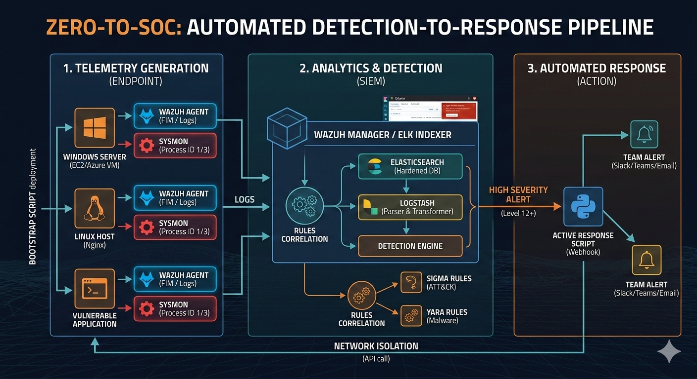 

```

DATA FLOW:
Windows/Linux Endpoints
  > Sysmon captures process telemetry
  > Splunk Universal Forwarder ships the logs
  > Splunk Enterprise indexes and makes it searchable

Wazuh Agent on Windows
  > Wazuh Manager detects and fires alerts
  > alerts.json gets streamed into Splunk for correlation
  > Webhook triggers Tines SOAR which sends the email
```

---

## Node Map

| Node Name | OS | Role | IP Address |
|---|---|---|---|
| SOC-SIEM | Ubuntu Desktop | Splunk Enterprise Indexer | 192.168.80.10 |
| SOC-Manager | Ubuntu Server | Wazuh Manager | 192.168.80.20 |
| SOC-Target | Windows 10 | Monitored Endpoint | 192.168.80.30 |
| SOC-Attacker | Kali Linux | Attack Simulation | 192.168.80.40 |
| Qualys | Linux Appliance | Vulnerability Scanner | 192.168.80.50 |

---

## The Full Build Walkthrough

I want to walk you through every step of how I built this. Not just what I did but why I made each decision. Every screenshot below is from the actual live build.

---

### Phase 1: Building the Lab Foundation

#### VMware Lab Setup and Network Isolation

Before I installed a single tool I made a deliberate architectural decision. All VMs would share a host-only network. This was intentional. A host-only network gives the isolation of a controlled lab while still allowing inter-VM communication, which is essential for testing malware simulation and telemetry flows without putting the host machine or wider network at risk.

I confirmed the Ubuntu Server node was live at 192.168.80.130 before moving forward.

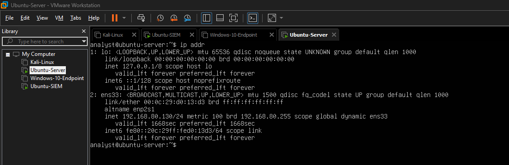

From there I SSHed into the Ubuntu Server from the SIEM node to begin remote configuration, keeping my workflow efficient across multiple machines at the same time.

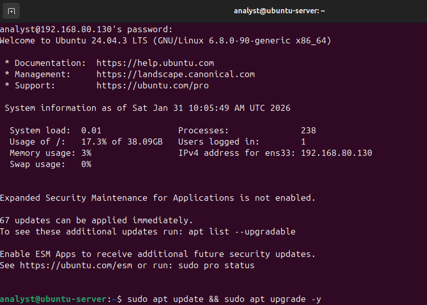

---

#### Deploying the SIEM Brain (Splunk Enterprise)

I installed Splunk Enterprise on the Ubuntu Desktop node, which would serve as the centralized log indexer for the entire lab.

The most important step after installation was enabling boot-start persistence:

```bash
sudo /opt/splunk/bin/splunk enable boot-start -user root
```

If the SIEM dies after a reboot, the entire pipeline breaks. That one command makes sure it never does.

I then confirmed that port 9997, the Splunk receiving port, was actively listening:

```bash
ss -antl | grep 9997
# Output: LISTEN 0   128   0.0.0.0:9997   0.0.0.0:*
```

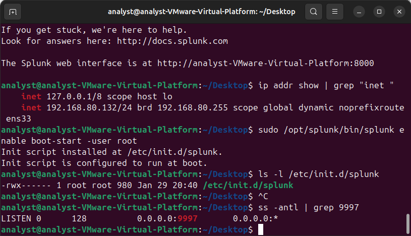

---

#### Opening the Data Gate (Port 9997)

With Splunk running I opened the receiving port through the Web UI, then hardened the host firewall with UFW rules to control exactly what traffic could reach the SIEM:

```bash
sudo ufw allow 9997/tcp
sudo ufw allow 8000/tcp
```

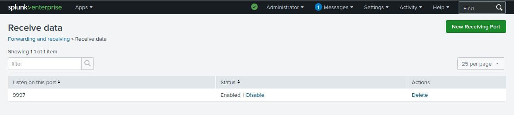

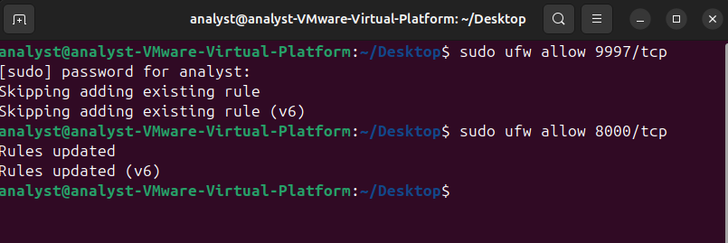

---

#### First Log Ingestion: Local Linux Telemetry

Before bringing in remote endpoints I verified the SIEM was working by pointing it at its own /var/log/syslog. This is the smoke test. If Splunk cannot index local logs, nothing downstream will work.

I created a dedicated main_logs index and confirmed 15,777 events were flowing in.

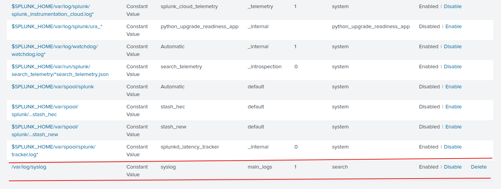

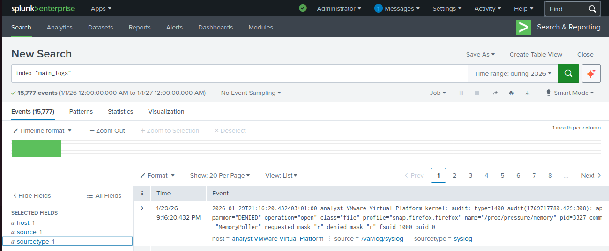

I drilled into the sourcetype to verify Splunk was parsing events as syslog and not raw text. This matters because accurate sourcetype classification is what makes precise SPL queries possible later during threat hunting.

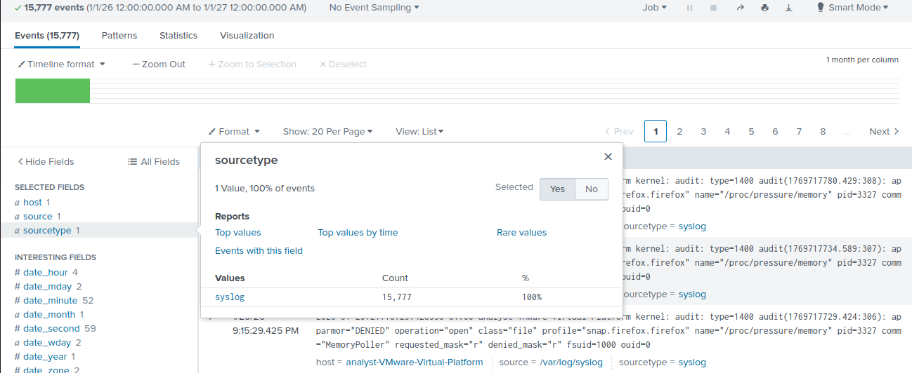

I also ran a search to surface DENIED kernel audit events in real time. That was early proof the telemetry pipeline was capturing meaningful security data and not just noise.

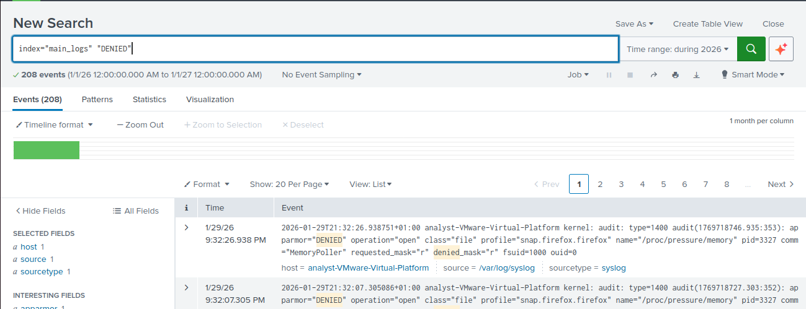

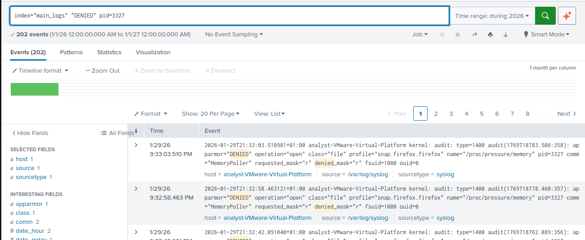

---

### Phase 2: Arming the Windows Endpoint

#### Network Connectivity Verification

Before installing any agent I validated the network path from the Windows 10 target to the Splunk SIEM. No connectivity means no logs.

```cmd
ping 192.168.80.10
# 0% packet loss confirmed
```

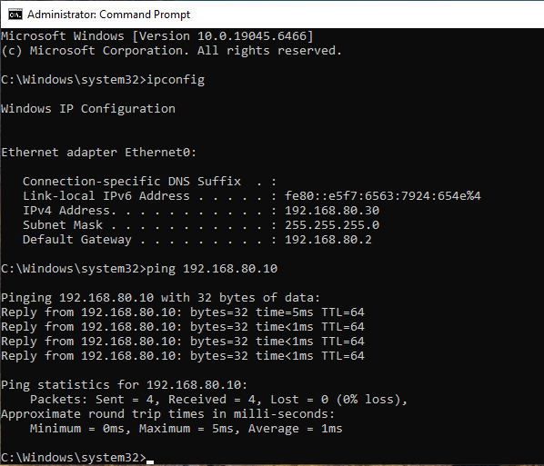

---

#### Deploying Sysmon for Deep Endpoint Telemetry

Standard Windows Event Logs miss a lot. Process creation, network connections, file hash recording, that level of granularity requires Sysmon. I deployed it using the industry-standard SwiftOnSecurity config file for maximum detection coverage from day one.

```powershell
.\Sysmon64.exe -i sysmonconfig.xml -accepteula
```

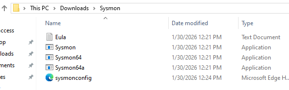

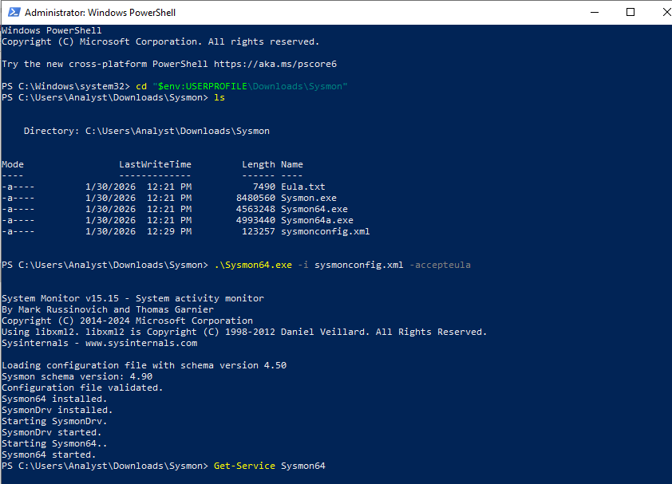

I then opened Windows Event Viewer and navigated to Applications and Services Logs > Microsoft > Windows > Sysmon > Operational to confirm it was generating 17,280 events. What I specifically verified was Event ID 1, Process Create. Every process launch on this machine was now being captured with full command line and file hash.

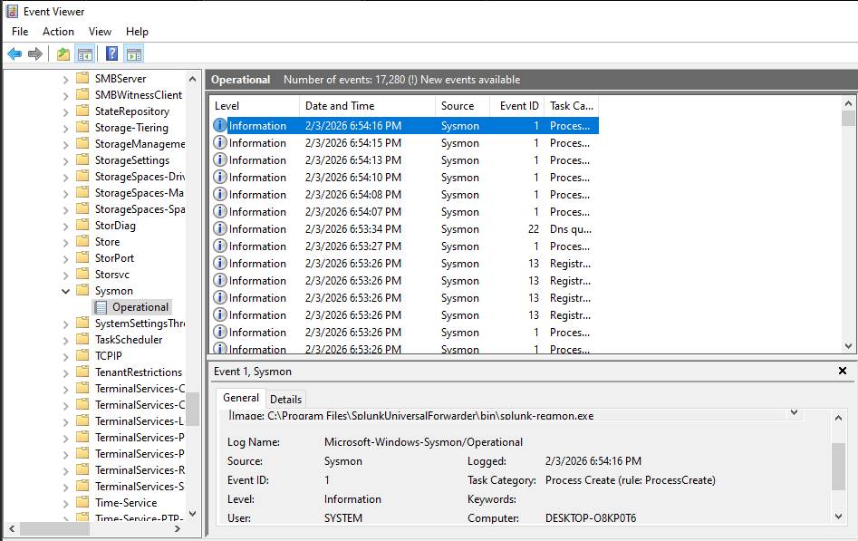

---

#### Installing the Splunk Universal Forwarder on Windows

Sysmon generating data locally is not enough. I needed to ship it to the SIEM. I downloaded and installed the Splunk Universal Forwarder and pointed it directly at the SIEM during the setup wizard.

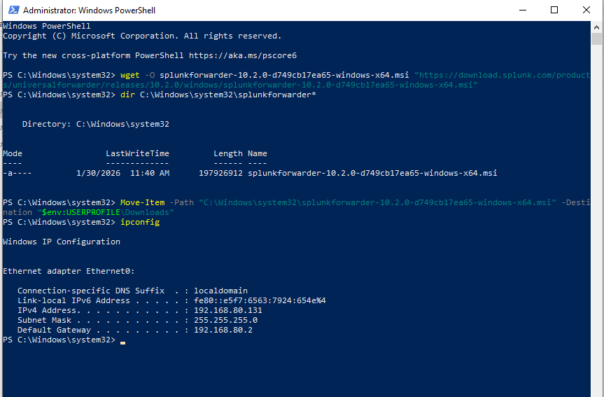

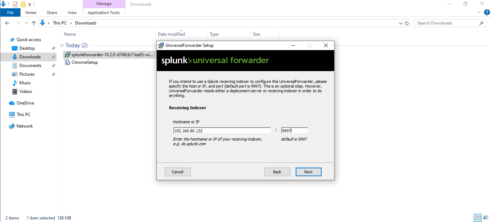

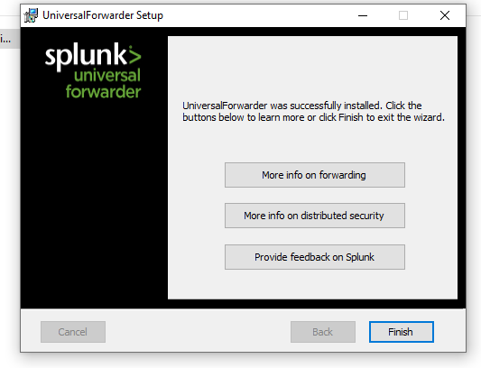

---

#### Authoring inputs.conf (The Decision That Made Threat Hunting Possible)

The Universal Forwarder is a blank slate after installation. I manually wrote a custom inputs.conf to tell it exactly what to monitor and forward. The most important part was the Sysmon stanza:

```ini
[default]
host = DESKTOP-08KP0T6

[WinEventLog://Application]
disabled = 0
index = main

[WinEventLog://Security]
disabled = 0
index = main

[WinEventLog://System]
disabled = 0
index = main

[WinEventLog://Microsoft-Windows-Sysmon/Operational]
disabled = 0
index = main
renderXml = 1
```

That renderXml = 1 line is the one that matters most. Sysmon events are XML structured by nature. Without rendering them as XML, Splunk ingests everything as a raw text blob and you lose all the structured fields like CommandLine, Hashes, and ParentImage. With it enabled every Sysmon event becomes a fully queryable field-extracted record. That is the difference between having logs and being able to actually threat hunt.

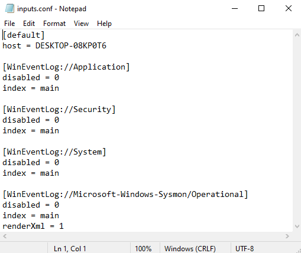

After saving I restarted the forwarder to commit the changes:

```cmd
cd "C:\Program Files\SplunkUniversalForwarder\bin"
splunk restart
```

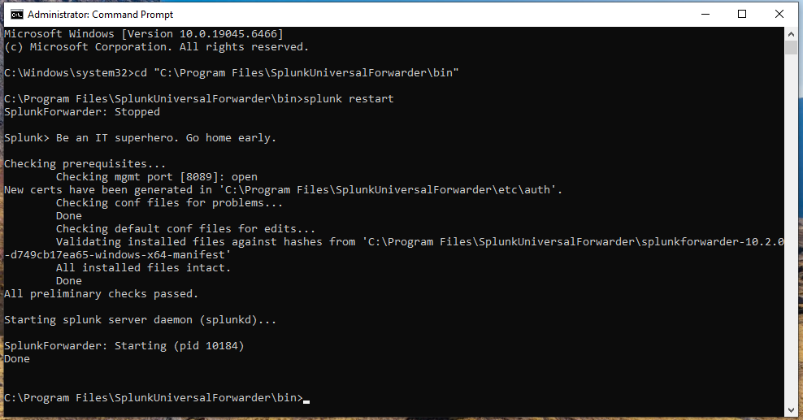

I confirmed the active forward connection was established:

```cmd
splunk list forward-server
# Active forwards: 192.168.80.10:9997
```

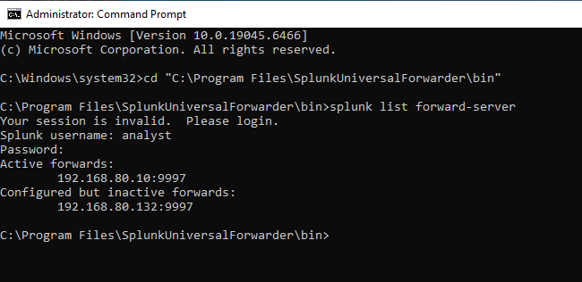

---

#### Verifying Windows Telemetry in Splunk

With the forwarder running I jumped into Splunk and searched for the Windows host. The results showed 1,088 events from DESKTOP-O8KP0T6 with all three Windows sourcetypes present.

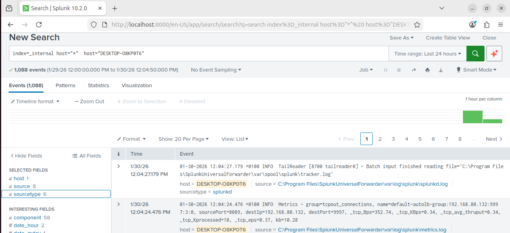

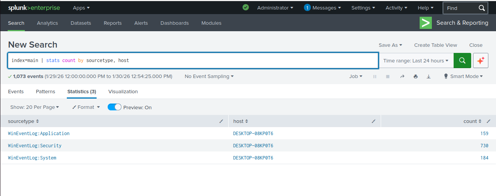

Querying the Security log directly showed 736 WinEventLog:Security events with structured fields like EventCode, Account_Name, and Logon_Type all properly parsed and searchable.

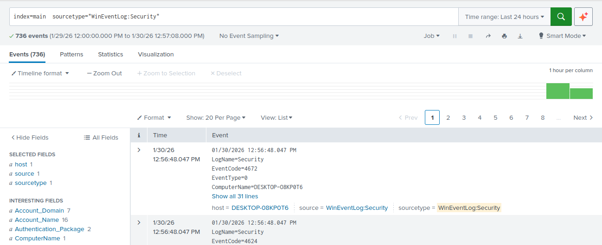

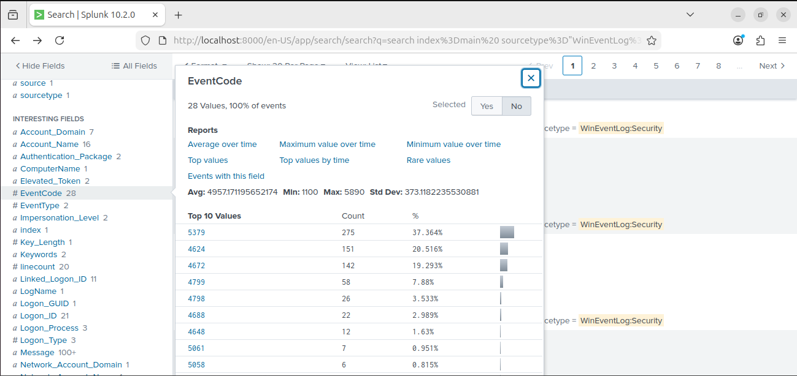

---

### Phase 3: Sysmon on Linux and Full Multi-Host Visibility

#### Installing Sysmon on the Ubuntu Desktop Node

I extended Sysmon coverage to the Linux nodes as well. This is something a lot of home lab builds skip but Linux endpoints generate critical telemetry that standard syslog does not capture. I installed sysmonforlinux on the Ubuntu Desktop SIEM node:

```bash
sudo sysmon -i
# Sysmon v1.4.0 installed, symlink created
```

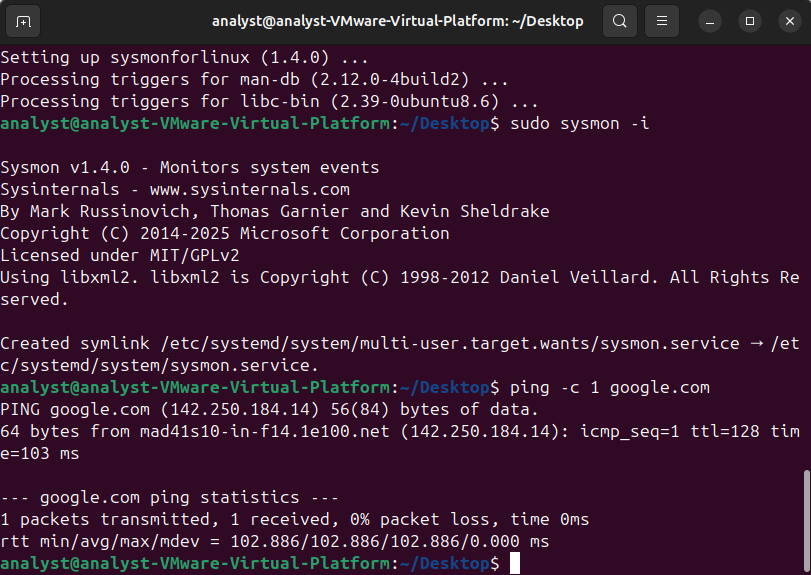

---

#### Linux Sysmon Events Flowing into Splunk

With Sysmon for Linux running I queried Splunk and confirmed Linux-Sysmon/Operational events were being ingested with EventID 1 and full SHA256 hashes visible alongside every process creation event.

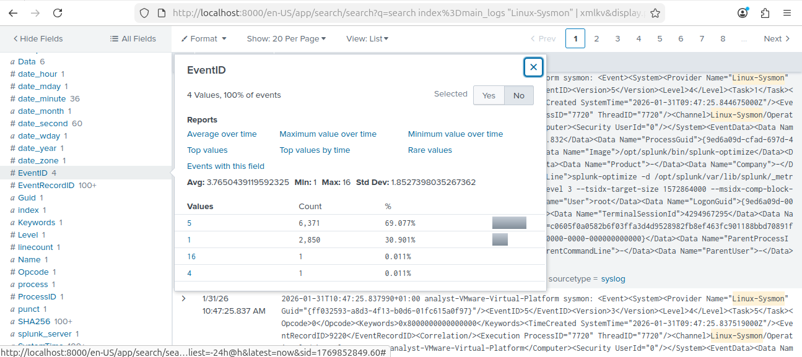

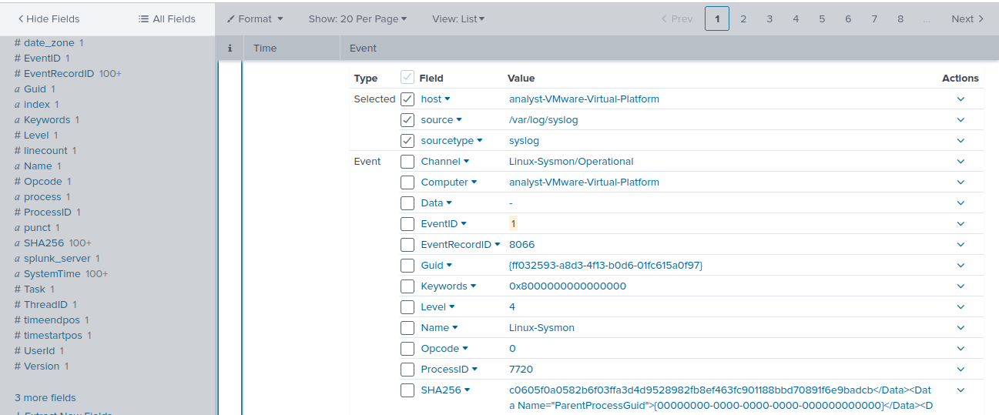

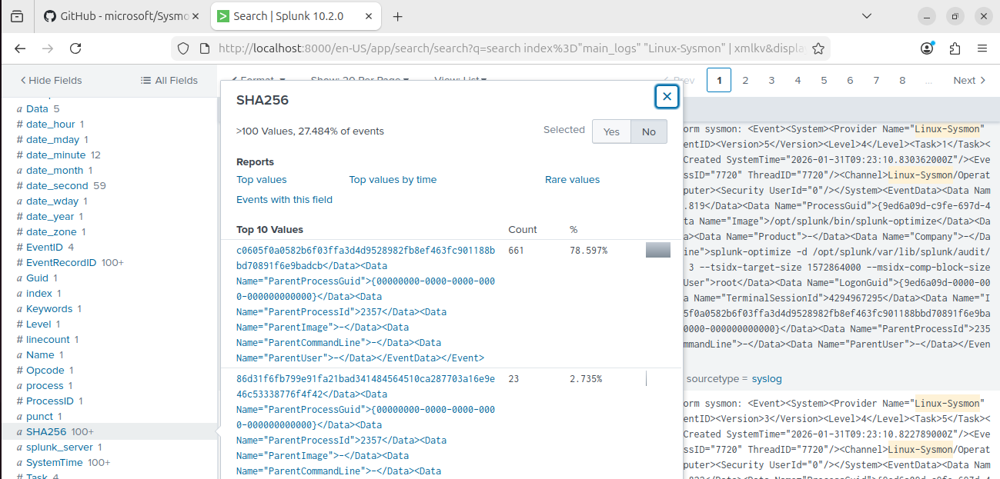

---

#### The Unified View: All 3 Hosts Reporting to Splunk

This was the moment the pipeline came together. One SPL query confirmed all three hosts shipping logs simultaneously:

```spl
index=main OR index=main_logs | stats count by host
```

| Host | Event Count |
|---|---|
| DESKTOP-O8KP0T6 (Windows) | 744 |
| analyst-VMware-Virtual-Platform (Ubuntu Desktop) | 31,578 |
| ubuntu-server | 5,136 |
| **Total** | **37,458** |

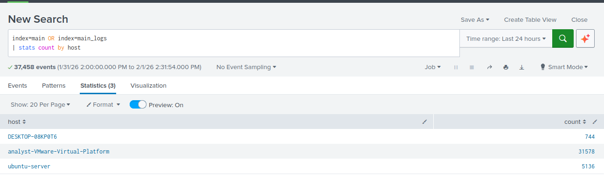

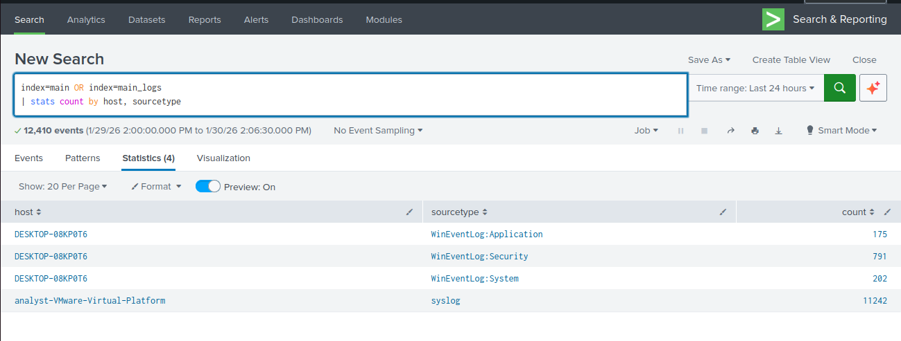

---

### Phase 4: Deploying the XDR Layer (Wazuh)

#### Installing Wazuh Manager on the Ubuntu Server

The Wazuh Manager is the enforcement engine of this lab. It provides EDR capabilities, compliance scanning, file integrity monitoring, and the detection rules that feed into the SOAR automation. I installed it using the official one-line script:

```bash
curl -sO https://packages.wazuh.com/4.9/wazuh-install.sh && \
sudo bash wazuh-install.sh -a
```

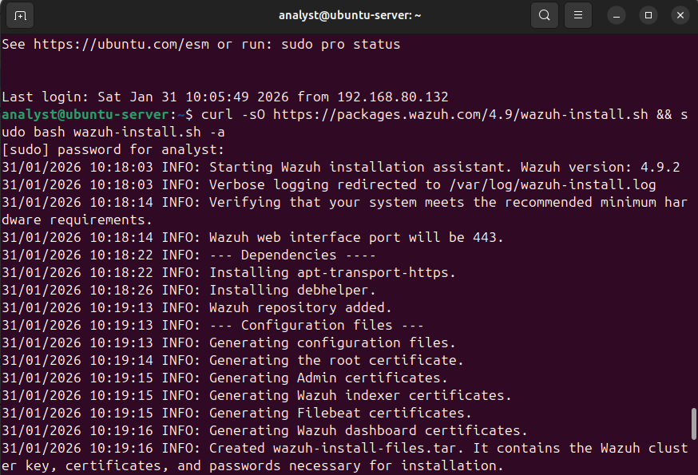

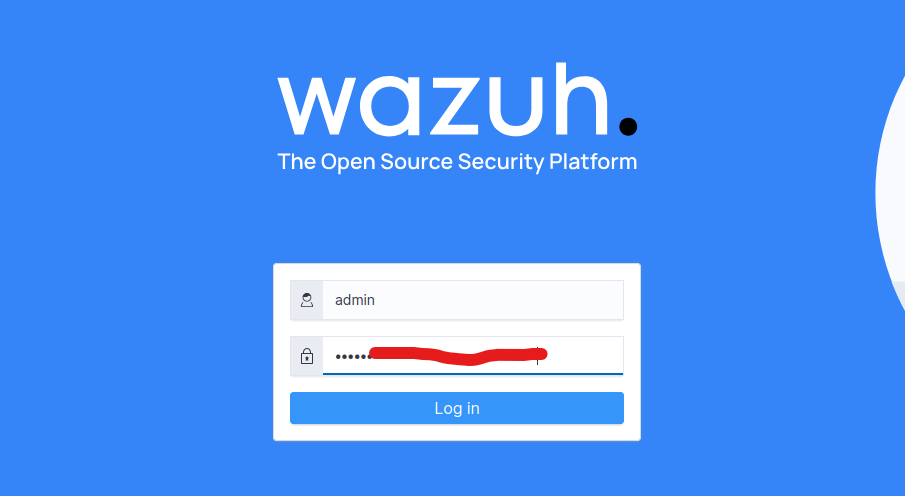

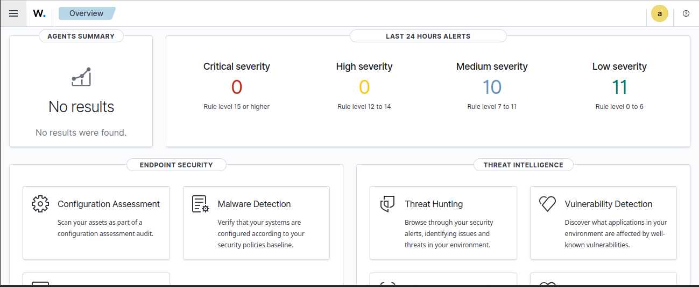

---

#### Deploying the Wazuh Agent on Windows 10

From the Wazuh Manager web UI I used the Deploy new agent wizard to generate the silent installation command for Windows, then ran it from PowerShell on the target machine:

```powershell
Invoke-WebRequest -Uri https://packages.wazuh.com/4.x/windows/wazuh-agent-4.9.2-1.msi -OutFile $env:tmp\wazuh-agent
msiexec.exe /i $env:tmp\wazuh-agent /q WAZUH_MANAGER='192.168.80.20'
NET START WazuhSvc
```

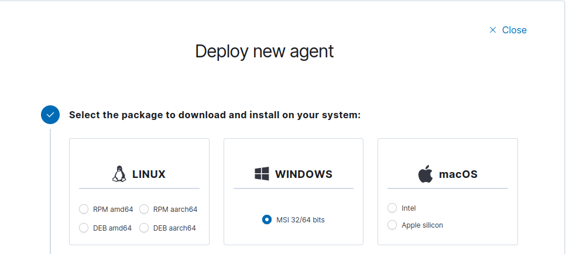

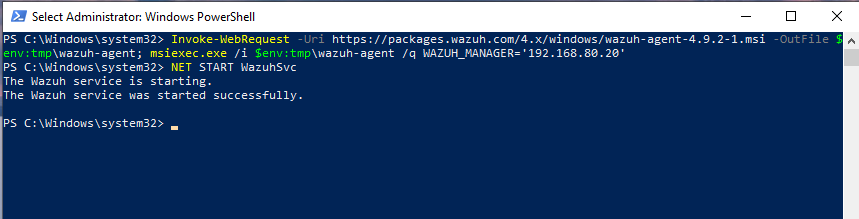

---

#### Agent Confirmed Active in Wazuh Manager

Back on the Wazuh dashboard DESKTOP-O8KP0T6 showed up with a green Active status. The cryptographic handshake between manager and agent was complete and endpoint telemetry was flowing.

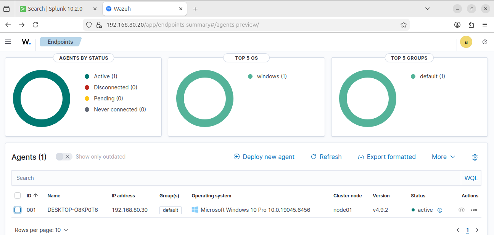

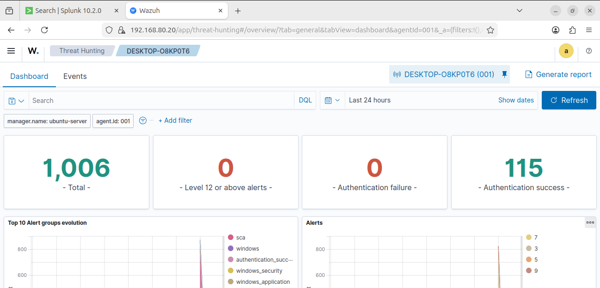

---

#### Enabling MSU Vulnerability Detection

I edited /var/ossec/etc/ossec.conf to turn on the Microsoft Security Update vulnerability detection provider. This turns Wazuh into a proactive vulnerability scanner for the Windows endpoint.

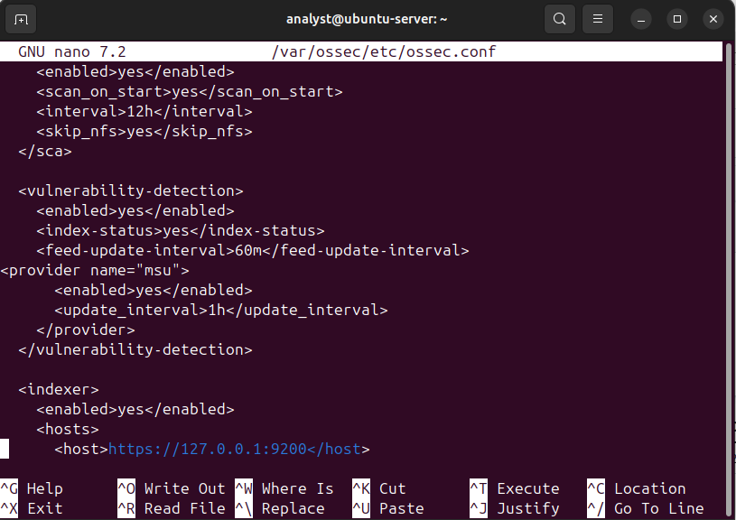

The scan returned two real CVEs on the Windows 10 machine:

| CVE | Severity |
|---|---|
| CVE-2022-30168 | High |
| CVE-2024-29988 | Medium |

This is what shifts the SOC from reactive to proactive. Finding weaknesses before an attacker can exploit them.

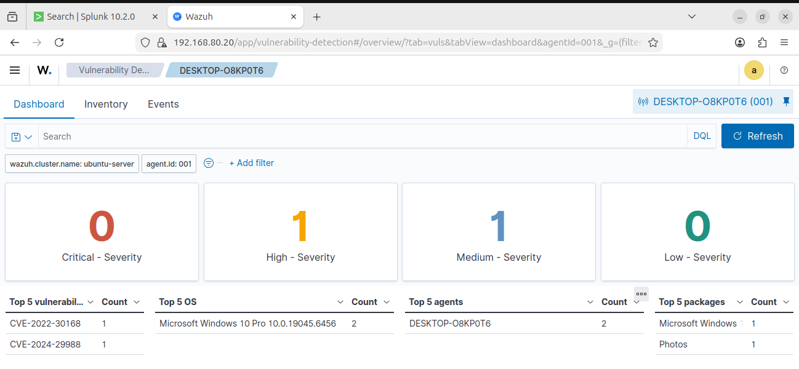

---

#### Centralizing Wazuh Alerts into Splunk

Wazuh stores its alerts as structured JSON at /var/ossec/logs/alerts/alerts.json. I installed a Splunk Universal Forwarder on the Ubuntu Server and pointed it at that file with a custom sourcetype so all Wazuh alert data lands in Splunk alongside everything else:

```bash
sudo /opt/splunkforwarder/bin/splunk add monitor /var/ossec/logs/alerts/alerts.json \
  -index main -sourcetype wazuh:alerts
sudo chmod 644 /var/ossec/logs/alerts/alerts.json
sudo /opt/splunkforwarder/bin/splunk restart
```

I also configured the forwarder to ship syslog and auth.log to the SIEM:

```bash
sudo /opt/splunkforwarder/bin/splunk add forward-server 192.168.80.10:9997
sudo /opt/splunkforwarder/bin/splunk add monitor /var/log/syslog
sudo /opt/splunkforwarder/bin/splunk add monitor /var/log/auth.log
```

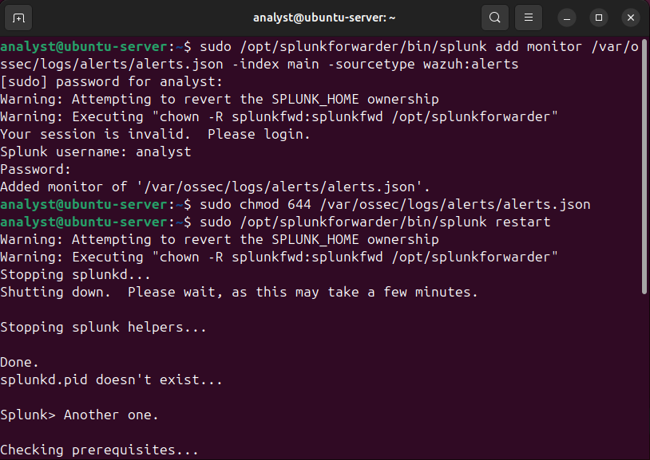

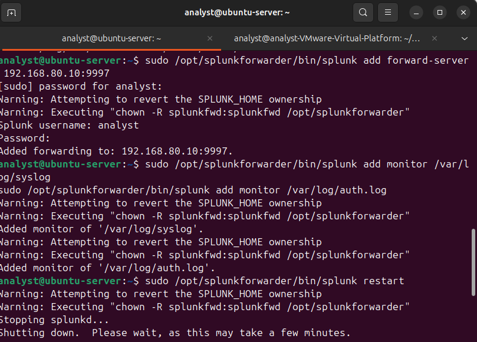

The result was 643 structured Wazuh alert events now visible in Splunk alongside all other host telemetry. One search bar. Every host. Complete picture.

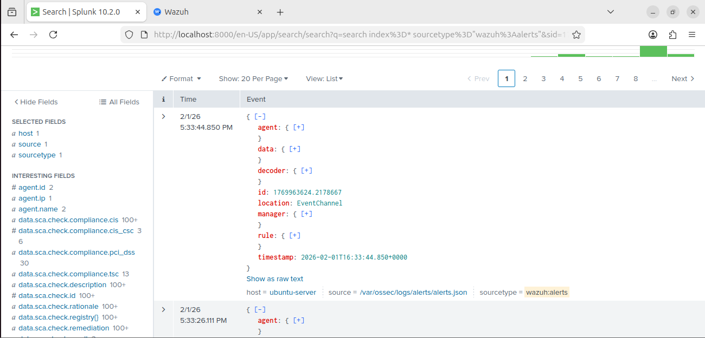

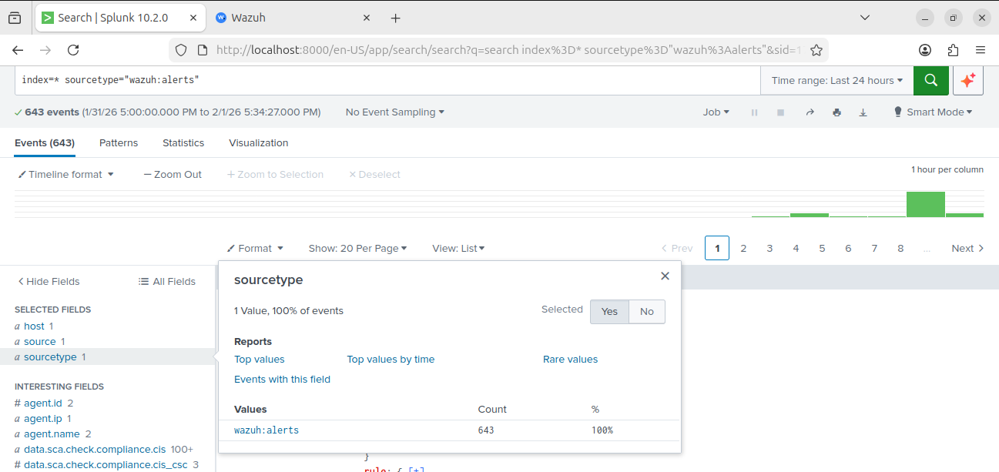

---

### Phase 5: Custom Detection Engineering

#### Writing MITRE-Mapped Detection Rules

Out-of-the-box rules catch common patterns. Custom rules catch specific adversary techniques. I wrote two rules in /var/ossec/etc/rules/local_rules.xml for this environment specifically.

Rule 100001 flags SSH authentication failures from a known malicious IP and maps them to PCI-DSS compliance controls:

```xml
<rule id="100001" level="5">
  <if_sid>5716</if_sid>
  <srcip>1.1.1.1</srcip>
  <description>sshd: authentication failed from IP 1.1.1.1.</description>
  <group>authentication_failed,pci_dss_10.2.4,pci_dss_10.2.5,</group>
</rule>
```

Rule 100002 fires at Level 12 any time the Windows Security log is cleared. This is Event ID 1102 and it maps directly to MITRE ATT&CK T1070.001, Indicator Removal. Attackers clear logs to cover their tracks. Now we catch it the moment it happens.

```xml
<rule id="100002" level="12">
  <if_sid>60000</if_sid>
  <field name="win.system.eventID">1102</field>
  <description>CRITICAL: Security Log Cleared (Event ID 1102)</description>
  <mitre>
    <id>T1070.001</id>
  </mitre>
</rule>
```

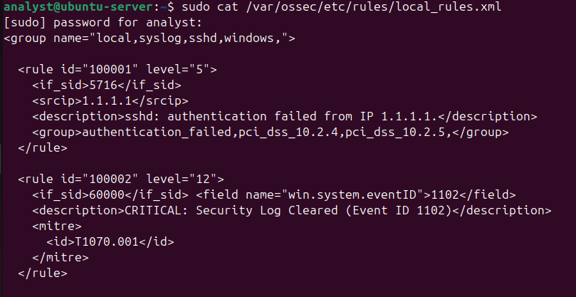

---

### Phase 6: Threat Simulation

#### PowerShell Brute-Force Attack

With the full detection pipeline in place I needed to fire a real attack to validate everything. I wrote a PowerShell script that hammered the target with 50 failed authentication attempts and simultaneously attempted a privilege escalation by adding the guest account to the Administrators group:

```powershell
net localgroup Administrators /add guest

for ($i=1; $i -le 50; $i++) {
    net use \\127.0.0.1\c$ /user:Administrator "WrongPass$i" 2>$null
    Write-Host "Nuclear Attempt $i sent..."
}
```

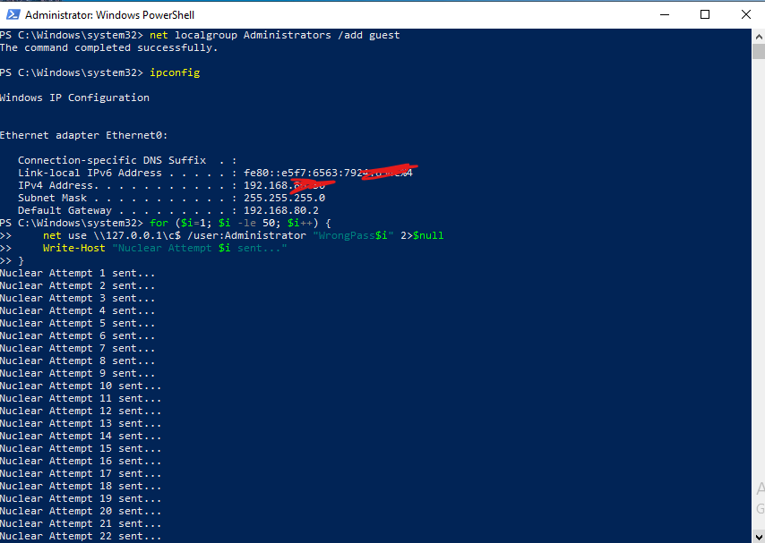

---

#### Detection Confirmed in Wazuh

Wazuh caught it. The Threat Hunting dashboard showed 482 hits with the exact sequence I expected: individual logon failures at Level 5, an account lockout at Level 9, and then the correlation rule firing at Level 10 with the description "Multiple Windows Logon Failures" under Rule ID 60204.

This is what real alert triage looks like. The system correctly escalated individual noise into one high-severity grouped incident.

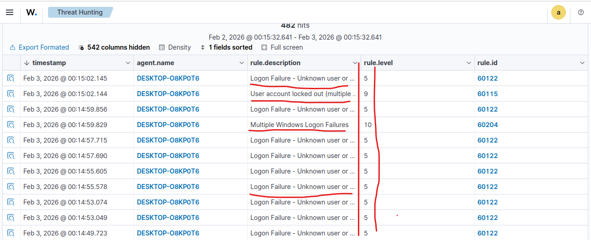

---

### Phase 7: SOAR Automation with Tines

#### Connecting Wazuh to Tines via Webhook

The final piece was closing the loop with automation. I integrated Tines Cloud by adding a webhook block to ossec.conf. The most important configuration choice here was the level threshold of 10. Only high-severity alerts should trigger automated response. Everything below that stays in the dashboard for manual review.

```xml
<integration>
  <n>custom-tines</n>
  <hook_url>https://ringing-paper-8653.tines.com/webhook/your-first-story/8fc...</hook_url>
  <alert_format>json</alert_format>
  <level>10</level>
</integration>
```

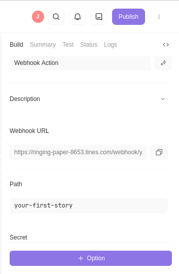

---

#### Building the Automated Response Story in Tines

Inside Tines I designed a two-node automation story. The Webhook Action receives the Wazuh alert payload as a JSON object. The Send_SOC_Alert_Email node fires an email to the analyst inbox automatically.

This completely replaces the manual process of an analyst checking a dashboard, reading an alert, and typing out a notification email. The whole thing now happens in seconds with no human involved.

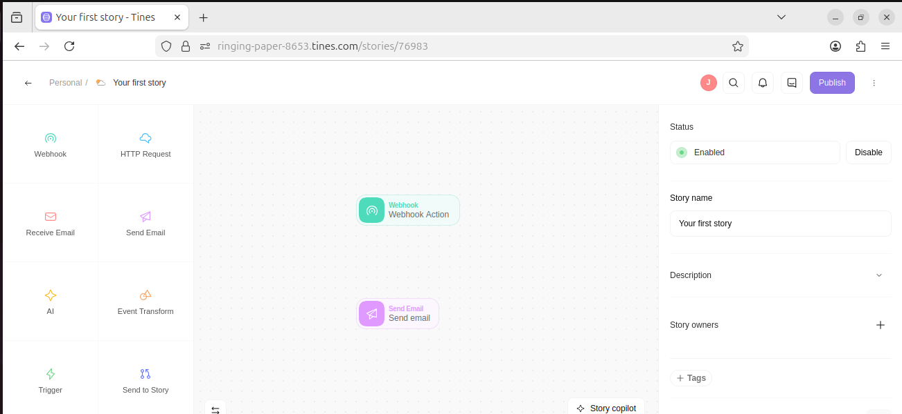

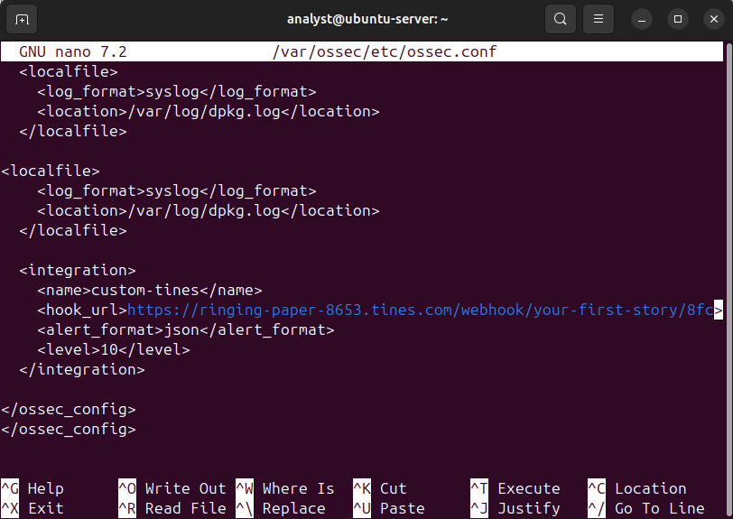

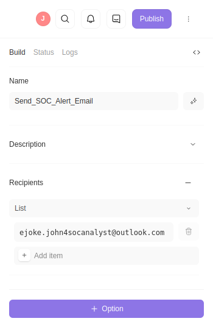

---

#### The Final Proof: Automated Alerts Hitting the Inbox

After the brute-force simulation triggered Wazuh's Level 10 rule, the Tines webhook fired and alerts started landing in the analyst inbox automatically. Real time. No one doing anything on the other end.

Multiple emails arrived within seconds of each other, one per alert event, proving the end-to-end pipeline was working exactly as designed.

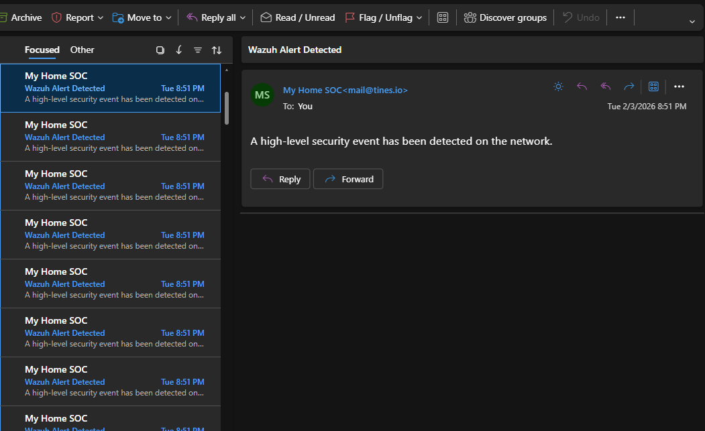

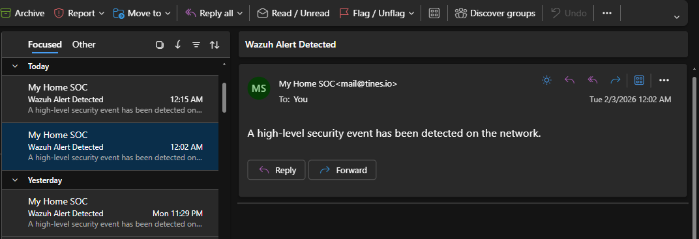

The loop was closed. Attack, detection, notification. Fully automated.

---

## Technical Decisions Worth Understanding

**Why renderXml = 1 matters**

Sysmon logs Windows events in XML format natively. Without renderXml = 1 in inputs.conf, Splunk ingests them as a raw text blob and you lose every structured field including CommandLine, Hashes, ParentImage, and User. With it enabled every Sysmon event becomes a fully queryable field-extracted record. That is the difference between having logs and being able to actually threat hunt.

**Why I streamed alerts.json instead of using the Wazuh API**

Streaming /var/ossec/logs/alerts/alerts.json into Splunk via Universal Forwarder is lightweight, real-time, and requires no API authentication or polling logic. The Wazuh Manager appends to that file continuously and the Splunk UF tails it as a live stream. Simple and reliable with no token management overhead.

**Why Level 10 was the right SOAR threshold**

Wazuh alert levels go from 0 to 15. Levels 0 through 6 are informational. Levels 7 through 11 are medium severity. Level 12 and above is critical. Setting the Tines webhook at Level 10 catches high-severity events like brute-force correlations without flooding the inbox with noise from routine informational events. That is real SOC tuning, not default config.

---

## Tools and Technologies

| Tool | Role | Version |
|---|---|---|
| Splunk Enterprise | SIEM, log indexing, search, dashboards | 10.2.0 |
| Wazuh | XDR/EDR, endpoint detection, vulnerability scanning | 4.9.2 |
| Tines | SOAR, automated response orchestration | Cloud |
| Sysmon (Windows) | Endpoint telemetry for process, network, file events | v15.15 |
| Sysmon for Linux | Linux endpoint telemetry | v1.4.0 |
| SwiftOnSecurity Config | Sysmon detection ruleset | Latest |
| VMware Workstation | Virtualization layer | |
| Kali Linux | Attack simulation | |

---

## Repository Structure

```
zero-to-soc/
├── README.md
├── screenshots/
│   ├── 01-vmware-all-vms-ubuntu-server-ip.png
│   ├── 02-ssh-into-ubuntu-server-from-desktop.png
│   └── ...
├── configs/
│   ├── inputs.conf
│   ├── local_rules.xml
│   └── ossec.conf
└── scripts/
    └── brute_force_simulation.ps1
```

---

## What I Took Away From This

Architecture thinking matters more than tool knowledge. Knowing how to install Splunk is table stakes. Understanding why you open port 9997, why you set renderXml = 1, and why Level 10 is the right SOAR threshold is what separates an analyst who monitors from an engineer who builds.

Telemetry quality determines detection quality. Without Sysmon I would have missed the process creation events that make real threat hunting possible. Getting the instrumentation right at the endpoint pays off at every stage downstream.

Automation is the goal, not a shortcut. I built the manual pipeline first, SIEM then XDR then SOAR, because I needed to understand every handoff before I could automate it. When the Tines alert fired I knew exactly what triggered it, why it triggered, and what the system did about it.

---

## What Comes Next

Extend the Tines story to include automated IP blocking via Wazuh active response so the response goes beyond notification into actual containment.

Integrate the VirusTotal API into Tines for automated IOC enrichment on every alert.

Add a Splunk dashboard for real-time SOC metrics to track MTTD and MTTR over time.

Deploy a second Windows endpoint to test lateral movement detection scenarios.

Convert detection logic to Sigma rules for portability across other SIEM platforms.

---

## Connect With Me

If you are building something similar or want to talk SOC engineering, feel free to reach out.

**LinkedIn:** https://www.linkedin.com/in/cybsecjohn/ 
**Email:** ejoke.john4socanalyst@outlook.com

---

*Built with open-source tools. Proven with a real attack. Ready for production thinking.*

