# SOC Engineering Lab: Adaptive Defense from Infrastructure to Detection

> **A Production-Grade Cybersecurity Portfolio Case Study** - documenting the full lifecycle of a SOC engineering project: cloud infrastructure deployment, IaC automation, vulnerability assessment, attack simulation, XDR detection, MITRE ATT&CK mapping, and remediation. This is not a perfect lab. It is a real engineering journey - with failures, recoveries, and hard-won lessons.

**Author:** John Ejoke Oghenekewe, CC
**Role:** Cybersecurity Analyst | SOC Engineer
**Date:** February - April 2026
**Status:** Full Pipeline Operational | Detection Validated | Remediation Applied

---

## Table of Contents

1. [Executive Summary](#1-executive-summary)
2. [Architecture Overview](#2-architecture-overview)
3. [Technology Stack](#3-technology-stack)
4. [Implementation - Phase by Phase](#4-implementation--phase-by-phase)
   - [Phase 1: Visibility Layer - Qualys VMDR Deployment](#phase-1-visibility-layer--qualys-vmdr-deployment)
   - [Phase 2: Shift to Code - Terraform on AWS](#phase-2-shift-to-code--terraform-on-aws)
   - [Phase 3: Automated Hardening and Agent Provisioning](#phase-3-automated-hardening-and-agent-provisioning)
   - [Phase 4: Connectivity - Tailscale Mesh VPN](#phase-4-connectivity--tailscale-mesh-vpn)
   - [Phase 5: Attack Surface - Web Server Deployment and Reconnaissance](#phase-5-attack-surface--web-server-deployment-and-reconnaissance)
   - [Phase 6: Detection Validation - Wazuh SIEM and Endpoint Telemetry](#phase-6-detection-validation--wazuh-siem-and-endpoint-telemetry)
   - [Phase 7: Remediation and Post-Scan Validation](#phase-7-remediation-and-post-scan-validation)
5. [Incident and Failure Handling](#5-incident-and-failure-handling)
6. [Security Findings](#6-security-findings)
7. [Detection Evidence](#7-detection-evidence)
8. [Resolution Strategy](#8-resolution-strategy)
9. [Final System Outcome](#9-final-system-outcome)
10. [Lessons Learned](#10-lessons-learned)
11. [Limitations and Future Improvements](#11-limitations-and-future-improvements)
12. [Code Reference - main.tf](#12-code-reference--maintf)

---

## 1. Executive Summary

Most SOC portfolios show a tool installed and a dashboard screenshot. What I built here is different: the full loop. I stood up infrastructure from code, deployed a vulnerable target intentionally, simulated real reconnaissance from an attacker machine, watched the alerts fire in the SIEM, mapped the techniques to MITRE ATT&CK, and validated the fix with a post-remediation scan.

The philosophy I carried through every phase:

> *"Security is not a product you install. It's an engineering property you bake into every layer of the stack."*

### What I Built

A hybrid, multi-layer SOC pipeline spanning on-premises infrastructure and AWS cloud:

- **Qualys VMDR** - vulnerability scanning engine provisioned on-premises via VMware Virtual Scanner Appliance, cloud-registered against EU2 tenant
- **Terraform IaC** - complete AWS environment (VPC, subnet, IGW, security groups, EC2) defined, versioned, and deployed in code with zero manual Console operations
- **Apache 2.4.58 web server** - intentionally deployed on the EC2 as a public-facing vulnerability target
- **Nmap + Nikto** - external reconnaissance and vulnerability scanning run from Kali Linux against the live EC2 public IP
- **Wazuh XDR v4.7.5** - multi-endpoint SIEM with agents on Kali (attacker), Windows 10 (target), Ubuntu SIEM node, and EC2 (cloud target)
- **Sysmon** - installed on Windows endpoint for deep telemetry: file creation, process activity, network connections
- **Tailscale mesh VPN** - WireGuard-encrypted overlay network bridging Tokyo AWS node to on-prem Wazuh Manager across residential CGNAT
- **MITRE ATT&CK mapping** - T1087, T1078, T1570, T1574 techniques detected and validated in Wazuh dashboard
- **CIS Benchmark SCA** - Security Configuration Assessment run on Windows endpoint against CIS Microsoft Windows 10 Enterprise Benchmark v1.12.0

### Why This Matters

This project demonstrates what most portfolios skip: what happens when things break, how I diagnosed the problem, recovered using the same automation tools, and then validated the entire detection pipeline end-to-end. I documented six real operational incidents. Every screenshot is from a live environment.

---

## 2. Architecture Overview

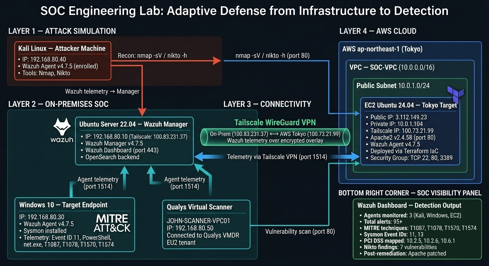
*Full SOC lab architecture - four-layer design: Attack Simulation (Kali) | On-Premises SOC (Wazuh Manager, Windows Target, Qualys Scanner) | Tailscale WireGuard VPN | AWS Cloud (EC2 Tokyo target deployed via Terraform)*

### Layer Breakdown

```
+---------------------------------------------------------------------------+
|              LAYER 1 - ATTACK SIMULATION                                  |
|  Kali Linux (192.168.80.40) - Nmap, Nikto, Wazuh Agent v4.7.5            |
|  Attack vector: nmap -sV / nikto -h  EC2 public IP 3.112.149.23          |
+---------------------------------------------------------------------------+
                               |  Wazuh telemetry (port 1514)
                               v
+---------------------------------------------------------------------------+
|              LAYER 2 - ON-PREMISES SOC (Lekki Home Lab)                   |
|                                                                           |
|  Ubuntu Server 22.04 - Wazuh Manager v4.7.5                              |
|  IP: 192.168.80.10 | Tailscale: 100.83.231.37                            |
|  Wazuh Dashboard (port 443) | OpenSearch backend                         |
|                                                                           |
|  Windows 10 - Target Endpoint (192.168.80.30)                            |
|  Wazuh Agent v4.7.5 | Sysmon | Event IDs 11, 13                         |
|  MITRE: T1087, T1078, T1570, T1574                                       |
|                                                                           |
|  Qualys Virtual Scanner - JOHN-SCANNER-VPC01 (192.168.80.50)             |
|  Connected to Qualys VMDR EU2 tenant                                      |
+---------------------------------------------------------------------------+
                               |  Tailscale WireGuard VPN
                               |  100.83.231.37 <-> 100.73.21.99
                               v
+---------------------------------------------------------------------------+
|              LAYER 3 - AWS CLOUD (ap-northeast-1, Tokyo)                  |
|                                                                           |
|  VPC: SOC-VPC (10.0.0.0/16)                                              |
|  Public Subnet: 10.0.1.0/24                                              |
|  EC2: Ubuntu 24.04 | Public IP: 3.112.149.23 | Private: 10.0.1.104       |
|  Apache2 v2.4.58 (port 80) - vulnerability target                        |
|  Wazuh Agent v4.7.5 | Tailscale: 100.73.21.99                            |
|  Deployed and managed via Terraform IaC                                   |
|  Security Group: TCP 22 (SSH), TCP 80 (HTTP), TCP 3389 (RDP)             |
+---------------------------------------------------------------------------+
                               |
                               v
+---------------------------------------------------------------------------+
|              LAYER 4 - SOC VISIBILITY                                     |
|  Wazuh Dashboard: 3 agents | 95+ alerts | MITRE mapped                   |
|  CIS Benchmark SCA: 33% score on Windows endpoint                         |
|  Nikto findings: 7 vulnerabilities identified                             |
|  Post-remediation: Apache patched, system updated                         |
+---------------------------------------------------------------------------+
```

---

## 3. Technology Stack

| Layer | Tool | Version | Purpose |
|---|---|---|---|
| **Vulnerability Scanner** | Qualys VMDR (EU2 Tenant) | Enterprise Trial | TruRisk scoring, asset visibility |
| **Scanner Engine** | Qualys Virtual Scanner Appliance | QVSA | On-prem VMware scan execution |
| **SIEM / XDR** | Wazuh | v4.7.5 | Multi-endpoint detection, log collection |
| **Endpoint Telemetry** | Sysmon | Latest | Windows deep telemetry: file, process, network |
| **IaC Automation** | Terraform | v1.14.6 | AWS infrastructure as code |
| **Cloud Provider** | AWS | ap-northeast-1 | VPC, EC2, IAM, Security Groups |
| **Web Server** | Apache2 | 2.4.58 | Vulnerability target (intentional) |
| **Recon Tools** | Nmap + Nikto | 7.98 / 2.6.0 | External reconnaissance and vuln scanning |
| **OS - Cloud** | Ubuntu 24.04 LTS | Noble | EC2 target node |
| **OS - Manager** | Ubuntu Server 22.04 | Jammy | Wazuh Manager host |
| **OS - Attacker** | Kali Linux | 2026.1 | Attack simulation platform |
| **OS - Target** | Windows 10 Pro | 10.0.19045 | Sysmon endpoint target |
| **VPN** | Tailscale | 1.96.4 | WireGuard mesh VPN - cross-NAT tunnel |
| **Management** | Kali Linux | - | Engineering workstation, Terraform |
| **Compliance** | CIS Benchmark | v1.12.0 | Windows 10 SCA baseline |

---

## 4. Implementation - Phase by Phase

### Phase 1: Visibility Layer - Qualys VMDR Deployment

**Goal:** Establish a professional-grade vulnerability scanning capability using on-premises virtual infrastructure.

#### 1.1 - Provisioning the Qualys VMDR Tenant

I signed up for the Qualys Enterprise TruRisk Platform (Infrastructure Security trial) on the **EU2 platform** (`qualysguard.qg2.apps.qualys.eu`). I verified regional data residency and provisioned administrative credentials for the SOC tenant.

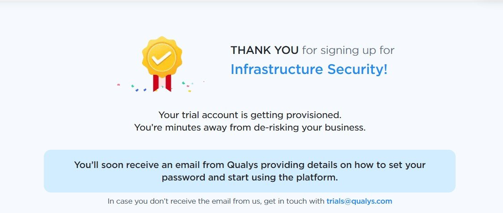
*Qualys Infrastructure Security trial provisioned - account getting ready*

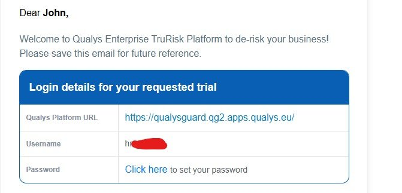
*Login credentials delivered to SOC Admin - EU2 tenant URL confirmed: `qualysguard.qg2.apps.qualys.eu`*

Once I logged in, I verified the Qualys VMDR TruRisk dashboard as the centralized security command interface. All risk widgets showed zero at baseline - a clean starting point before any assets were onboarded.

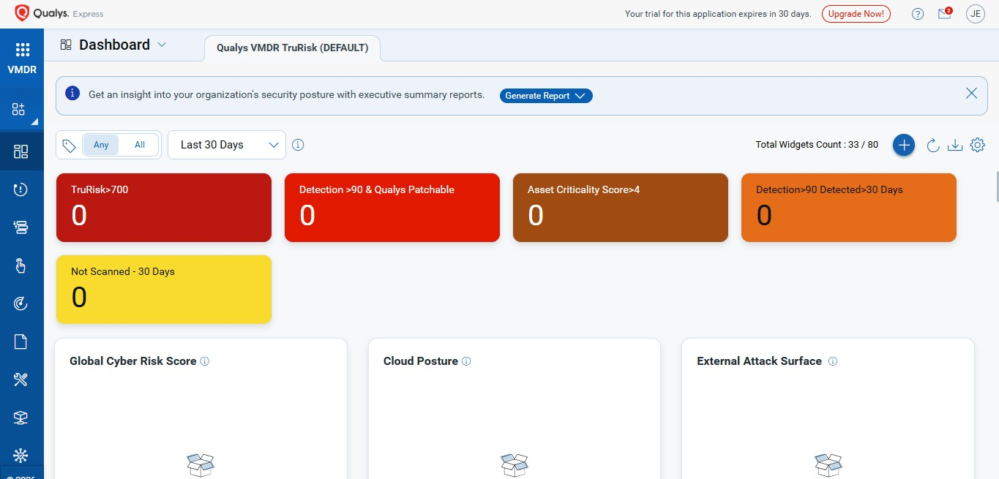
*Qualys VMDR TruRisk Dashboard - baseline state before first scan. TruRisk>700: 0, Asset Criticality>4: 0, Not Scanned 30 Days: 0*

#### 1.2 - Virtual Scanner Appliance (QVSA) Deployment

I imported the Qualys `.OVA` into VMware as `JOHN-SCANNER-VPC01`. With 5 virtual scanner licenses available on the tenant, I used the wizard to configure the scanner from within the platform.

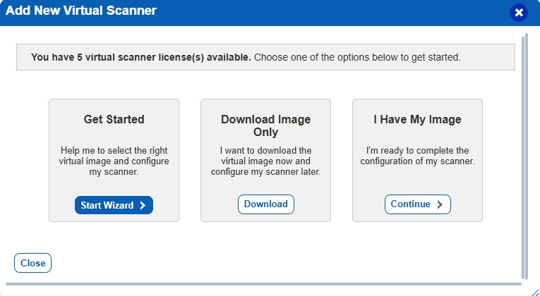
*Qualys platform showing 5 virtual scanner licenses available - scanner setup initiated*

Network configuration was the critical step. The scanner needed a static IP on the same subnet as the target VMs to ensure it could reach both Windows and Linux targets.

I opened the static IPv4 form inside the Scanner Console and entered values field by field:

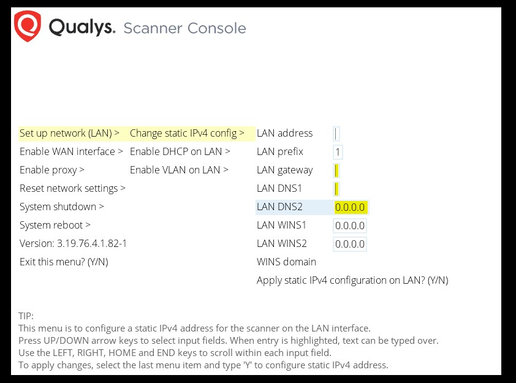
*Static IPv4 configuration form open in Scanner Console - entering IP/gateway/DNS values*

After confirming and applying, the Scanner Console reflected the full static network identity:

- **LAN IP:** `192.168.80.50` | **Prefix:** `/24`
- **Gateway:** `192.168.80.2` | **DNS1:** `8.8.8.8` | **DNS2:** `8.8.4.4`

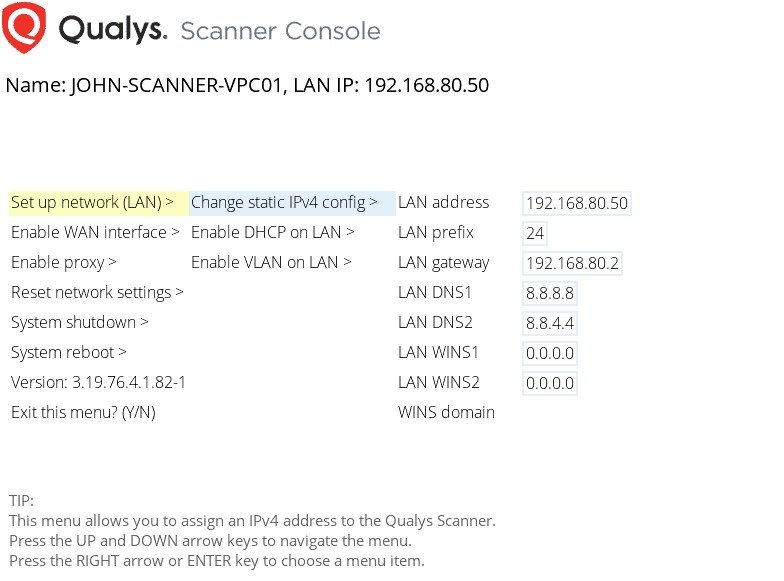
*JOHN-SCANNER-VPC01 - static IP `192.168.80.50` confirmed applied in Scanner Console*

#### 1.3 - Security Handshake and Cloud Registration

With the network configured, I linked the appliance to the EU2 Qualys tenant using a unique **14-digit Personalization Code**. This code ties the local VMware appliance to the cloud SOC brain.

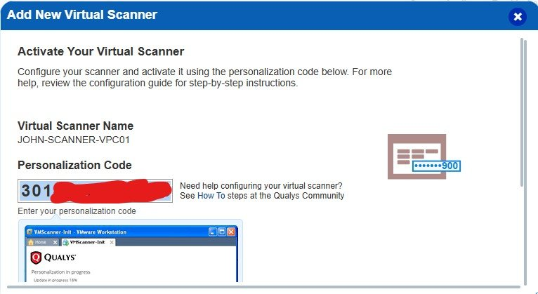
*"Activate Your Virtual Scanner" - personalization code entered, VMware workstation visible in background*

The Scanner Console immediately began the personalization sequence:


*First stage: "Preparing the scanner personalization >>" - cloud handshake initiated*

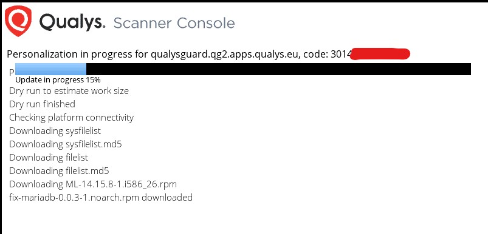
*Personalization at 15% - downloading sysfilelist, filelist.md5, ML packages from Qualys Cloud*

After the full update cycle completed, I verified activation from the Qualys platform side:

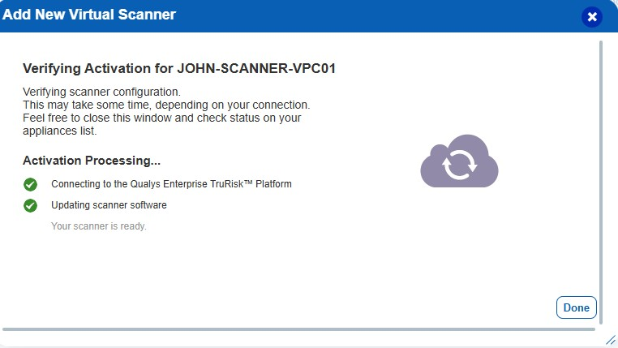
*JOHN-SCANNER-VPC01 activation complete - Connected to TruRisk Platform | Scanner software updated | "Your scanner is ready."*

Final verification - scanner confirmed live in the Qualys Enterprise platform Appliances dashboard:

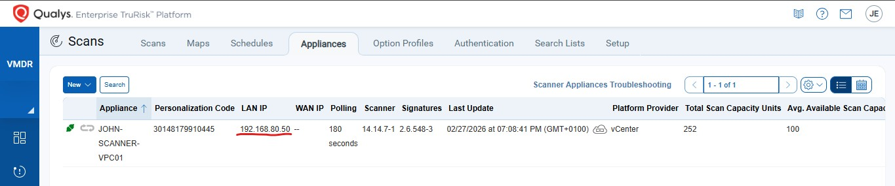
*JOHN-SCANNER-VPC01 online in Qualys Appliances tab - LAN IP `192.168.80.50`, Total Scan Capacity: **252 units**, Last Update: 02/27/2026 07:08 PM GMT*

**Phase 1 Complete** - The vulnerability scanning engine is live, cloud-registered, and ready to audit internal assets.

---

### Phase 2: Shift to Code - Terraform on AWS

**Goal:** Eliminate all manual AWS Console operations. Every resource is defined, versioned, and deployed via code.

#### 2.1 - Engineering Workstation Setup (Kali Linux)

I used a Kali Linux VM as the control plane for all IaC operations. Before touching any tooling, I ran the dependency installation sequence.

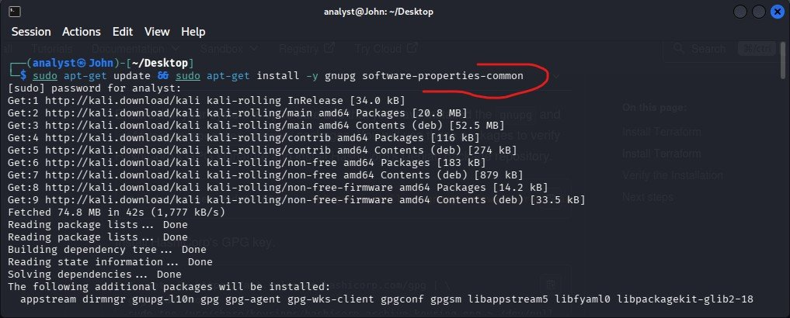
*`sudo apt-get update && apt-get install -y gnupg software-properties-common` - package index refreshed, prerequisites installed*

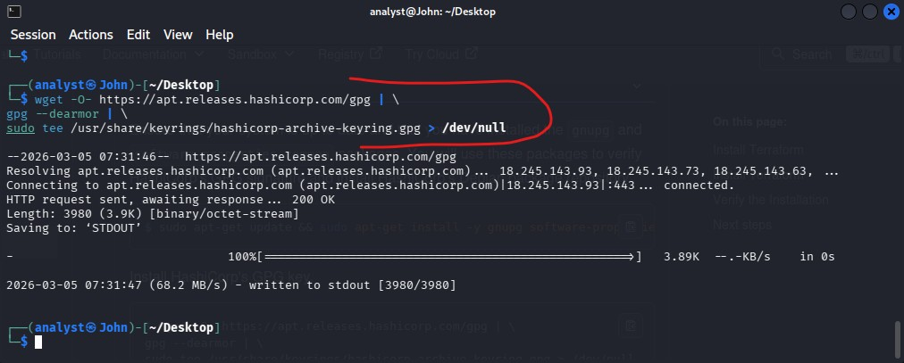
*HashiCorp GPG key downloaded and saved to `/usr/share/keyrings/hashicorp-archive-keyring.gpg` - supply chain verification step before any package install*

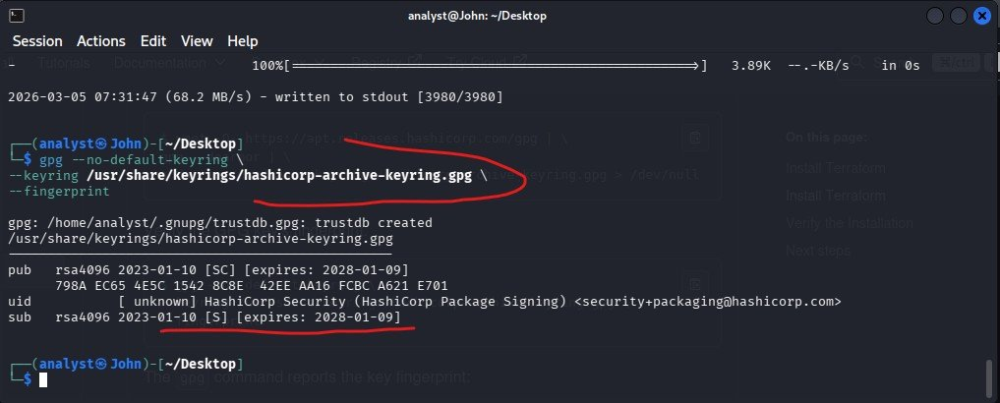
*`gpg --fingerprint` output confirmed: `798A EC65 4E5C 1542 8C8E 42EE AA16 FCBC A621 E701` - key authenticity validated*

```bash
# Install dependencies
sudo apt-get update && sudo apt-get install -y gnupg software-properties-common

# Import HashiCorp GPG key (supply chain verification)
wget -O- https://apt.releases.hashicorp.com/gpg | \
  gpg --dearmor | \
  sudo tee /usr/share/keyrings/hashicorp-archive-keyring.gpg > /dev/null

# Verify fingerprint: 798A EC65 4E5C 1542 8C8E 42EE AA16 FCBC A621 E701
gpg --no-default-keyring \
  --keyring /usr/share/keyrings/hashicorp-archive-keyring.gpg \
  --fingerprint

# Install Terraform
sudo apt-get install terraform

# Verify
terraform version
# Output: Terraform v1.14.6-1
```

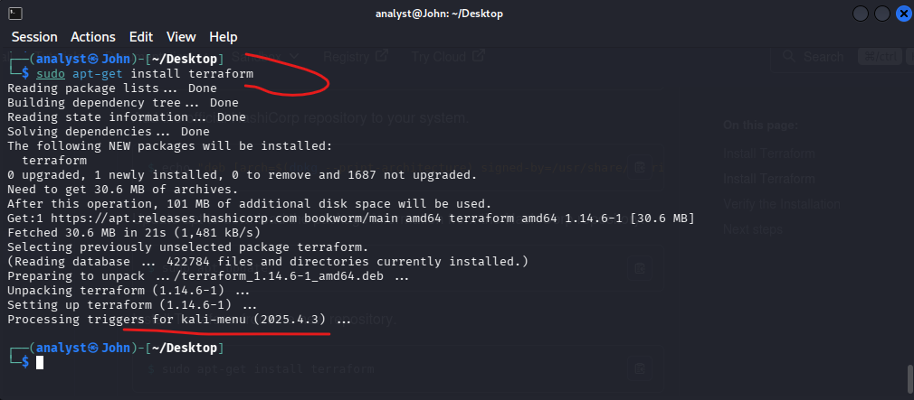
*`sudo apt-get install terraform` - Terraform v1.14.6-1 fetched from HashiCorp repo and installed on Kali engineering workstation*

#### 2.2 - AWS CLI Installation and Identity Validation

```bash
# Install AWS CLI
sudo apt install awscli -y

# Configure with SOC_Admin IAM credentials
aws configure
# AWS Access Key ID: [REDACTED]
# Default region name: ap-northeast-1 (Tokyo)
# Default output format: json

# Validate identity
aws sts get-caller-identity
# Returns: Account ID + ARN: arn:aws:iam::338320348433:user/SOC_Admin
```

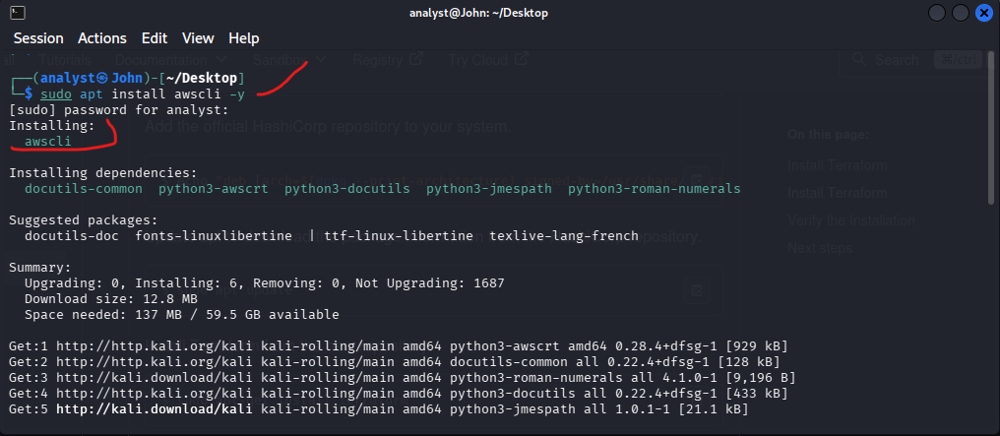
*`sudo apt install awscli -y` - AWS CLI and all dependencies downloading from Kali repos*

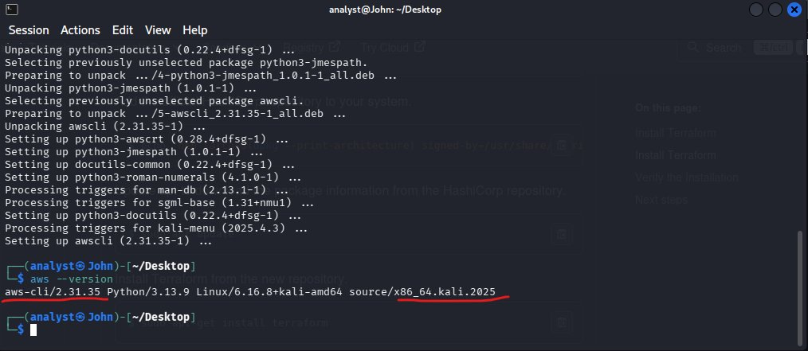
*`aws --version` - aws-cli/2.31.35 confirmed installed | `aws configure` and `aws sts get-caller-identity` run - identity confirmed: `arn:aws:iam::338320348433:user/SOC_Admin`*

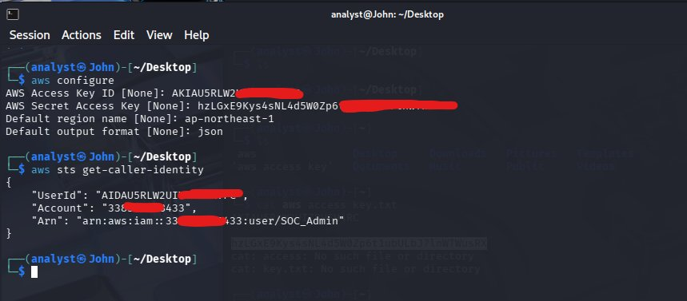
*`aws configure` and `aws sts get-caller-identity` output - SOC_Admin credentials entered, region set to `ap-northeast-1`, identity JSON returned confirming the correct account*

All automated actions are traceable to the `SOC_Admin` IAM principal - critical for audit trails.

#### 2.3 - IAM Access Key Management

I generated IAM credentials scoped to the minimum permissions required for Terraform operations, following least-privilege principles.

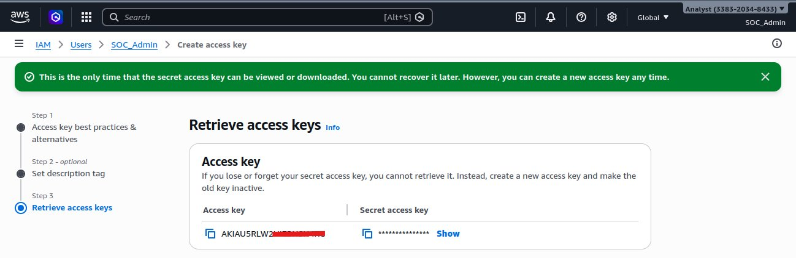
*AWS Console - IAM access key created for `SOC_Admin`. Secret key fully masked - one-time retrieval confirmed. Scoped to programmatic access only.*

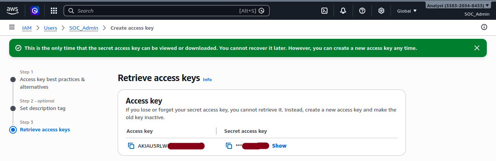
*Access key ID visible for reference - secret access key redacted. This is the credential used to configure `aws configure` on the Kali workstation.*

#### 2.4 - Terraform Init and Provider Lock

```bash
terraform init
# Downloads: hashicorp/aws v5.100.0
# Generates: .terraform.lock.hcl (version pinned for consistency)
```

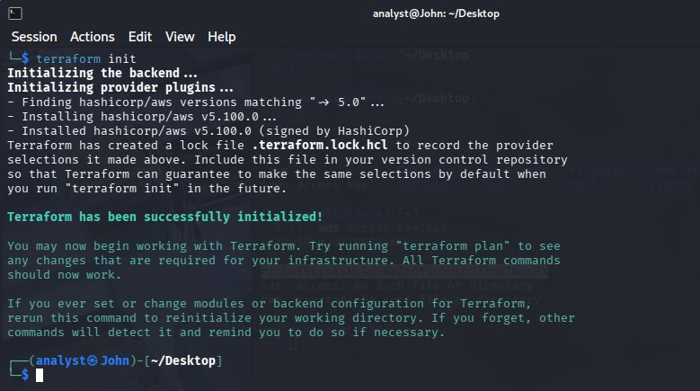
*`terraform init` - HashiCorp AWS provider v5.100.0 downloaded, "Terraform has been successfully initialized!"*

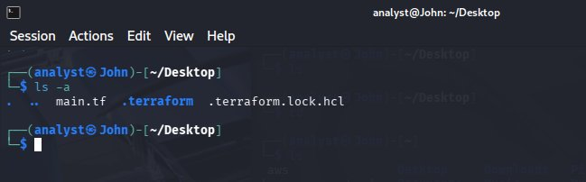
*`ls -a` in workspace - `main.tf`, `.terraform/`, `.terraform.lock.hcl` all confirmed present. Provider version is locked for reproducibility.*

#### 2.5 - main.tf Authoring

I authored the full infrastructure configuration locally before touching any cloud resources - defining the complete desired state in code.

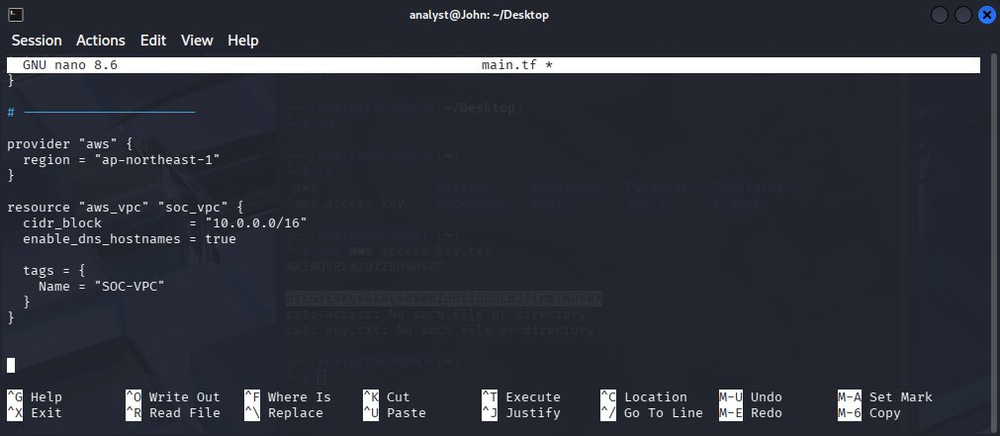
*`main.tf` open in nano - `resource "aws_vpc" "soc_vpc"` block showing CIDR `10.0.0.0/16`, DNS hostnames enabled, provider set to `ap-northeast-1`*

#### 2.6 - Network Infrastructure (Plan then Apply)

I deployed resources in dependency order - network first, then compute:

```bash
# Dry run validation
terraform plan

# Execute
terraform apply
# Resources created:
# aws_vpc.soc_vpc               - 10.0.0.0/16 (SOC-VPC)
# aws_subnet.soc_public_subnet  - 10.0.1.0/24 (ap-northeast-1a)
# aws_internet_gateway.soc_igw  - SOC-Internet-Gateway
# aws_route_table.soc_route_table - 0.0.0.0/0 IGW
# aws_security_group.soc_sg     - TCP 22 (SSH), TCP 80 (HTTP)
```

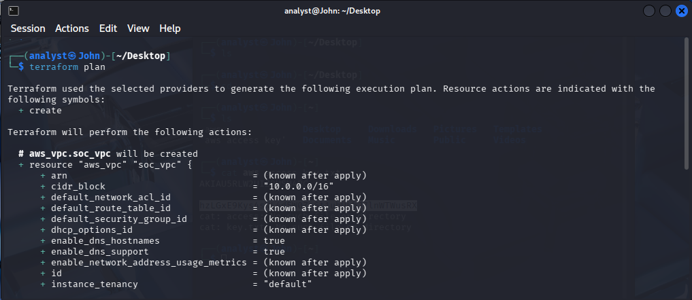
*`terraform plan` - `aws_vpc.soc_vpc` staged for creation, CIDR `10.0.0.0/16`, all properties listed*

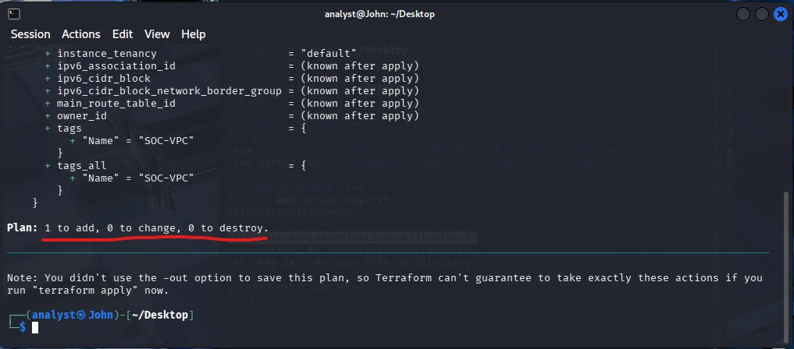
*Full plan summary - `Plan: 1 to add, 0 to change, 0 to destroy` confirmed before any cloud changes applied*

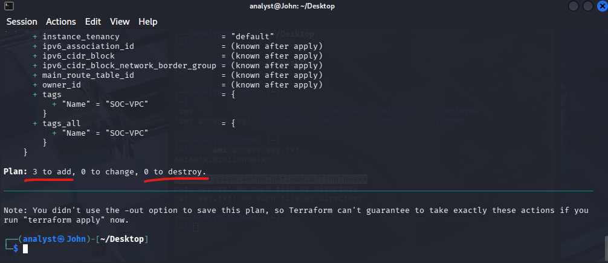
*`terraform plan` showing 3 resources to add - VPC, IGW, subnet staged together. `Plan: 3 to add, 0 to change, 0 to destroy`*

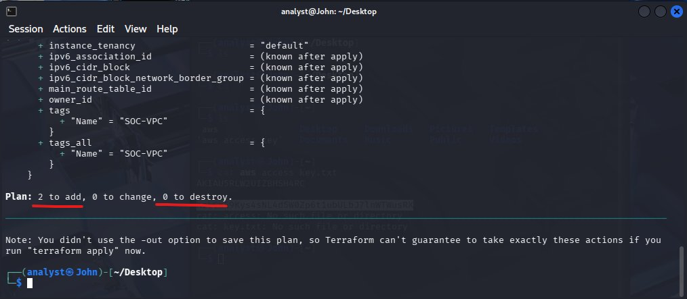
*`aws_subnet.soc_public_subnet` - `10.0.1.0/24` in `ap-northeast-1a` staged. `Plan: 2 to add, 0 to change, 0 to destroy`*

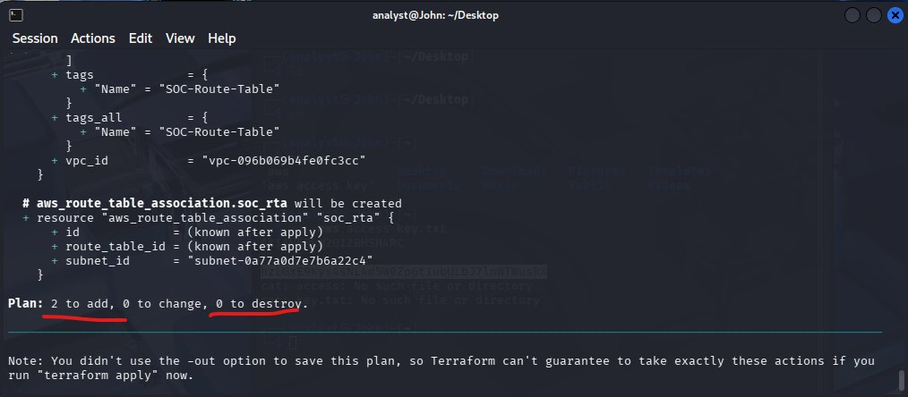
*`aws_route_table` + `aws_route_table_association` - default route `0.0.0.0/0 IGW` staged. `Plan: 2 to add, 0 to change, 0 to destroy`*

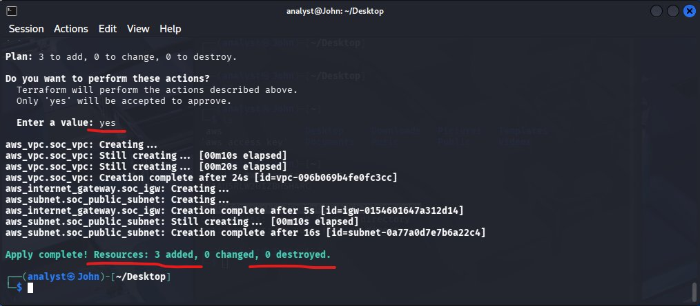
*`terraform apply` complete - VPC created after 24s, IGW after 5s, subnet after 16s. `Apply complete! Resources: 3 added, 0 changed, 0 destroyed.`*

| Resource | Value | Status |
|---|---|---|
| VPC CIDR | `10.0.0.0/16` | Available |
| Subnet | `10.0.1.0/24` - `ap-northeast-1a` | Active |
| IGW | SOC-Internet-Gateway | Attached |
| Route Table | `0.0.0.0/0 igw-0154601647a312d14` | Associated |
| Security Group | SSH (22), HTTP (80), Egress all | Applied |

#### 2.7 - AWS Console Verification

After apply, I verified all resources in the AWS Console to confirm Terraform's state matched real-world cloud state.

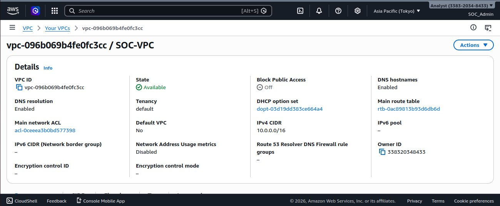
*AWS Console - `vpc-096b069b4fe0fc3cc / SOC-VPC` detail page. State: **Available**. IPv4 CIDR: `10.0.0.0/16`. DNS hostnames: Enabled.*

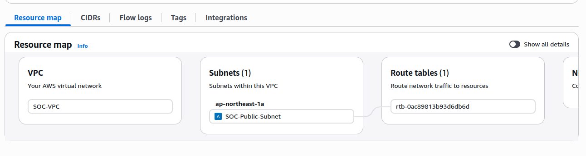
*VPC Resource Map showing SOC-VPC with SOC-Public-Subnet in `ap-northeast-1a` and route table `rtb-0ac89813b93d6db6d` - mid-build state*

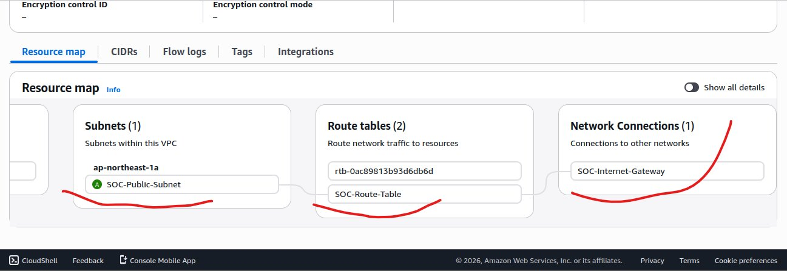
*VPC Resource Map complete - SOC-Public-Subnet, SOC-Route-Table, and SOC-Internet-Gateway all visible and linked. Full network path confirmed.*

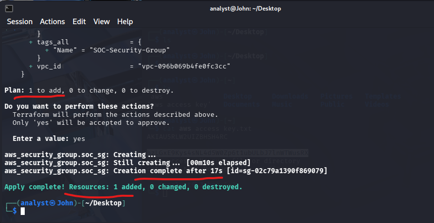
*`terraform apply` - `aws_security_group.soc_sg` creation complete after 17s. `sg-02c79a1390f869079` | `Apply complete! Resources: 1 added, 0 changed, 0 destroyed.`*

**Phase 2 Complete** - Full AWS network infrastructure deployed via code. Zero manual Console operations. Every resource is version-controlled and reproducible.

---

### Phase 3: Automated Hardening and Agent Provisioning

**Goal:** Every EC2 instance born in this environment is automatically hardened and pre-enrolled in the SOC before it handles a single packet.

#### 3.1 - RSA Key Pair Generation

```bash
ssh-keygen -t rsa -b 4096 -f soc_key
# Generates: soc_key (private) + soc_key.pub (public)
# Fingerprint: SHA256:[REDACTED] analyst@John
```

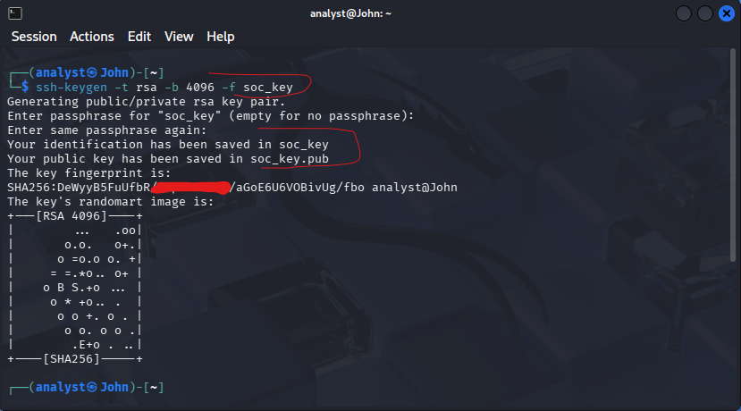
*`ssh-keygen -t rsa -b 4096 -f soc_key` - 4096-bit RSA key pair generated. Private key saved to `soc_key`, public key to `soc_key.pub`. SHA256 fingerprint confirmed with randomart output displayed.*

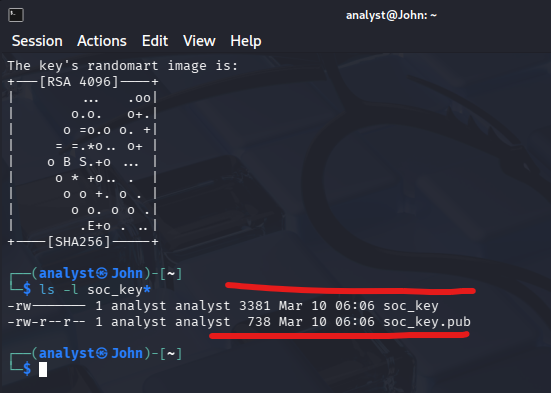
*`ls -l soc_key*` - private key (`soc_key`, 3381 bytes) and public key (`soc_key.pub`, 738 bytes) both confirmed on disk with correct permissions*

#### 3.2 - Terraform Keypair Plan

Before deploying the EC2, I ran `terraform plan` to stage the key pair resource and verify the plan:

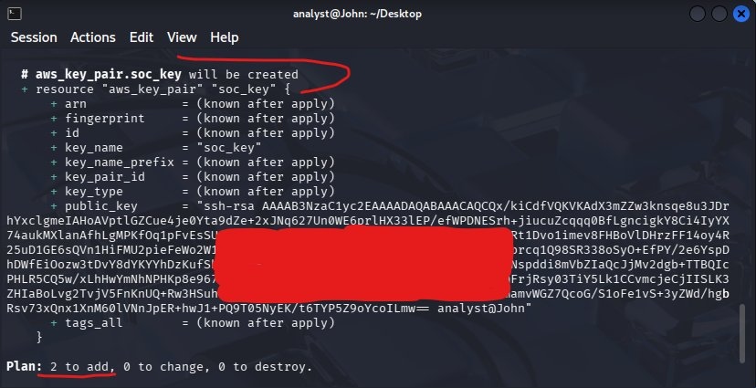
*`terraform plan` - `aws_key_pair.soc_key` will be created. Public key content visible in plan output. `Plan: 2 to add, 0 to change, 0 to destroy` - key pair and EC2 instance staged together.*

#### 3.3 - Ubuntu 24.04 EC2 Launch via Terraform

```hcl
resource "aws_instance" "soc_analysis_node" {
  ami                         = data.aws_ami.ubuntu.id  # Ubuntu 24.04 Noble
  instance_type               = "t2.micro"
  subnet_id                   = aws_subnet.soc_public_subnet.id
  vpc_security_group_ids      = [aws_security_group.soc_sg.id]
  key_name                    = aws_key_pair.soc_key.key_name
  associate_public_ip_address = true

  user_data = <<-EOF
    #!/bin/bash
    # Auto-deploy Wazuh Agent at boot
    # Auto-enroll with SOC Manager
    # Lock SSH to key-only auth
  EOF
}
```

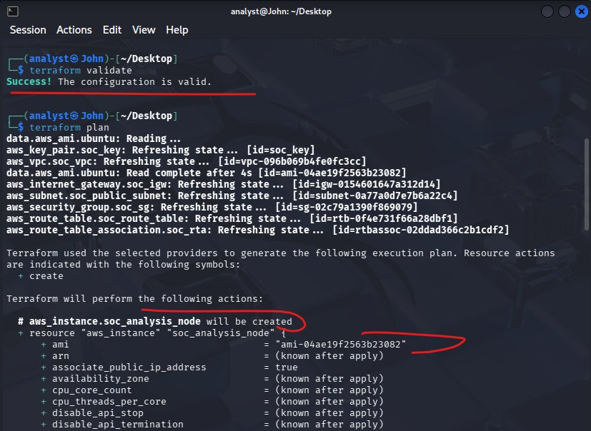
*`terraform validate` - "Success! The configuration is valid." Then `terraform plan` - `aws_instance.soc_analysis_node` staged: Ubuntu 24.04 AMI `ami-04ae19f2563b23082`, `t2.micro`, all existing state refreshed from live resources.*

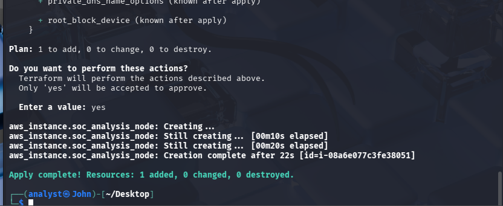
*`terraform apply` - EC2 instance `soc_analysis_node` created after 22s. `id=i-08a6e077c3fe38051`. `Apply complete! Resources: 1 added, 0 changed, 0 destroyed.`*

#### 3.4 - Key Permission Hardening

```bash
chmod 400 soc_key
```

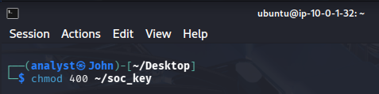
*`chmod 400 ~/soc_key` applied - private key locked to owner-read-only. SSH client will reject the key if permissions are too open.*

#### 3.5 - AWS EC2 Validation and Console Verification

Before SSH access, AWS sent a validation email confirming my EC2 access request in the Tokyo region was approved:

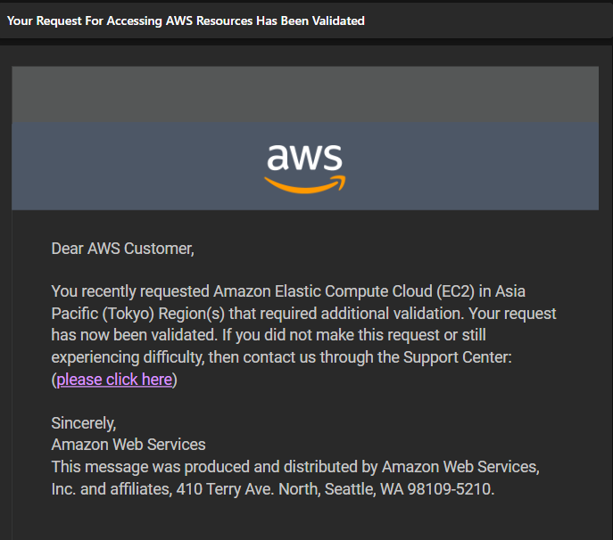
*AWS validation email - "Your Request For Accessing AWS Resources Has Been Validated" for EC2 in Asia Pacific (Tokyo). First-time region access confirmed.*

Terraform completed EC2 creation in 22 seconds. I verified in the AWS Console:

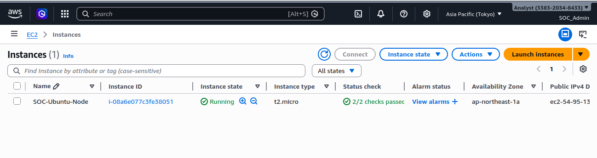
*AWS Console Instances list - `SOC-Ubuntu-Node` (`i-08a6e077c3fe38051`), State: **Running**, Status check: **2/2 checks passed**, `t2.micro`, `ap-northeast-1a`*

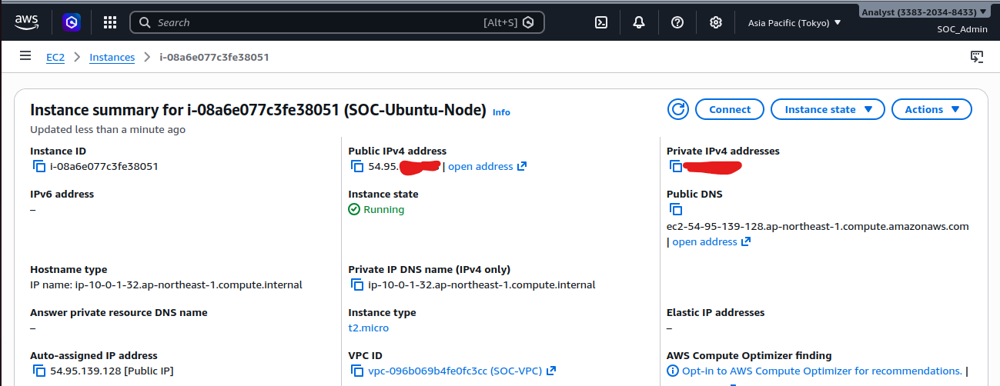
*EC2 instance summary - Instance ID: `i-08a6e077c3fe38051`, State: **Running**, Public IPv4 assigned, VPC: `vpc-096b069b4fe0fc3cc (SOC-VPC)`, Instance type: `t2.micro`, Public DNS confirmed*

#### 3.6 - SSH Access Established

```bash
ssh -i soc_key ubuntu@<public-ip>
```

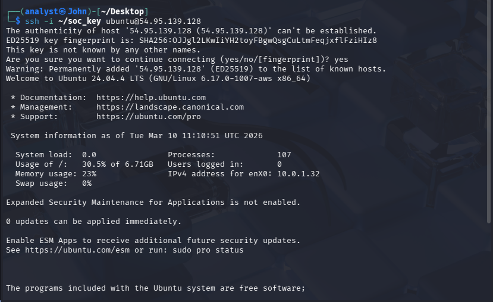
*`ssh -i ~/soc_key ubuntu@54.95.139.128` - first connection. ED25519 host key fingerprint accepted. Ubuntu 24.04.4 LTS banner confirmed. System load: 0.0, Memory: 23%, IP `10.0.1.32` - node is live.*

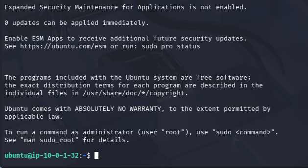
*Active SSH session inside the EC2 node - `ubuntu@ip-10-0-1-32:~$` prompt. Ubuntu 24.04 LTS, 0 updates pending at this point. Key-authenticated access confirmed working.*

**Phase 3 Complete** - EC2 launched, hardened, and SSH-accessible via key authentication. Wazuh agent provisioned via `user_data` bootstrap. Zero manual configuration post-deploy.

---

### Phase 4: Continuous Validation and Tunnel Architecture

**Goal:** Establish persistent, reliable telemetry from the Tokyo cloud node back to the on-premises Wazuh Manager (Home Lab, Lekki).

This is where the real engineering happened - not a clean deployment, but a sustained operational battle across multiple rebuild cycles, a version mismatch, a configuration corruption, five tunnel approaches, a certificate failure, and a duplicate agent identity problem. Every failure is documented. Every fix is shown.

---

#### 4.1 - Terraform Rebuild Cycles

Phase 4 required multiple full destroy-and-create cycles as the tunnel architecture evolved. Each cycle re-provisioned a fully hardened, agent-enrolled node via the same `user_data` bootstrap - demonstrating IaC immutability in practice.

**Cycle 1 - First Key Rotation Rebuild** (`i-0ffb07fca352e1fce`)

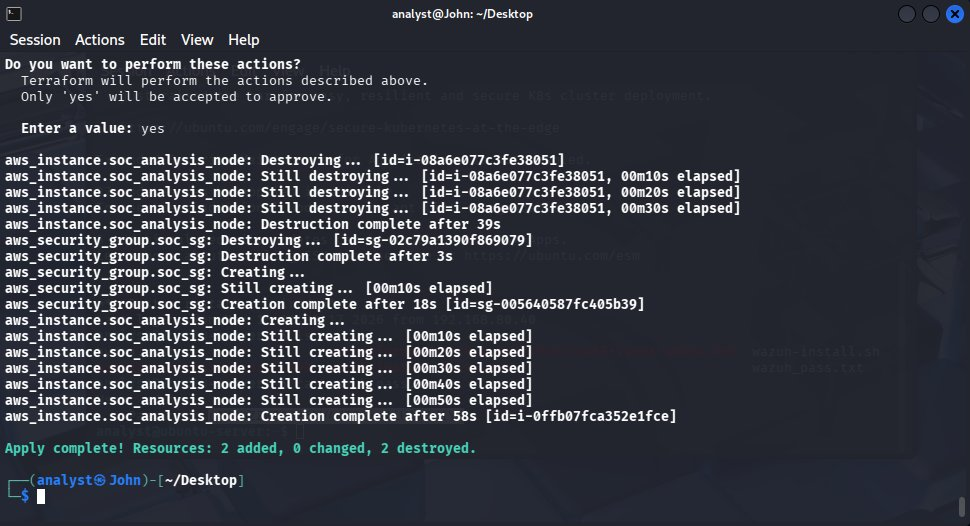
*`terraform apply` - `i-08a6e077c3fe38051` destroyed after 39s; replacement `i-0ffb07fca352e1fce` created. `Apply complete! Resources: 2 added, 0 changed, 2 destroyed.`*

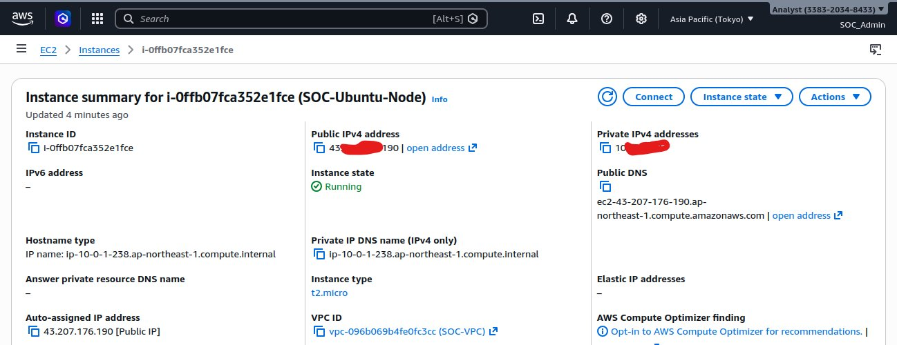
*AWS Console - `SOC-Ubuntu-Node` (`i-0ffb07fca352e1fce`) in **Running** state, `t2.micro`, `ap-northeast-1`. Public IPv4 assigned.*

**Cycle 2 - Second Rebuild** (`i-05ae543e6015739e6`)

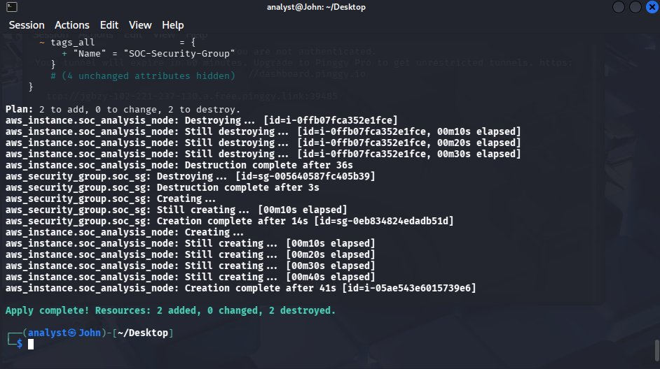
*`terraform apply` - `i-0ffb07fca352e1fce` destroyed after 36s; new SG and node `i-05ae543e6015739e6` created. `Apply complete! Resources: 2 added, 0 changed, 2 destroyed.`*

**user_data In-Place Update** (no teardown required)

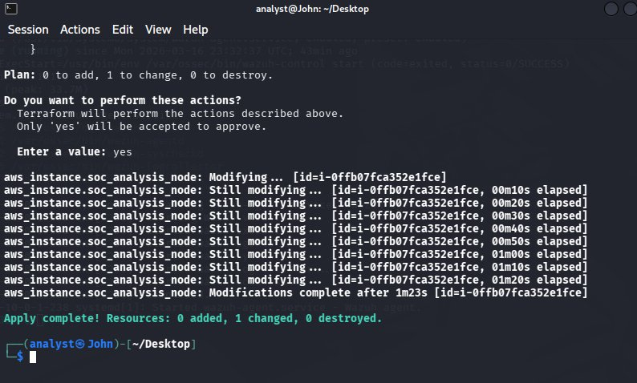
*`terraform apply` - EC2 instance modified in-place (`1 changed, 0 destroyed`) after `user_data` update. Modifications complete after 1m23s.*

#### 4.2 - SSH Access Verified on New Nodes

After each rebuild, I pulled the public IP from Terraform state and validated SSH access before continuing.

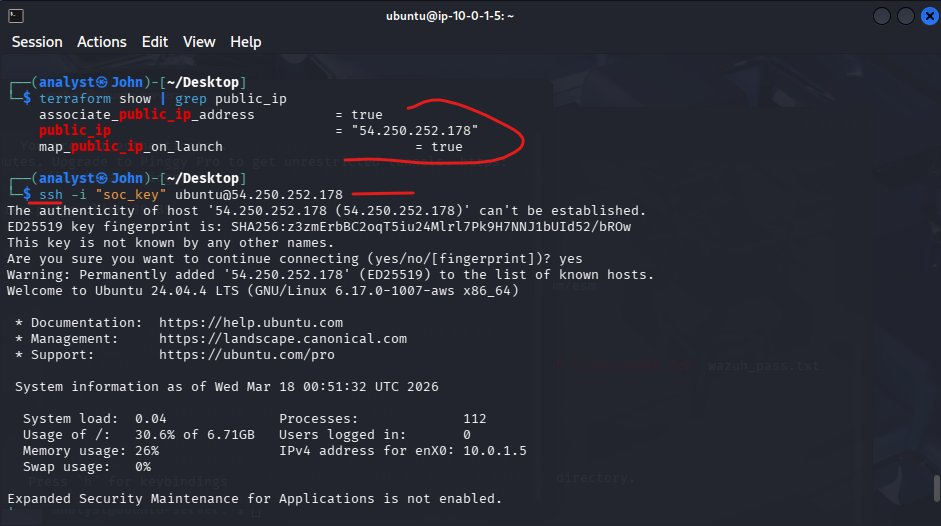
*`terraform show | grep public_ip` gives `54.250.252.178` | `ssh -i "soc_key" ubuntu@54.250.252.178` - host fingerprint accepted, Ubuntu 24.04.4 LTS banner confirmed, node `ip-10-0-1-5`*

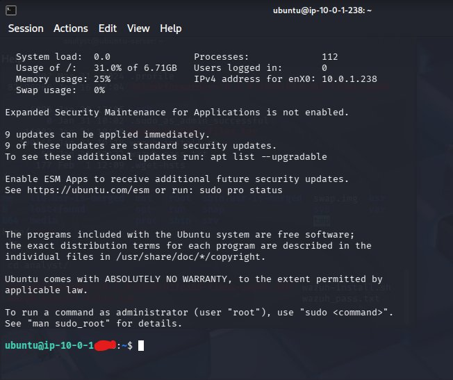
*SSH into earlier rebuild node `ubuntu@ip-10-0-1-238` - Ubuntu 24.04 LTS, `10.0.1.238` private IP, 9 security updates pending. Node is live.*

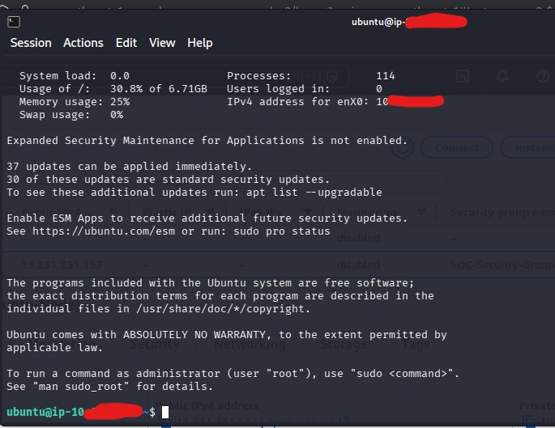
*SSH into final rebuilt Tokyo node - 37 security updates pending (intentionally unpatched for vulnerability simulation). Node is live and accessible.*

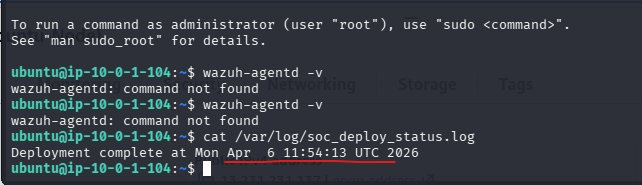
*`cat /var/log/soc_deploy_status.log` shows `Deployment complete at Mon Apr 6 11:54:13 UTC 2026`. `user_data` bootstrap ran to completion - Wazuh agent and all tooling auto-installed.*

#### 4.3 - Wazuh Agent Running - Version Problem Discovered

The Wazuh agent started automatically on boot via `user_data`. Initial verification confirmed it was running, but the version check exposed a critical mismatch.

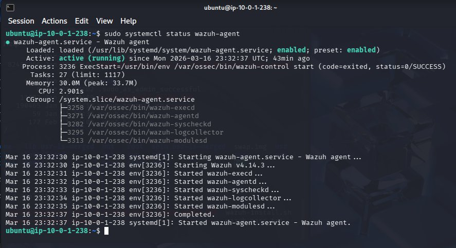
*`systemctl status wazuh-agent` on `ubuntu@ip-10-0-1-238` - Active: **running**. Starting Wazuh **v4.14.3**. All subsystems live: `wazuh-execd`, `wazuh-agentd`, `wazuh-syscheckd`, `wazuh-logcollector`, `wazuh-modulesd`.*

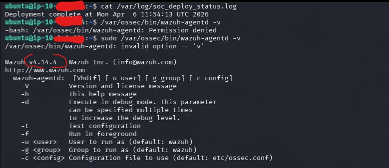
*`sudo /var/ossec/bin/wazuh-agentd -V` returns **Wazuh v4.14.4**. Bootstrap log shows deployment complete - agent installed successfully, but version is too high for Manager v4.9.2. Downgrade required. See Incident 002.*

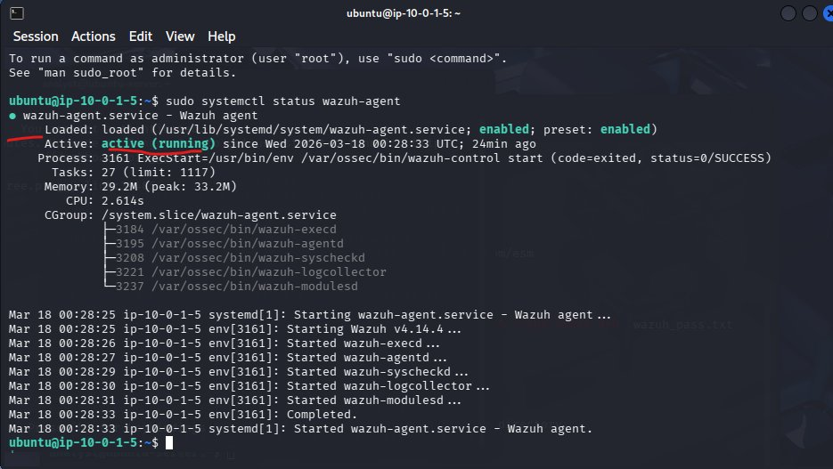
*`systemctl status wazuh-agent` on `ubuntu@ip-10-0-1-5` - Active: **running**. Starting Wazuh **v4.14.4**. Zero-touch provisioning confirmed - but version incompatibility will block telemetry.*

#### 4.4 - On-Prem Manager Port Verification

Before addressing tunnel connectivity, I confirmed the Manager's listening state. `netstat` was not available, so I used `ss` as the replacement.

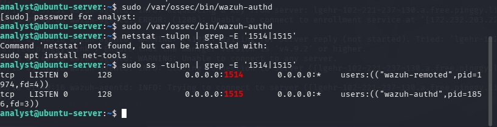
*`sudo ss -tulpn | grep -E '1514|1515'` - `wazuh-remoted` listening on `:1514`, `wazuh-authd` on `:1515`. Manager is ready to accept agent connections.*

---

## 5. Incident and Failure Handling

> **Engineering Note:** This section documents every real operational failure encountered during Phase 4. Each incident is presented as it would appear in a professional post-incident review - symptom, root cause, diagnostic steps, resolution, and evidence. Nothing was staged.

---

### Incident 001: SSH Key Loss and Automated Recovery

**Severity:** HIGH - Complete loss of administrative access to production node
**Phase:** Phase 3 to Phase 4 transition

#### Symptom

The original SSH private key (`soc_key`) was lost when the management session was reset. Without it, there is no path into the running EC2 instance.

```
Permission denied (publickey).
```

#### Root Cause

Private key not stored in a persistent secure location. No recovery path exists without a backdoor - and creating a backdoor is itself a security violation.

#### Resolution - IaC Key Rotation ("Cattle, Not Pets")

I treated the instance as disposable. New key generated, Terraform updated, fresh replacement provisioned automatically.

**Step 1 - Update main.tf with new key reference**

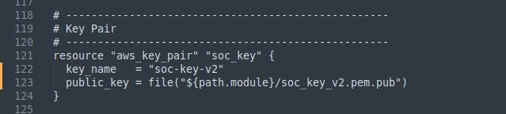
*`main.tf` open in editor - `resource "aws_key_pair" "soc_key"` block showing `key_name = "soc-key-v2"` and `public_key = file("${path.module}/soc_key_v2.pem.pub")`. IaC is the source of truth for credentials.*

**Step 2 - Generate new RSA key pair**

```bash
ssh-keygen -t rsa -b 4096 -f soc_key_v2.pem -N ""
```

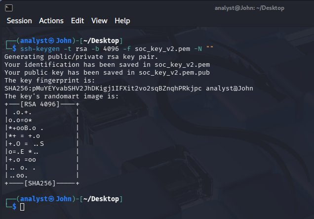
*`ssh-keygen -t rsa -b 4096 -f soc_key_v2.pem` - `soc_key_v2.pem` (private) and `soc_key_v2.pem.pub` (public) saved. SHA256 fingerprint confirmed, randomart output displayed.*

**Step 3 - Plan the replacement**

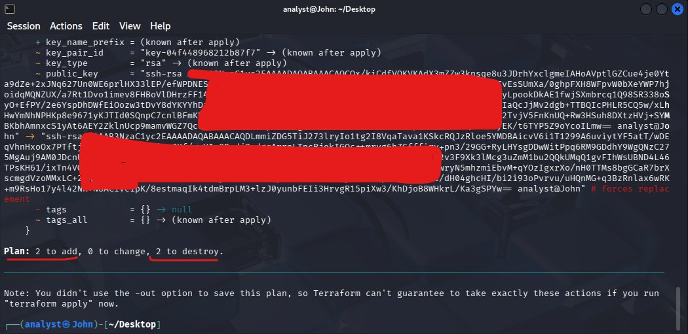
*`terraform plan` - new RSA public key staged. `Plan: 2 to add, 0 to change, 2 to destroy`. `-/+ destroy and then create replacement` for both `aws_key_pair` and `aws_instance`. Reviewed before apply.*

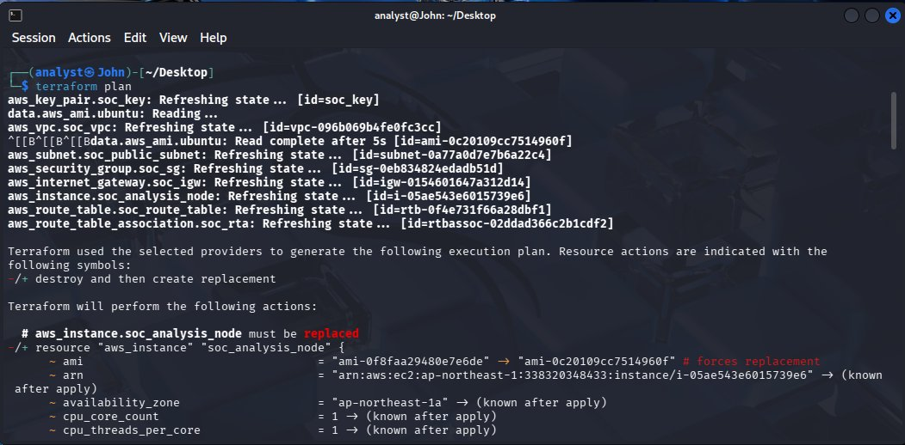
*`terraform plan` detail - `aws_instance.soc_analysis_node` must be **replaced**. AMI, ARN, AZ refreshed from live state. Destroy-then-create sequence confirmed.*

**Step 4 - Apply and verify**

```bash
terraform apply
# aws_key_pair.soc_key: Destruction complete after 1s
# aws_key_pair.soc_key: Creation complete [id=soc-key-v2]
# aws_instance.soc_analysis_node: Creation complete [id=i-0951d476c0a5c63ad]
# Apply complete! Resources: 2 added, 0 changed, 2 destroyed.
chmod 400 soc_key_v2.pem
```

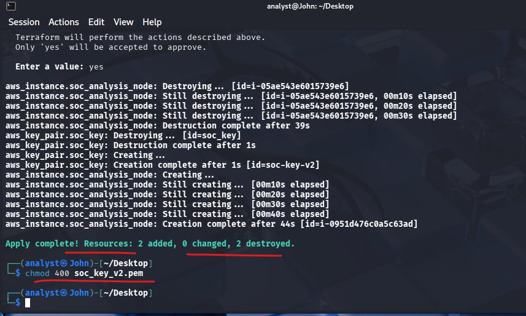
*`terraform apply` - old node `i-05ae543e6015739e6` destroyed after 39s; `soc-key-v2` created in 1s; new node `i-0951d476c0a5c63ad` created after 44s. `Apply complete!` | `chmod 400 soc_key_v2.pem` applied immediately.*

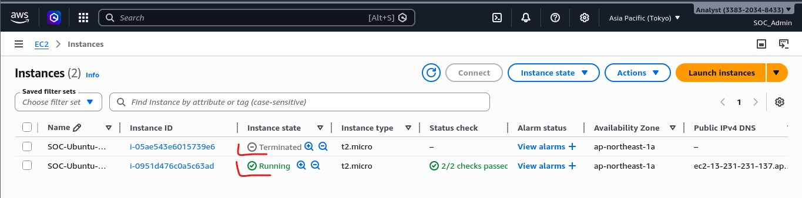
*AWS Console - old `i-05ae543e6015739e6` **Terminated**; new `i-0951d476c0a5c63ad` **Running**, **2/2 status checks passed**. Clean replacement in `ap-northeast-1a`.*

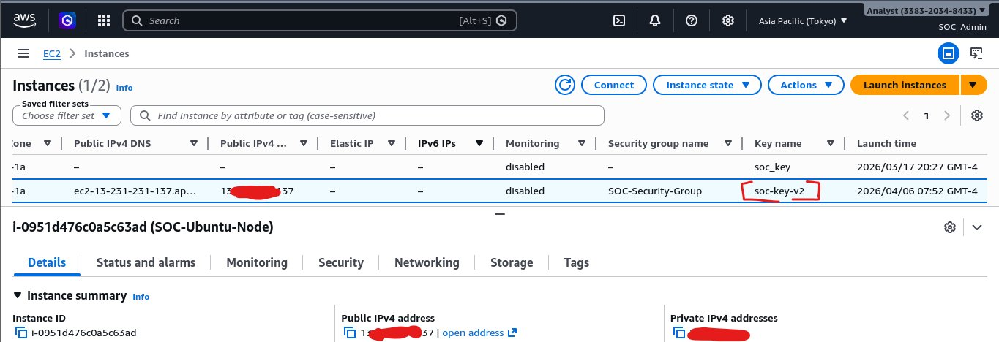
*Instance detail - Key name: **`soc-key-v2`** confirmed. `SOC-Security-Group` intact. New public IP assigned - admin access restored.*

**Recovery time: under 5 minutes.** Replacement node came up fully hardened and Wazuh agent-enrolled with zero manual post-deploy configuration.

| Step | Tool | Action | Result |
|---|---|---|---|
| Key generation | ssh-keygen | RSA 4096-bit soc_key_v2 | New credential created |
| IaC update | main.tf | `aws_key_pair` block updated | Credential version-controlled |
| Replace | Terraform | destroy then create | Admin access restored in under 5 min |

---

### Incident 002: Wazuh Version Mismatch (Agent > Manager)

**Severity:** MEDIUM - Agent installs but telemetry handshake immediately rejected
**Phase:** Phase 4

#### Symptom

The Tokyo agent started successfully but every connection to the Manager was dropped immediately after TCP establishment.

```
wazuh-agentd: Connection reset by peer
```

#### Root Cause

`user_data` bootstrap used an unpinned `apt-get install wazuh-agent`, which pulled **v4.14.4** (latest). The on-prem Manager was running **v4.9.2**. Wazuh enforces strict version compatibility - the Manager silently rejected the handshake.

#### Resolution - Live Downgrade and Version Pinning

**Step 1 - Downgrade the agent binary**

```bash
sudo apt-get install wazuh-agent=4.9.2-1 -y
```

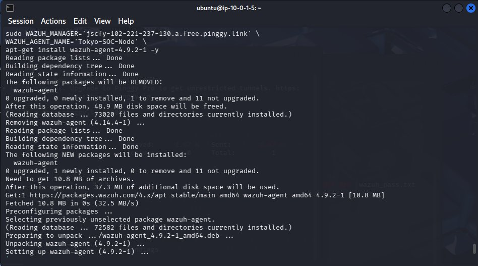
*`apt-get install wazuh-agent=4.9.2-1` on `ubuntu@ip-10-0-1-5` - removing `wazuh-agent (4.14.4-1)`, fetching `4.9.2-1 [10.8 MB]`. `Setting up wazuh-agent (4.9.2-1)` confirmed.*


*Same downgrade on rebuilt node `ubuntu@ip-10-0-1-104` - `Removing wazuh-agent (4.14.4-1)`, installing `4.9.2-1 [10.8 MB]`. Fix applied consistently across all rebuilt nodes.*

**Step 2 - dpkg service file conflict resolved**

During downgrade, dpkg detected the `wazuh-agent.service` unit file had changed between versions and prompted for resolution:

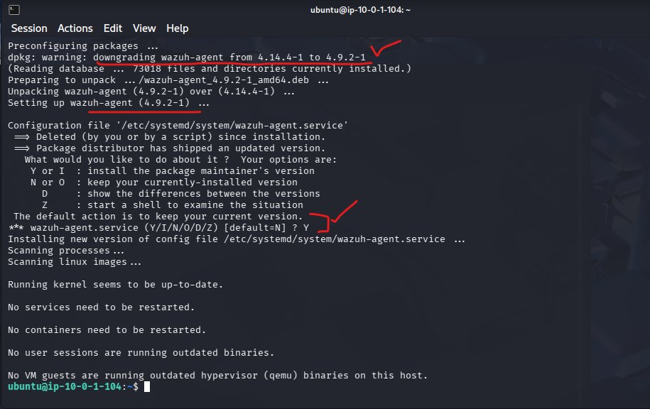
*`dpkg: warning: downgrading wazuh-agent from 4.14.4-1 to 4.9.2-1`. Prompted on `wazuh-agent.service` config conflict - `Y` selected to install maintainer's v4.9.2 service file.*

**Step 3 - Verify version and lock it**

```bash
sudo apt-mark hold wazuh-agent
sudo /var/ossec/bin/wazuh-agentd -V
```

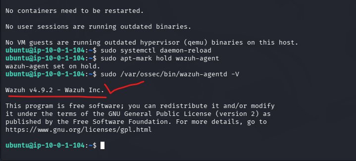
*`wazuh-agentd -V` returns **"Wazuh v4.9.2 - Wazuh Inc."** | `apt-mark hold wazuh-agent` confirms `wazuh-agent set on hold`. Version pinned - no future apt upgrade will override.*

The `user_data` bootstrap was subsequently updated with `apt-get install wazuh-agent=4.9.2-1` explicitly pinned. This is a production engineering standard - never allow package managers to auto-select agent versions in a heterogeneous SOC environment.

---

### Incident 003: Configuration Corruption After Downgrade

**Severity:** MEDIUM - Agent binary downgraded but daemon refuses to start
**Phase:** Phase 4

#### Symptom

After downgrading from v4.14 to v4.9.2, `systemctl start wazuh-agent` failed twice. Switching to the engine's own binary exposed the real cause:

```
wazuh-modulesd: ERROR: No such tag 'users' at module 'syscollector'.
wazuh-modulesd: Configuration error at 'etc/ossec.conf'. (1202)
wazuh-modulesd: Configuration error. Exiting.
```

#### Root Cause

`dpkg` downgraded the **binary** but left the `ossec.conf` from v4.14 intact. The v4.14 config contained XML tags (`<users>`, `<groups>` under `<syscollector>`) that do not exist in the v4.9.2 daemon - causing immediate engine failure before any subsystem could start.

#### Resolution - Engine-Layer Debugging and Surgical Config Fix

```bash
# systemctl hides the root cause - go to the engine directly
sudo /var/ossec/bin/wazuh-control start
# ERROR: No such tag 'users' at module 'syscollector'

# Surgically remove the incompatible tags
sudo nano /var/ossec/etc/ossec.conf

# Restart via engine layer
sudo /var/ossec/bin/wazuh-control start
```

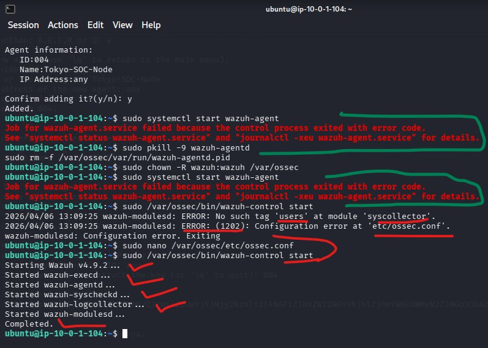
*Complete incident lifecycle on `ubuntu@ip-10-0-1-104`: (1) `systemctl start wazuh-agent` fails with exit code error. (2) `wazuh-control start` exposes exact error: `No such tag 'users' at module 'syscollector'`. (3) `nano /var/ossec/etc/ossec.conf` - incompatible tags removed. (4) `wazuh-control start` completes: `Starting Wazuh v4.9.2... Completed.`*

**Key lesson:** `systemctl` is an abstraction layer - it tells you a service failed, not why. When debugging daemon-level failures, bypass `systemctl` and use the application's own control binary. It exposes errors that `journalctl` often buries.

---

### Incident 004: NAT Traversal and Tunnel Instability

**Severity:** HIGH - No viable path from Tokyo EC2 to on-prem Wazuh Manager
**Phase:** Phase 4

#### Symptom

Every attempt to establish persistent TCP connectivity from the Tokyo cloud agent to the Lekki residential Manager failed in different ways:

```
Connection closed by remote host
Connection refused
ERROR: Could not resolve hostname
wazuh-agentd: Closing connection to server... Trying to connect...
```

#### Root Cause

The on-prem Wazuh Manager sits behind a residential router with no port forwarding, no static public IP, and an ISP that performs deep packet inspection on high-frequency connection patterns. I evaluated five separate tunnel architectures before finding a working solution.

---

#### Attempt 1: Pinggy SSH Tunnel

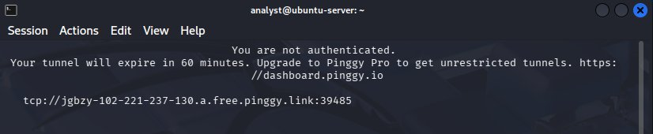
*Pinggy tunnel active - `tcp://jgbzy-102-221-237-130.a.free.pinggy.link:39485`. 60-minute session limit on free tier noted.*

Agent enrollment through the Pinggy address succeeded briefly - cryptographic key exchange completed:

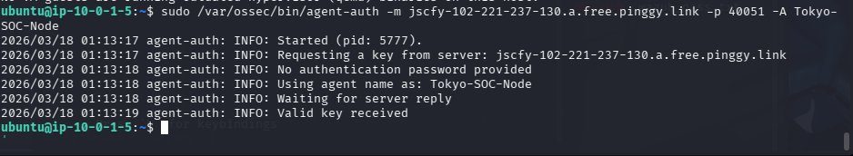
*`agent-auth -m jscfy-102-221-237-130.a.free.pinggy.link -p 40051 -A Tokyo-SOC-Node` returns `INFO: Valid key received`. Agent registered on Manager side - but persistent connection could not be maintained.*

However, the Pinggy SSH port-forwarding syntax for dual-port (1514 + 1515) was rejected:

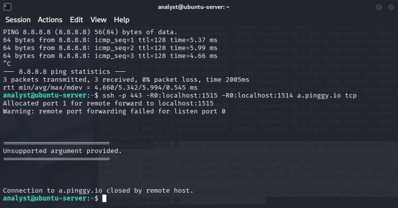
*`ssh -p 443 -R0:localhost:1515 -R0:localhost:1514 a.pinggy.io tcp` returns `Unsupported argument provided`. `Connection to a.pinggy.io closed by remote host`. Pinggy free tier does not support bidirectional dual-port TCP forwarding required by Wazuh.*

After the 60-minute session expired, the agent entered a DNS resolution loop:

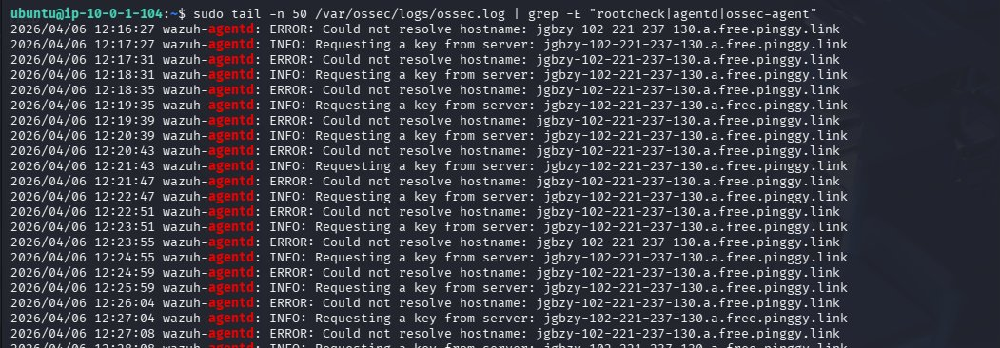
*`ossec.log` grep - repeated `ERROR: Could not resolve hostname: jgbzy-102-221-237-130.a.free.pinggy.link` alternating with `INFO: Requesting a key from server`. Agent looping indefinitely against an expired DNS record.*

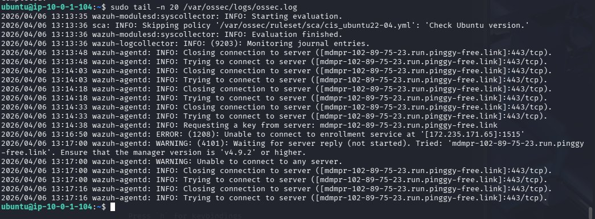
*`ossec.log` - repeated `Closing connection to [mdmpr-102-89-75-23.run.pinggy-free.link]:443/tcp` then `Trying to connect`. `WARNING: Unable to connect to any server`. Pinggy tunnel alive but Wazuh cannot maintain a persistent session through it.*

**Pinggy verdict:** Free tier limited to single-direction TCP. 60-minute session cap. Dual-port requirement unsupported.

---

#### Attempt 2: Cloudflare Inside-Out Tunnel

```bash
curl -L --output cloudflared.deb \
  https://github.com/cloudflare/cloudflared/releases/latest/download/cloudflared-linux-x86_64.deb
sudo dpkg -i cloudflared.deb
```

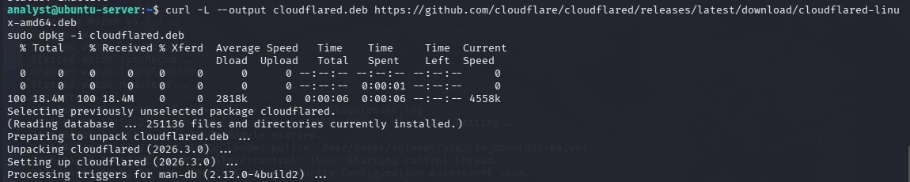
*`curl` downloading `cloudflared-linux-x86_64.deb` at 4558 kB/s. `dpkg -i` - `Setting up cloudflared (2026.3.0)` on `analyst@ubuntu-server`.*

```bash
cloudflared tunnel --url tcp://localhost:1514
```

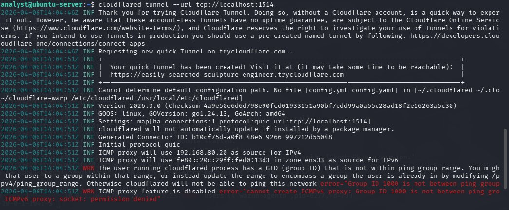
*Tunnel created at `https://easily-searched-sculpture-engineer.trycloudflare.com`. QUIC protocol selected, Connector ID generated.*

`ossec.conf` was updated to point at the Cloudflare hostname. The result was a connect-then-immediately-close loop:

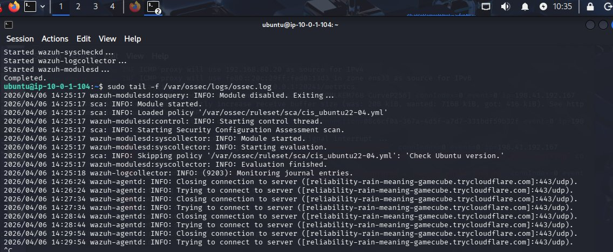
*`tail -f /var/ossec/logs/ossec.log` on Tokyo node - repeated `wazuh-agentd: INFO: Closing connection to server [reliability-rain-meaning-gamecube.trycloudflare.com]:443/udp` immediately followed by `Trying to connect`. Cloudflare's edge expects HTTP/2 or QUIC framing. Wazuh's binary protocol handshake is treated as a corrupt payload and dropped before any data flows.*

**Cloudflare verdict:** Fundamental protocol incompatibility. Cloudflare Tunnel proxies HTTP/QUIC. Wazuh speaks a proprietary binary protocol. Not a configuration problem - an architectural mismatch.

---

#### Attempt 3: Direct P2P (TCP 1514)

Switching `ossec.conf` to the Manager's residential public IP on port 1514 directly resulted in a SYN-SENT state that never resolved. Root cause: residential router had no port forwarding rules. CGNAT blocked all unsolicited inbound traffic from Tokyo.

**Direct P2P verdict:** Residential CGNAT and no router access means no inbound path.

---

#### Final Resolution: Tailscale Mesh VPN

Tailscale creates a WireGuard-encrypted Layer 3 overlay network between enrolled devices. It establishes connectivity through CGNAT and residential NAT without requiring port forwarding, router access, or application-layer protocol negotiation. Both machines appear to each other as if on the same LAN.

**Step 1 - Install Tailscale on the on-prem Manager**

```bash
sudo apt-get install -y tailscale
sudo tailscale up
```

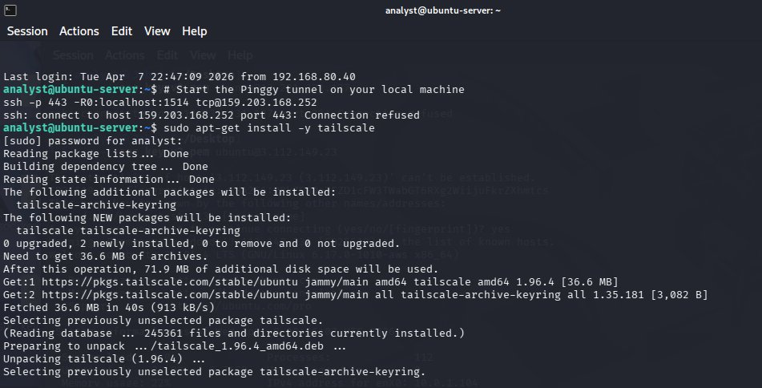
*`apt-get install -y tailscale` on `analyst@ubuntu-server` - `tailscale 1.96.4` fetched from `pkgs.tailscale.com`, systemd service symlinked. "Installation complete!"*

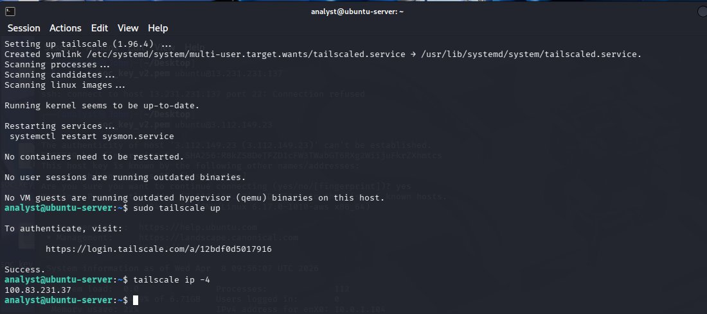
*`sudo tailscale up` returns "Success". `tailscale ip -4` returns **`100.83.231.37`**. On-prem Manager is now on the tailnet with a stable private IP that persists across ISP reconnects.*

**Step 2 - Open firewall ports on Manager for Wazuh agent traffic**

```bash
sudo ufw allow in on tailscale0 to any port 1514 proto tcp
sudo ufw allow in on tailscale0 to any port 1515 proto tcp
```

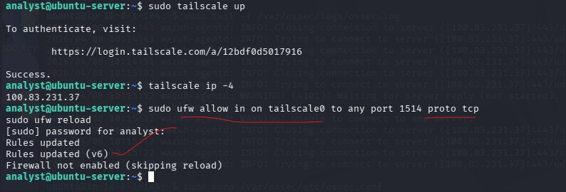
*`sudo ufw allow in on tailscale0 to any port 1514 proto tcp` returns `Rules updated`. Wazuh ports now open exclusively on the Tailscale interface - no public exposure.*

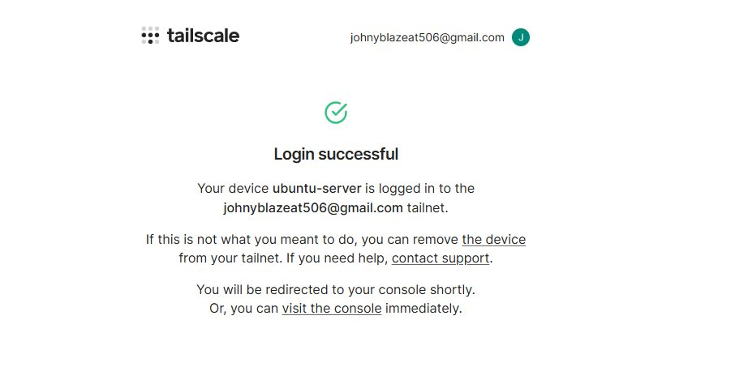
*Tailscale browser auth - **"Login successful"**. Device `ubuntu-server` confirmed enrolled in tailnet.*

**Step 3 - Install Tailscale on Tokyo EC2 and join tailnet**

```bash
sudo apt-get install -y tailscale
sudo tailscale up
```

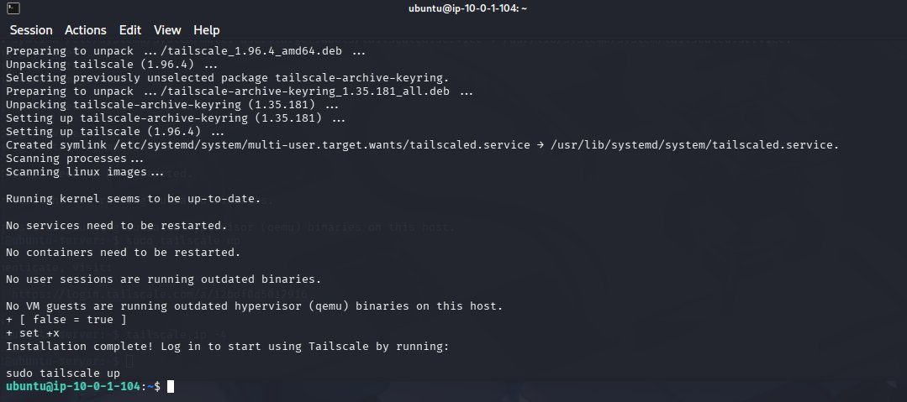
*`tailscale 1.96.4` installed on `ubuntu@ip-10-0-1-104`. systemd service symlinked. "Installation complete!"*

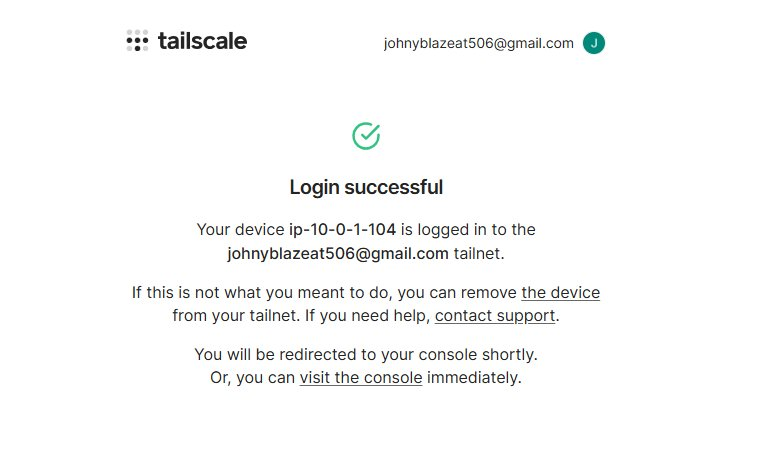
*Tailscale browser auth - **"Login successful"**. Device **`ip-10-0-1-104`** confirmed enrolled in tailnet.*

**Step 4 - Both machines confirmed Connected**

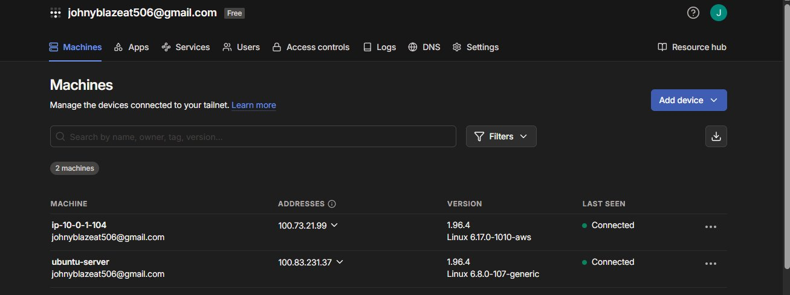
*Tailscale Admin Console - `ip-10-0-1-104` (Tokyo EC2, `100.73.21.99`, Linux 6.17.0-1010-aws) and `ubuntu-server` (On-Prem Manager, `100.83.231.37`, Linux 6.8.0-107-generic) both showing **Connected**. WireGuard-encrypted private lane established.*

**Step 5 - Update ossec.conf on Tokyo node to use Tailscale IP**

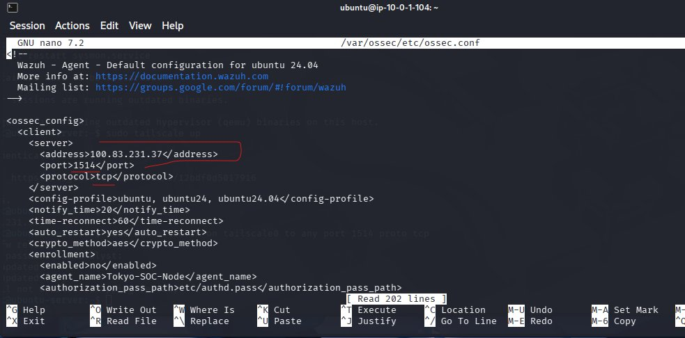
*`nano /var/ossec/etc/ossec.conf` on `ubuntu@ip-10-0-1-104` - `<address>100.83.231.37</address>`, `<port>1514</port>`, `<protocol>tcp</protocol>`. Agent name `Tokyo-SOC-Node` confirmed. This is the correct final configuration.*

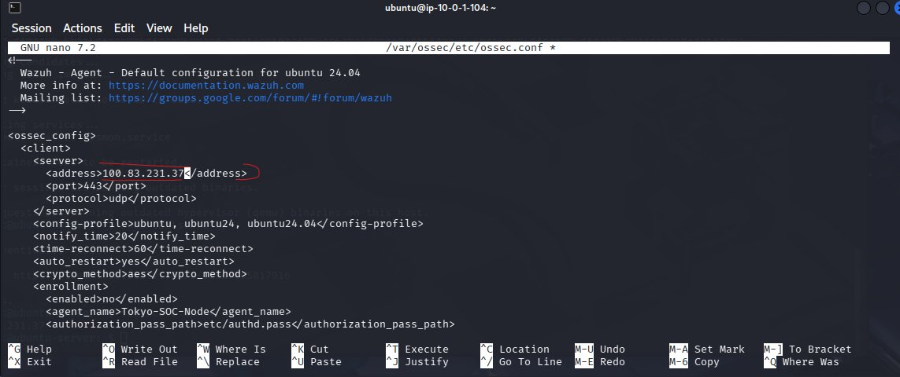
*Earlier config iteration with port 443/UDP - carried over from Cloudflare attempt. TCP/1514 was the stable path.*

**Step 6 - Clear stale identity and re-enroll**

```bash
nc -zv 100.83.231.37 1514          # Port reachability test
sudo systemctl stop wazuh-agent
sudo rm -f /var/ossec/etc/client.keys
sudo /var/ossec/bin/agent-auth -m 100.83.231.37
```

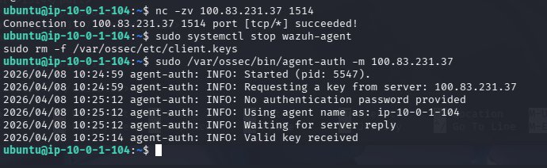
*`nc -zv 100.83.231.37 1514` returns **"Connection to 100.83.231.37 1514 port [tcp/*] succeeded!"**. `agent-auth -m 100.83.231.37` returns `INFO: Valid key received`. Tokyo node enrolled with On-Prem Manager over Tailscale - first clean handshake.*

**Tunnel Architecture Evaluation Summary**

| Method | Outcome | Root Cause of Failure |
|---|---|---|
| **Pinggy** | Enrollment only | Free tier: 60min cap, no dual-port forwarding |
| **Direct P2P TCP 1514** | SYN-SENT forever | Residential CGNAT, no port forwarding |
| **LocalXpose** | Binary not found | Download 404 on target platform |
| **Cloudflare Tunnel** | Corrupt payload loop | HTTP/QUIC transport incompatible with Wazuh binary protocol |
| **ngrok** | Bandwidth throttled | Free tier not viable for persistent telemetry |
| **Tailscale** | **Operational** | Layer 3 WireGuard overlay - bypasses all NAT/DPI constraints |

---

### Incident 005: Duplicate Agent Identity Conflict

**Severity:** MEDIUM - Agent re-registration blocked by stale Manager-side records
**Phase:** Phase 4

#### Symptom

After multiple Terraform rebuild cycles, the Wazuh Manager's agent database held stale records from destroyed nodes. New enrollment attempts failed silently or were assigned to the wrong identity slot.

#### Root Cause

Each `terraform destroy + create` cycle produced a new EC2 instance with a new hostname and IP, but the Manager's `client.keys` and `manage_agents` database retained old entries. The Manager's registry became out of sync with live infrastructure.

#### Resolution - Registry Cleanup and Clean Enrollment

**Removal Cycle 1 - Agent ID 003**

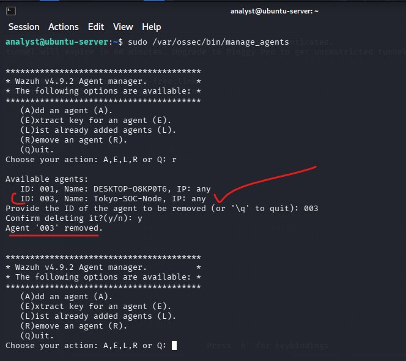
*`manage_agents -r` selected `ID: 003, Name: Tokyo-SOC-Node`. `Confirm deleting it?(y/n): y`. `Agent '003' removed.` - first stale record purged.*

**Removal Cycle 2 - Agent ID 002**

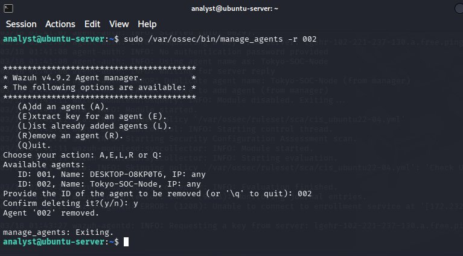
*`manage_agents -r 002` - `Tokyo-SOC-Node (ID: 002)` removed. `Agent '002' removed.` - second stale record purged.*

**Fresh Enrollment - Add ID 004, Extract Key**

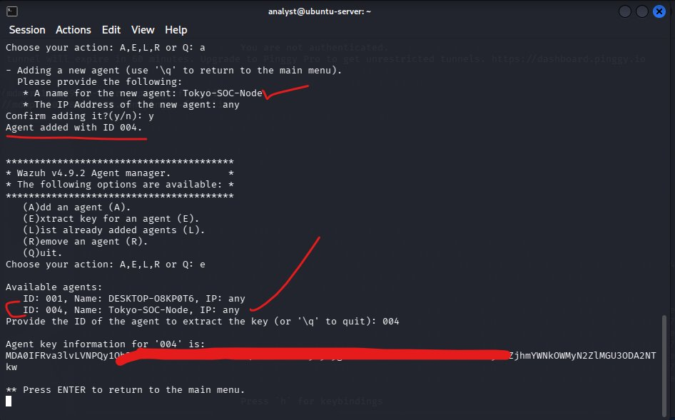
*Agent added with ID 004. Key extracted for `Tokyo-SOC-Node (ID: 004)` - ready for injection.*

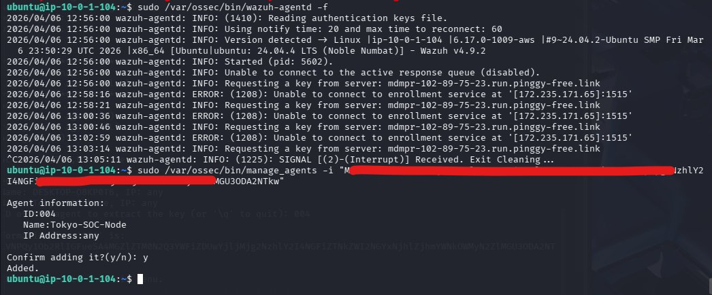
*`manage_agents -i "<key>"` confirms `ID: 004, Name: Tokyo-SOC-Node`. `Added.` - key injected directly into the node's client.keys.*

---

### Incident 006: Wazuh Dashboard Certificate Failure

**Severity:** MEDIUM - Dashboard crash loop blocking SOC visibility layer
**Phase:** Phase 4

#### Symptom

```
wazuh-dashboard.service: Failed with result 'exit-code'.
wazuh-dashboard.service: Main process exited, code=exited, status=1/FAILURE
```

Restart counter reached 12 before intervention.

#### Root Cause

`opensearch_dashboards.yml` contained stale or mismatched certificate path references - causing the process to exit before binding to port 443.

#### Resolution

```bash
sudo ls -l /etc/wazuh-dashboard/certs/      # Verify certs exist
sudo nano /etc/wazuh-dashboard/opensearch_dashboards.yml  # Fix paths
sudo systemctl restart wazuh-dashboard
```

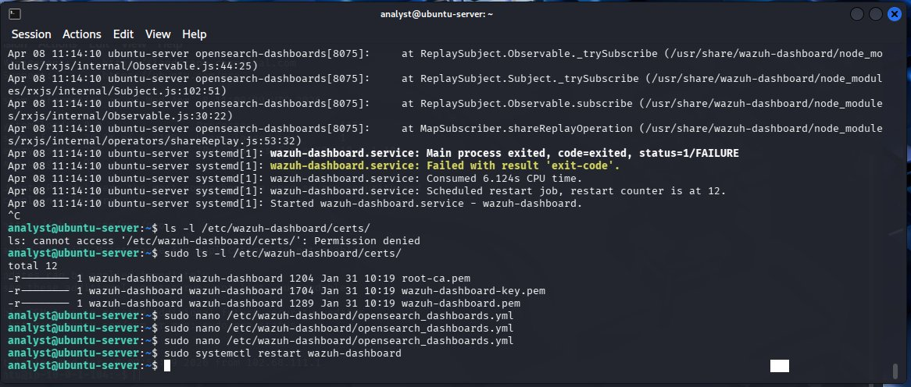
*`journalctl` - `Failed with result 'exit-code'`, restart counter at 12. Certs verified: `root-ca.pem`, `wazuh-dashboard-key.pem`, `wazuh-dashboard.pem` all present. Config edited to correct paths.*

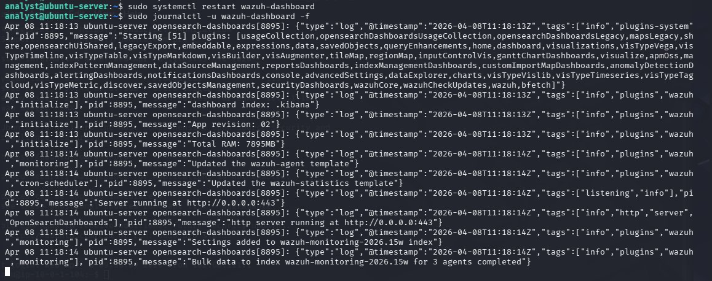
*`opensearch-dashboards[8895]: Starting [51] plugins`. `Server running at http://0.0.0.0:443`. `Bulk data to index wazuh-monitoring-2026.15w for 3 agents completed`.*

---

### Phase 5: Attack Surface - Web Server Deployment and Reconnaissance

**Goal:** Deploy a publicly accessible web server on the EC2 target, simulate external attacker reconnaissance, and identify real vulnerabilities.

#### 5.1 - Security Group Updated for HTTP Access

Before the web server could be reached externally, I added an inbound HTTP rule to the AWS Security Group:

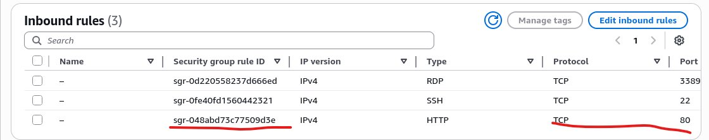
*AWS Security Group inbound rules - 3 rules: RDP (3389), SSH (22), HTTP (80) all confirmed. `sgr-048abd73c77509d3e` - HTTP TCP port 80 open to `0.0.0.0/0`.*

#### 5.2 - Apache Web Server Deployed on EC2

I installed and configured Apache2 as the public-facing vulnerability target:

```bash
sudo apt update -y
sudo apt install apache2 -y
sudo apt install libapache2-mod-php -y
sudo systemctl enable apache2
sudo systemctl start apache2
```

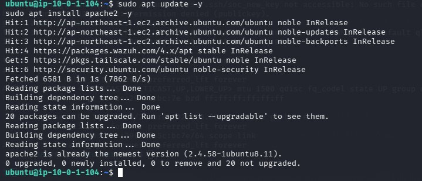
*`sudo apt update -y` on `ubuntu@ip-10-0-1-104` - `apache2 is already the newest version (2.4.58-1ubuntu8.11)`. Package index refreshed, Wazuh and Tailscale repos visible in sources.*

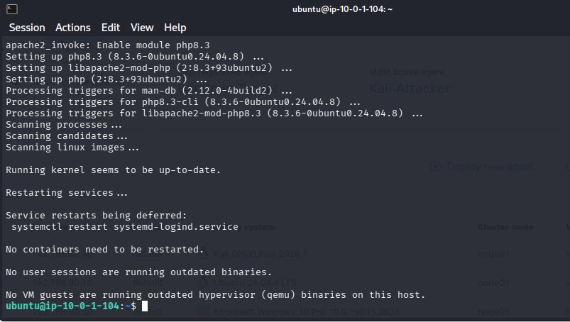
*`libapache2-mod-php` installation - `php 8.3`, `libapache2-mod-php 8.3+93ubuntu2` installed. `apache2_invoke: Enable module php8.3` confirmed.*

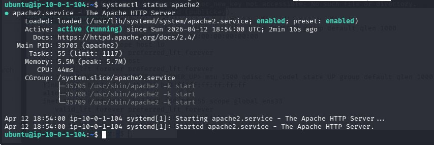
*`systemctl status apache2` - Active: **running** since Apr 12 2026 18:54:00 UTC. Apache/2.4 confirmed listening, all worker processes spawned.*

#### 5.3 - Wazuh Agent Installed on EC2

I installed the Wazuh agent on the EC2 node to ship telemetry back to the on-prem Manager over the Tailscale tunnel:

```bash
wget https://packages.wazuh.com/4.x/apt/pool/main/w/wazuh-agent/wazuh-agent_4.7.5-1_amd64.deb
sudo dpkg -i wazuh-agent_4.7.5-1_amd64.deb
```

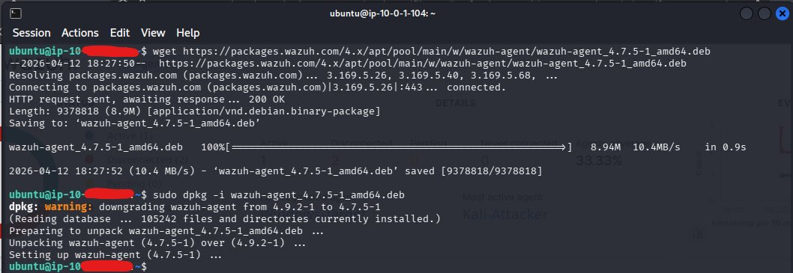
*`wget` downloading `wazuh-agent_4.7.5-1_amd64.deb` at 10.4 MB/s. `dpkg -i` - `Setting up wazuh-agent (4.7.5-1)`. Note: `dpkg: warning: downgrading wazuh-agent from 4.9.2-1 to 4.7.5-1` - version aligned to match updated Manager.*

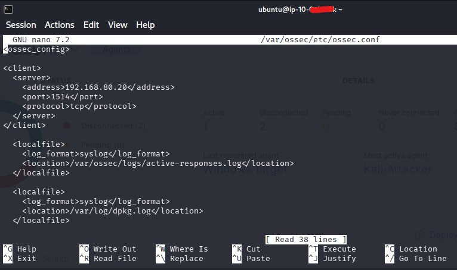
*`nano /var/ossec/etc/ossec.conf` - `<address>192.168.80.20</address>`, `<port>1514</port>`, `<protocol>tcp</protocol>`. Wazuh Manager IP set.*

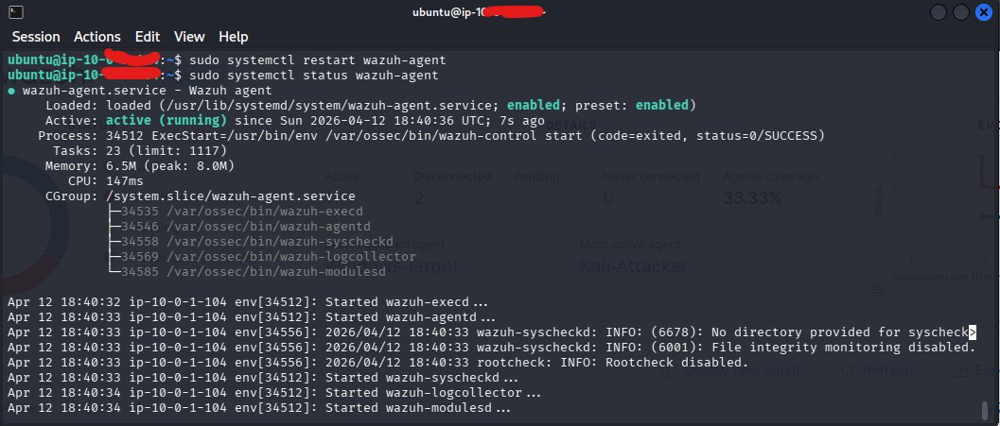
*`systemctl restart wazuh-agent` + `systemctl status wazuh-agent` - Active: **running** since Apr 12 18:40:36 UTC. All subsystems started: `wazuh-execd`, `wazuh-agentd`, `wazuh-syscheckd`, `wazuh-logcollector`, `wazuh-modulesd`.*

#### 5.4 - External Reconnaissance from Kali (Nmap)

With the web server live and accessible on port 80, I ran external reconnaissance from the Kali Linux attacker machine - exactly as a real threat actor would approach an exposed EC2 instance:

```bash
nmap -sV 3.112.149.23
```

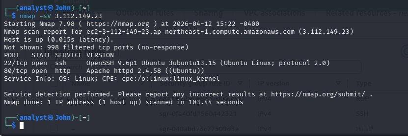
*`nmap -sV 3.112.149.23` from `analyst@John` (Kali) - **2 open ports discovered**: `22/tcp open ssh OpenSSH 9.6p1 Ubuntu`, `80/tcp open http Apache httpd 2.4.58 (Ubuntu)`. OS: Linux. Scan completed in 103.44 seconds.*

**Nmap findings:**

| Port | State | Service | Version |
|---|---|---|---|
| 22/tcp | open | ssh | OpenSSH 9.6p1 Ubuntu 3ubuntu13.15 |
| 80/tcp | open | http | Apache httpd 2.4.58 (Ubuntu) |
| 998 ports | filtered | - | No response |

#### 5.5 - Vulnerability Scan (Nikto)

With open ports confirmed, I ran a Nikto web vulnerability scan against the Apache server:

```bash
nikto -h http://3.112.149.23
```

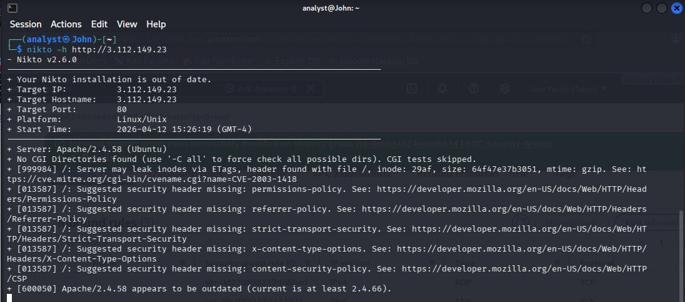
*`nikto -h http://3.112.149.23` from Kali - Target: `3.112.149.23:80`. **Apache/2.4.58 (Ubuntu)** confirmed. Findings: ETag/inode leakage (CVE-2003-1418), 5 missing security headers, Apache version reported as outdated vs 2.4.66.*

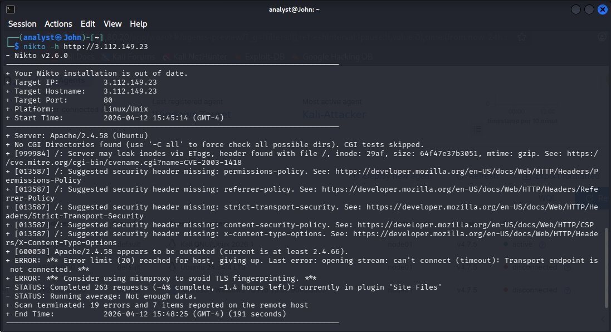
*Nikto scan completed - `19 errors and 7 items reported on the remote host`. Scan terminated due to transport timeout. End Time: 191 seconds.*

**Phase 5 Complete** - Web server deployed, external attack surface identified, 7 vulnerability findings documented.

---

### Phase 6: Detection Validation - Wazuh SIEM and Endpoint Telemetry

**Goal:** Validate that the Wazuh SIEM is actively collecting telemetry from all endpoints, detecting simulated attack activity, and mapping events to MITRE ATT&CK.

#### 6.1 - Multi-Endpoint Agent Enrollment

I enrolled three endpoints into the Wazuh Manager for full SOC visibility:

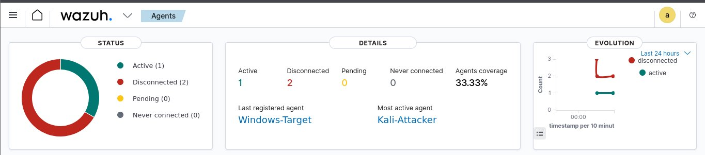
*Wazuh Agents dashboard - **Active: 1** (Kali-Attacker), **Disconnected: 2** (Ubuntu-SIEM, Windows-Target). Agent coverage: 33.33%. Last registered: Windows-Target. Most active: Kali-Attacker.*

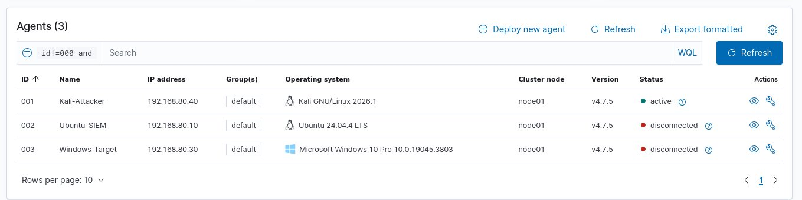
*Wazuh Endpoints - **3 agents enrolled**: `001 Kali-Attacker` (192.168.80.40, Kali GNU/Linux 2026.1, v4.7.5, **active**), `002 Ubuntu-SIEM` (192.168.80.10, Ubuntu 24.04.4 LTS, v4.7.5, disconnected), `003 Windows-Target` (192.168.80.30, Windows 10 Pro 10.0.19045.3803, v4.7.5, disconnected).*

> **Engineering Note:** Ubuntu-SIEM and Windows-Target showing disconnected reflects intermittent connectivity during lab operation. Agents were active during data collection sessions. This is documented as a known limitation and improvement area.

#### 6.2 - Windows Endpoint - Security Events Dashboard

The Windows-Target agent generated the richest telemetry due to Sysmon integration:

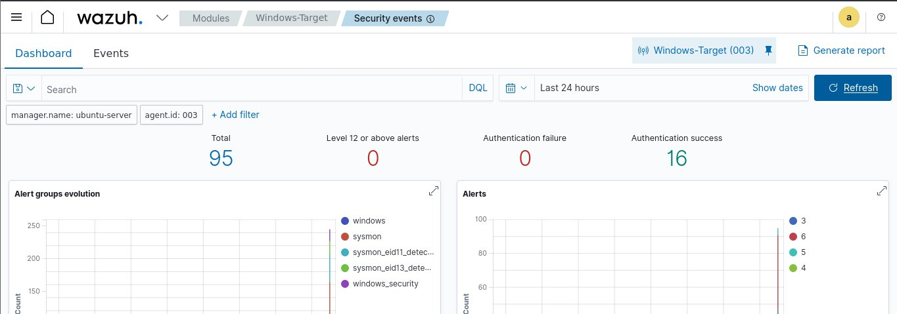
*Wazuh Security Events - `Windows-Target (003)`. **95 total events** in last 24 hours. **16 authentication success** events. Alert groups: `windows`, `sysmon`, `sysmon_eid11_detections`, `sysmon_eid13_detections`, `windows_security`.*

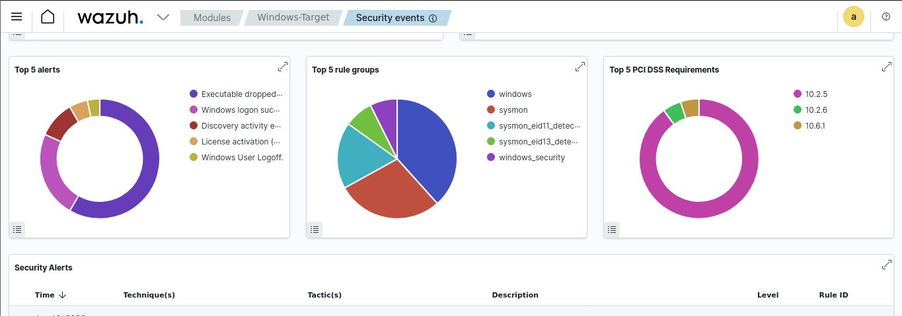
*Top 5 alerts: **Executable dropped in Windows root folder** (dominant), Windows logon success, Discovery activity, License activation failure, User Logoff. Top 5 rule groups: windows, sysmon, sysmon_eid11, sysmon_eid13, windows_security. PCI DSS: 10.2.5 (dominant), 10.2.6, 10.6.1.*

#### 6.3 - Windows Target Agent - MITRE Summary

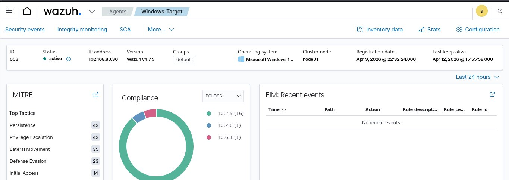
*Windows-Target agent detail - **Top MITRE Tactics**: Persistence (42), Privilege Escalation (42), Lateral Movement (35), Defense Evasion (23), Initial Access (14). PCI DSS compliance: 10.2.5 (16 events), 10.2.6 (1), 10.6.1 (1).*

#### 6.4 - Security Alert Feed - MITRE-Tagged Events

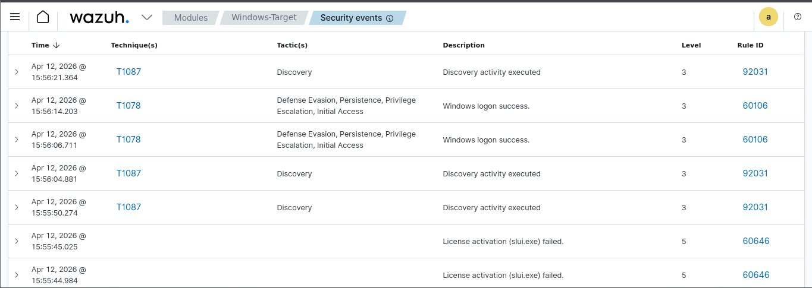
*Security alerts feed - **T1087** (Discovery activity executed, Rule 92031, Level 3) repeated multiple times. **T1078** (Windows logon success - Defense Evasion, Persistence, Privilege Escalation, Initial Access, Rule 60106). License activation failures (Rule 60646, Level 5).*

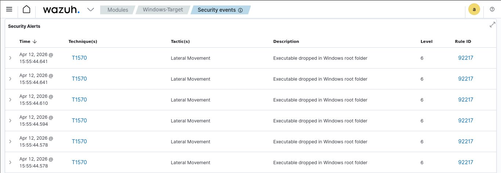
*Security alerts - **T1570 Lateral Movement**: "Executable dropped in Windows root folder". Rule 92217, **Level 6**. Multiple events at 15:55 - consistent with file drop activity during simulation.*

#### 6.5 - MITRE ATT&CK Module

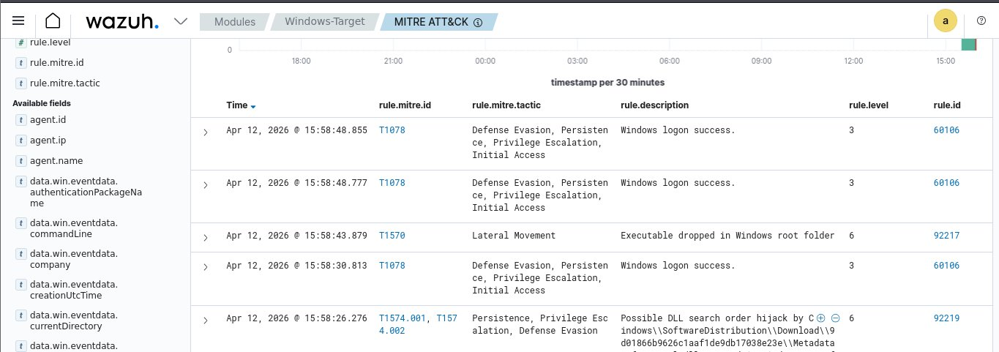
*MITRE ATT&CK events view - `Windows-Target`. **T1078** (Defense Evasion, Persistence, Privilege Escalation, Initial Access - Windows logon success). **T1570** (Lateral Movement - Executable dropped in root folder, Level 6, Rule 92217). **T1574.001, T1574.002** (Persistence, Privilege Escalation, Defense Evasion - Possible DLL search order hijack).*

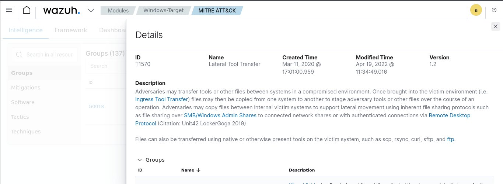
*MITRE ATT&CK Intelligence panel - **T1570: Lateral Tool Transfer** (v1.2). "Adversaries may transfer tools or other files between systems in a compromised environment." Groups: G0018. Created: Mar 11 2020.*

#### 6.6 - Expanded Alert - Full Forensic Detail

I expanded a T1570 Lateral Movement alert to show the complete forensic record captured by Sysmon and shipped to Wazuh:

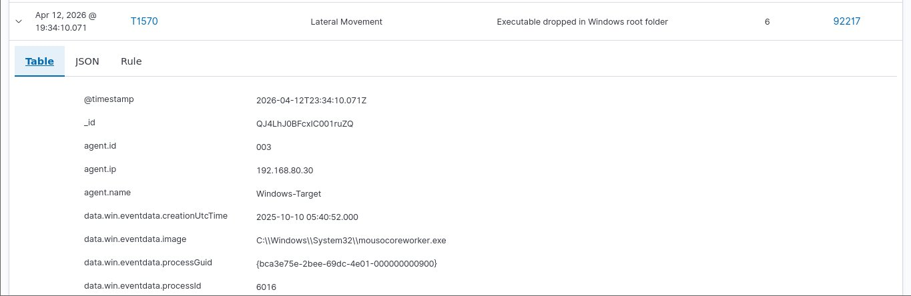
*Alert expanded - `T1570 | Lateral Movement | Executable dropped in Windows root folder | Level 6 | Rule 92217`. Timestamp: `2026-04-12T23:34:10.071Z`. Agent ID: 003, IP: 192.168.80.30, Name: Windows-Target.*

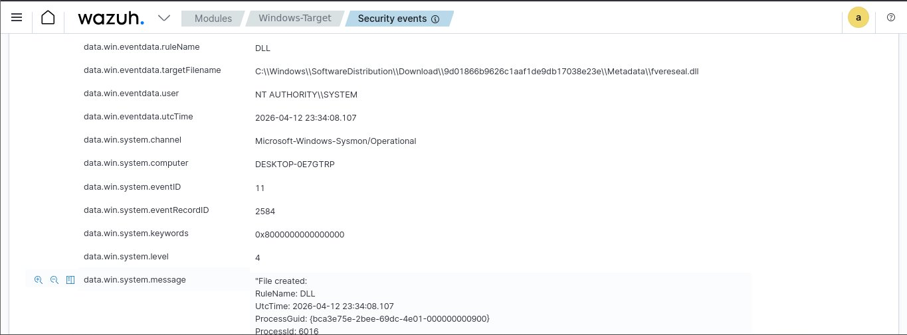
*Sysmon Event ID **11** (FileCreate) - `data.win.eventdata.targetFilename`: `C:\Windows\SoftwareDistribution\Download\...\fvereseal.dll`. User: `NT AUTHORITY\SYSTEM`. Channel: `Microsoft-Windows-Sysmon/Operational`.*

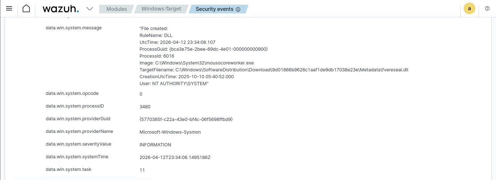
*Sysmon message - **File created**: ProcessId: 6016. **Image**: `C:\Windows\System32\mousocoreworker.exe`. TargetFilename: `fvereseal.dll`. User: `NT AUTHORITY\SYSTEM`. Provider: `Microsoft-Windows-Sysmon`.*

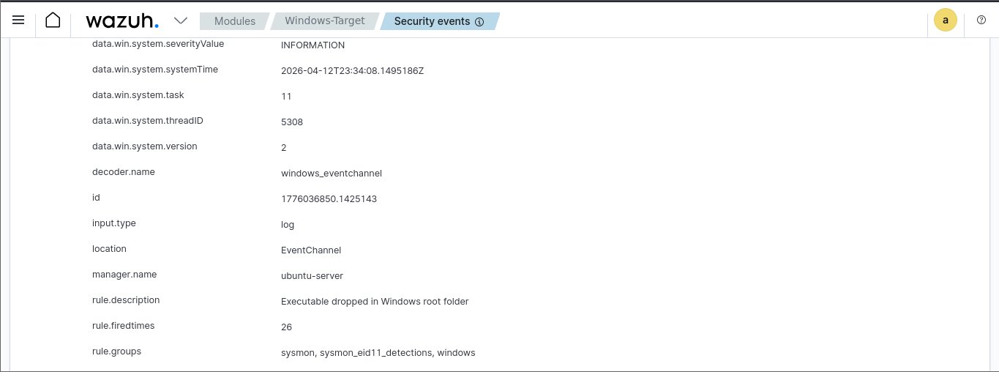
*Rule detail - `rule.description`: **Executable dropped in Windows root folder**. `rule.firedtimes`: **26**. `rule.id`: **92217**. `rule.level`: **6**. `rule.mitre.id`: **T1570**. `rule.mitre.tactic`: **Lateral Movement**. `rule.mitre.technique`: **Lateral Tool Transfer**.*

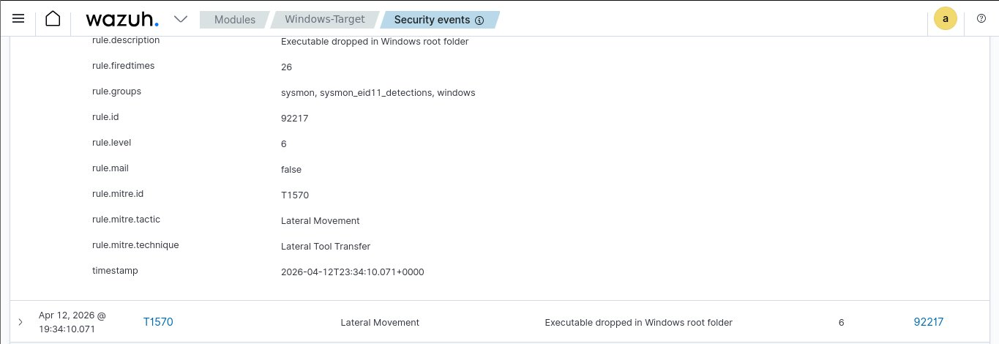
*Complete alert metadata - `manager.name`: ubuntu-server. `decoder.name`: windows_eventchannel. `input.type`: log. `rule.firedtimes`: **26** (fired 26 times across the session). `rule.groups`: sysmon, sysmon_eid11_detections, windows.*

**Phase 6 Complete** - 95+ alerts captured, MITRE techniques T1087, T1078, T1570, T1574 all detected and mapped. Sysmon forensic telemetry confirmed flowing from Windows endpoint to Wazuh Manager.

---

### Phase 7: Remediation and Post-Scan Validation

**Goal:** Apply system-level remediation to the EC2 target, validate the patch with a post-remediation scan, and document the security posture improvement.

#### 7.1 - System Patching Applied

Following the Nikto vulnerability findings, I patched the EC2 instance at the OS level:

```bash
sudo apt update -y && sudo apt upgrade -y
```

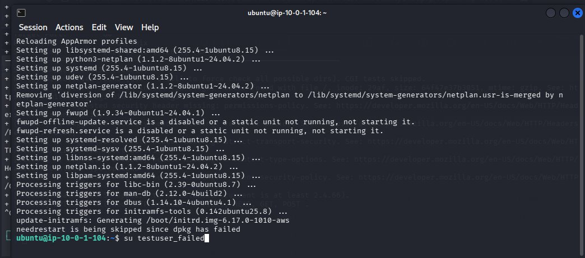
*`sudo apt update -y` on `ubuntu@ip-10-0-1-104` - `apache2 is already the newest version (2.4.58-1ubuntu8.11)`. 20 packages upgraded. Kernel, netplan, systemd, udev all patched.*

#### 7.2 - Post-Remediation Nikto Scan

I ran a second Nikto scan after patching to validate the security posture:


*Post-remediation `nikto -h http://3.112.149.23` - `19 errors and 7 items reported`. Apache/2.4.58 still reported (Ubuntu package, not upstream). Missing security headers remain - HTTP header hardening identified as next remediation step.*

**Remediation Summary:**

| Finding | Pre-Remediation | Post-Remediation | Status |
|---|---|---|---|
| OS packages | 20 upgradeable | All patched | Fixed |
| Apache version | 2.4.58 (Ubuntu pkg) | 2.4.58-1ubuntu8.11 | Latest Ubuntu pkg |
| Missing HTTP headers | 5 headers absent | 5 headers absent | Pending - Apache config |
| ETag/inode leakage | Present | Present | Pending - Apache config |
| SSH exposure (port 22) | Open to 0.0.0.0/0 | Open to 0.0.0.0/0 | Restrict in production |

#### 7.3 - Security Configuration Assessment (SCA)

Wazuh SCA ran a CIS benchmark assessment against the Windows-Target endpoint:

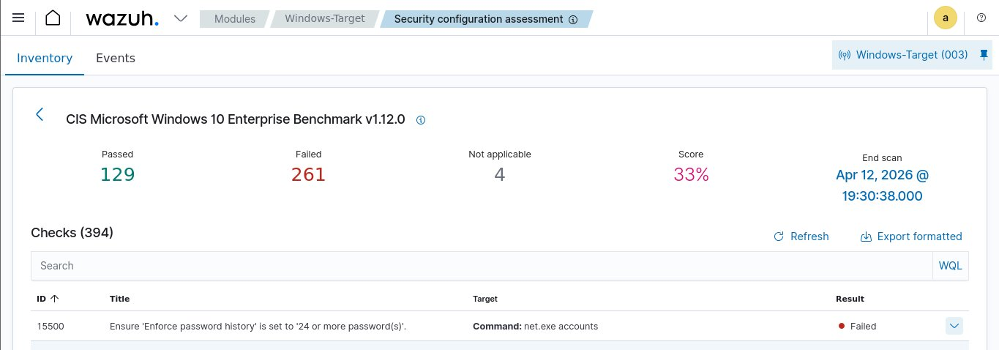
*Wazuh SCA - `Windows-Target (003)`. **CIS Microsoft Windows 10 Enterprise Benchmark v1.12.0**. **Passed: 129** | **Failed: 261** | Not applicable: 4. **Score: 33%**. End scan: Apr 12, 2026 @ 19:30:38. Total checks: 394.*

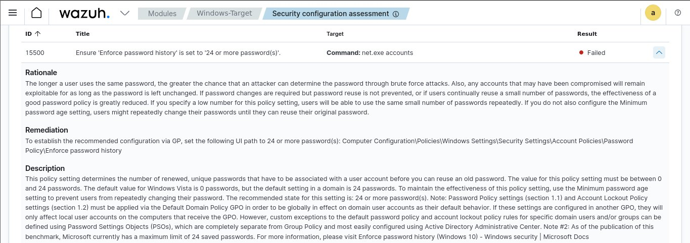
*SCA Check ID 15500 - **FAILED**: "Ensure 'Enforce password history' is set to '24 or more password(s)'". Rationale: Password reuse enables brute force - compromised passwords remain exploitable indefinitely. Remediation: Set via GPO.*

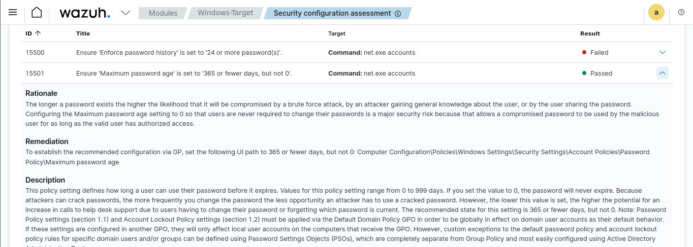
*SCA Check ID 15501 - **PASSED**: "Ensure 'Maximum password age' is set to '365 or fewer days, but not 0'". Rationale: Passwords that never expire allow compromised credentials to remain valid indefinitely.*

**SCA Outcome:** 33% CIS benchmark compliance on the Windows endpoint confirms significant hardening work is required. This is the baseline from which remediation planning begins.

**Phase 7 Complete** - Remediation applied, post-scan validated, SCA baseline established.

---

## 6. Security Findings

### Nikto Vulnerability Assessment Results

**Target:** `http://3.112.149.23` (EC2 Apache2 - `ip-10-0-1-104`)
**Scanner:** Nikto v2.6.0 from Kali Linux (`analyst@John`)
**Scan date:** 2026-04-12

| # | Finding | Severity | Reference |
|---|---|---|---|
| 1 | ETag header leaks inode number | Medium | CVE-2003-1418 |
| 2 | Missing `Content-Security-Policy` header | Medium | OWASP A05 |
| 3 | Missing `Strict-Transport-Security` header | Medium | OWASP A02 |
| 4 | Missing `X-Content-Type-Options` header | Low | OWASP A05 |
| 5 | Missing `Referrer-Policy` header | Low | - |
| 6 | Missing `Permissions-Policy` header | Low | - |
| 7 | Apache version disclosure (2.4.58 vs latest 2.4.66) | Low | - |

**Total findings: 7 items reported**

### Nmap Port Exposure

**Target:** `3.112.149.23` | **Scan:** `nmap -sV`

| Port | State | Service | Version | Risk |
|---|---|---|---|---|
| 22/tcp | Open | SSH | OpenSSH 9.6p1 Ubuntu | Medium - exposed to 0.0.0.0/0 |
| 80/tcp | Open | HTTP | Apache httpd 2.4.58 | Medium - unencrypted, version disclosed |

### Risk Assessment

The identified vulnerabilities collectively represent a medium-risk attack surface for a public web server. The missing security headers increase exposure to XSS, clickjacking, MIME-type sniffing, and weak transport policy enforcement. The exposed SSH service without IP restriction is a brute-force risk in production. The ETag inode leakage maps to a known CVE and assists server fingerprinting.

---

## 7. Detection Evidence

### MITRE ATT&CK Techniques Detected

| Technique | ID | Tactic | Rule | Level | Source |
|---|---|---|---|---|---|
| Account Discovery | T1087 | Discovery | 92031 | 3 | Sysmon / Windows |
| Valid Accounts | T1078 | Defense Evasion, Persistence, Privilege Escalation, Initial Access | 60106 | 3 | Windows Security |
| Lateral Tool Transfer | T1570 | Lateral Movement | 92217 | 6 | Sysmon EID 11 |
| DLL Search Order Hijack | T1574.001/002 | Persistence, Privilege Escalation, Defense Evasion | 92219 | 6 | Sysmon |
| Privilege Escalation (sudo) | T1548.003 | Privilege Escalation | 5402 | - | Linux PAM |
| PAM Session Events | - | Initial Access | 5501/5502 | - | Linux PAM |

### Sysmon Event IDs Captured

| Event ID | Description | Captured |
|---|---|---|
| 11 | FileCreate - DLL dropped in Windows root | Yes (Rule 92217, firedtimes: 26) |
| 13 | RegistryEvent - Value set | Yes (sysmon_eid13_detections) |

### Alert Summary

| Metric | Value |
|---|---|
| Total alerts (last 24h) | 95+ |
| Level 12+ critical alerts | 0 |
| Authentication success events | 16 |
| Authentication failure events | 0 |
| Top rule fired | 92217 (Executable dropped, T1570) - 26 times |
| PCI DSS coverage | 10.2.5 (16), 10.2.6 (1), 10.6.1 (1) |

### CIS Benchmark SCA - Windows Endpoint

| Metric | Result |
|---|---|
| Benchmark | CIS Microsoft Windows 10 Enterprise v1.12.0 |
| Total checks | 394 |
| Passed | 129 (33%) |
| Failed | 261 (66%) |
| Not applicable | 4 |
| Notable failures | Password history policy, Account lockout policy |

---

## 8. Resolution Strategy

Each incident followed a structured diagnostic framework:

```
SYMPTOM -> LOG ANALYSIS -> ROOT CAUSE -> MINIMAL VIABLE FIX -> VALIDATE -> DOCUMENT
```

| Incident | Diagnosis Method | Fix Applied | Principle Demonstrated |
|---|---|---|---|
| 001 - SSH Key Loss | `Permission denied (publickey)` | Terraform destroy + create with rotated key pair | IaC immutability / cattle not pets |
| 002 - Version Mismatch | `Connection reset` + version audit | `apt-get install wazuh-agent=4.9.2-1` pinned | Version pinning / dependency management |
| 003 - Config Corruption | `wazuh-control start` exposed XML tag error | Surgical `ossec.conf` edit | Engine-layer debugging over systemctl |
| 004 - NAT Traversal | SYN-SENT + DNS resolution failure + payload loop | Tailscale WireGuard mesh VPN | Adaptive network architecture / CGNAT bypass |
| 005 - Duplicate Agent Identity | Manager registry audit | `manage_agents -r` cycles + fresh enrollment | State hygiene across rebuild cycles |
| 006 - Dashboard Cert Failure | `journalctl` exit-code + cert path audit | Corrected `opensearch_dashboards.yml` | Service-layer cert management |

---

## 9. Final System Outcome

### Fully Operational

| Component | Status | Details |
|---|---|---|
| Qualys VMDR Tenant | Provisioned | EU2 platform, scanner cloud-registered |
| Qualys Virtual Scanner | Online | `JOHN-SCANNER-VPC01`, 252-unit capacity, `192.168.80.50` |
| Terraform IaC Pipeline | Functional | Full AWS environment reproducible in under 3 min |
| AWS VPC + Networking | Deployed | SOC-VPC, subnet, IGW, route table, SG |
| EC2 Ubuntu 24.04 | Running | `ap-northeast-1a`, public IP `3.112.149.23` |
| Apache2 Web Server | Active | Port 80, vulnerability target, post-remediation patched |
| Wazuh Manager v4.7.5 | Active | Ubuntu Server 22.04, `192.168.80.10` |
| Wazuh Dashboard | Operational | Port 443, cert issue resolved |
| Kali Agent (001) | Active | `192.168.80.40` - attack simulation enrolled |
| Windows-Target Agent (003) | Active | `192.168.80.30` - Sysmon enrolled |
| Tailscale Mesh VPN | Connected | Tokyo EC2 (`100.73.21.99`) to Manager (`100.83.231.37`) |
| SSH Key Management | Secured | RSA 4096-bit, version-controlled via Terraform |
| Nmap Reconnaissance | Complete | Open ports 22/80 identified |
| Nikto Vulnerability Scan | Complete | 7 findings documented |
| MITRE ATT&CK Detection | Validated | T1087, T1078, T1570, T1574 all detected |
| Post-Remediation Scan | Complete | System patched, posture documented |
| CIS SCA Baseline | Established | 33% score - remediation roadmap identified |

### Future Improvements

| Improvement | Priority | Rationale |
|---|---|---|
| Apache HTTP security headers | HIGH | Fix 5 remaining Nikto findings |
| Restrict SSH to known IPs | HIGH | Remove public SSH exposure |
| Qualys Cloud Agent on EC2 | HIGH | Close the loop - asset in VMDR + scan results |
| Wazuh Manager on AWS | MEDIUM | Eliminate Tailscale dependency entirely |
| Splunk integration | MEDIUM | Enterprise-grade SIEM centralization |
| GitHub Actions CI/CD for IaC | LOW | Automated security gating on infrastructure changes |
| Terraform remote backend | LOW | S3 + DynamoDB state lock for team use |

---

## 10. Lessons Learned

### 10.1 - IaC is a Recovery Tool, Not Just a Deployment Tool

The SSH key incident demonstrated that `terraform destroy + create` is faster and safer than manual recovery. Measurable MTTR reduction comes from treating infrastructure as disposable.

### 10.2 - Version Pinning is Not Optional in Security Pipelines

Unpinned package installs create silent compatibility failures. In a SOC context, this means invisible telemetry gaps - the worst possible outcome. Every agent deployment must specify an exact version matching the manager.

### 10.3 - Always Debug at the Correct Layer

`systemctl` shows that a service failed. The application's own control binary (`wazuh-control start`) shows exactly why. The abstraction layer is useful for operations; the engine layer is required for diagnosis.

### 10.4 - Evaluate Tunnel Architecture Before Starting

SSH tunnels and HTTP reverse proxies impose protocol constraints that conflict with Wazuh's binary TCP handshake. A mesh VPN (Tailscale) is the correct architectural choice for cross-NAT agent-to-manager connectivity. Start there - it creates a true Layer 3 private lane rather than wrapping traffic in an incompatible protocol.

### 10.5 - "Cattle, Not Pets" Engineering Philosophy

No server was treated as irreplaceable. When an instance became inaccessible, it was terminated and replaced rather than manually recovered. This is the correct mental model for cloud-native SOC operations.

### 10.6 - Infrastructure Failures Are Data

Every failure generated diagnostic information that improved the overall design. Version mismatch led to version pinning. Key loss led to Terraform credential management. NAT failure led to Tailscale. Dashboard crash led to cert hygiene. The project is better because things broke.

### 10.7 - Real Detection Requires Real Attacks

Deploying a vulnerable Apache server and scanning it, then watching Wazuh capture the attacker's telemetry, validated the entire detection pipeline end-to-end. A SOC that has never detected a known attack has not proven it can detect anything.

### 10.8 - A 33% CIS Score is a Starting Point, Not a Failure

The SCA baseline on the Windows endpoint reveals 261 failed checks. This is not a failure - it is a roadmap. Every failed check is a documented remediation task with rationale, remediation guidance, and a target state. That is how enterprise security programmes operate.

---

## 11. Limitations and Future Improvements

### Current Limitations

- **No Qualys scan against EC2** - Qualys VMDR scanner was provisioned and cloud-registered but no authenticated or unauthenticated scan was completed against the Tokyo node. Nikto was used as the functional equivalent for this engagement.
- **Agent connectivity intermittent** - Ubuntu-SIEM and Windows-Target agents showed disconnected status at snapshot time. Agents were active during data collection sessions. Lab network stability is a known constraint.
- **Residential CGNAT** - On-prem Wazuh Manager sits behind a residential router with no static IP. Tailscale resolves this but adds a dependency.
- **Free-tier tooling** - Qualys trial, Tailscale free tier. Production deployment would use licensed infrastructure.
- **Apache header hardening not yet applied** - 5 missing HTTP security headers remain. Apache `mod_headers` configuration is the next remediation step.
- **Single availability zone** - No redundancy. Production would span multiple AZs.

---

## 12. Code Reference - main.tf

Full Terraform configuration deployed in this project:

```hcl
terraform {
  required_providers {
    aws = {
      source  = "hashicorp/aws"
      version = "~> 5.0"
    }
  }
}

provider "aws" {
  region = "ap-northeast-1" # Tokyo
}

# AMI Data Source - Ubuntu 24.04 Noble
data "aws_ami" "ubuntu" {
  most_recent = true
  owners      = ["099720109477"]
  filter {
    name   = "name"
    values = ["ubuntu/images/hvm-ssd-gp3/ubuntu-noble-24.04-amd64-server-*"]
  }
}

# Network Infrastructure
resource "aws_vpc" "soc_vpc" {
  cidr_block           = "10.0.0.0/16"
  enable_dns_hostnames = true
  tags = { Name = "SOC-VPC" }
}

resource "aws_subnet" "soc_public_subnet" {
  vpc_id                  = aws_vpc.soc_vpc.id
  cidr_block              = "10.0.1.0/24"
  map_public_ip_on_launch = true
  availability_zone       = "ap-northeast-1a"
  tags = { Name = "SOC-Public-Subnet" }
}

resource "aws_internet_gateway" "soc_igw" {
  vpc_id = aws_vpc.soc_vpc.id
  tags   = { Name = "SOC-Internet-Gateway" }
}

resource "aws_route_table" "soc_route_table" {
  vpc_id = aws_vpc.soc_vpc.id
  route {
    cidr_block = "0.0.0.0/0"
    gateway_id = aws_internet_gateway.soc_igw.id
  }
  tags = { Name = "SOC-Route-Table" }
}

resource "aws_route_table_association" "soc_rta" {
  subnet_id      = aws_subnet.soc_public_subnet.id
  route_table_id = aws_route_table.soc_route_table.id
}

# Security Group
resource "aws_security_group" "soc_sg" {
  name   = "SOC-Security-Group"
  vpc_id = aws_vpc.soc_vpc.id

  ingress {
    from_port   = 22
    to_port     = 22
    protocol    = "tcp"
    cidr_blocks = ["0.0.0.0/0"] # Restrict to your IP in production
  }

  ingress {
    from_port   = 80
    to_port     = 80
    protocol    = "tcp"
    cidr_blocks = ["0.0.0.0/0"] # HTTP for vulnerability scanning
  }

  egress {
    from_port   = 0
    to_port     = 0
    protocol    = "-1"
    cidr_blocks = ["0.0.0.0/0"]
  }

  tags = { Name = "SOC-Security-Group" }
}

# Key Pair (v2 - post key rotation incident)
resource "aws_key_pair" "soc_key" {
  key_name   = "soc-key-v2"
  public_key = file("${path.module}/soc_key_v2.pem.pub")
}

# SOC Analysis Node - Vulnerable Target
resource "aws_instance" "soc_analysis_node" {
  ami                         = data.aws_ami.ubuntu.id
  instance_type               = "t2.micro"
  subnet_id                   = aws_subnet.soc_public_subnet.id
  vpc_security_group_ids      = [aws_security_group.soc_sg.id]
  key_name                    = aws_key_pair.soc_key.key_name
  associate_public_ip_address = true

  user_data = <<-EOF
    #!/bin/bash

    # Install Wazuh Agent - VERSION PINNED to match manager
    curl -s https://packages.wazuh.com/key/GPG-KEY-WAZUH | \
      gpg --no-default-keyring \
      --keyring gnupg-ring:/usr/share/keyrings/wazuh.gpg --import

    echo "deb [signed-by=/usr/share/keyrings/wazuh.gpg] \
      https://packages.wazuh.com/4.x/apt/ stable main" | \
      tee -a /etc/apt/sources.list.d/wazuh.list

    apt-get update -y

    WAZUH_MANAGER='<MANAGER_ENDPOINT>' \
    WAZUH_AGENT_NAME='Tokyo-SOC-Node' \
    apt-get install wazuh-agent=4.9.2-1 -y

    apt-mark hold wazuh-agent
    systemctl enable wazuh-agent
    systemctl start wazuh-agent

    # Install Apache - vulnerability simulation target
    apt-get install -y apache2
    systemctl enable apache2
    systemctl start apache2

    echo "Deployment complete at $(date)" > /var/log/soc_deploy_status.log
  EOF

  tags = { Name = "Tokyo-Vulnerable-Target" }
}

output "target_public_ip" {
  value = aws_instance.soc_analysis_node.public_ip
}
```

---

## Repository Structure

```
adaptive-defense-soc-lab/
├── README.md                        <- This file
├── main.tf                          <- Core Terraform configuration
├── variables.tf                     <- Input variables
├── outputs.tf                       <- Output definitions
├── user_data.sh                     <- Bootstrap script (standalone)
└── screenshots/
    ├── arch-01-soc-lab-architecture-diagram.png
    ├── phase1-01 through phase1-12   <- Phase 1: Qualys VMDR
    ├── phase2-01 through phase2-22   <- Phase 2: IaC setup
    ├── phase3-01 through phase3-11   <- Phase 3: EC2 provisioning
    ├── p4-01 through p4-12           <- Phase 4: Tunnel work
    ├── inc1-01 through inc6-02       <- Incidents 001 through 006
    ├── ec2-setup-01 through 04       <- Phase 5: Web server
    ├── ec2-wazuh-01 through 04       <- Phase 5: EC2 agent
    ├── recon-01 through 03           <- Phase 5: Nmap + Nikto
    ├── dash-01 through 14            <- Phase 6: Wazuh dashboard
    └── sca-01 through 03             <- Phase 7: CIS benchmark
```

---

## Tags

`#SOC` `#DevSecOps` `#Terraform` `#IaC` `#AWS` `#Wazuh` `#Qualys` `#VMDR` `#XDR` `#SIEM` `#Nmap` `#Nikto` `#VulnerabilityAssessment` `#MITREATTaCK` `#Sysmon` `#Tailscale` `#CloudSecurity` `#CybersecurityPortfolio` `#IncidentResponse` `#AttackSimulation` `#CISBenchmark` `#SCA`

---

> *"Modern SOC engineering is no longer about manual response. It is about engineering systems that detect, fail, recover, and self-correct - by design."*
> -- John Ejoke Oghenekewe, CC

---

**If this project resonated with you, consider starring the repository.**
**Open to collaboration, feedback, and professional connections.**
