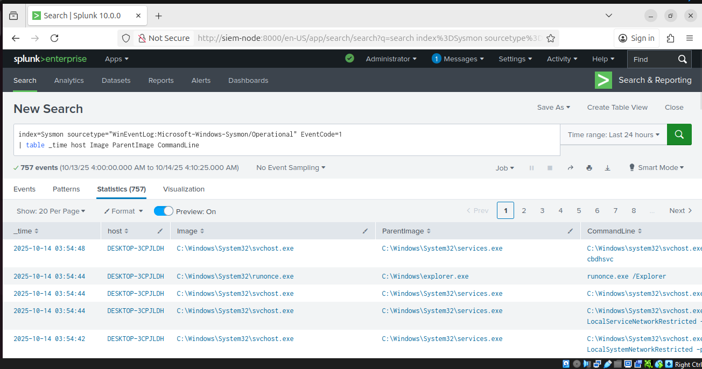
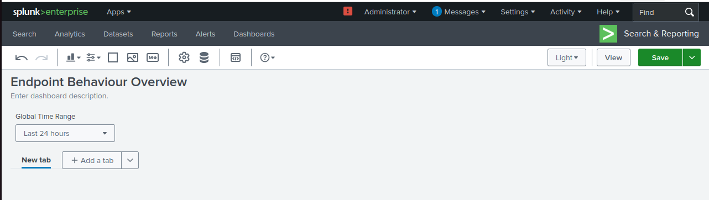
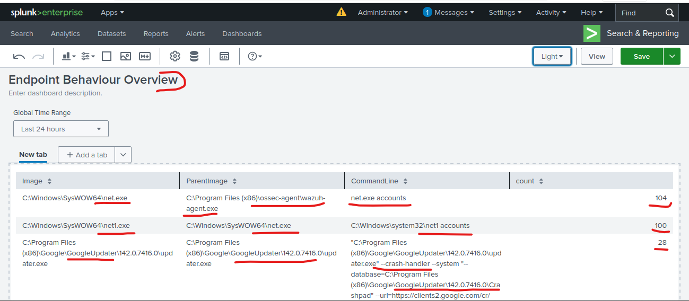
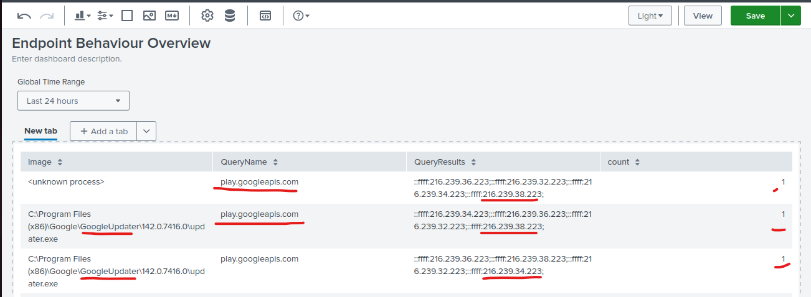
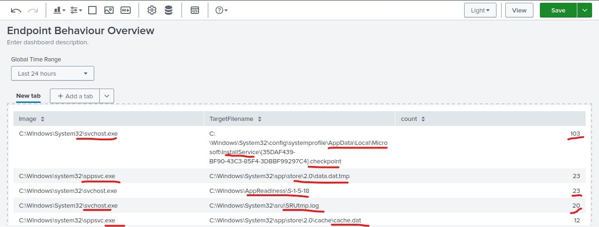
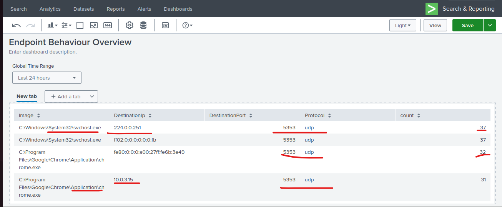
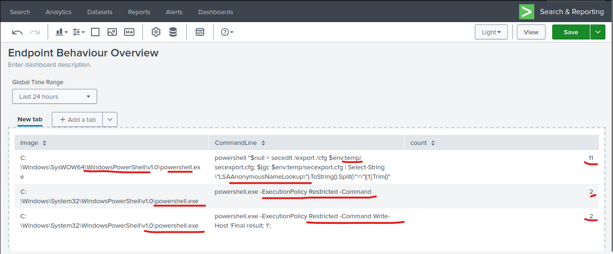
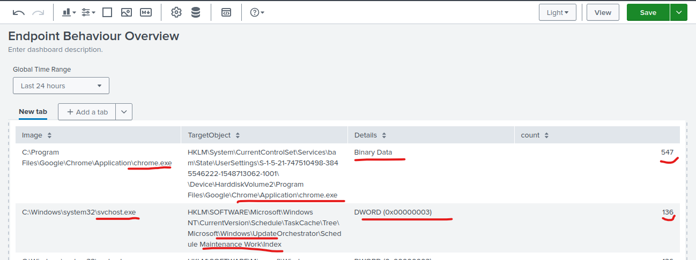

# Advanced Endpoint Telemetry with Splunk

**Leveraging Sysmon for Real-Time Threat Detection and Behavioral Analytics**

**Author:** Ejoke John | Cybersecurity Analyst
**LinkedIn:** [linkedin.com/in/john-ejoke](https://www.linkedin.com/in/john-ejoke/)
**Date:** August 2025

---

## Overview

This project builds directly on my earlier Splunk SIEM deployment and Universal Forwarder configuration. With the log forwarding pipeline already in place, I moved into the next phase: ingesting high-fidelity Sysmon telemetry, parsing key event types, and building a custom dashboard to surface endpoint behavior and detect anomalies across the lab environment.

The result is a six-panel "Endpoint Behaviour Overview" dashboard in Splunk Enterprise that covers process execution, DNS activity, registry changes, network connections, PowerShell usage, and file creation in sensitive paths. Each panel was built using SPL queries targeting specific Sysmon EventCodes, with findings mapped to relevant MITRE ATT&CK techniques.

---

## Environment

| Component | Platform | Role |
|---|---|---|
| Splunk Enterprise 10.0.0 | Ubuntu Server (siem-node) | Central SIEM: indexing, search, dashboards |
| Splunk Universal Forwarder | Windows Endpoint (DESKTOP-3CPJLDH) | Forwards Sysmon logs to Splunk |
| Sysmon | Windows Endpoint | Generates high-fidelity telemetry |
| SPL | Splunk | Query, correlate, and visualize event data |
| MITRE ATT&CK | Reference framework | Maps behaviors to known adversary techniques |

---

## Pipeline Verification

Before building the dashboard, I confirmed that Sysmon logs were successfully ingested into `index=sysmon`. I ran an initial query against EventCode=1 (process creation) and returned 757 events spanning a 24-hour window, with fields including `Image`, `ParentImage`, and `CommandLine` all resolving correctly.

```spl
index=Sysmon sourcetype="WinEventLog:Microsoft-Windows-Sysmon/Operational" EventCode=1
| table _time host Image ParentImage CommandLine
```

This validated the full pipeline from endpoint to SIEM and confirmed the field extraction was working before I moved into dashboard development.




---

## Dashboard: Endpoint Behaviour Overview

The dashboard was built inside Splunk's native dashboard editor with a global time range selector set to the last 24 hours. Each panel targets a distinct Sysmon EventCode and answers a specific detection question.




---

### Panel 1: Top Process Executions

**EventCode=1 — Process Creation**

```spl
index=Sysmon EventCode=1
| stats count by Image, ParentImage, CommandLine
| sort - count
```

This panel surfaces the most frequently executed binaries and their parent processes. It is the starting point for behavioral baseline analysis — understanding what is normal makes anomalies visible.



**Notable finding:** `net.exe` ran 104 times with `C:\Program Files (x86)\ossec-agent\wazuh-agent.exe` as the parent process, executing `net.exe accounts`. `net1.exe` followed immediately with 100 executions of `net1 accounts` under the same parent.

`net accounts` is a Windows command used to enumerate local account policies — password age, lockout thresholds, and similar configuration. While Wazuh (an open-source EDR/HIDS agent) does perform system enumeration as part of its monitoring activity, the volume here — over 200 executions in a 24-hour window — is worth flagging. In a real environment, this pattern would warrant investigation to confirm the behavior is expected from the agent version deployed, and to rule out a compromised agent or a process impersonating the Wazuh parent. This maps to **MITRE ATT&CK T1087 — Account Discovery**.

---

### Panel 2: DNS Queries by Process

**EventCode=22 — DNS Query**

```spl
index=Sysmon EventCode=22
| stats count by Image, QueryName, QueryResults
| sort - count
```

This panel identifies which processes are initiating DNS requests and what domains they are resolving. It provides visibility into potential command-and-control beaconing, suspicious lookups, or misconfigured services.



The results here showed `GoogleUpdater.exe` resolving `play.googleapis.com` multiple times, which is consistent with expected Google software update behavior. The presence of `<unknown process>` in one row is worth noting — Sysmon occasionally fails to capture the process name when the process terminates before the event is written. In a production environment, that gap would be investigated further.

---

### Panel 3: File Creations in Sensitive Paths

**EventCode=11 — File Created**

```spl
index=Sysmon EventCode=11
| stats count by Image, TargetFilename
| sort - count
```

This panel tracks files being written to disk, with a focus on sensitive or unusual paths. File creation in system directories, temp folders, or AppData locations is a common technique used in malware staging and persistence.



The top result showed `svchost.exe` writing 103 files to `C:\Windows\System32\config\systemprofile\AppData\Local\Microsoft\InstallService\` with a checkpoint extension. This is associated with the Windows Update Orchestrator and is expected behavior, but the volume and path pattern are exactly the kind of thing this panel is designed to surface for analyst review. Maps to **MITRE ATT&CK T1074 — Data Staged** when seen in malicious context.

---

### Panel 4: Network Connections by Process

**EventCode=3 — Network Connection**

```spl
index=Sysmon EventCode=3
| stats count by Image, DestinationIp, DestinationPort, Protocol
| sort - count
```

This panel reveals which processes are making outbound connections, the destination IPs and ports, and the protocol used. It supports detection of beaconing, data exfiltration, and unauthorized access attempts.



The dominant traffic was `svchost.exe` sending UDP to `224.0.0.251` on port 5353 — this is mDNS (multicast DNS), a normal Windows behavior for local network discovery. Chrome also appeared with UDP 5353 traffic to link-local addresses. Port 5353 UDP at this volume is baseline noise in a Windows lab environment. In a production alert rule, I would filter known-good mDNS sources before alerting on this pattern.

---

### Panel 5: PowerShell Usage and Encoded Commands

**EventCode=1 — Process Creation, filtered to powershell.exe**

```spl
index=Sysmon EventCode=1 Image=*powershell.exe*
| stats count by Image, CommandLine
| sort - count
```

PowerShell is one of the most abused native Windows tools. This panel isolates all PowerShell executions and captures the full command line, including any base64-encoded payloads or obfuscated arguments.



The top result showed `SysWOW64\WindowsPowerShell\v1.0\powershell.exe` executing a `secedit /export` command that exported local security policy and then parsed the `LSAAnonymousNameLookup` value from the output. This is a technique used to enumerate local security settings and check whether anonymous enumeration of SAM accounts is permitted. While Wazuh uses this for auditing, it is also a known reconnaissance technique. Maps to **MITRE ATT&CK T1012 — Query Registry** and **T1082 — System Information Discovery**.

---

### Panel 6: Registry Changes by Process

**EventCode=13 — Registry Value Set**

```spl
index=Sysmon EventCode=13
| stats count by Image, TargetObject, Details
| sort - count
```

Registry modifications are a primary persistence mechanism for malware. This panel tracks which processes are writing to the registry, which keys are being modified, and what values are being set.



The top result was `chrome.exe` writing Binary Data to a BAM (Background Activity Moderator) state key under `HKLM\System\CurrentControlSet\Services` — this is normal Chrome behavior related to execution tracking. `svchost.exe` was also writing DWORD values to the Windows Update Orchestrator TaskCache. Neither of these is inherently suspicious, but this panel would immediately surface a malicious process writing to `HKLM\Software\Microsoft\Windows\CurrentVersion\Run` or similar autorun locations. Maps to **MITRE ATT&CK T1547.001 — Registry Run Keys / Startup Folder** when used for persistence.

---

## Key Findings Summary

| Finding | EventCode | Potential Technique | Assessment |
|---|---|---|---|
| net.exe accounts (x104) under wazuh-agent | 1 | T1087 — Account Discovery | Investigate: volume is high for legitimate agent behavior |
| PowerShell secedit LSAAnonymousNameLookup export | 1 | T1082 — System Information Discovery | Monitor: consistent with Wazuh audit but worth baselining |
| svchost writing to AppData\InstallService | 11 | T1074 — Data Staged | Expected: Windows Update Orchestrator activity |
| Chrome + svchost UDP 5353 | 3 | N/A | Baseline mDNS — filter in alert rules |
| Unknown process DNS query | 22 | T1071 — Application Layer Protocol | Investigate: missing process name warrants follow-up |

---

## Key Learnings

Working through this project gave me hands-on experience with the full telemetry-to-detection pipeline. Writing SPL queries against real Sysmon data is different from working with sample datasets — the noise is real, and separating legitimate system behavior from actionable findings requires understanding both the tools generating the logs and the techniques attackers use.

The most valuable thing I took from this project is understanding how process lineage works in endpoint telemetry. Seeing `net.exe` under `wazuh-agent.exe` looks suspicious until you understand what Wazuh does — but at that volume, it still warrants confirmation. That is exactly the kind of judgment call a SOC analyst has to make, and building the tooling to surface those questions is the point.

Specific skills developed: SPL aggregation and sorting logic, Sysmon EventCode mapping, Splunk dashboard construction, MITRE ATT&CK technique alignment, and distinguishing baseline noise from detection-worthy behavior.

---

## MITRE ATT&CK Coverage

| Technique | ID | Panel |
|---|---|---|
| Account Discovery | T1087 | Top Process Executions |
| System Information Discovery | T1082 | PowerShell Usage |
| Query Registry | T1012 | PowerShell Usage |
| Data Staged | T1074 | File Creations in Sensitive Paths |
| Application Layer Protocol | T1071 | DNS Queries by Process |
| Registry Run Keys / Startup Folder | T1547.001 | Registry Changes by Process |

---

## SPL Query Reference

All queries used in this project are available in [`spl/endpoint_telemetry_queries.spl`](spl/endpoint_telemetry_queries.spl).

---

## Related Projects

- [SOC Home Lab Build & Documentation](https://github.com/john-ejoke/SOC_Operations/soc-home-lab-build) — Splunk deployment, Universal Forwarder configuration, and pipeline validation that this project builds on
- [SOC Incident Response Playbook — Emotet](https://github.com/john-ejoke/SOC_Operations/soc-incident-response-playbook-emotet) — Detection and response workflow for a real-world malware campaign
- [Splunk SIEM Threat Detection](https://github.com/john-ejoke/SOC_Operations/splunk-siem-threat-detection) — Broader SIEM detection work built on the same lab infrastructure
