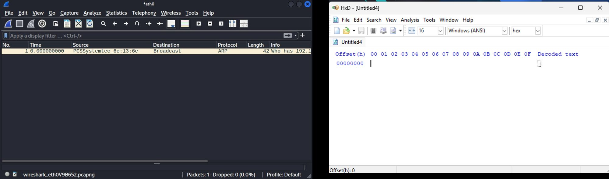
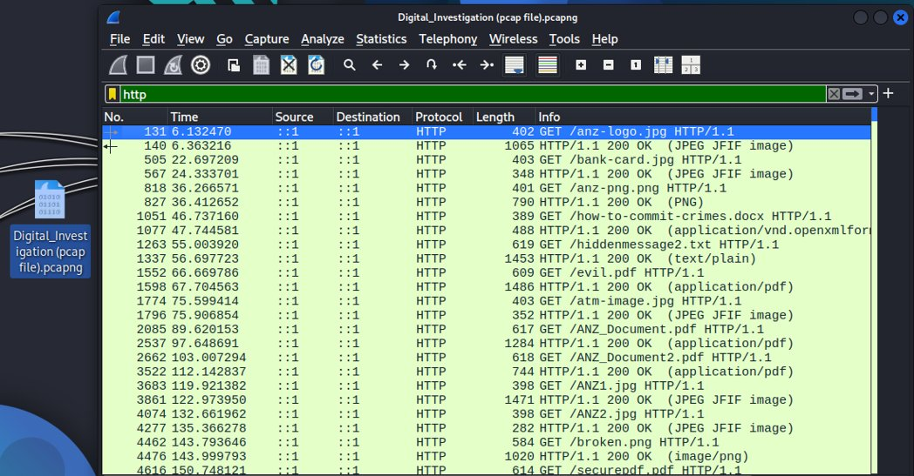
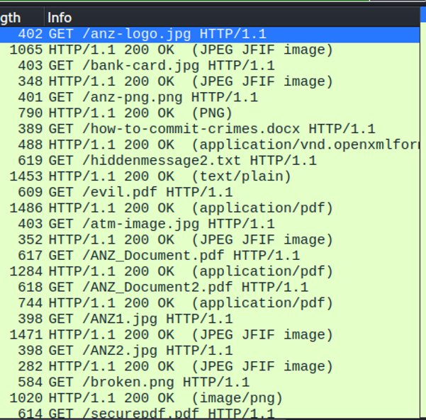
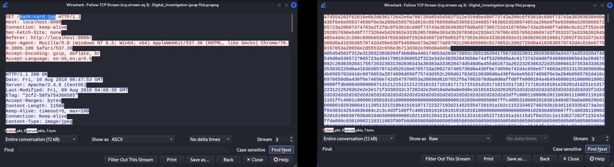
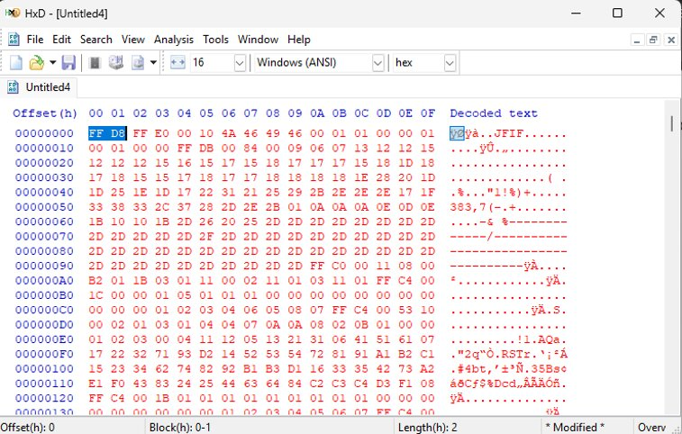

# Deep Packet Inspection for Cyber Threat Detection :Using Wireshark & HxD

> **Repo:** `Network-Forensics/dpi-threat-detection-wireshark-hxd/`
> **Analyst:** Ejoke John | CyBlack SOC Academy
> **Date:** December 2024
> **Focus:** Network forensics, file carving from raw packet data, data exfiltration detection

---

## Table of Contents

1. [Project Overview](#1-project-overview)
2. [Lab Environment](#2-lab-environment)
3. [Investigation Methodology](#3-investigation-methodology)
4. [Step 1 :Loading the PCAP & Filtering HTTP Traffic](#4-step-1--loading-the-pcap--filtering-http-traffic)
5. [Step 2 :Identifying Suspicious Files](#5-step-2--identifying-suspicious-files)
6. [Step 3 :Following the TCP Stream](#6-step-3--following-the-tcp-stream)
7. [Step 4 :Extracting Raw Hex & Carving the File in HxD](#7-step-4--extracting-raw-hex--carving-the-file-in-hxd)
8. [Step 5 :Reconstructing & Confirming the Exfiltrated File](#8-step-5--reconstructing--confirming-the-exfiltrated-file)
9. [Key Findings](#9-key-findings)
10. [Defensive Recommendations](#10-defensive-recommendations)
11. [Tools & Environment](#11-tools--environment)
12. [References](#12-references)

---

## 1. Project Overview

This project documents a deep packet inspection (DPI) investigation I conducted against a captured PCAP file containing simulated malicious network traffic. The goal was to go beyond surface-level protocol analysis and demonstrate how a SOC analyst can identify data exfiltration attempts by inspecting traffic at the raw byte level :using Wireshark for packet analysis and HxD for hex-level file carving and reconstruction.

The key finding was the successful extraction and reconstruction of a bank card image (`bank-card.jpg`) that had been embedded and transmitted within HTTP traffic in the PCAP. By locating JPEG magic bytes (`FFD8` / `FFD9`) in the raw TCP stream data and carving the file manually in HxD, I was able to visually confirm what was being exfiltrated :a complete ANZ bank debit card with a full card number.

This investigation demonstrates a workflow directly applicable to real-world SOC and DFIR scenarios: identifying suspicious transfers in network traffic, drilling into raw packet data, and reconstructing exfiltrated files to confirm the nature of what was taken.

**What This Investigation Covers:**

| Phase | What I Did |
|-------|------------|
| **Traffic Analysis** | Loaded a PCAP in Wireshark and filtered HTTP traffic to enumerate all file transfers |
| **Threat Identification** | Identified multiple suspicious filenames indicating malicious intent |
| **TCP Stream Analysis** | Followed the TCP stream of a target file and switched between ASCII and RAW views |
| **File Carving** | Located JPEG magic bytes in raw hex, extracted the data, and transferred it to HxD |
| **File Reconstruction** | Saved the carved hex data as a `.jpg` to reconstruct and visually confirm the exfiltrated content |

---

## 2. Lab Environment

I set up a controlled home lab environment on Kali Linux with both Wireshark and HxD running side by side. Working in an isolated VM ensured I could safely analyse the PCAP and manipulate raw packet data without any risk to production systems.

*Wireshark and HxD open side by side in my Kali Linux lab :Wireshark showing an initial ARP packet capture, HxD ready to receive extracted hex data*

| Component | Role |
|-----------|------|
| **Kali Linux VM** | Isolated analysis environment |
| **Wireshark** | Network protocol analyser for deep packet inspection and TCP stream following |
| **HxD** | Hex editor for inspecting raw byte data, file carving, and reconstruction |
| **PCAP File** (`Digital_Investigation (pcap file).pcapng`) | Pre-captured network traffic file containing simulated malicious activity |

---

## 3. Investigation Methodology

My approach followed a structured network forensics workflow:

1. Load the PCAP and filter down to HTTP traffic to enumerate all file transfers in the capture
2. Review GET requests and HTTP responses to identify filenames that indicate suspicious or malicious content
3. Select the most interesting target file and follow its TCP stream to inspect the full request/response
4. Switch the TCP stream view to RAW to access the underlying hex data rather than the ASCII interpretation
5. Locate the JPEG magic bytes (`FFD8` at the start, `FFD9` at the end) to define the exact boundaries of the embedded image
6. Extract that hex data and paste it into HxD for structured inspection
7. Save the HxD file with a `.jpg` extension to reconstruct the image and confirm what was being transferred

This workflow mirrors what a SOC analyst or DFIR investigator would do when triaging a suspected data exfiltration alert :working from a high-level traffic view down to raw bytes to confirm what was actually moved.

---

## 4. Step 1 :Loading the PCAP & Filtering HTTP Traffic

I opened Wireshark and loaded the pre-captured PCAP file (`Digital_Investigation (pcap file).pcapng`). My first action was to apply an `http` display filter to strip away non-HTTP traffic and focus specifically on file transfer activity :GET requests and their corresponding HTTP 200 OK responses.

*Wireshark with the `http` display filter applied to the PCAP :all HTTP GET requests and server responses now visible, revealing a series of file transfers*

Filtering to HTTP immediately revealed a significant volume of file transfer activity across the capture. The `http` filter surfaces both the client GET requests and the server `200 OK` responses, giving a clear picture of everything that was transferred.

---

## 5. Step 2 :Identifying Suspicious Files

With the HTTP filter applied, I reviewed the Info column to enumerate all filenames being requested. Several immediately flagged as suspicious:

*The HTTP-filtered packet list revealing multiple suspicious filenames in the Info column*

| Filename | Why It's Suspicious |
|----------|---------------------|
| `bank-card.jpg` | Financial data :potential cardholder data exfiltration |
| `how-to-commit-crimes.docx` | Explicitly named malicious document |
| `hiddenmessage2.txt` | Suggests steganography or covert communication |
| `evil.pdf` | Explicitly named malicious file |
| `atm-image.jpg` | ATM imagery :possible card skimming or fraud material |

Other files in the capture (`anz-logo.jpg`, `ANZ_Document.pdf`, `ANZ1.jpg`, `ANZ2.jpg`) suggest a pattern of ANZ bank-themed content being transferred :which, taken together with `bank-card.jpg` and `atm-image.jpg`, pointed strongly toward a financial data exfiltration scenario.

I chose to focus my investigation on **`bank-card.jpg`** as the primary target :a filename that explicitly suggests financial cardholder data and offered the best opportunity to demonstrate file carving from raw packet data.

---

## 6. Step 3 :Following the TCP Stream

I right-clicked on the `bank-card.jpg` GET request packet and selected **Follow → TCP Stream** to reconstruct the full HTTP conversation between client and server for that file transfer.

*Left: TCP stream in ASCII view showing the HTTP request headers and response metadata. Right: the same stream switched to RAW view, revealing the raw hex data of the JPEG file content*

The ASCII view (left) confirmed the HTTP transaction details :the GET request for `/bank-card.jpg`, the `HTTP/1.1 200 OK` response from the Apache server, content type `image/jpeg`, and content length `11506` bytes. This confirmed a complete JPEG file had been transferred.

The critical step was switching to **RAW view** (right) using the "Show As" dropdown. ASCII view interprets the binary data as text, which obscures the actual structure of the file. RAW view exposes the underlying hex stream :and that's where the file carving work begins.

---

## 7. Step 4 :Extracting Raw Hex & Carving the File in HxD

In the RAW view of the TCP stream, I used the **Find** function to locate two specific hexadecimal markers:

- **`FFD8`** :the JPEG Start of Image (SOI) marker, which marks the very first bytes of any valid JPEG file
- **`FFD9`** :the JPEG End of Image (EOI) marker, which marks the last bytes

These are known as **magic bytes** :file format signatures embedded in the binary data that identify the file type regardless of its filename or extension. Knowing these markers allowed me to precisely identify where the JPEG data begins and ends within the raw hex stream, and extract exactly that portion.

I highlighted all data between `FFD8` and `FFD9`, copied it, and pasted it into HxD for structured inspection.

*HxD showing the extracted hex data :the first two bytes `FF D8` at offset 0x00000000 confirm this is a valid JPEG file. The decoded text column on the right shows the `JFIF` string, further confirming JPEG format*

In HxD, I could immediately verify the extraction was correct: the file starts with `FF D8 FF E0` :the standard JPEG/JFIF header :and the decoded text column shows `JFIF` on the first line, which is the JPEG File Interchange Format identifier. This is exactly what a legitimate JPEG begins with, confirming the carved data was a complete and valid image file.

---

## 8. Step 5 :Reconstructing & Confirming the Exfiltrated File

With the hex data verified in HxD, I saved the file with a `.jpg` extension. This instructed the operating system to interpret the raw bytes as a JPEG image, allowing me to open and visually inspect the reconstructed file.

*The reconstructed image recovered from the packet capture :an ANZ bank debit card showing card number `4000 1234 5678 9010`, confirming active financial data exfiltration within the traffic*

The result was unambiguous: a complete ANZ bank debit card image with a full 16-digit card number (`4000 1234 5678 9010`) :reconstructed entirely from raw hex data extracted from an HTTP packet stream.

This confirmed the exfiltration scenario. What appeared in Wireshark as a routine JPEG file transfer was actually the covert transfer of financial cardholder data. Without the hex-level inspection in HxD, the file would have appeared as just another image in the traffic.

---

## 9. Key Findings

### Primary Finding :Confirmed Data Exfiltration

| Finding | Detail |
|---------|--------|
| **Exfiltrated File** | `bank-card.jpg` :ANZ bank debit card image |
| **Card Number Exposed** | `4000 1234 5678 9010` |
| **Transfer Protocol** | HTTP (plaintext :no encryption) |
| **Transfer Method** | Standard HTTP GET request :no obfuscation at the protocol level |
| **Detection Method** | HTTP filter → TCP stream → RAW hex → JPEG magic byte carving → HxD reconstruction |

### Why This Is Dangerous

The transfer used **plain HTTP** :meaning the content was completely unencrypted and visible to any observer on the network path. The attacker didn't need to use any sophisticated encoding or obfuscation :they relied on the file blending in with the other image transfers in the same capture (`anz-logo.jpg`, `ANZ1.jpg`, `ANZ2.jpg`).

This is a real exfiltration technique: embed sensitive data transfers within seemingly normal file traffic, betting that analysts won't drill into every image file. This investigation shows why that assumption is wrong :and why hex-level inspection matters.

### Additional Suspicious Files in the PCAP

The broader PCAP contained a pattern of suspicious content beyond `bank-card.jpg`. The filenames `how-to-commit-crimes.docx`, `hiddenmessage2.txt`, `evil.pdf`, and `atm-image.jpg` together suggest this PCAP was built to simulate a realistic threat scenario involving multiple simultaneous exfiltration vectors :documents, text files, PDFs, and images all being used as carriers.

---

## 10. Defensive Recommendations

Based on what I uncovered in this investigation, these are the controls that would directly prevent or detect this type of attack:

| Control | How It Addresses This Threat |
|---------|------------------------------|
| **TLS/HTTPS Enforcement** | The bank card transfer was over plain HTTP :enforcing TLS would encrypt the payload, though it also requires SSL inspection at the network boundary to maintain visibility |
| **SSL/TLS Inspection** | Deploy inline SSL inspection at the perimeter so encrypted traffic can still be analysed for data exfiltration patterns |
| **DLP (Data Loss Prevention)** | A DLP solution inspecting outbound HTTP/S traffic would flag image files containing card number patterns (matching PAN formats like `4000 1234 5678 9010`) |
| **Network Monitoring & SIEM** | Alert on large volumes of image/document file transfers to unusual destinations, or transfers of files with suspicious naming patterns |
| **HTTP Content Inspection** | Next-gen firewalls and proxies with deep packet inspection can analyse file content in transit, not just headers |
| **Network Segmentation** | Limit which systems can initiate outbound HTTP connections :systems handling cardholder data should not have unrestricted outbound access |
| **PCAP Retention & Forensics Capability** | This investigation was only possible because a full PCAP was available. Organisations should retain network capture capability for incident response |

---

## 11. Tools & Environment

| Tool | How I Used It |
|------|--------------|
| **Kali Linux VM** | Isolated analysis environment |
| **Wireshark** | Loaded the PCAP, applied HTTP display filters, enumerated file transfers, followed TCP streams, switched between ASCII and RAW views |
| **HxD** | Received extracted hex data from Wireshark, inspected JPEG magic bytes, verified file structure, saved reconstructed `.jpg` |
| **PCAP File** | `Digital_Investigation (pcap file).pcapng` :pre-captured traffic containing simulated malicious file transfers |

---

## 12. References

| Resource | Link |
|----------|------|
| Wireshark Display Filter Reference | https://www.wireshark.org/docs/dfref/ |
| JPEG File Format & Magic Bytes | https://en.wikipedia.org/wiki/JPEG#Syntax_and_structure |
| SANS :Network Forensics & Packet Analysis | https://www.sans.org/white-papers/33920/ |
| MITRE ATT&CK :T1048 Exfiltration Over Alt Protocol | https://attack.mitre.org/techniques/T1048/ |
| MITRE ATT&CK :T1041 Exfiltration Over C2 Channel | https://attack.mitre.org/techniques/T1041/ |

---

*This investigation was conducted in a controlled home lab environment using a simulated PCAP file. All findings relate to lab-generated traffic. No real cardholder data was accessed or compromised.*

*:Ejoke John | [LinkedIn](https://www.linkedin.com/in/john-ejoke/) | [GitHub](https://github.com/YOUR-USERNAME)*
