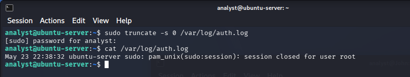
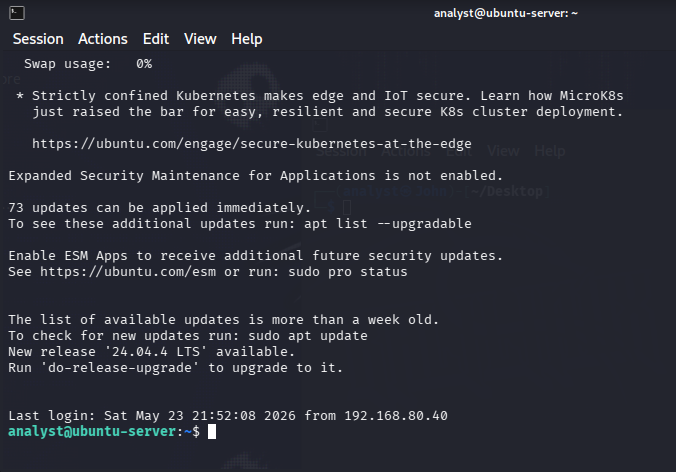
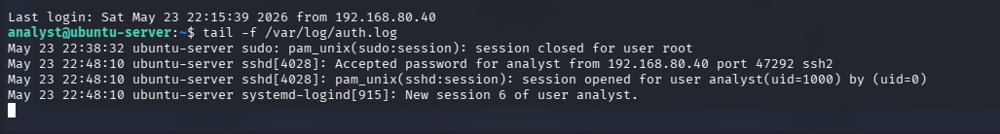
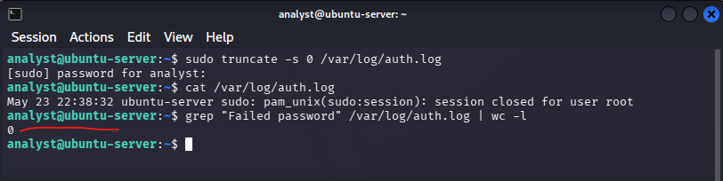
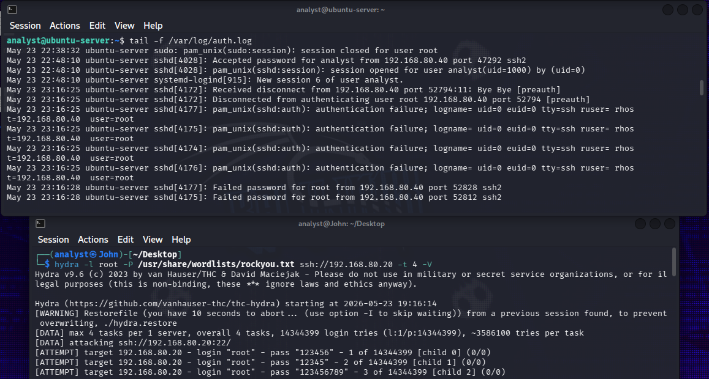
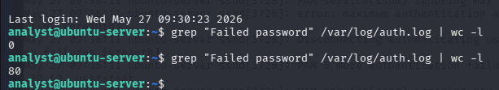
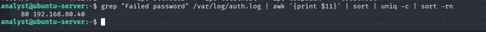
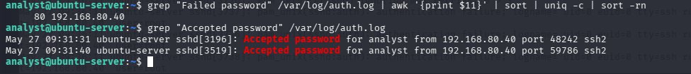

# Week 01 : SSH Brute Force Detection and Analysis
### SOC Log Analysis Series | Month 1 | Authentication Logs

**Date:** 27 May 2026
**Analyst:** John Ejoke Oghenekewe
**Lab Environment:** Ubuntu 22.04 Target VM | Kali Linux Attacker VM | VMware Virtual Platform
**Attacker IP:** 192.168.80.40 (Kali Linux)
**Target IP:** 192.168.80.20 (Ubuntu Server)
**Log Source:** /var/log/auth.log

---

## What This Investigation Is About

This is a hands-on log analysis exercise simulating a real SSH brute force attack in a controlled lab environment. As the analyst, I took on two roles simultaneously: the attacker generating the threat on Kali Linux, and the defender investigating the logs on Ubuntu Server.

The goal was to detect, investigate, and document a brute force attack using only the authentication log, the same way a SOC analyst would in a real incident.

---

## Lab Setup

Three terminal windows running at the same time:

```
Window 1 (Ubuntu - Watcher)     Window 2 (Ubuntu - Analyst)     Window 3 (Kali - Attacker)
tail -f /var/log/auth.log        Investigation commands           Hydra brute force tool
Watching logs live               grep, wc, awk analysis           Generating the attack
```


---

## Step 1: Establishing the Baseline

Before launching any attack, I cleared the authentication log and confirmed a clean starting point. This is critical in any investigation. You must know what normal looks like before you can identify what is not normal.

**Command used:**
```bash
sudo truncate -s 0 /var/log/auth.log
cat /var/log/auth.log
```



**What I observed:**
Only one line visible after truncation: the sudo session used to run the truncate command itself. The system logged my own administrative action. This is expected and healthy behaviour. Everything else is clean.

---

## Step 2: Legitimate SSH Login

I connected to the Ubuntu target machine via SSH from my Kali machine. This established my legitimate analyst session before the attack began.



**What this shows:**
The Ubuntu welcome screen confirming a successful SSH connection. The last login timestamp is visible. In a real investigation, this timestamp is important. It tells you who was last in the system and from where before an incident occurred.

---

## Step 3: Real-Time Log Monitoring

With the tail -f command running on Window 1, I could watch the authentication log update in real time. Every new event appeared instantly as it was written to the file.

```bash
tail -f /var/log/auth.log
```



**What I observed:**
My own legitimate SSH login generated three log entries simultaneously from three different system components:
- `sshd` recorded the authentication success
- `pam_unix` recorded the session opening
- `systemd-logind` recorded the new session ID

This is normal. One login event, three components recording it from their own perspective. This is what legitimate activity looks like in an auth log.

---

## Step 4: Pre-Attack Evidence Count

Before launching the attack I ran a count of failed password attempts to establish a clean baseline number.

```bash
grep "Failed password" /var/log/auth.log | wc -l
```



**Result: 0**

Zero failed attempts. Clean log confirmed. This screenshot is the before picture. When the number changes after the attack, the spike is the evidence.

---

## Step 5: Launching the Brute Force Attack

From the Kali attacker machine on Window 3, I launched Hydra against the SSH service on the Ubuntu target. Hydra is an automated password guessing tool that systematically tries passwords from a list against an authentication service.

```bash
hydra -l root -P /usr/share/wordlists/rockyou.txt ssh://192.168.80.20 -t 4 -V
```

**Command breakdown:**

| Flag | Meaning |
|---|---|
| `-l root` | Target the root account specifically |
| `-P rockyou.txt` | Use the rockyou password list (14 million real leaked passwords) |
| `ssh://192.168.80.20` | Attack SSH on the Ubuntu target |
| `-t 4` | Run 4 parallel threads simultaneously |
| `-V` | Verbose mode, show every attempt |



**What happened:**
The moment Hydra started, Window 1 began flooding with failed password entries in real time. This screenshot captures both sides simultaneously. The attack generating on Window 3 (bottom). The defence logging it on Window 1 (top). This is the closest thing to watching a live attack from a defender position.


---

## Step 6: Investigation Commands

After stopping the attack I ran three investigation commands on Window 2 to build the evidence picture.

### Command 1: Total Failed Attempts

```bash
grep "Failed password" /var/log/auth.log | wc -l
```

**Result: 80**



80 failed password attempts recorded in the authentication log. All within approximately 90 seconds. No human types 80 passwords in 90 seconds. This is automated tooling.

### Command 2: Source IP Analysis

```bash
grep "Failed password" /var/log/auth.log | awk '{print $11}' | sort | uniq -c | sort -rn
```

**Result:**
```
80 192.168.80.40
```



Every single one of the 80 failed attempts came from the same IP address. One attacker. One target account. 80 attempts. Zero variety in origin. This eliminates any possibility that this was random noise or multiple sources. This was a deliberate, focused, automated attack from a single machine.

### Command 3: Successful Login Check

```bash
grep "Accepted password" /var/log/auth.log
```



**Result:**
```
May 27 09:31:31 - Accepted password for analyst from 192.168.80.40 port 48242
May 27 09:31:40 - Accepted password for analyst from 192.168.80.40 port 59786
```

Only two accepted logins in the entire log. Both are for the analyst account. Both happened before the attack started. The root account was never successfully authenticated. The attack failed.

---

## Attack Timeline

```
09:31:31  Legitimate analyst SSH login (Session 1 established)
09:31:40  Legitimate analyst SSH login (Session 2 established)
          |
          | [Quiet period - normal baseline activity]
          |
09:35:56  ATTACK BEGINS - First failed password for root detected
09:35:56  Four parallel Hydra threads firing simultaneously
09:36:xx  80 failed attempts recorded across multiple SSH processes
09:36:xx  SSH server begins disconnecting Hydra connections
          (MaxAuthTries exceeded - server defence activating)
          |
          Attack stopped manually
          Root account: NEVER COMPROMISED
```

---

## MITRE ATT&CK Mapping

| Technique ID | Name | Tactic |
|---|---|---|
| T1110.001 | Brute Force: Password Guessing | Credential Access |

**What this means:**
The attacker used a systematic automated approach to guess the root password using a real-world leaked password list. This is one of the most common initial access techniques used against internet-facing SSH services.

**If the attack had succeeded, the next techniques would be:**

| Technique ID | Name | What would happen |
|---|---|---|
| T1078 | Valid Accounts | Attacker uses compromised root credentials for persistent access |
| T1059.004 | Unix Shell | Attacker drops into root shell and executes commands |
| T1053.003 | Cron | Attacker creates cron job for persistence |

The defender stopped the kill chain at the very first technique. No foothold was established.

---

## Key Technical Observations

**Multiple SSH process IDs:**
sshd[3725], sshd[3726], sshd[3727], sshd[3728] appearing simultaneously. This is Hydra's four parallel threads. Each thread opens its own SSH connection. In a real environment this pattern is immediately recognisable as automated tooling.

**MaxAuthTries exceeded errors:**
The Ubuntu SSH server has a built-in limit on authentication attempts per connection. When Hydra exceeded this limit, SSH automatically disconnected the session and logged an error. This is a native SSH defence mechanism. It slowed Hydra down but did not stop it because Hydra simply opened new connections and continued.

**Password authentication is enabled:**
The fact that this attack was even possible means password authentication is active on SSH. In a hardened production environment, password authentication should be disabled entirely and SSH key-based authentication enforced exclusively.

---

## 5-Part Investigation Note

**1. Log Type and Source:**
Linux authentication log at /var/log/auth.log on Ubuntu 22.04 target VM. Attack generated using Hydra brute force tool from Kali Linux attacker VM.

**2. What Triggered My Attention:**
A sudden flood of Failed password entries for the root account from a single IP address 192.168.80.40 observed in real time via tail -f monitoring. The volume, speed, and consistency of the attempts indicated automated tooling rather than human activity.

**3. Supporting Evidence:**
80 failed password attempts confirmed via grep and wc -l. All 80 attempts from a single source IP confirmed via awk analysis. Only legitimate analyst sessions found in Accepted password entries. Root account never compromised.

**4. MITRE ATT&CK:**
T1110.001 - Brute Force: Password Guessing

**5. Analyst Conclusion:**
High confidence SSH brute force attack from 192.168.80.40 targeting root account via automated password guessing. Attack unsuccessful. System integrity maintained. Recommended actions: block source IP at firewall, install Fail2ban, disable SSH password authentication, enforce key-based authentication only.

---

## Detection Rule

```
RULE: SSH Brute Force Detection
IF:   count(Failed password) from same source IP > 10
      WITHIN 60 seconds
THEN: ALERT - SSH Brute Force Detected
      Severity: MEDIUM
      Action: Flag source IP for review
              Notify SOC analyst on duty
```

---

## Recommended Response Actions

| Priority | Action |
|---|---|
| Immediate | Block 192.168.80.40 at UFW or firewall |
| Immediate | Check source IP on AbuseIPDB and VirusTotal |
| Short-term | Install and configure Fail2ban |
| Short-term | Disable SSH password authentication, enforce key-based only |
| Long-term | Restrict SSH to known IP ranges in firewall rules |
| Long-term | Move SSH to non-standard port to reduce automated scan noise |

---

## What I Learned

**1. Logs tell a complete story.**
Every action left a trace. The attack, the defence, the legitimate sessions. All of it was in /var/log/auth.log waiting to be read.

**2. Volume and consistency are the signature of automated attacks.**
No human generates 80 login attempts in 90 seconds. That pattern is a tool, not a person.

**3. Establishing a baseline before the attack is not optional.**
Without the zero-count screenshot before the attack, I could not have proven the timeline with confidence.

**4. Native SSH defences exist but are not enough alone.**
MaxAuthTries slowed Hydra but did not stop it. Disabling password authentication entirely is the real fix.

**5. The root account should never be exposed directly via SSH.**
Targeting root is the first thing automated tools do. Disable direct root SSH login. Use a non-privileged account and escalate via sudo.

---

## Screenshots Index

| File | What It Shows |
|---|---|
| 01_clean_baseline.png | Auth log cleared. Clean starting point confirmed. |
| 01_legitimate_ssh_login.png | Successful SSH connection to Ubuntu target. |
| 02_tail_live_legitimate_login.png | Real-time monitoring capturing legitimate login. |
| 03_three_windows_ready.png | Full lab setup. Three windows. Attacker, watcher, analyst. |
| 04_zero_failed_pre_attack.png | Zero failed attempts before attack. Clean baseline count. |
| 05_hydra_running_attack_live.png | Attack and defence captured simultaneously. |
| brute_force_attack.png | Hydra on Kali showing all password attempts scrolling. |
| failed_password.png | Auth log flooding with failed password entries live. |
| 06_failed_count.png | Total count: 80 failed attempts confirmed. |
| 07_source_ip_count.png | All 80 attempts from single IP: 192.168.80.40. |
| 07_three_investigation_commands.png | Accepted password check. Root never compromised. |

---

*John Ejoke Oghenekewe | Cybersecurity Analyst*
*SOC Log Analysis Series | Week 01 | May 2026*
*GitHub: github.com/john-ejoke | LinkedIn: linkedin.com/in/john-ejoke*
