# SOC Home Lab Build & Documentation

**Author:** Ejoke John Oghenekewe
**Role:** Cybersecurity Analyst
**LinkedIn:** [linkedin.com/in/john-ejoke](https://www.linkedin.com/in/john-ejoke/)
**Domain:** SOC Operations

---

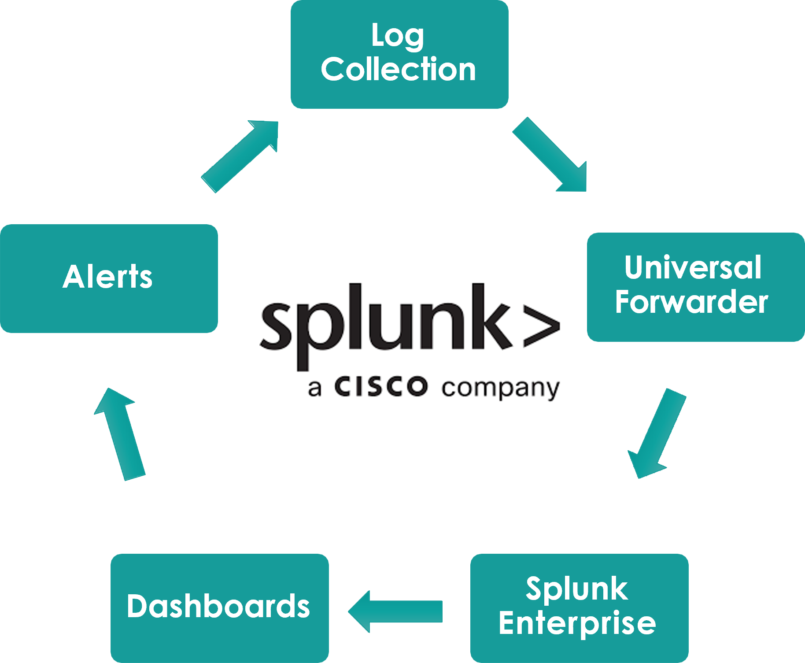

## Overview

I built this SOC home lab from scratch to get hands-on experience with the full log monitoring pipeline — from endpoint telemetry collection through to real-time analysis in a SIEM. The lab runs on my physical laptop using VirtualBox, with three purpose-built VMs handling distinct roles: attacker, victim, and SIEM. Alongside the VirtualBox environment, I also deployed Splunk Enterprise natively on Kali Linux and configured a Universal Forwarder to ship live system logs directly into it — giving me two parallel Splunk deployments to work with and compare.

Everything documented here was built, configured, and tested by me. No pre-built OVAs, no shortcuts.

---

## Host Machine Specs

| Component | Detail |
|---|---|
| Device | Dell Latitude 7400 |
| Processor | Intel Core i7-8665U |
| RAM | 16GB |
| Storage | 512GB SSD |
| OS | Windows 11 Pro |
| Hypervisor | VirtualBox |

---

## Lab Architecture

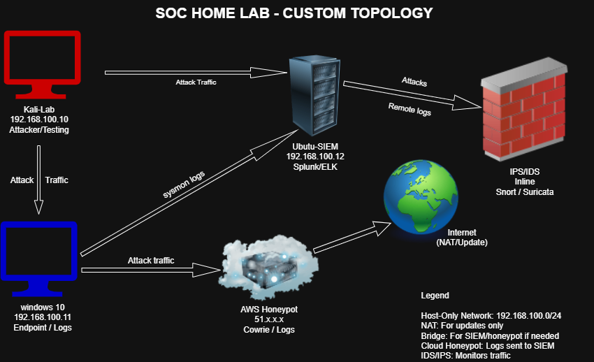

All three VMs sit on a VirtualBox internal network named **SOC-Lab** with the subnet `192.168.100.0/24`. None of them have direct internet access — traffic is isolated to the lab network. Each machine has a defined role:

| VM | IP Address | Role |
|---|---|---|
| Kali Linux | 192.168.100.10 | Attacker |
| Windows 10 | 192.168.100.11 | Victim endpoint |
| Ubuntu 22.04 | 192.168.100.12 | SIEM (Splunk Enterprise) |

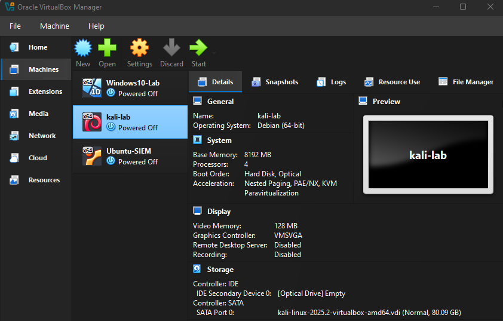
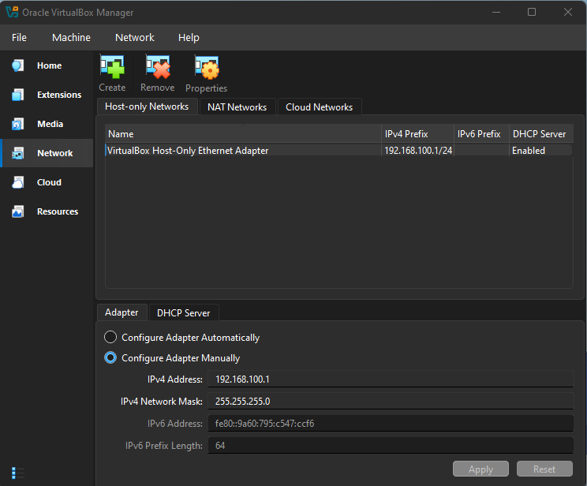

---

## Environment Setup

### Kali Linux — Attacker Machine

Kali serves as the attacker node. I configured its network adapter to the internal SOC-Lab network so all attack traffic stays contained within the lab.

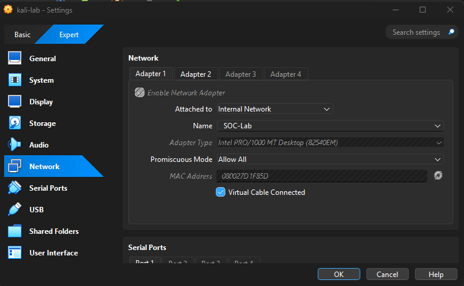
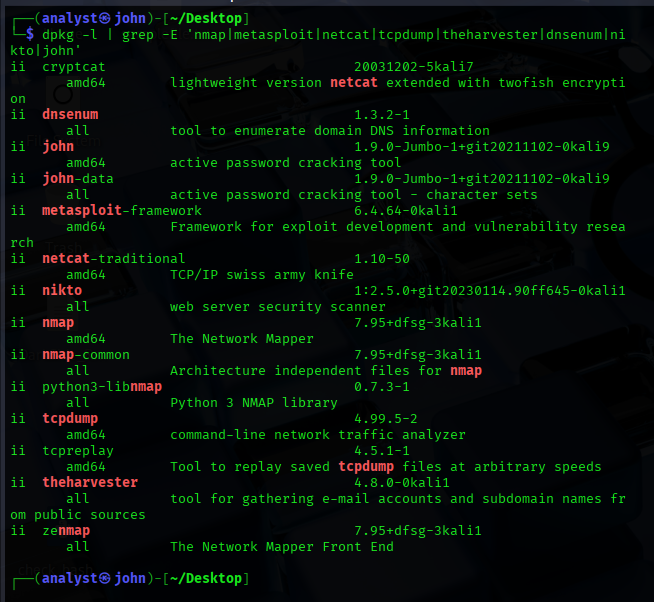

### Windows 10 — Victim Endpoint

The Windows 10 VM is the target. I installed two monitoring agents on it:

- **Sysmon v15.15** — for deep endpoint telemetry (process creation, network connections, process access)
- **Splunk Universal Forwarder** — to ship Sysmon and Windows Event logs to the SIEM

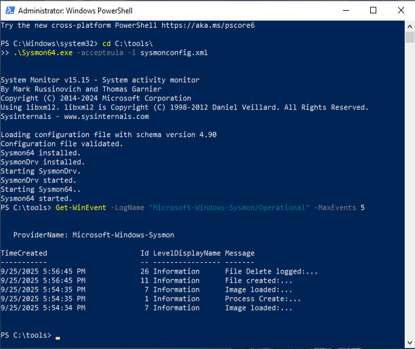
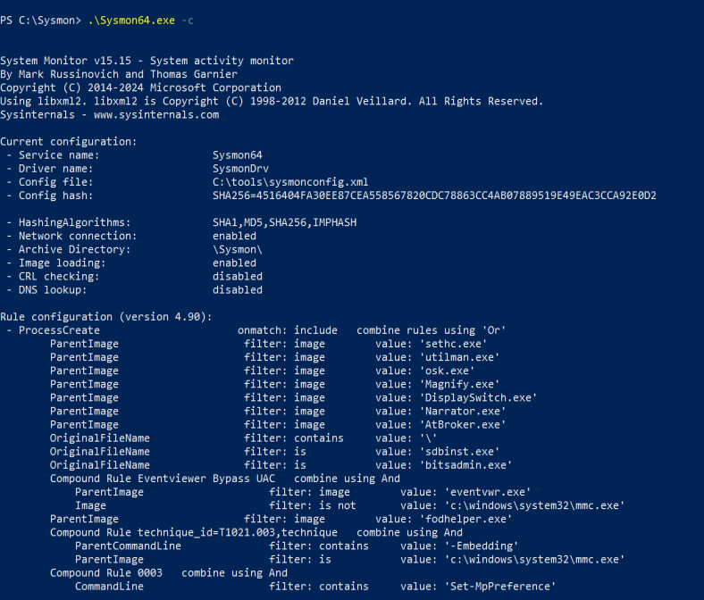

### Ubuntu 22.04 — SIEM

Ubuntu hosts Splunk Enterprise, listening on port `8000` for the web interface and port `9997` to receive forwarded logs from endpoints.

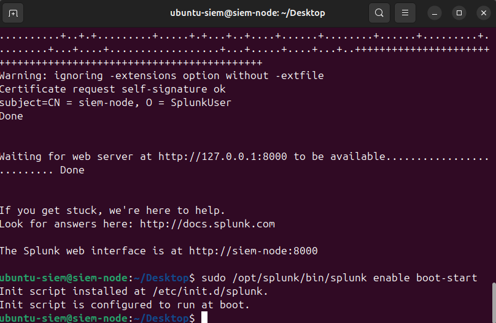
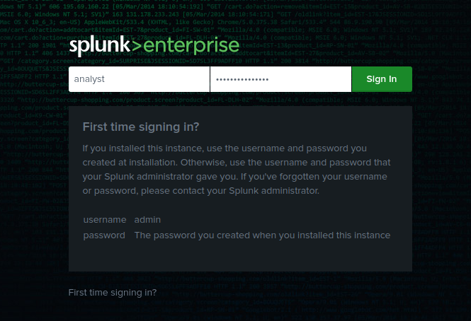

---

## Splunk Universal Forwarder — Windows 10 Configuration

I installed the Splunk Universal Forwarder on the Windows 10 victim machine and configured it to forward logs to the Ubuntu SIEM at `192.168.100.12:9997`.

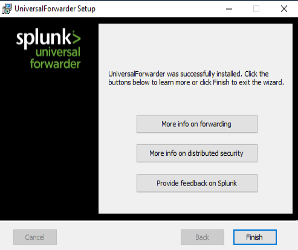

### inputs.conf

The `inputs.conf` file tells the forwarder what to collect. I configured it to monitor the Windows Event Log channels most relevant to endpoint detection — Security, System, and the Sysmon operational channel.

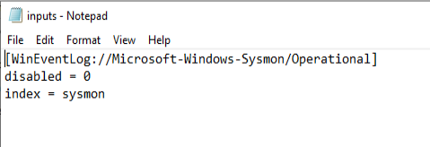

### outputs.conf

The `outputs.conf` file points the forwarder at the receiving indexer — in this case the Ubuntu SIEM on port `9997`.

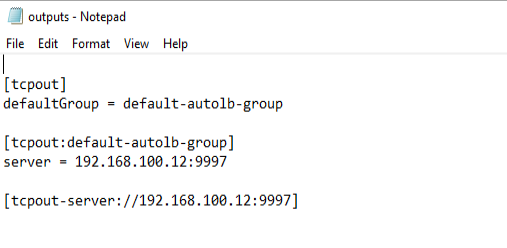

---

## Splunk Enterprise — Native Kali Deployment

In addition to the Ubuntu-based SIEM, I also deployed Splunk Enterprise directly on Kali Linux to practice the full installation workflow on a Linux host and test a second forwarding configuration.

### Downloading Splunk Enterprise

I navigated to the Splunk Enterprise download page and selected the Linux package matching my architecture. I used the `wget` link to pull it directly from the terminal.


### Starting Splunk Enterprise

After installation, I started Splunk using `sudo /opt/splunk/bin/splunk start`, accepted the license agreement, and created admin credentials. The startup output confirmed all ports were open and the web server was available at `http://127.0.0.1:8000`.


### Accessing Splunk Web

With the service running, I accessed the Splunk Web Interface at `http://kali:8000` using my admin credentials.

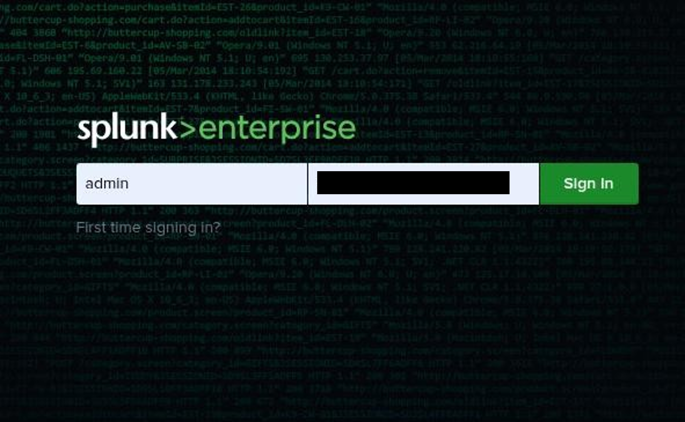
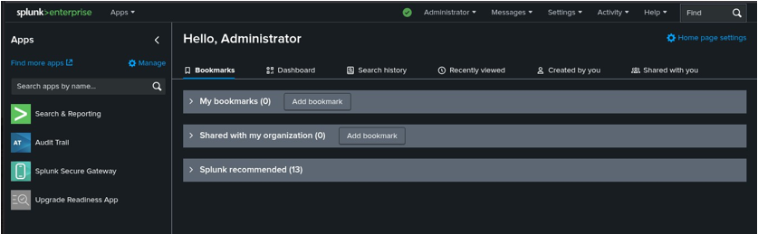

### Downloading and Installing the Universal Forwarder

I downloaded the Splunk Universal Forwarder using `wget` — the 130MB `.tgz` package for Linux AMD64. After extracting and installing it, I accepted the license agreement and set up admin credentials.

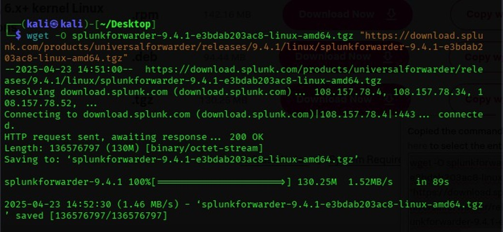

### Configuring the Universal Forwarder

I configured the forwarder to ship logs to the local Splunk Enterprise instance on port `9997`, then added `/var/log` as the monitored directory for real-time log collection. After applying the settings I restarted the forwarder to confirm everything was active.

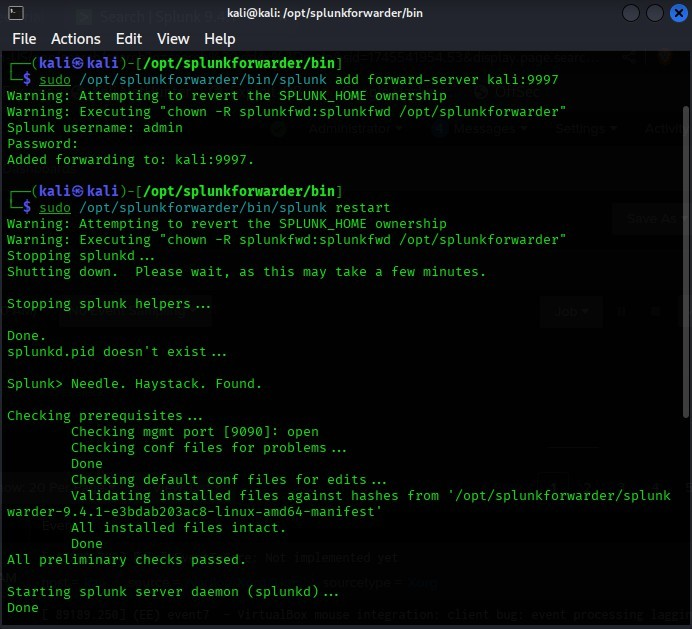

---

## Wireshark — Interface Verification

Before running attacks, I verified that Wireshark could see traffic on the lab network interfaces.

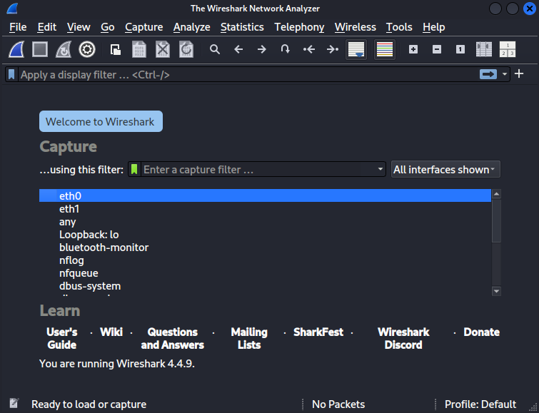

---

## Attack Simulation — Nmap Reconnaissance

With the lab fully operational, I launched a reconnaissance scan from the Kali attacker machine against the Windows 10 victim:

```bash
nmap -Pn -p 445,3389,80 192.168.100.11
```

I targeted ports 445 (SMB), 3389 (RDP), and 80 (HTTP) — three ports commonly probed during the initial access phase of an attack.

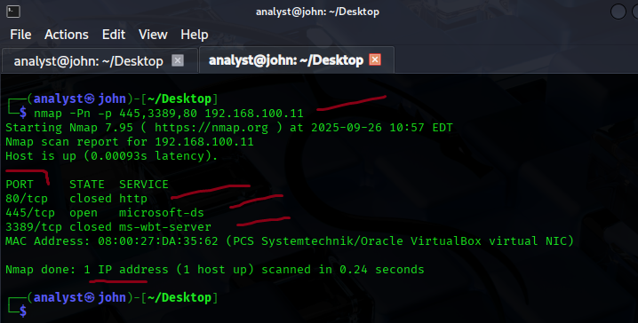

---

## Detection in Splunk — Windows 10 Endpoint

### Querying the Events

After the scan, I ran `index=main` in the Search & Reporting app on the Ubuntu SIEM to pull all indexed events.

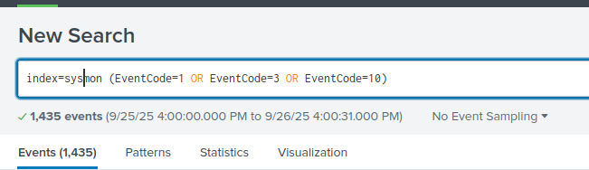

### Results — 1,435 Events Indexed

The query returned **1,435 events** from the Windows 10 endpoint, confirming the UF was shipping logs successfully.

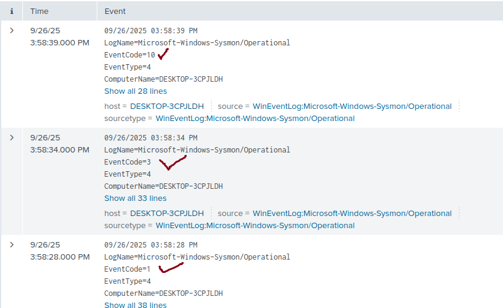

### Sysmon EventCode Breakdown

Three Sysmon event codes confirmed the nmap scan was captured end to end:

**EventCode 1 — Process Creation**
Sysmon recorded the process that initiated the scan activity on the victim host.

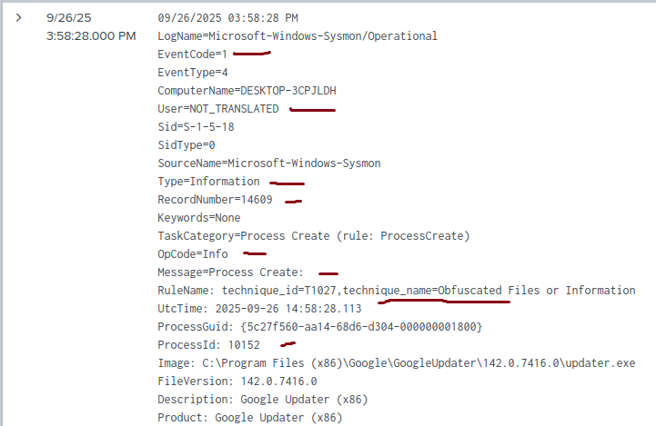

**EventCode 3 — Network Connection**
Outbound network connection events showed the specific ports being probed, with source and destination IPs logged.

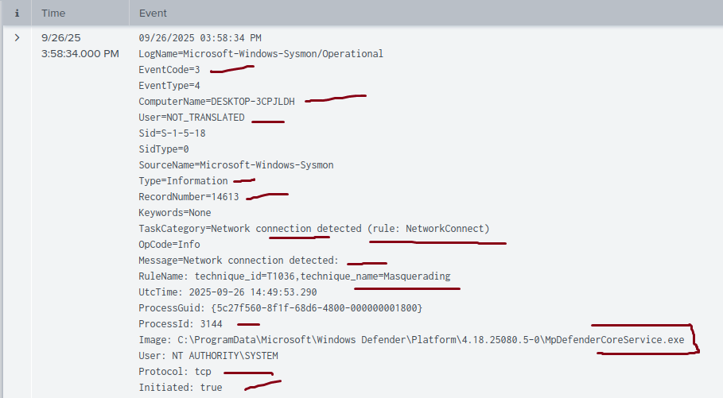

**EventCode 10 — Process Access**
Process access events showed inter-process activity triggered as a result of the scan.

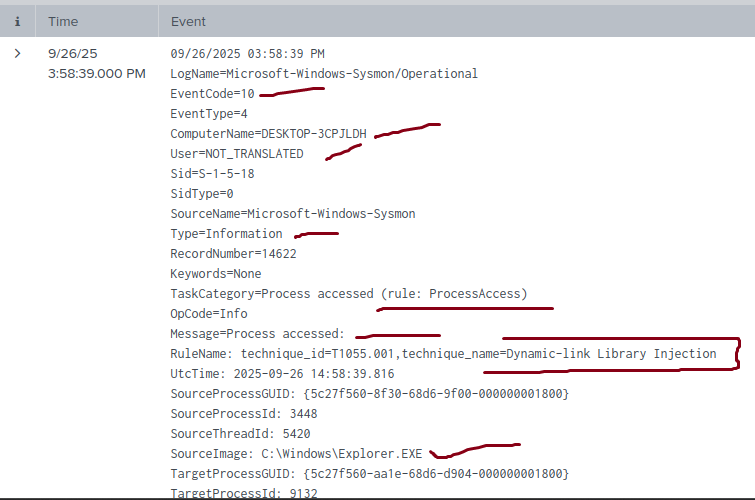

---

## Real-Time Logs — Kali Native Deployment

On the Kali-native Splunk instance, running `index=main` returned **20,089 events** from the `/var/log` directory over a 24-hour window, across 10 sources and 9 source types. This confirmed the Universal Forwarder was actively shipping live system logs into the local Splunk Enterprise instance.

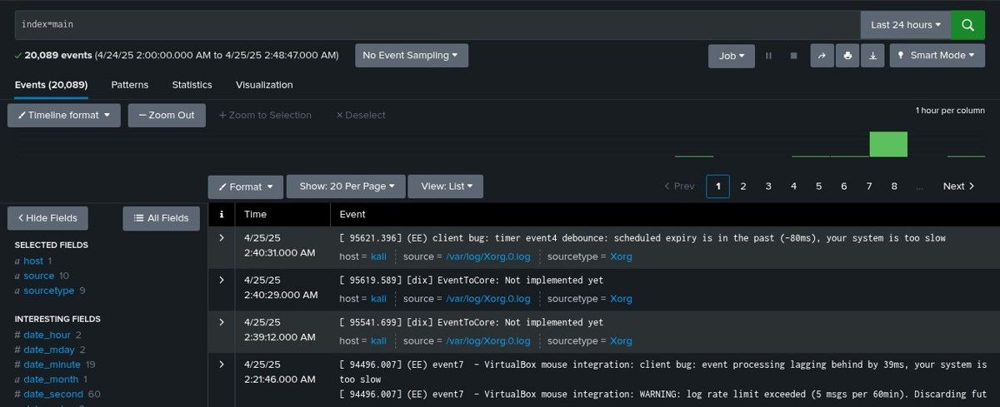

The logs included Xorg display server events, VirtualBox integration messages, and kernel-level activity — all the background telemetry a real analyst learns to distinguish from actual security-relevant events.

---

## Snapshots — Lab State Preservation

After verifying everything worked, I took snapshots of all three VMs to preserve the clean baseline state. This means I can revert after any destructive test and return to a known-good configuration.

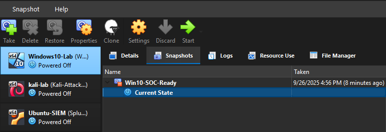
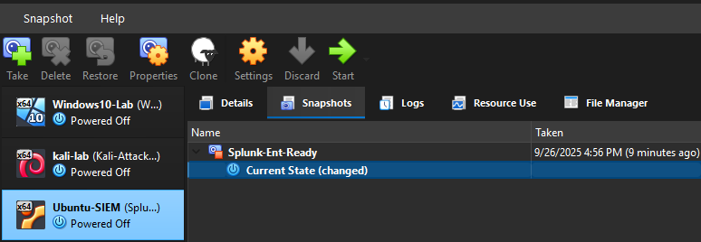
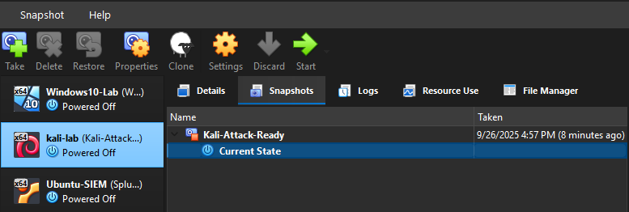

---

## Splunk Cloud — Additional Exposure

Beyond the on-premise lab setup, I also created a Splunk Cloud account to familiarise myself with the managed platform. Understanding both deployment models — self-hosted Enterprise and cloud-managed — reflects how organisations actually operate Splunk at scale.

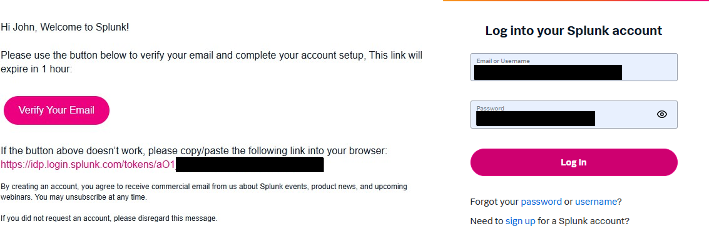

---

## Key Takeaways

Running this lab gave me practical experience across the full SOC toolchain:

- Deploying and configuring Splunk Enterprise in two different environments (Ubuntu SIEM and native Kali)
- Installing and tuning Sysmon for meaningful endpoint telemetry
- Configuring Universal Forwarders on both Windows and Linux hosts
- Writing and running SPL queries to surface real events
- Understanding the difference between noise (Xorg, VirtualBox messages) and security-relevant log entries
- Preserving lab state with snapshots for repeatable testing

---

---

## Future Additions

- `configs/` folder — `sysmonconfig.xml`, `inputs.conf`, `outputs.conf`
- Suricata IDS rules and alert configuration
- Cowrie honeypot setup and log integration
- Custom SPL detection rules for common attack patterns
