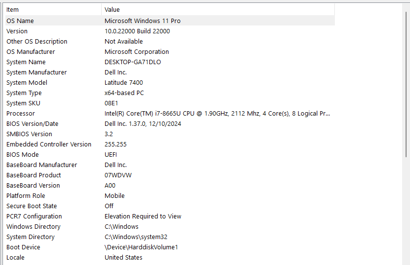

# SOC Home Lab: Build & Documentation

**Author:** [Ejoke John Oghenekewe](https://www.linkedin.com/in/john-ejoke/) | Cybersecurity Analyst  
**Specialization:** Detection Engineering · SIEM Operations · Threat Simulation  
**Built:** May 2025 · **Last Updated:** September 2025

---

## About This Project

I built this SOC home lab from scratch to get hands-on experience with the tools and workflows that real SOC analysts use every day. The goal was not just to install software but to simulate an actual threat detection pipeline: generate attack traffic, capture it at the endpoint level with Sysmon, forward the logs to a centralized SIEM, and confirm detection in Splunk.

By the end of the build I had a fully functional three-VM environment where I could fire an attack from Kali, watch it land on the Windows endpoint, and query the results in Splunk within seconds. This document walks through every step of how I got there.

---

## Table of Contents

1. [Lab Objectives](#1-lab-objectives)
2. [Host Machine](#2-host-machine)
3. [Lab Architecture](#3-lab-architecture)
4. [VM Setup and OS Installation](#4-vm-setup-and-os-installation)
5. [Networking Configuration](#5-networking-configuration)
6. [Security Tools Deployment](#6-security-tools-deployment)
7. [Splunk Configuration](#7-splunk-configuration)
8. [Sysmon Configuration](#8-sysmon-configuration)
9. [Live Threat Simulation](#9-live-threat-simulation)
10. [Splunk Detection Results](#10-splunk-detection-results)
11. [VM Snapshots](#11-vm-snapshots)
12. [Challenges I Ran Into](#12-challenges-i-ran-into)
13. [What I Am Building Next](#13-what-i-am-building-next)
14. [Tools and References](#14-tools-and-references)

---

## 1. Lab Objectives

I designed this lab to give me repeatable, hands-on practice in four areas:

- **Detection Engineering:** Writing and validating Sysmon rules that catch real attack behaviors
- **SIEM Operations:** Ingesting, searching, and correlating endpoint logs in Splunk Enterprise
- **Threat Simulation:** Generating realistic attack traffic from Kali to test detection coverage
- **Incident Response Validation:** Using the lab as a live test environment for detection rules I write in other projects

The tools I chose reflect what I would realistically encounter in a SOC role:

| Tool | Purpose |
|---|---|
| Splunk Enterprise | Central SIEM for log aggregation, search, and alerting |
| Sysmon v15.15 | High-fidelity endpoint telemetry on the Windows victim machine |
| Splunk Universal Forwarder | Ships Sysmon logs from Windows to the Ubuntu SIEM |
| Kali Linux 2025.2 | Attack simulation and adversary emulation |
| Wireshark 4.4.9 | Network traffic inspection and packet analysis |
| Nmap 7.95 | Port scanning and network discovery simulation |
| VirtualBox | Hypervisor for all three VMs |

---

## 2. Host Machine

Everything runs on my physical laptop. The screenshot below is taken directly from `msinfo32` on my machine.



| Component | Details |
|---|---|
| OS | Windows 11 Pro (Build 10.0.22000) |
| System | Dell Latitude 7400 |
| CPU | Intel Core i7-8665U @ 1.90GHz, 4 Cores / 8 Logical Processors |
| RAM | 16 GB |
| Storage | 512 GB SSD |
| BIOS | Dell Inc. 1.37.0 (UEFI) |

Running three VMs simultaneously on 16 GB required careful memory allocation. I assigned 4 GB to Windows 10, 6 GB to Ubuntu-SIEM (Splunk needs headroom), and the remainder to Kali, leaving enough for the host OS to stay stable.

---

## 3. Lab Architecture

This is the custom topology I designed for the lab. Every component has a defined role and the traffic flow between them mirrors how a real hybrid SOC environment is structured.


### Component Breakdown

| Component | IP Address | Role |
|---|---|---|
| Kali-Lab | 192.168.100.10 | Attacker / threat simulation |
| Windows 10 | 192.168.100.11 | Victim endpoint and log source |
| Ubuntu-SIEM | 192.168.100.12 | Splunk Enterprise SIEM |
| AWS Honeypot | 51.x.x.x | Cowrie honeypot for external attack capture |
| IDS/IPS Layer | Inline | Snort / Suricata for network-level detection |

### How the Detection Pipeline Flows

```
Kali generates attack traffic (192.168.100.10)
        |
        v
Windows 10 endpoint receives attack (192.168.100.11)
        |
Sysmon captures: process creation, network connections, process access
        |
        v
Splunk Universal Forwarder ships logs → Ubuntu-SIEM:9997
        |
        v
Splunk Enterprise indexes and makes logs searchable (192.168.100.12:8000)
        |
        v
Analyst queries Splunk → detections confirmed
```

### Networking Modes

Three networking modes serve different purposes in the lab:

- **Internal Network (SOC-Lab):** All three VMs communicate on the isolated `192.168.100.0/24` subnet. No external traffic can enter or leave. Critical for controlled simulations
- **NAT:** Used when VMs need internet access for updates or tool downloads
- **Bridged:** Used when the SIEM or honeypot needs to be visible on the physical network

---

## 4. VM Setup and OS Installation

I installed all three VMs in VirtualBox. The screenshot below shows the VirtualBox Manager with all three machines configured and their specs.


The Kali VM details visible in the screenshot confirm the actual configuration: Debian 64-bit, 8192 MB RAM, 4 processors, 80.09 GB disk on SATA. All machines were assigned static IPs on the internal network to ensure consistent communication.

| VM | OS | IP | RAM | Role |
|---|---|---|---|---|
| Windows10-Lab | Windows 10 | 192.168.100.11 | 4 GB | Victim endpoint |
| kali-lab | Kali Linux 2025.2 | 192.168.100.10 | 8 GB | Attacker |
| Ubuntu-SIEM | Ubuntu Desktop | 192.168.100.12 | 6 GB | Splunk SIEM |

---

## 5. Networking Configuration

### VirtualBox Host-Only Network

The lab uses a manually configured VirtualBox Host-Only Ethernet Adapter as the foundation for the `192.168.100.0/24` subnet.


The adapter is configured manually at `192.168.100.1` with subnet mask `255.255.255.0` and DHCP enabled for the range. Static IPs are then assigned at the VM level to override DHCP and keep addresses fixed.

### Kali VM Network Adapter

Each VM has Adapter 1 set to Internal Network mode, attached to the `SOC-Lab` network name. The screenshot below shows the exact settings on the Kali VM.


Key settings: Internal Network, name `SOC-Lab`, Intel PRO/1000 MT adapter, Promiscuous Mode set to Allow All for packet capture. This same configuration is mirrored on the Windows 10 and Ubuntu-SIEM VMs.

---

## 6. Security Tools Deployment

### Kali Linux Toolset

Before running any simulations I verified all key offensive tools were installed. The output below is from a `dpkg` query run directly on the Kali VM.


Confirmed tools and versions:

| Tool | Version | Purpose |
|---|---|---|
| nmap | 7.95+dfsg-3kali1 | Network discovery and port scanning |
| metasploit-framework | 6.4.64-0kali1 | Exploit development and payload delivery |
| netcat-traditional | 1.10-50 | TCP/IP swiss army knife |
| nikto | 1:2.5.0 | Web server vulnerability scanner |
| theharvester | 4.8.0-0kali1 | OSINT / email and subdomain enumeration |
| dnsenum | 1.3.2-1 | DNS enumeration |
| tcpdump | 4.99.5-2 | Command-line packet capture |
| zenmap | 7.95+dfsg-3kali1 | Nmap GUI frontend |

### Wireshark on Kali

Wireshark 4.4.9 is installed and operational on the Kali VM for deep packet inspection during simulations.


The interface list shows `eth0`, `eth1`, `any`, and loopback available for capture. `eth0` is the internal SOC-Lab adapter used for capturing traffic between Kali and the Windows endpoint.

### Splunk Enterprise on Ubuntu-SIEM

Splunk Enterprise was installed on Ubuntu and configured to start automatically at boot. The terminal output below confirms a successful install with the web server listening at `http://siem-node:8000`.


The init script is installed at `/etc/init.d/splunk` and set to run at boot, meaning Splunk survives VM reboots without manual intervention.


The web interface is accessible on port 8000. I log in with the `analyst` account created during installation.

### Splunk Universal Forwarder on Windows 10

To get logs from the Windows endpoint into Splunk I installed the Splunk Universal Forwarder on the Windows 10 VM.


The forwarder installation completed successfully. It runs as a background service and monitors configured log sources, shipping them to the SIEM continuously.

---

## 7. Splunk Configuration

### inputs.conf

The `inputs.conf` file on the Windows 10 VM tells the Universal Forwarder exactly what to collect. I configured it to monitor the Sysmon Operational event log channel, which is where all high-fidelity endpoint telemetry is written.


```ini
[WinEventLog://Microsoft-Windows-Sysmon/Operational]
disabled = 0
index = sysmon
```

This keeps the Sysmon channel enabled, collects all events from it, and stores them in the `sysmon` index in Splunk for easy filtering.

### outputs.conf

The `outputs.conf` file tells the forwarder where to send the collected logs.


```ini
[tcpout]
defaultGroup = default-autolb-group

[tcpout:default-autolb-group]
server = 192.168.100.12:9997

[tcpout-server://192.168.100.12:9997]
```

All logs are forwarded to `192.168.100.12:9997`, which is the Ubuntu-SIEM running Splunk Enterprise. Port 9997 is the standard Splunk indexer receiving port.

---

## 8. Sysmon Configuration

### Installation

I installed Sysmon v15.15 on the Windows 10 VM using PowerShell with Administrator privileges and loaded a custom configuration file.


```powershell
cd C:\tools\
.\Sysmon64.exe -accepteula -i sysmonconfig.xml
```

The output confirms the full installation sequence: configuration file validated, `Sysmon64` installed, `SysmonDrv` installed and started, `Sysmon64` started. I then ran `Get-WinEvent` to confirm Sysmon was writing events immediately, which shows EventIDs 1, 7, 11, 26 appearing within the first minute.

### Active Configuration

After installation I verified the live configuration by running `.\Sysmon64.exe -c` to dump the current state.


Key configuration details confirmed:

| Setting | Value |
|---|---|
| Service name | Sysmon64 |
| Config file | C:\tools\sysmonconfig.xml |
| Config hash | SHA256=4516404FA30EE87CEA558567820CDC78863CC4AB07889519E49EAC3CCA92E0D2 |
| Hashing algorithms | SHA1, MD5, SHA256, IMPHASH |
| Network connection logging | Enabled |
| Image loading | Enabled |

### Detection Rules in the Configuration

The configuration includes compound rules targeting specific attack techniques:

**Accessibility Tool Abuse (Sticky Keys Backdoor)**  
Flags ProcessCreate events where the parent image is one of: `sethc.exe`, `utilman.exe`, `osk.exe`, `Magnify.exe`, `DisplaySwitch.exe`, `Narrator.exe`, `AtBroker.exe`. These are the classic accessibility tool abuse vectors used to establish backdoors on the Windows login screen.

**UAC Bypass via Eventvwr**  
Compound rule: parent is `eventvwr.exe` AND image is not `c:\windows\system32\mmc.exe`. This catches the well-known UAC bypass where attackers use Event Viewer to launch a process without a UAC prompt.

**T1021.003 Detection**  
Monitors for command lines containing `-Embedding` with parent `c:\windows\system32\mmc.exe`. This targets DCOM lateral movement techniques.

**Windows Defender Preference Modification**  
Flags any command line containing `Set-MpPreference`, which is how attackers commonly disable or weaken Windows Defender through PowerShell.

---

## 9. Live Threat Simulation

With the full pipeline in place I ran a live attack simulation from Kali targeting the Windows 10 endpoint to validate the end-to-end detection chain.

### The Attack

From the Kali VM terminal:


```bash
nmap -Pn -p 445,3389,80 192.168.100.11
```

**What this does:**
- `-Pn` treats the target as online and skips ping discovery
- `-p 445,3389,80` scans three ports: SMB, RDP, and HTTP — the most common initial access vectors in Windows environments
- Target is `192.168.100.11`, the Windows 10 victim

**Scan results:**

| Port | State | Service |
|---|---|---|
| 80/tcp | Closed | HTTP |
| 445/tcp | **Open** | microsoft-ds (SMB) |
| 3389/tcp | Closed | ms-wbt-server (RDP) |

The open SMB port on 445 is the significant finding. In a real engagement this would be the starting point for EternalBlue, PrintNightmare, or NTLM relay attacks.

---

## 10. Splunk Detection Results

### Search Query

Immediately after the scan I queried Splunk for the three Sysmon event codes that cover the core detection categories.


```spl
index=sysmon (EventCode=1 OR EventCode=3 OR EventCode=10)
```

**Result: 1,435 events** captured across the 9/25/25 to 9/26/25 window. The pipeline is working.

### All Three EventCodes Confirmed


Three events from the simulation window, each a different EventCode, all sourced from `WinEventLog:Microsoft-Windows-Sysmon/Operational` on `DESKTOP-3CPJLDH`.

---

### EventCode 1 — Process Creation


**Timestamp:** 09/26/2025 03:58:28 PM  
**EventCode:** 1 (Process Create)  
**Computer:** DESKTOP-3CPJLDH  
**Rule fired:** `technique_id=T1027, technique_name=Obfuscated Files or Information`  
**Process:** `C:\Program Files (x86)\Google\GoogleUpdater\142.0.7416.0\updater.exe`

This event was triggered by a background Google Updater process that matched the Sysmon ProcessCreate rule criteria — not the nmap scan directly. What this confirms is that the Sysmon rules are actively evaluating process creation events in real time and writing them to Splunk immediately. The T1027 rule tag comes from the Sysmon config's technique labeling, which flags processes matching certain obfuscation or update-mechanism patterns.

---

### EventCode 3 — Network Connection


**Timestamp:** 09/26/2025 03:58:34 PM  
**EventCode:** 3 (Network Connection Detected)  
**Rule fired:** `technique_id=T1036, technique_name=Masquerading`  
**Process:** `C:\ProgramData\Microsoft\Windows Defender\Platform\4.18.25080.5-0\MpDefenderCoreService.exe`  
**User:** NT AUTHORITY\SYSTEM  
**Protocol:** TCP

Immediately following the nmap scan, Windows Defender became active in response to the port scan traffic. The Sysmon EventCode 3 rule captured this network connection from the Defender process. This is expected behavior: the endpoint's defenses reacted to the scan, and Sysmon caught that reaction. In a real investigation this chain — scan from external IP → immediate Defender network activity — is precisely the kind of correlation that leads to identifying a reconnaissance event.

---

### EventCode 10 — Process Access


**Timestamp:** 09/26/2025 03:58:39 PM  
**EventCode:** 10 (Process Access)  
**Rule fired:** `technique_id=T1055.001, technique_name=Dynamic-link Library Injection`  
**Source process:** `C:\Windows\Explorer.EXE`  
**Source PID:** 3448  
**Target PID:** 9132

EventCode 10 fires when one process opens a handle to another. Explorer accessing another process triggered the DLL injection monitoring rule. This is a triage event: confirmed Sysmon detection, requires analyst review to determine whether the cross-process access is malicious or routine Windows Explorer behavior. In a real SOC environment this would be queued for Tier 1 review.

---

### What the Three Detections Prove Together

| EventCode | What it Caught | Pipeline Stage Validated |
|---|---|---|
| 1 — Process Create | Sysmon ProcessCreate rule firing in real time | Rules are active and evaluating |
| 3 — Network Connection | Defender reacting to the nmap scan traffic | Network telemetry is being captured |
| 10 — Process Access | Cross-process handle monitoring working | Advanced detection rules are operational |

The combination confirms the entire detection chain is functional from attack generation through to indexed, searchable events in Splunk.

---

## 11. VM Snapshots

I took snapshots of all three VMs at the point where the lab was fully configured and the detection pipeline was validated. These are the rollback points I use when a simulation corrupts a configuration.

### Windows10-Lab Snapshot


**Snapshot:** Win10-SOC-Ready  
**Taken:** 09/26/2025 4:56 PM  
**State:** Sysmon v15.15 installed and running, Universal Forwarder configured, logs flowing to SIEM

### Ubuntu-SIEM Snapshot


**Snapshot:** Splunk-Ent-Ready  
**Taken:** 09/26/2025 4:56 PM  
**State:** Splunk Enterprise installed, receiving logs on port 9997, web interface accessible on port 8000

### Kali-Lab Snapshot


**Snapshot:** Kali-Attack-Ready  
**Taken:** 09/26/2025 4:57 PM  
**State:** All offensive tools installed, network adapter configured on SOC-Lab internal network

Taking snapshots before any simulation run is a discipline I built into my workflow. It mirrors how enterprise SOC teams maintain known-good baselines before running threat exercises, so that a failed simulation never leaves the lab in a broken state.

---

## 12. Challenges I Ran Into

### Network Configuration Complexity

Getting all three VMs to communicate reliably on the internal network while also having internet access for updates was harder than I expected. The dual adapter setup (Internal Network for SOC-Lab traffic, NAT for internet) caused routing conflicts where VMs would either talk to each other or reach the internet but not both. I resolved this by controlling adapter roles explicitly and assigning static IPs at the OS level on every VM.

### Persistent Connectivity Drops Between Reboots

Some network settings reverted after VM reboots. VirtualBox was not reliably persisting the internal network adapter assignments between sessions. I identified the issue was related to saving VM state rather than doing a clean shutdown, and resolved it by always shutting down cleanly and verifying adapter settings after each restart.

### Sysmon Rule Noise

1,435 events in a 24-hour window on a lab machine with minimal user activity is high. My initial Sysmon configuration generates more noise than would be acceptable in a production environment because the rules are broad. In a real deployment, each rule would need tuning to reduce false positives before being used for alerting. Reducing noise without losing detection coverage is something I am actively working on as I build more specific rules.

---

## 13. What I Am Building Next

- **Suricata IDS integration:** Add network-level detection sitting inline between Kali and the Windows victim, giving me alerts at the network layer before anything even hits the endpoint
- **AWS Cowrie Honeypot:** The topology includes a cloud honeypot not yet fully deployed. The plan is to expose it on a public IP, let real internet attackers interact with it, and feed those logs into Splunk
- **Microsoft Sentinel:** Replicate the Splunk setup in Sentinel to become proficient in both SIEM platforms
- **YARA rule development:** Write custom YARA signatures for malware identification and integrate them with the Sysmon pipeline
- **Automated Splunk alerting:** Configure alerts that fire automatically when key EventCodes appear rather than running searches manually

---

## 14. Tools and References

| Tool | Version | Resource |
|---|---|---|
| VirtualBox | 7.x | [virtualbox.org](https://www.virtualbox.org) |
| Splunk Enterprise | Latest free | [splunk.com](https://www.splunk.com) |
| Sysmon | v15.15 | [Sysinternals](https://learn.microsoft.com/en-us/sysinternals/downloads/sysmon) |
| Splunk Universal Forwarder | Latest | [Splunk UF Docs](https://docs.splunk.com/Documentation/Forwarder) |
| Kali Linux | 2025.2 | [kali.org](https://www.kali.org) |
| Wireshark | 4.4.9 | [wireshark.org](https://www.wireshark.org) |
| MITRE ATT&CK | v14 | [attack.mitre.org](https://attack.mitre.org) |
| Splunk SPL Cheat Sheet | — | [Splunk Docs](https://docs.splunk.com/Documentation/Splunk/latest/SearchReference/WhatsInThisManual) |
| Sysmon Config Guide | — | [SwiftOnSecurity](https://github.com/SwiftOnSecurity/sysmon-config) |

---

*[Ejoke John Oghenekewe](https://www.linkedin.com/in/john-ejoke/) — Cybersecurity Analyst*
