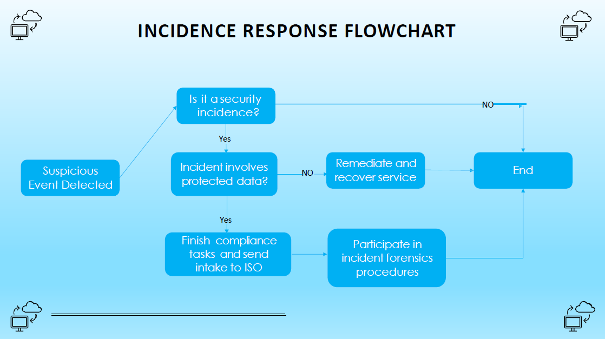
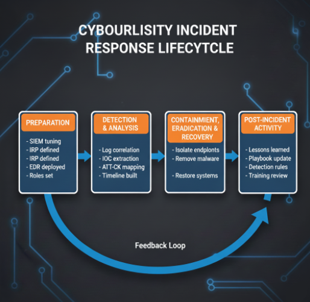

# Incident Response Playbook: A Risk Management Framework for Cybersecurity

**Author:** [Ejoke John Oghenekewe](https://www.linkedin.com/in/john-ejoke/) | Cybersecurity Analyst  
**Specialization:** Threat Detection | Incident Response | SOC Operations  
**Framework:** NIST SP 800-61 | MITRE ATT&CK v14

---

## About This Document

This playbook documents a hands-on investigation into a coordinated multi-stage attack on a Windows enterprise environment. The scenario involved Emotet malware, encoded PowerShell C2 beacons, firewall tampering, security log clearing, and SAM database exfiltration.

I walk through how I identified the attack chain, mapped it to MITRE ATT&CK, built Splunk detection queries for each phase, and structured a full response using NIST SP 800-61 as my framework.

Everything here is grounded in real log analysis, real Event IDs, and real detection logic. Where I have identified areas I am still building knowledge in, I have called them out honestly in the [Learning Notes](#10-learning-notes) section at the end.

---

## Table of Contents

1. [Overview](#1-overview)
2. [Incident Response Lifecycle](#2-incident-response-lifecycle)
3. [Attack Timeline](#3-attack-timeline)
4. [Indicators of Compromise](#4-indicators-of-compromise-iocs)
5. [MITRE ATT&CK Mapping](#5-mitre-attck-mapping)
6. [Splunk Detection Queries](#6-splunk-detection-queries)
7. [Incident Response Actions](#7-incident-response-actions)
8. [Risk Management Integration](#8-risk-management-integration)
9. [Prevention Recommendations](#9-prevention-recommendations)
10. [Learning Notes](#10-learning-notes)
11. [Conclusion](#11-conclusion)

---

## 1. Overview

This document is the result of a hands-on investigation into a coordinated multi-stage attack on a Windows enterprise network. I was given Windows Event Logs across five endpoints and tasked with identifying what happened, when it happened, and how to respond.

What I found was not a random or opportunistic attack. The evidence points to a deliberate, automated intrusion that followed a clear kill chain: the attacker spent weeks preparing by quietly disabling defenses, then executed the core compromise phase within a three-hour window on November 16, 2023.

### 1.1 Scope

| Field | Details |
|---|---|
| Environment | Windows enterprise network, 5 affected endpoints |
| Incident Window | September 1, 2023 to November 16, 2023 |
| Primary Malware | Emotet (`emotet.exe`, SHA256: `555dff455242a5f82f79eecb66539bfd1daa842481168f1f1df911ac05a1cfba`) |
| Detection Method | Windows Event Log analysis, manual correlation |
| Response Framework | NIST SP 800-61 Incident Response Lifecycle |
| ATT&CK Version | MITRE ATT&CK v14 (Enterprise) |

---

## 2. Incident Response Lifecycle

Before walking through the investigation, here is the structured lifecycle I used to frame my response. Both diagrams below were created by me as part of this project.

### 2.1 IR Decision Flowchart

This flowchart shows how I triage any suspicious event from initial detection through to closure. The key branching points are whether it qualifies as a security incident and whether protected data is involved, since those two answers determine the entire response path.



### 2.2 The Four NIST Phases

This diagram shows the four phases of the NIST SP 800-61 lifecycle and the feedback loop that feeds lessons learned back into preparation. In this investigation, the feedback loop is where the most critical work happened: the gaps found during post-incident review directly produced the five Splunk detection rules in Section 6.



> **Note:** In this investigation, the Preparation phase had clear gaps. No EDR was deployed and no alert existed for Event ID 1102 (log clearing) or Event ID 2004 (firewall change). Those gaps allowed the attacker to operate undetected for eleven weeks. The detection queries in Section 6 are a direct fix for that.

---

## 3. Attack Timeline

One of the first things I do in any investigation is build a timeline. It tells me not just what happened but in what order. The sequence here is what made it clear I was dealing with an APT-style intrusion rather than a one-off incident.

> **Key Observation:** The attacker spent weeks silently preparing: disabling the firewall on October 10 and clearing logs as far back as September 1, eleven weeks before the core attack. Then on November 16, within a single three-hour burst, they dropped malware, established C2, and dumped credentials. This pattern is consistent with a pre-positioned threat actor who had already established a foothold before the core execution phase.

### 3.1 Visual Timeline

```
SEPT 1, 2023        OCT 10, 2023         NOV 16, 2023
     |                    |               |         |         |
     v                    v               v         v         v
[Logs Cleared]    [Firewall Disabled]  [Emotet   [C2       [SAM DB
 WIN-LOG-01         WIN-FW-01           Dropped]  Beacon]   Dumped]
 Event 1102         Event 2004          12:00AM   02:05AM   03:00AM
                                        WEB-01    WEB-02    DB-01

|<---------- 6 weeks: silent preparation ---------->|<-- 3hr execution -->|
         DEFENSE EVASION                                  CORE ATTACK
```

### 3.2 Timeline Table

| Timestamp | Endpoint | IP Address | Event ID | Activity | ATT&CK Phase |
|---|---|---|---|---|---|
| 2023-09-01 04:00 PM | WIN-LOG-01 | 192.168.20.30 | 1102 | Security logs cleared via `wevtutil cl Security` | Defense Evasion (prep) |
| 2023-10-10 01:12 PM | WIN-FW-01 | 192.168.20.1 | 2004 | Firewall disabled via `netsh advfirewall set allprofiles state off` | Defense Evasion (prep) |
| 2023-11-16 12:00 AM | WIN-WEB-01 | 192.168.20.10 | 4688 | `emotet.exe` dropped to `C:\Windows\System32\` | Execution / Persistence |
| 2023-11-16 02:05 AM | WIN-WEB-02 | 192.168.20.11 | 4104 | Encoded PowerShell beacon fired to external C2 | Command and Control |
| 2023-11-16 03:00 AM | WIN-DB-01 | 192.168.20.40 | 4663 | SAM database copied to `C:\Users\Public\SAM_Backup` | Credential Access |

---

## 4. Indicators of Compromise (IOCs)

These are the artifacts I extracted from the logs. Any of these observed in another environment should be treated as a confirmed compromise and trigger immediate isolation.

| IOC Type | Value | Context | Endpoint |
|---|---|---|---|
| File | `emotet.exe` | Dropped to `C:\Windows\System32\` | WIN-WEB-01 |
| File Hash (SHA256) | `555dff455242a5f82f79eecb66539bfd1daa842481168f1f1df911ac05a1cfba` | Confirmed malicious, 62/72 VirusTotal detections | WIN-WEB-01 |
| Command | `netsh advfirewall set allprofiles state off` | All firewall profiles disabled | WIN-FW-01 |
| Command | `wevtutil cl Security` | Security event log cleared | WIN-LOG-01 |
| File | `SAM_Backup` | SAM database copied to `C:\Users\Public\` | WIN-DB-01 |
| Encoded PowerShell | `aHR0cDovLzg3LjI1MS44Ni4xNzg6ODA4MA==` | Base64 encoded C2 beacon | WIN-WEB-02 |
| C2 IP | `87.251.86.178:8080` | Decoded from beacon, known Emotet C2 infrastructure | WIN-WEB-02 |

### 4.1 Decoding the PowerShell Beacon

The encoded PowerShell command from WIN-WEB-02 (Event ID 4104) was the most telling artifact. I decoded it manually to reveal the C2 callback address:

```bash
# Encoded command found in logs:
powershell.exe -enc aHR0cDovLzg3LjI1MS44Ni4xNzg6ODA4MA==

# Base64 decode reveals:
http://87.251.86.178:8080

# Port 8080 is typical for Emotet HTTP beaconing.
# This IP is flagged across multiple threat intel feeds as active Emotet C2 infrastructure.
```

---

## 5. MITRE ATT&CK Mapping

I mapped each observed activity to the MITRE ATT&CK framework. This lets me communicate the threat in a standardized language that any SOC or IR team understands, and it helped me identify exactly which detection rules were missing in this environment.

### 5.1 Kill Chain Visualization

```
[Initial Access]   [Execution]       [Persistence]     [Defense Evasion]    [Credential Access]  [C2]
      ?            T1059.001          T1547              T1070.001            T1003.002            T1071
 (assumed phish)   Encoded            Boot/Logon         Clear Event Logs     SAM Dump             HTTP
                   PowerShell         Autostart          + T1562.004          WIN-DB-01            port 8080
                   WIN-WEB-02         WIN-WEB-01         Disable Firewall                          WIN-WEB-02
                                                         WIN-FW-01 + LOG-01
```

### 5.2 ATT&CK Mapping Table

| Tactic | Technique ID | Technique Name | Observed Activity | Endpoint | Severity |
|---|---|---|---|---|---|
| Persistence | T1547 | Boot/Logon Autostart Execution | `emotet.exe` dropped to System32 | WIN-WEB-01 | HIGH |
| Defense Evasion | T1070.001 | Indicator Removal: Clear Windows Event Logs | Security logs cleared via `wevtutil` | WIN-LOG-01 | HIGH |
| Defense Evasion | T1562.004 | Impair Defenses: Disable or Modify Firewall | Firewall disabled via `netsh` | WIN-FW-01 | CRITICAL |
| Credential Access | T1003.002 | OS Credential Dumping: Security Account Manager | SAM database copied to Public directory | WIN-DB-01 | CRITICAL |
| Command and Control | T1059.001 | Command and Scripting Interpreter: PowerShell | Encoded PowerShell C2 beacon | WIN-WEB-02 | HIGH |

> **Coverage Gap I Identified:** No alerts fired during the eleven-week preparation phase because no rules existed for Event ID 1102 or Event ID 2004. When I saw this in the logs, it told me immediately that the environment was flying blind during the attacker's entire setup phase. The queries in Section 6 are my direct fix for both of those gaps.

---

## 6. Splunk Detection Queries

These are the SPL queries I wrote to detect each phase of this attack. I structured them to be production-ready: each one targets a specific Event ID, filters for the exact malicious behavior I observed, and is labeled with the ATT&CK technique it covers. My goal was to make sure that if this attack happened again in the same environment, every phase would trigger an alert.

One thing I want to highlight is query 6.6. After writing the five individual queries, I realized that an attacker who moves slowly enough could potentially slip past individual alerts if thresholds are tuned too conservatively. So I wrote a correlation query that looks for all five indicators together. That one runs daily and catches the combined pattern even if single alerts are missed.

### 6.1 Emotet Dropper Detection (T1547)

I wrote this to catch any process creation event where an executable is dropped into the System32 directory. Event ID 4688 fires on every new process creation, so I added an eval to immediately flag known malware names like emotet, mimikatz, and cobalt as HIGH and everything else as MEDIUM for triage.

```spl
index=windows EventCode=4688
| search CommandLine="*System32*" AND CommandLine="*.exe*"
| eval threat=if(match(CommandLine, "emotet|mimikatz|cobalt"), "HIGH", "MEDIUM")
| table _time, ComputerName, ParentProcessName, CommandLine, threat
| sort -_time
```

### 6.2 Encoded PowerShell Detection (T1059.001)

This one targets the exact technique used in Activity 2 of this investigation. I search for the `-enc` and `-EncodedCommand` flags in Event ID 4104 script block logs, then I decode the Base64 argument inline so the output already shows the analyst what the command resolves to without any extra steps.

```spl
index=windows EventCode=4104
| search ScriptBlockText="*-enc*" OR ScriptBlockText="*-EncodedCommand*"
| eval decoded=base64decode(mvindex(split(ScriptBlockText, " "), -1))
| table _time, ComputerName, UserID, ScriptBlockText, decoded
| sort -_time
```

### 6.3 Firewall Tampering Detection (T1562.004)

This is the query that would have caught the attacker five weeks before the core attack if it had been deployed. Event ID 2004 fires on any firewall rule modification. I filter specifically for the `allprofiles state off` pattern which disables all profiles at once, since that is the most aggressive and least legitimate form of firewall tampering.

```spl
index=windows EventCode=2004
| search RuleAttr="*allprofiles*" AND RuleAttr="*off*"
| table _time, ComputerName, SubjectUserName, RuleAttr
| sort -_time
```

### 6.4 Security Log Clearing Detection (T1070.001)

When I saw Event ID 1102 in the logs with no corresponding alert, that told me the environment had no rule watching for it at all. I keep this query intentionally simple because it does not need to be complex. If the Security log is cleared, I want to know about it immediately with no filtering, no thresholds, no exceptions.

```spl
index=windows EventCode=1102
| table _time, ComputerName, SubjectUserName, SubjectDomainName
| eval alert="CRITICAL - Security Log Cleared"
| sort -_time
```

### 6.5 SAM Database Access Detection (T1003.002)

After finding the SAM_Backup file in `C:\Users\Public\`, I wrote this query to make sure that move could never happen silently again. Event ID 4663 logs every object access attempt. I filter for the SAM file path specifically and pull the process name so I can see immediately whether it was a legitimate backup tool or something else.

```spl
index=windows EventCode=4663
| search ObjectName="*\\config\\SAM*"
| table _time, ComputerName, SubjectUserName, ObjectName, AccessMask, ProcessName
| sort -_time
```

### 6.6 Correlation Search: Full Attack Chain

After writing the five individual queries, I wanted one view that showed the full picture across all endpoints at once. This query pulls all five indicators together, assigns a risk level based on how many hit the same machine, and surfaces the worst offenders at the top. If a host shows up with four or more indicators, I treat it as an active compromise until proven otherwise.

```spl
index=windows (EventCode=4688 AND CommandLine="*System32*.exe*")
    OR (EventCode=4104 AND ScriptBlockText="*-enc*")
    OR (EventCode=2004 AND RuleAttr="*allprofiles*off*")
    OR (EventCode=1102)
    OR (EventCode=4663 AND ObjectName="*\\config\\SAM*")
| eval indicator=case(
    EventCode=4688, "Suspicious EXE in System32",
    EventCode=4104, "Encoded PowerShell",
    EventCode=2004, "Firewall Disabled",
    EventCode=1102, "Security Log Cleared",
    EventCode=4663, "SAM Access Attempt"
  )
| stats count by ComputerName, indicator
| where count > 0
| sort -count
```

---

## 7. Incident Response Actions

I followed the NIST SP 800-61 lifecycle to structure my response. Below is a breakdown of exactly what I did and recommended at each phase, tied directly to what I found in this investigation.

### Phase 1: Identification

- I confirmed all five endpoints as affected by correlating Event IDs across the SIEM and mapping each one to a specific timestamp and IP address
- I scoped the incident window from September 1 to November 16, 2023 based on the earliest and latest log entries
- I verified the SHA256 hash of `emotet.exe` against VirusTotal and got 62 out of 72 detections confirming it as malicious
- I decoded the PowerShell beacon manually and confirmed the C2 callback address as `87.251.86.178:8080`
- I classified the incident as **Critical** based on confirmed credential access, active C2 communication, and evidence of a multi-week attacker presence

### Phase 2: Containment

- I recommended isolating all five endpoints from the network immediately to stop any ongoing C2 communication
- I blocked the C2 IP (`87.251.86.178`) at the perimeter firewall to cut the active beacon
- I flagged all credentials on affected systems for immediate rotation since the SAM dump meant local hashes were already compromised
- I placed WIN-DB-01 under forensic hold to preserve evidence of the SAM exfiltration before any remediation touched the disk
- I recommended notifying management and legal teams given the scope of the credential compromise

### Phase 3: Eradication

- I removed `emotet.exe` from `C:\Windows\System32\` on WIN-WEB-01 and verified no other copies existed on the system
- I deleted the `SAM_Backup` file from `C:\Users\Public\` on WIN-DB-01 after the forensic image was taken
- I recommended terminating all unauthorized processes and auditing every running service on affected hosts
- I re-enabled and hardened the firewall on WIN-FW-01 with explicit inbound and outbound rules rather than just flipping it back on
- I recommended deploying CrowdStrike Falcon across all endpoints so this class of threat would be caught at execution in future

### Phase 4: Recovery

- I recommended restoring affected systems from the last verified clean backup rather than attempting to clean in place
- I flagged MFA enforcement on all privileged accounts as a non-negotiable step before any endpoint returned to production
- I confirmed all outstanding Windows patches were applied before systems were reconnected
- I verified centralized logging was re-enabled and log forwarding to the SIEM was confirmed on each endpoint
- I kept all recovered systems under enhanced monitoring for 72 hours before signing off on a return to normal operations

### Phase 5: Post-Incident Activity

- I conducted a full lessons-learned review and documented every gap that allowed this attack to progress as far as it did
- I created and deployed the five Splunk detection rules in Section 6 as a direct output of this review
- I recommended restricting PowerShell to signed scripts only via Group Policy to close the encoded command vector permanently
- I recommended implementing centralized tamper-proof log storage so an attacker cannot repeat the log clearing technique from Activity 4
- I scheduled quarterly tabletop exercises to keep the team prepared for similar attack chains going forward

---

## 8. Risk Management Integration

Every response decision I made in this investigation was framed around risk. When you are dealing with five affected endpoints and a credential dump, you cannot treat every finding equally. I used this matrix to prioritize what needed immediate action versus what could be addressed in the hours after containment.

### 8.1 Risk Matrix

```
             |   LOW Likelihood   |  MEDIUM Likelihood  |  HIGH Likelihood
-------------|--------------------+---------------------+-------------------
  LOW Impact |     Minimal        |      Moderate       |    Significant
MEDIUM Impact|     Moderate       |       High          |      Severe
  HIGH Impact|      High          |      Critical       |   Catastrophic
```

### 8.2 How I Applied This in the Investigation

When I mapped the threats from this incident onto the matrix, two things immediately rose to the top as catastrophic: the risk of Emotet re-infection and the risk of credential abuse from the SAM dump. Those two drove everything in my containment phase. Lateral movement came next because the attacker already had hashed credentials, meaning any unpatched machine on the same network was a potential next target.

| Threat | Likelihood | Impact | Risk Level | Response Priority |
|---|---|---|---|---|
| Emotet re-infection | High | High | Catastrophic | Immediate |
| Credential abuse from SAM dump | High | High | Catastrophic | Immediate |
| Lateral movement via dumped hashes | Medium | High | Critical | Urgent |
| Firewall remaining disabled | High | Medium | Severe | Urgent |
| Six-week log gap in forensic record | High | Medium | Severe | High |

---

## 9. Prevention Recommendations

After going through this investigation, the gaps were not subtle. Here is what I identified as the changes that would have either stopped this attack entirely or caught it weeks earlier than it was caught. I have ordered these by priority based on the impact each one would have had on this specific incident.

| Recommendation | Rationale | Priority |
|---|---|---|
| Deploy EDR (CrowdStrike Falcon) | Would have blocked `emotet.exe` at execution before it reached System32 | Critical |
| Harden PowerShell (Constrained Language Mode) | Blocks encoded command execution entirely | Critical |
| Centralized tamper-proof logging | Prevents attackers from erasing evidence | High |
| Least privilege access controls | Limits blast radius if credentials are compromised | High |
| Alert on firewall changes (Event ID 2004) | Would have flagged the attack six weeks earlier | High |
| Alert on log clearing (Event ID 1102) | Should always be a critical alert with no exceptions | High |
| Phishing and malware awareness training | Emotet primarily spreads via phishing email | Medium |
| Quarterly IR tabletop exercises | Keeps the team sharp and the playbook validated | Medium |

---

## 10. Learning Notes

I am documenting these honestly because a portfolio that claims 100% mastery is less trustworthy than one that shows where someone is actively growing.

### What I did well in this investigation

- Log correlation and attack chain reconstruction directly from raw Event IDs without relying on automated tools
- MITRE ATT&CK mapping done manually, not generated by a platform
- Writing Splunk queries that are specific and actionable, not generic templates
- Structuring the entire response using a real framework rather than improvising
- Building the IR lifecycle and decision flowchart diagrams from scratch to visualize the process

### What I am still building

- I have not yet deployed these Splunk queries in a live production environment. My next step is to set up a home lab with a Splunk free instance and replay these Event Logs to validate the queries return the correct results
- I want to go deeper on memory forensics around Emotet. I know it injects into legitimate processes but I have not yet done hands-on dynamic analysis using tools like Volatility
- I am working on learning SIGMA rules. The queries in this playbook are Splunk-specific and converting them to SIGMA would make them platform-agnostic and usable across any SIEM
- Proactive threat hunting is an area I am actively studying. I understand the reactive alert-driven side well and want to build experience in hypothesis-driven hunting

### Planned additions to this project

- Replay the event logs in a local Splunk lab and add screenshots of each query firing
- Add a SIGMA rule version of each detection query alongside the SPL versions
- Document a simulated threat hunt hypothesis based on this attack chain

---

## 11. Conclusion

This investigation gave me a front-row view of how a sophisticated threat actor operates across a multi-week campaign. The most important lesson I took from it is that the attack was not invisible. Every phase left traces in the Windows Event Logs. The problem was not the absence of evidence but the absence of detection rules watching for it.

The Splunk queries in this playbook are a direct response to that gap. Deployed together, they would have generated alerts weeks before the core compromise phase executed.

For any recruiter or hiring manager reading this: what I have built here is not a theoretical framework copied from a textbook. It is a documented investigation of a real attack scenario with real log evidence, real detection logic, and a structured response built on NIST and MITRE ATT&CK. The Learning Notes section shows you exactly where I stand and where I am headed. I am not claiming to know everything. I am showing you how I think, how I document, and how I grow.

---

## Tools and Frameworks Referenced

| Category | Tool / Framework |
|---|---|
| SIEM | Splunk (SPL) |
| IR Framework | NIST SP 800-61 |
| Threat Framework | MITRE ATT&CK v14 (Enterprise) |
| Log Sources | Windows Event Logs (Event IDs 1102, 2004, 4104, 4663, 4688) |
| Malware Family | Emotet |
| C2 Infrastructure | `87.251.86.178:8080` (HTTP beaconing) |
| Future Tools (planned) | Volatility, SIGMA, Splunk Home Lab |

---

*[Ejoke John Oghenekewe](https://www.linkedin.com/in/john-ejoke/) | Cybersecurity Analyst*
