# 🛡️ SIEM Threat Detection with Splunk Cloud
### Investigating Brute-Force Attacks via OpenSSH Logs: A SOC Analyst Walkthrough

**Author:** Ejoke John | Cybersecurity Analyst
**Platform:** Splunk Cloud | **Language:** SPL | **Threat Intel:** VirusTotal, AbuseIPDB, WHOIS

## What This Project Is About

I wanted to go beyond theory and actually operate a SIEM platform the way a SOC analyst would on the job. So I took a real OpenSSH authentication log, ingested it into Splunk Cloud, and worked through the full investigation cycle: setting up the environment, hunting for brute-force patterns with SPL queries, building dashboards, configuring automated alerts, and validating suspicious IPs against external threat intelligence sources.

This is a full walkthrough of everything I did, why I did it, and what I found.

## Environment

| Component | Details |
|-----------|----------|
| **Platform** | Splunk Cloud |
| **Log Source** | OpenSSH authentication log (`openssh_log.csv`) |
| **Query Language** | SPL (Splunk Processing Language) |
| **Index** | main |
| **Threat Intel Tools** | VirusTotal, AbuseIPDB, WHOIS |

## 🔧 Phase 1: Setting Up the Splunk Environment

Before touching any log data, I needed the workspace configured properly.

### User Accounts and Role Assignment

I created analyst accounts and assigned roles based on the principle of least privilege, meaning each user only got access to what their role actually required. Roles ranged from standard `user` to `power` and `admin`. I also enforced a forced password change on first login for every new account.

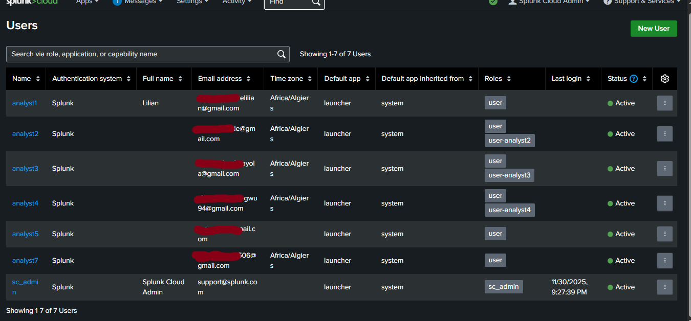

### Splunk Cloud Login

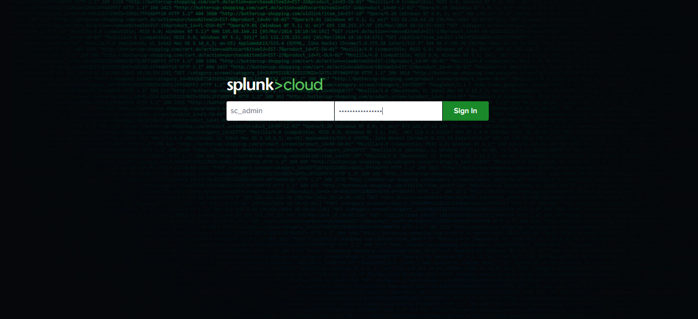

### Timezone Configuration

I set the default system timezone to WAT (West Africa Time). Splunk handles this gracefully for users in other regions by falling back to their browser or system timezone, but having a consistent default matters when correlating event timestamps across multiple analysts.

## 📥 Phase 2: Log Ingestion and Validation

### Uploading the Log File

I uploaded `openssh_log.csv` through the Add Data workflow in Splunk Cloud, configured the source type as `csv` to ensure correct field parsing, and indexed everything under `main` for centralized querying.

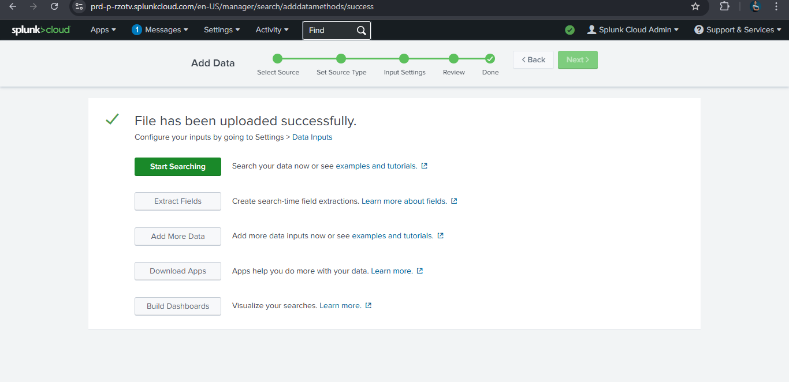

### Verifying Data Integrity

Before writing a single detection query, I verified the data was clean:

- Ran `index=main "Failed password"` to confirm events were indexed and searchable
- Checked that timestamps were chronologically accurate with no gaps
- Confirmed host, source, and sourcetype metadata was consistent across all events

This step matters because bad ingestion means bad analysis. I needed confidence the data was reliable before drawing any conclusions from it.

## 🔎 Phase 3: Hunting for Brute-Force Activity

### Starting Broad: How Many Failed Logins?

```spl
index=main "Failed password"
```

**Result: 520 failed login events.** That is not noise. That is a pattern worth investigating.

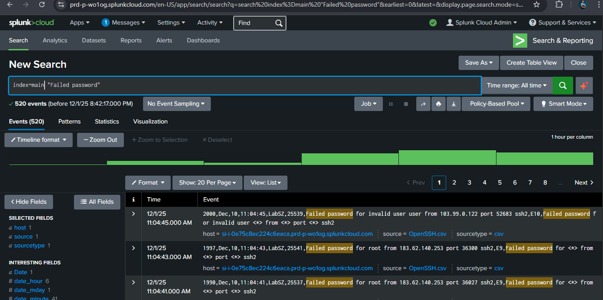

### Extracting Source IPs and Ranking by Frequency

The raw log entries did not have source IP as a structured field, so I used inline regex to extract it and immediately group by frequency to see who was hitting the system hardest:

```spl
index=main "Failed password"
| rex "(?<src_ip>\d{1,3}(?:\.\d{1,3}){3})"
| stats count by src_ip
| where count > 10
```

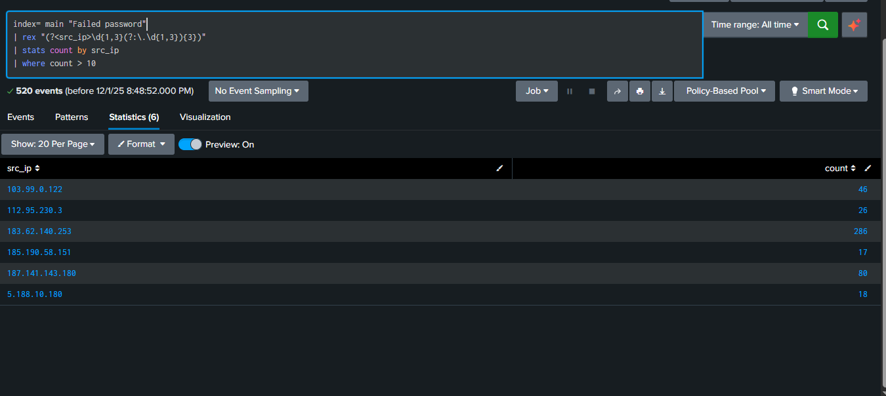

| IP Address | Failed Attempts | Origin |
|------------|----------------|--------|
| 183.62.140.253 | 286 | China, ChinaNet Shenzhen |
| 187.141.143.180 | 80 | Mexico, Uninet S.A. de C.V. |
| 103.99.0.122 | 46 | Vietnam, VPSONLINE Ltd. |
| 112.95.230.3 | 26 | China, China Unicom Guangdong |
| 5.188.10.180 | 18 | Russia, Petersburg Internet Network |
| 185.190.58.151 | 17 | Unknown origin |

286 attempts from a single IP is not manual. That is an automated brute-force script.

### Brute-Force Pattern: Sequential Ports

Looking at the raw events from `183.62.140.253` confirmed sequential port progression (33665, 34100, 34642, 35101), a clear sign of automated tooling rather than a human operator.

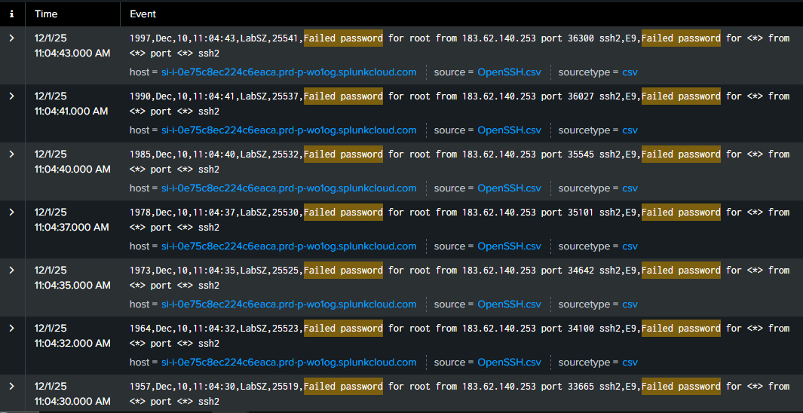

### What Accounts Were Being Targeted?

I correlated each attacking IP with the usernames it was trying to understand the targeting strategy.

`185.190.58.151` targeting `admin` and `api`:

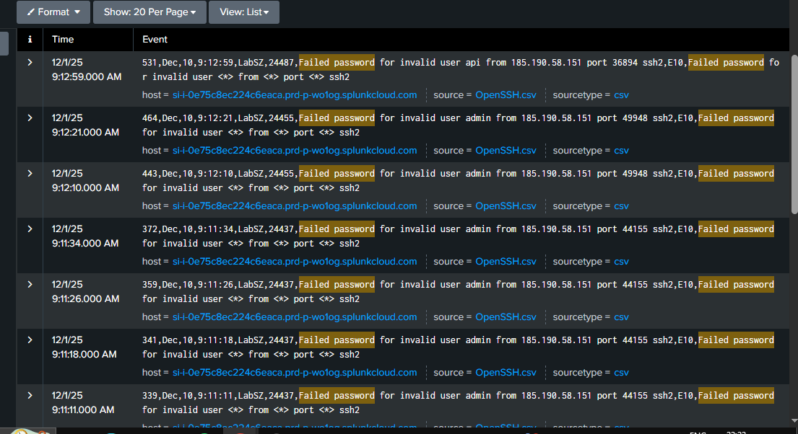

`103.99.0.122` cycling through user, guest, test, cisco accounts:

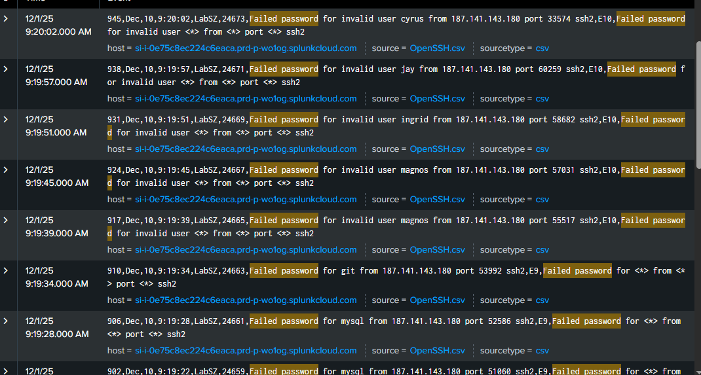

`5.188.10.180` probing guest, ftp, and default accounts:

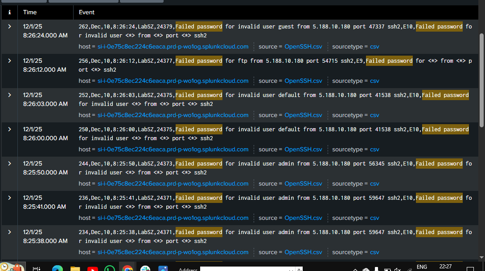

`187.141.143.180` targeting multiple usernames:

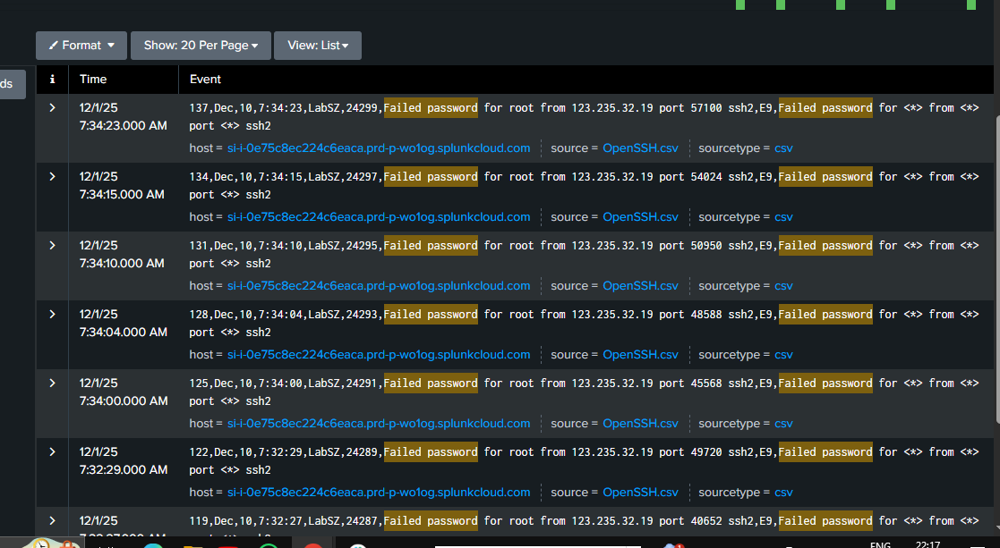

This is dictionary-based credential stuffing. Attackers were cycling through the most common default account names on Linux systems.

### Did Any of Them Get In?

That is always the most important question. I ran a query specifically checking for successful root authentication:

```spl
index=* "Accepted password for root"
| rex "from\s+(?<src_ip>\d{1,3}(\.\d{1,3}){3})"
| stats dc(src_ip) AS unique_root_ips
```

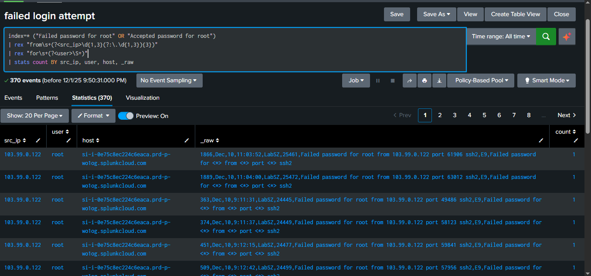

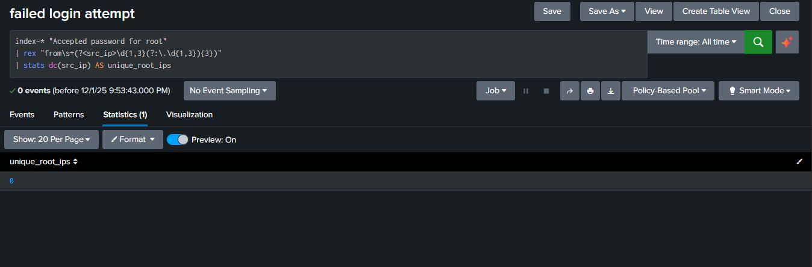

**Result: zero successful root logins.** Every attempt failed. The system held.

## 🧩 Phase 4: Building the src_ip Field Extraction

Running inline regex in every query works but it is inefficient. I created a persistent field extraction so `src_ip` would always be available as a structured field across all searches automatically.

### Configuring the Extraction

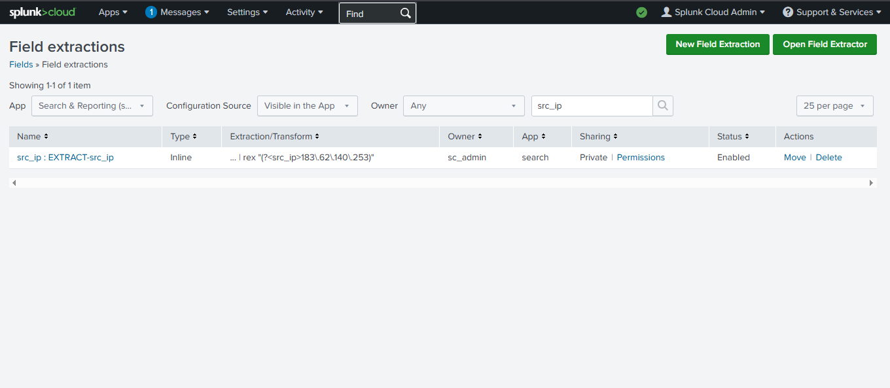

### Saving the Extraction

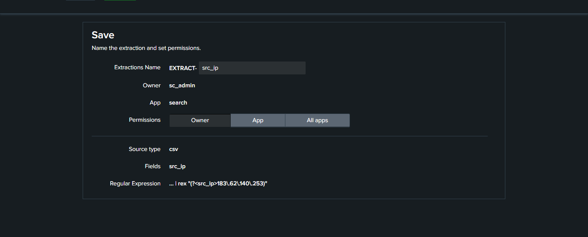

| Setting | Value |
|---------|-------|
| Destination App | search |
| Field Name | src_ip |
| Apply To | sourcetype = csv |
| Type | Inline |
| Extraction | `rex "(?<src_ip>\d{1,3}(?:\.\d{1,3}){3})"` |

### Extraction Confirmed Active

After saving, I validated it by running a count query and confirming the extracted IPs matched raw event frequency exactly.

## 📊 Phase 5: Dashboards and Alerts

### Dashboard: Disconnect Events

I built a dashboard panel around a specific preauth disconnect pattern from `112.95.230.3`. A `[preauth]` disconnect means the connection dropped before any credentials were exchanged, often a sign of automated port scanning before a brute-force run.

```spl
source="openssh_log.csv" host="DESKTOP-GB191B6" index=*
Status="Received disconnect from 112.95.230.3: 11: Bye Bye [preauth]"
```

This returned **26 events** visualized as a timeline.

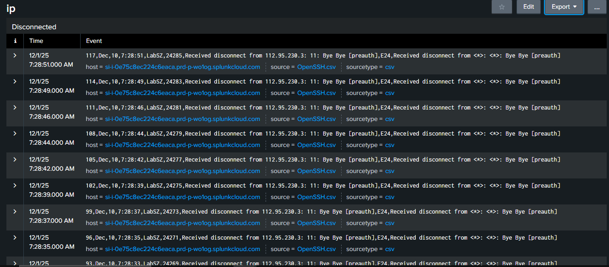

### Scheduled Alert Configuration

I configured a scheduled alert to trigger automatically when brute-force thresholds were crossed.

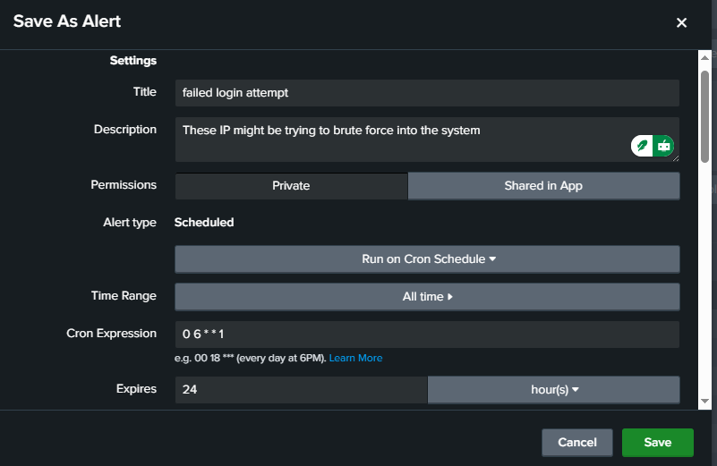

| Setting | Value |
|---------|-------|
| Title | failed login attempt |
| Trigger | More than 5 failed login attempts |
| Alert Type | Scheduled |
| Schedule | Cron: `0 6 * * 1` |
| Expiry | 24 hours |

### Alert Email Delivery Confirmed

I added all recipient email addresses and verified the alert actually fired by checking the incoming email from Splunk.

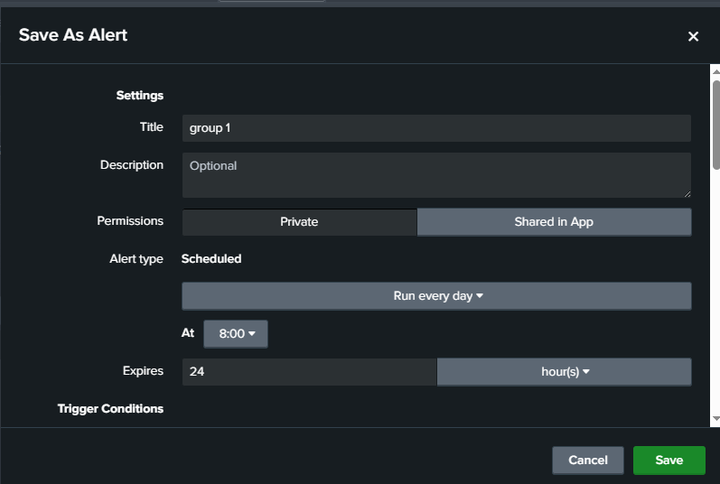

## 🌐 Phase 6: Threat Intelligence Verification

Splunk tells you what happened in your logs. External threat intel tells you what the world already knows about the actors involved. I checked every high-frequency IP across three sources.

### AbuseIPDB Results

`187.141.143.180` (Mexico, 935 reports, 0% confidence):


`5.188.10.180` (Russia, not found, data center):


`103.99.0.122` (Vietnam, 1 report, 0% confidence):

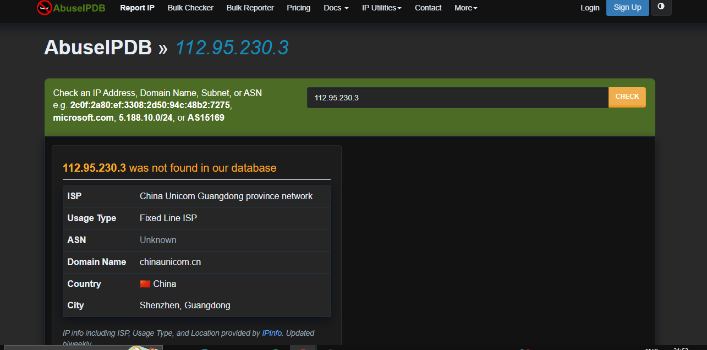

`112.95.230.3` (China Unicom, not found in database):

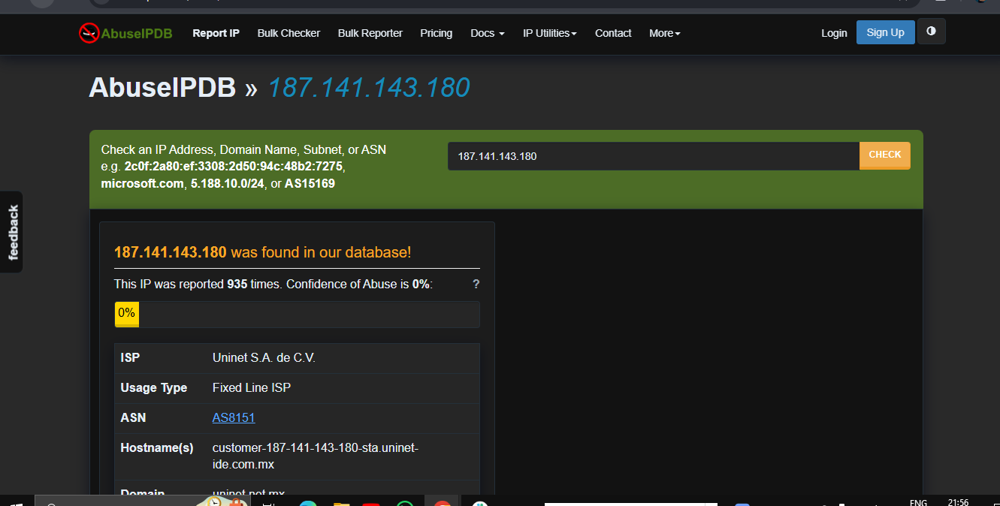

High report counts with 0% confidence do not mean an IP is clean. It means the community has not reached consensus. I treated low confidence as inconclusive, not exculpatory.

### VirusTotal

`183.62.140.253` was flagged by Xcitium Verdict Cloud as malware-related while 94 other vendors marked it clean. One flag out of 95 is a weak signal in isolation, but combined with 286 failed login attempts from that same IP, I classified it as high-risk.

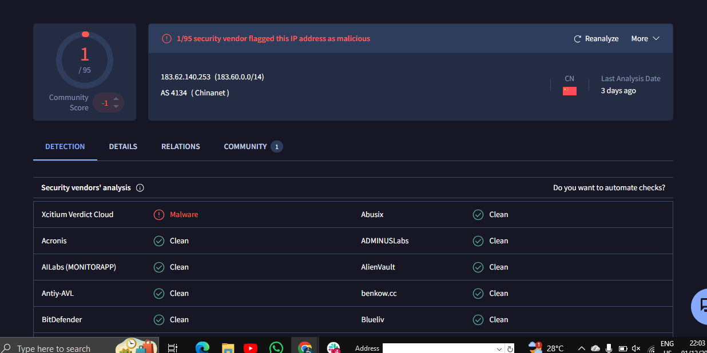

### WHOIS

WHOIS confirmed `183.62.140.253` belongs to ChinaNet Guangdong with abuse contacts listed, making it traceable and reportable directly to the ISP if escalation is needed.

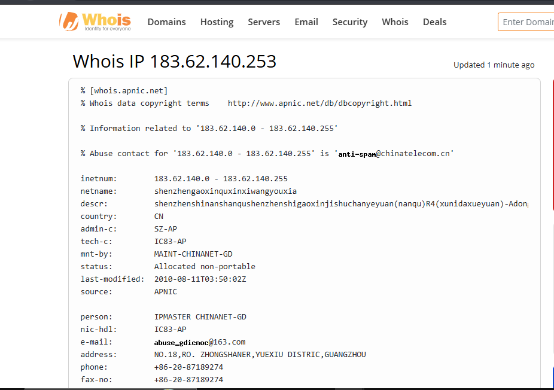

## 🧠 Threat Classification Summary

| Threat Category | Indicators | Example IPs |
|----------------|------------|-------------|
| Credential brute-force | 286+ failed attempts, sequential ports, automated pattern | 183.62.140.253, 187.141.143.180 |
| Distributed botnet traffic | Multiple international sources across data centers | 5.188.10.180, 103.99.0.122 |
| Low-confidence noise | High AbuseIPDB reports but 0% abuse confidence | 187.141.143.180 |
| Malware-associated IP | Vendor flag corroborated by brute-force log volume | 183.62.140.253 |
| Prevented intrusion | Zero successful root logins across all observed IPs | All IPs above |

## 🛠️ Recommendations

**Immediate:**
- Block all six identified IPs at the perimeter firewall
- Set `PermitRootLogin no` in `/etc/ssh/sshd_config`
- Deploy `fail2ban` with a ban threshold of 3 to 5 failed attempts within 5 minutes
- Disable password authentication entirely and enforce public key authentication only

**Short Term:**
- Move SSH off port 22 to a non-standard port to cut automated scanner noise
- Implement MFA for all SSH-capable accounts
- Restrict SSH access to known IPs or require VPN before access is possible

**Ongoing:**
- Weekly Splunk review of new high-frequency IP offenders
- Automate IP reputation enrichment via AbuseIPDB or AlienVault OTX lookup tables in Splunk
- Replace static count thresholds with behavioral baselines that flag deviations from normal patterns

## 💡 Skills Demonstrated

- Splunk Cloud administration: user management, role assignment, timezone configuration
- Log ingestion, source type configuration, and pre-analysis data integrity validation
- SPL query writing for authentication analysis, brute-force detection, and field correlation
- Regex-based field extraction and persistent field configuration
- Dashboard creation and scheduled alert configuration with email delivery verification
- External threat intelligence cross-referencing using VirusTotal, AbuseIPDB, and WHOIS
- Threat classification and structured security recommendation writing

## ✅ Takeaways

The full chain matters. Ingesting data is step one. The real work is knowing which questions to ask: how many failures, from where, against which accounts, at what frequency, and did anything succeed? Each query narrowed the picture until the attack pattern was undeniable.

520 failed login attempts is the headline. Zero successful root logins is the conclusion. Everything in between is the investigation.

**What I am building toward next:**
- [ ] Reproduce detection logic using Elastic SIEM (ELK Stack) for a comparative analysis
- [ ] Build MITRE ATT&CK-mapped correlation searches in Splunk
- [ ] Automate IP reputation enrichment directly into the Splunk pipeline via lookup tables

*See `EXECUTIVE_REPORT.md` for the business-facing summary of this investigation.*
*See `spl_queries.md` for all SPL queries used in this project.*
