# Honeypot Deployment on AWS: Threat Monitoring and Analysis

**Ejoke John | Cybersecurity Analyst**

**Pillar:** Threat Intelligence | **Tools:** T-Pot 24.04.1, AWS EC2, Kibana, Suricata, Kali Linux
**Region:** Asia Pacific (Tokyo) | **Observation Window:** 4 hours

> 958 attacks. 15+ countries. 4 hours. This is what the internet looks like when you intentionally leave a door open.

---

## About This Project

I built this project because I wanted to stop guessing what attackers actually do and start watching them do it.

A honeypot is one of the few tools in cybersecurity that flips the dynamic. Instead of waiting for an alert, you set a trap and observe. Every connection that hits it is hostile by definition. Every pattern that emerges is real intelligence, not a simulation.

I deployed this on AWS EC2 in the Tokyo region using T-Pot 24.04.1, a multi-honeypot framework built by Deutsche Telekom Security that runs over 20 honeypot daemons simultaneously. Within 20 minutes of going live, over 50 attacks had already registered. I left it running for 4 hours. By the end, 958 attack attempts had been captured from 15+ countries, with active CVE exploits dating back to 2013 still being used in the wild.

This project changed how I think about threat exposure. The internet does not wait. The moment a public IP is live, automated scanners find it. That reality shaped everything about how I approach defensive security now.

---

## Architecture Overview

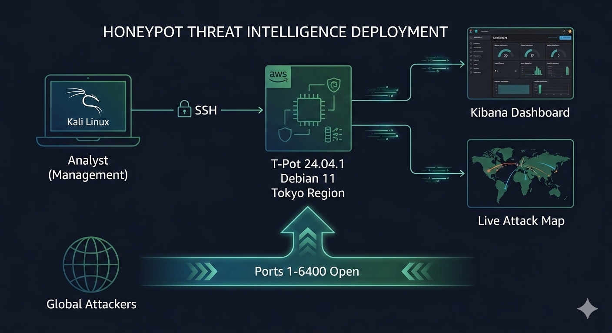

*Kali Linux management terminal connecting to AWS EC2 (Tokyo) running T-Pot 24.04.1, with Kibana and the live Attack Map as visualization outputs. Management ports locked to admin IP. Honeypot ports open to the entire internet.*

---

## What This Project Demonstrates

- Deploying a production-grade multi-honeypot platform on AWS EC2 from scratch
- Configuring AWS security groups to attract real-world attackers while locking down the management interface
- Installing and configuring T-Pot 24.04.1 on a Debian 11 EC2 instance
- Monitoring live global attacks using T-Pot's real-time Attack Map and Kibana dashboards
- Analyzing real threat intelligence: attack origins, targeted services, brute-force persistence patterns, and active CVE exploitation

---

## Table of Contents

- [Phase 1: What is a Honeypot](#phase-1-what-is-a-honeypot)
- [Phase 2: AWS Account and EC2 Setup](#phase-2-aws-account-and-ec2-setup)
- [Phase 3: Instance Configuration and SSH Access](#phase-3-instance-configuration-and-ssh-access)
- [Phase 4: Security Group and Inbound Rules](#phase-4-security-group-and-inbound-rules)
- [Phase 5: T-Pot Installation](#phase-5-t-pot-installation)
- [Phase 6: Attack Monitoring and Analysis](#phase-6-attack-monitoring-and-analysis)
- [Key Findings](#key-findings)
- [Challenges and Lessons Learned](#challenges-and-lessons-learned)

---

## Phase 1: What is a Honeypot

A honeypot is a deliberately exposed decoy system placed inside or alongside a network to attract attackers. It looks like a real target. It is not. Every connection made to it is suspicious by definition, because legitimate users have no reason to touch it.

Security teams use honeypots for three core reasons. First, early threat detection: attackers hit the honeypot before they reach real systems, giving defenders time to respond. Second, intelligence gathering: every attack attempt reveals the tools, techniques, and protocols the attacker is using. Third, isolation: the honeypot absorbs and logs attack traffic without putting any production infrastructure at risk.

This project uses **T-Pot 24.04.1**, built and maintained by Deutsche Telekom Security. T-Pot bundles over 20 individual honeypot daemons into a single deployable platform. Each daemon emulates a different service or vulnerability type. All attack data is logged into Elasticsearch and visualized through Kibana and a live attack map.

**Tools used in this project:**

| Tool | Purpose |
|------|---------|
| AWS EC2 | Cloud host for the honeypot instance |
| Debian 11 | Operating system (Amazon Machine Image) |
| T-Pot 24.04.1 | Multi-honeypot framework |
| Kibana | Attack data visualization dashboard |
| Suricata | Network intrusion detection and CVE identification |
| Kali Linux | Management terminal for SSH access |

---

## Phase 2: AWS Account and EC2 Setup

### Step 1: Creating the AWS Account

The first step was registering on AWS to gain access to EC2 and the cloud infrastructure needed to host the honeypot.


After registering, I navigated to the EC2 dashboard and selected the **Asia Pacific (Tokyo)** region. Tokyo was chosen deliberately to observe attack patterns targeting this part of the world.

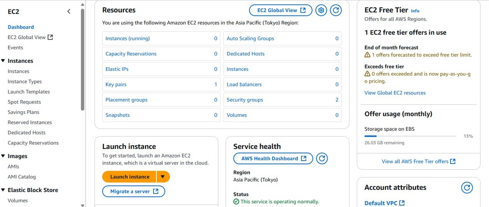

### Step 2: Selecting the AMI

An AMI is the operating system and software bundle the instance runs on. T-Pot requires a compatible Linux base. I initially tested Debian 12 but ran into compatibility issues during installation. After checking the T-Pot documentation and exploring the AWS Marketplace, **Debian 11** was the confirmed stable choice.

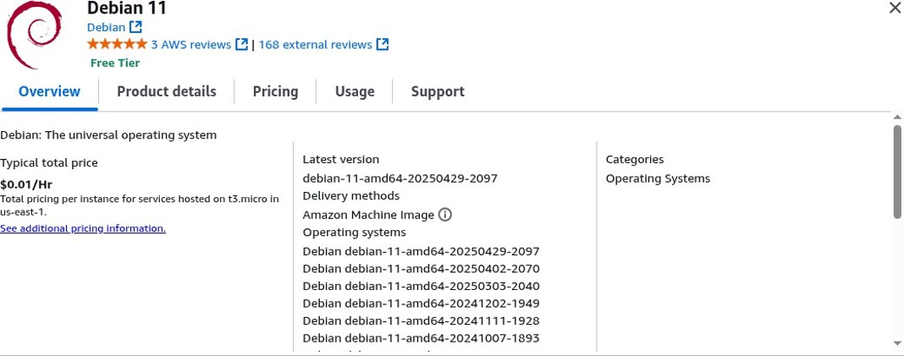

Pricing was reviewed upfront: $0.01/hr for the recommended instance size. Low cost, high value.

### Step 3: Selecting the Instance Type

T-Pot requires a minimum of 8 GB RAM to run its full stack simultaneously: 20+ honeypot containers, Elasticsearch, Logstash, and Kibana. I selected **t2.large**: 2 vCPU, 8 GiB memory. This met the requirements without over-provisioning.

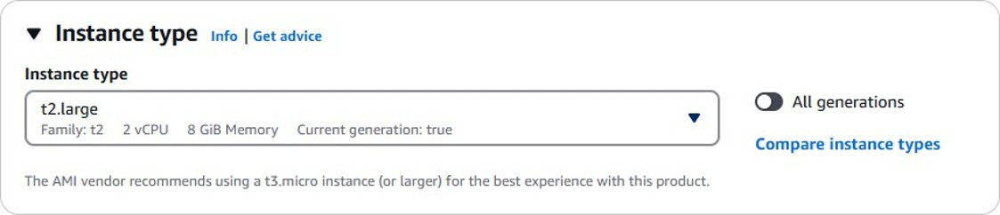

### Step 4: Creating the Key Pair

To connect to the instance securely, I generated an **RSA key pair** in .pem format. This file is required for all SSH authentication throughout the project and was saved to my Kali Linux desktop.

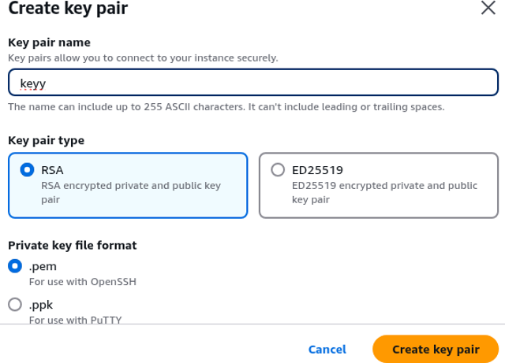

### Step 5: Configuring Network Settings

SSH traffic was restricted to **My IP** only. The management port is locked to my specific IP address. A separate inbound rule, configured in the next phase, opens the honeypot ports to the entire internet.

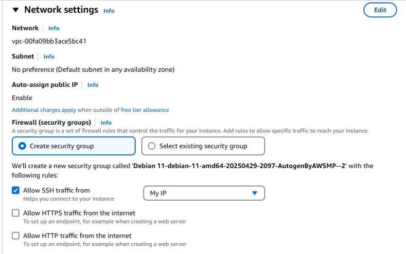

### Step 6: Storage Configuration and Instance Launch

**128 GB** of gp2 EBS storage was allocated. T-Pot persists honeypot logs for up to 30 days, so adequate storage is essential for any meaningful data collection window. After confirming storage, I clicked **Launch Instance**.

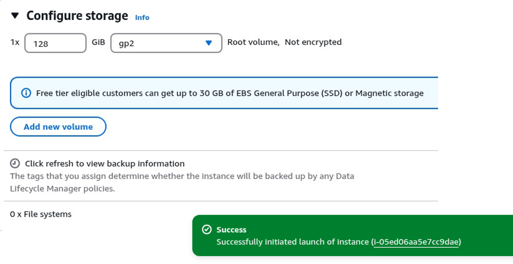

Instance launched successfully: `i-05ed06aa5e7cc9dae`

---

## Phase 3: Instance Configuration and SSH Access

### Step 7: Reviewing the SSH Connection Instructions

With the instance running, I opened the AWS console Connect to Instance panel and confirmed the correct connection syntax before switching to the terminal.

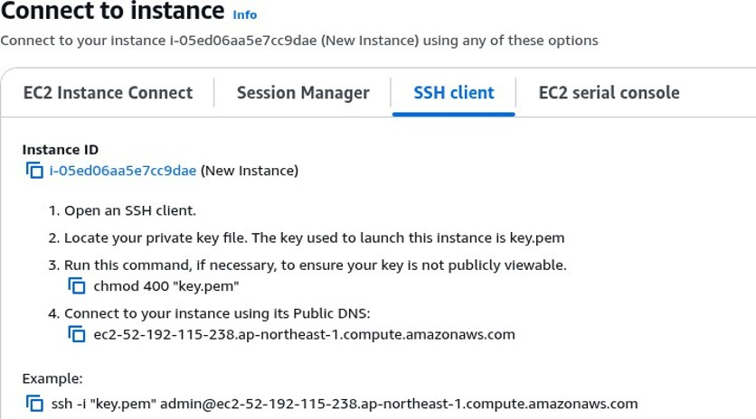

### Step 8: Connecting from Kali Linux

From the Kali Linux terminal, I navigated to the Desktop where the key file was saved, secured the file permissions, and established the initial SSH connection:

```bash
cd ~/Desktop
chmod 400 "key.pem"
ssh -i "key.pem" admin@ec2-52-192-115-238.ap-northeast-1.compute.amazonaws.com
```

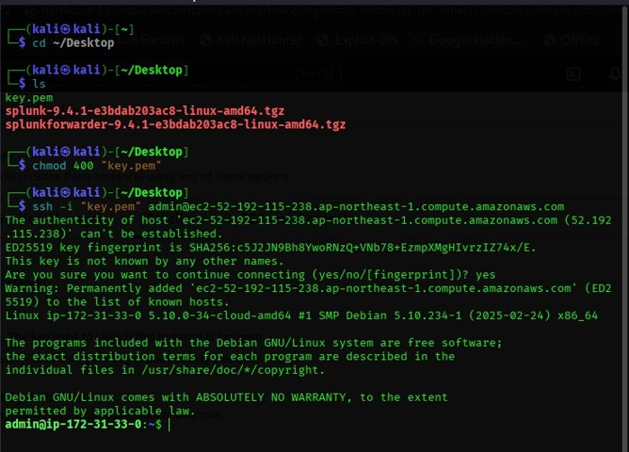

The terminal prompt switched from `kali@kali` to `admin@ip-172-31-33-0`, confirming a successful connection to the Debian 11 EC2 instance.

---

## Phase 4: Security Group and Inbound Rules

### Step 9: Configuring the Inbound Rules

This is the most important configuration step in the entire project. The inbound rules determine what traffic reaches the instance, and every decision here is deliberate.

I navigated to the Security tab of the running instance and added three custom TCP rules:

| Port | Source | Purpose |
|------|--------|---------|
| 64295 | My IP only | T-Pot management SSH port, admin access only |
| 64297 | My IP only | Kibana web dashboard, admin access only |
| 1 - 6400 | Anywhere (0.0.0.0/0) | Honeypot trap, open to the entire internet |

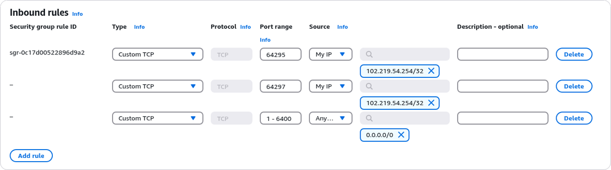

Ports 64295 and 64297 are T-Pot's management interfaces. They are locked to my IP address and unreachable by anyone else. The port range 1-6400 is intentionally open to the entire internet. This is the trap. Every connection attempt to these ports is hostile traffic, and T-Pot captures and logs every single interaction automatically.

---

## Phase 5: T-Pot Installation

### Step 10: Installing Git

Git is required to pull the T-Pot repository from GitHub.

```bash
sudo apt install git
```

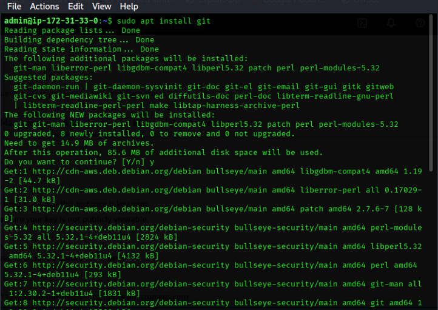

### Step 11: Cloning the Repository and Running the Installer

With Git available, I cloned the official T-Pot repository from Deutsche Telekom Security and ran the installation script:

```bash
git clone https://github.com/telekom-security/tpotce.git
cd tpotce
./install.sh
```

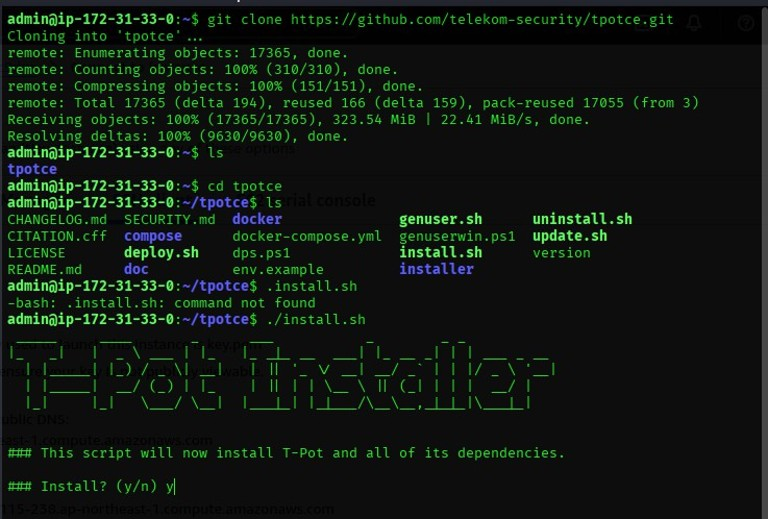

The installer pulled 17,365 objects (323.54 MiB) from GitHub, launched the T-Pot Installer banner, and prompted for confirmation. After answering `y`, it pulled all Docker images and configured every honeypot daemon automatically. No manual daemon configuration required.

### Step 12: Rebooting and Reconnecting

Once installation finished, T-Pot displayed all active network connections confirming every service was listening correctly, then instructed a system reboot to finalize configuration:

```bash
sudo reboot
```

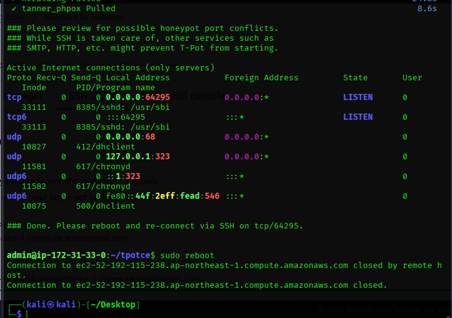

After the reboot, I reconnected on the new T-Pot management port rather than the default port 22:

```bash
ssh -i "key.pem" admin@ec2-52-192-115-238.ap-northeast-1.compute.amazonaws.com -p 64295
```

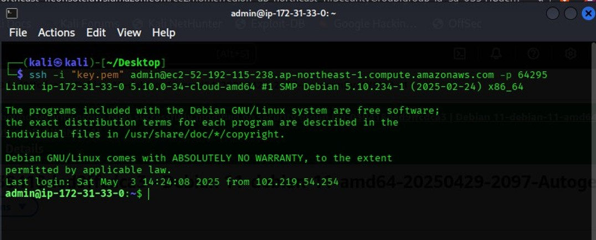

The `admin` prompt returned, confirming successful reconnection on the dedicated T-Pot SSH port.

### Step 13: Accessing the T-Pot Web Interface

I navigated to the T-Pot web interface using the instance's public IP and the management port:

```
https://52.192.115.238:64297
```

After entering the credentials set during installation, the T-Pot 24.04.1 landing page loaded successfully.

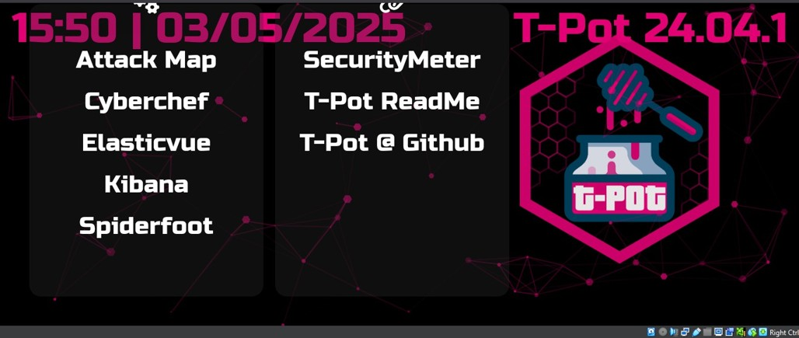

The dashboard gives direct access to the Attack Map, Kibana, Cyberchef, Elasticvue, Spiderfoot, and SecurityMeter. Everything was running. The honeypot was live and already collecting.

---

## Phase 6: Attack Monitoring and Analysis

### Step 14: The Live Attack Map

The first thing I opened was the Attack Map, a real-time geolocation visualization of every incoming connection hitting the honeypot. I expected to wait a while before seeing anything. Within 20 minutes, over 50 attacks had already registered.

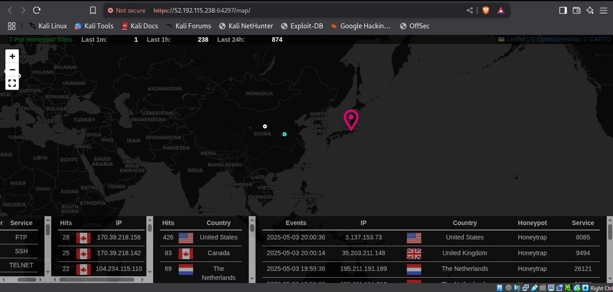

Stats at the time of capture: 238 attacks in the last hour, 874 in the last 24 hours. Attack sources plotted in real time across the globe, with the honeypot pinned in Japan.

That first 20 minutes told me everything I needed to know about what the internet looks like from the outside. I left the honeypot running for 4 hours.

The table at the bottom of the Attack Map surfaced behavioral patterns immediately. The same IP addresses were appearing multiple times in rapid succession. One Canadian IP had 28 hits. Another Canadian IP had 25. The top targeted services were **FTP, SSH, and Telnet**. These are not human operators manually probing a system. These are automated tools running continuously, cycling through credential lists and vulnerability checks until something responds.

### Step 15: Kibana Dashboard

Kibana is T-Pot's visualization layer, pulling all honeypot event data from Elasticsearch into structured, searchable dashboards. This is where the full picture of the 4-hour observation window came together.

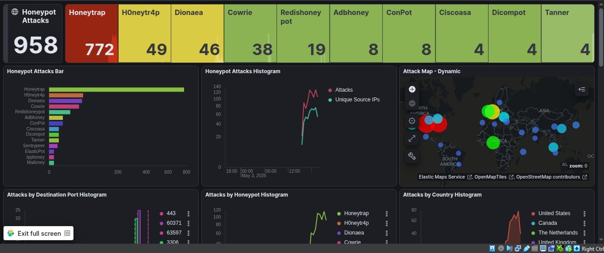

**Total attacks recorded: 958**

T-Pot runs multiple honeypot daemons simultaneously, each emulating a different type of target. Here is the breakdown of what was hit and what each daemon was designed to catch:

| Honeypot Daemon | Hits | What it Emulates |
|-----------------|------|-----------------|
| Honeytrap | 772 | Dynamically binds to open TCP ports and captures raw connection attempts across the full port range |
| H0neytr4p | 49 | HTTP and HTTPS vulnerability traps |
| Dionaea | 46 | Malware capture across SMB, HTTP, and FTP |
| Cowrie | 38 | SSH and Telnet brute-force interaction, logs full attacker session |
| Redishoneypot | 19 | Exposed Redis database instance |
| Adbhoney | 8 | Android Debug Bridge (ADB) exposure |
| ConPot | 8 | Industrial control systems, ICS and SCADA emulation |
| Ciscoasa | 4 | Cisco ASA firewall emulation |
| Dicompot | 4 | DICOM medical imaging protocol |
| Tanner | 4 | Web application vulnerability traps |

Honeytrap captured the largest share (772 of 958) because it binds dynamically to any port not already claimed by another daemon. That volume tells you most attackers were running full port range sweeps, not targeting specific known services. They probe everything and see what responds.

The attack histogram showed sustained, uninterrupted activity starting around 18:00 on May 3, 2025 and running through the entire observation window. Attack volume did not drop at any point. Attackers do not keep business hours.

Suricata, T-Pot's built-in network intrusion detection engine, flagged **three active CVE exploits** in its top detections during the session:

- **CVE-2013-747** — A vulnerability from 2013, still being used in active exploit kits in 2025
- **CVE-2016-200** — Still being probed nearly a decade after disclosure
- **CVE-2018-105** — A more recent vulnerability still circulating widely in automated attack tools

A vulnerability from 2013 showing up in a live attack session in 2025 is not an anomaly. It is a pattern. Attackers keep old exploits in rotation because organizations do not consistently patch, and something old will always find a way in somewhere.

---

## Key Findings

**The volume of attacks against a single exposed instance in 4 hours was nearly 1,000.** Projected forward, that is roughly 5,760 attacks per day. Real enterprise infrastructure faces this across hundreds of systems simultaneously, around the clock.

**The United States was the top attack source at 42% of all traffic** (400+ hits), followed by Canada at 9% (83 hits), the Netherlands at 7% (69 hits), and Germany at 5% (44 hits). Attacks came from 15+ countries in total. Geographic origin does not indicate a human operator in that country. It indicates where the automated attack infrastructure is hosted.

**Persistence from single IPs confirmed automated brute-force behavior.** 44 consecutive attempts from one German IP. 28 from one Canadian IP. 25 from another. These are credential stuffing and brute-force tools that run until they succeed or are blocked.

**FTP, SSH, and Telnet dominated as targeted services.** These are legacy protocols that remain widely exposed in production environments. Automated scanners know this and prioritize them.

**Three CVEs spanning 2013 to 2018 were actively exploited.** Old vulnerabilities do not retire when newer ones emerge. They stay in attacker toolkits as long as unpatched systems exist to exploit them.

---

## Challenges and Lessons Learned

**Getting the right AMI took troubleshooting.** Debian 12 caused T-Pot installation issues I could not resolve quickly. Switching to Debian 11 fixed everything immediately. The T-Pot documentation confirms Debian 11 as a supported base. If you reproduce this project, skip Debian 12 and start with Debian 11.

**Instance sizing is not optional.** T-Pot's full container stack is genuinely memory-hungry. Running it on anything under 8 GB RAM will cause services to crash under load. The t2.large was the right call.

**Security group configuration requires discipline.** One wrong rule and you either expose the admin panel to the internet or block all attack traffic from reaching the honeypot. The split approach used here, locking management ports to a single trusted IP while opening the honeypot port range to the world, is the correct design pattern.

**The internet found this instance within minutes.** No advertising. No special exposure. Just a public IP going live on AWS. Automated scanners continuously sweep the entire internet, and any new address is identified almost immediately. This is not theoretical. I watched it happen.

---

## Repository Structure

```
Threat_Intelligence/HONEYPOT-AWS/
├── README.md
└── screenshots/
    ├── 00-honeypot-architecture.png
    ├── 01-aws-signup-confirmation.png
    ├── 02-ec2-dashboard-tokyo.png
    ├── 03-debian11-ami-selection.png
    ├── 04-t2large-instance-type.png
    ├── 05-key-pair-creation.png
    ├── 06-network-settings-ssh-myip.png
    ├── 07-storage-128gb-launch-success.png
    ├── 08-aws-connect-ssh-instructions.png
    ├── 09-kali-ssh-initial-connection.png
    ├── 10-inbound-rules-configured.png
    ├── 11-git-install-terminal.png
    ├── 12-tpot-clone-install-script.png
    ├── 13-tpot-install-reboot.png
    ├── 14-ssh-reconnect-port64295.png
    ├── 15-tpot-landing-page.png
    ├── 16-attack-map-live.png
    └── 17-kibana-dashboard-958-attacks.png
```
