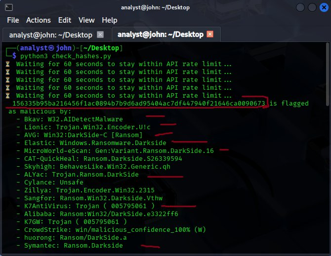
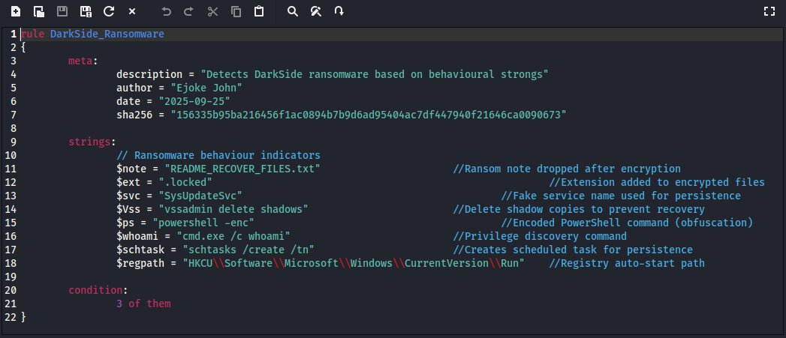
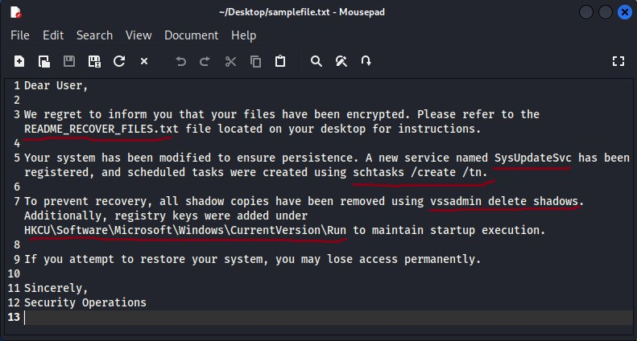
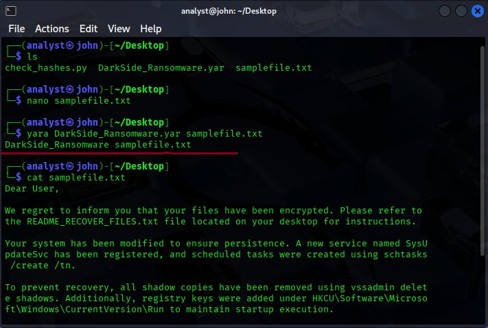

# DarkSide Ransomware : Threat Intelligence Investigation

> **Repo:** `Threat-Intelligence/darkside-ransomware-threat-intel/`  
> **Analyst:** Ejoke John | CyBlack SOC Academy  
> **Date:** July 2025  
> **Sample Hash (SHA-256):** `156335b95ba216456f1ac0894b7b9d6ad95404ac7df447940f21646ca0090673`

---

## Table of Contents

1. [Project Overview](#1-project-overview)
2. [Sample Discovery : VirusTotal API](#2-sample-discovery--virustotal-api)
3. [Threat Actor Profile](#3-threat-actor-profile)
4. [Notable Attacks & Campaign Analysis](#4-notable-attacks--campaign-analysis)
5. [Attack Lifecycle : MITRE ATT&CK Mapping](#5-attack-lifecycle--mitre-attck-mapping)
6. [Current Status & Successor Groups](#6-current-status--successor-groups)
7. [Indicators of Compromise (IOCs)](#7-indicators-of-compromise-iocs)
8. [YARA Detection Rule](#8-yara-detection-rule)
9. [Detection & Prevention Strategies](#9-detection--prevention-strategies)
10. [Tools & Environment](#10-tools--environment)
11. [References](#11-references)

---

## 1. Project Overview

This project documents a complete threat intelligence cycle that I conducted against a confirmed DarkSide ransomware sample : starting from initial hash discovery, through structured research and MITRE ATT&CK mapping, all the way to YARA rule development and actionable defense recommendations.

I carried out this investigation as part of a SOC home lab exercise at CyBlack SOC Academy, working inside a controlled Ubuntu virtual machine environment. The sample was one I identified myself from a batch of 50 SHA-256 hashes submitted to the VirusTotal API, which I then cross-correlated with MITRE ATT&CK Group G0139 (CARBON SPIDER / DarkSide) to confirm attribution and map the full attack lifecycle.

**Intelligence Cycle Phases I Covered:**

| Phase | What I Did |
|-------|------------|
| **Discovery** | Wrote a Python script to batch-submit 50 hashes to the VirusTotal API and identify the malicious sample |
| **Research & Analysis** | Linked the sample to the DarkSide family through structured TI research; mapped the full attack lifecycle to MITRE ATT&CK |
| **Detection Engineering** | Developed and validated a custom YARA rule with zero false positives |
| **Mitigation** | Produced actionable defense and prevention recommendations based on observed TTPs |

---

## 2. Sample Discovery : VirusTotal API

### My Methodology

I wrote a Python script using the `requests` library to submit 50 SHA-256 hashes in batches to the VirusTotal v3 API. The script was built to respect API rate limits, pausing for 60 seconds between requests to avoid throttling, and parsed each JSON response to extract detection counts and malware family classifications.

One hash immediately stood out : flagged as malicious by **over 60 security vendors**, with consistent and unanimous attribution to the DarkSide ransomware family across behavioural, signature, and heuristic detection engines.


*My Python script output showing the malicious hash flagged across multiple AV vendors via the VirusTotal API*

### Confirmed Malicious Hash

```
156335b95ba216456f1ac0894b7b9d6ad95404ac7df447940f21646ca0090673
```

**Full VirusTotal Report:** https://www.virustotal.com/gui/file/156335b95ba216456f1ac0894b7b9d6ad95404ac7df447940f21646ca0090673

### Vendor Detection Signatures

| Security Vendor | Detection Signature |
|----------------|---------------------|
| Microsoft | `Ransom:MSIL/Darkside.SK!MTB` |
| Elastic Security | `Windows.Ransomware.Darkside` |
| AVG / Avast | `Win32:DarkSide-C [Ransom]` |
| Kaspersky | `Trojan-Ransom.Win32.Gen.aayp` |
| BitDefender / Emsisoft / GData | `Gen:Variant.Ransom.DarkSide.16` |
| CrowdStrike | `win/malicious_confidence_100% (W)` |
| TrendMicro | `Ransom_DarkSide.R002C0DE121` |
| Malwarebytes | `Malware.AI.4023494292` |
| Symantec | `Ransom.Darkside` |

The unanimous detection across vendor families : behavioural engines (CrowdStrike, Elastic), signature engines (Microsoft, Kaspersky), and heuristic engines (Malwarebytes) : gave me high confidence this was a genuine DarkSide sample worth investigating further. I used this as the anchor for all subsequent research and attribution work.

---

## 3. Threat Actor Profile

**Group:** DarkSide (tracked as CARBON SPIDER by CrowdStrike; MITRE ATT&CK Group G0139)

| Attribute | Detail |
|-----------|--------|
| **First Observed** | April 2021 (creation timestamp: April 5, 2021) |
| **First Major Activity** | May 5, 2021 |
| **Shutdown Claimed** | May 2021 (post-Colonial Pipeline) |
| **Origin / Attribution** | Russian-speaking cybercriminal group |
| **Business Model** | Ransomware-as-a-Service (RaaS) |
| **Geographic Restrictions** | Explicitly avoided CIS (Commonwealth of Independent States) countries |
| **Sector Targets** | Energy, utilities, chemical distribution, manufacturing |
| **Excluded Targets** | Schools, hospitals, non-profits, government |
| **Successor Group** | BlackMatter (confirmed by CISA, July 2021) |
| **Links** | REvil (shared code/infrastructure patterns) |

### RaaS Business Model

One of the things that stood out to me in my research was how professionally DarkSide operated : more like a structured business than a typical criminal group. The core developers maintained the ransomware codebase and backend infrastructure, while recruited affiliates handled the actual intrusions and split ransom payments with the core team. The group maintained:

- A dedicated **press room** for issuing public statements and media communications
- A **victim hotline** for ransom negotiation support
- A **data leak site (DLS)** used to apply double-extortion pressure
- Affiliate profit-sharing tiers, typically 75–90% going to the affiliate

This level of operational sophistication is what made DarkSide particularly dangerous : it was scalable, and the affiliate model meant the core developers could stay at arm's length from individual attacks.

### Motivation & Tactics

- **Primary Motivation:** Financial extortion
- **Core Tactics:** Double-extortion (encrypt data + threaten public leak), RDP brute-force, phishing, PowerShell and registry abuse, data exfiltration via FTP or cloud staging

---

## 4. Notable Attacks & Campaign Analysis

### Colonial Pipeline : May 2021 (USA)

| Attribute | Detail |
|-----------|--------|
| **Target** | Colonial Pipeline Company |
| **Sector** | Energy / Critical Infrastructure |
| **Impact** | 5,500 miles of fuel pipeline shut down; ~45% of East Coast fuel supply disrupted |
| **Ransom Paid** | $4.4 million USD (partially recovered by DOJ) |
| **Consequence** | DarkSide publicly shut down operations shortly after due to law enforcement pressure |

This attack is what brought DarkSide to global attention and ultimately led to its downfall. What struck me during my research was that the pipeline itself wasn't directly compromised : the operational shutdown was a precautionary decision by Colonial after their IT billing systems were encrypted. That detail matters for defenders: ransomware hitting IT infrastructure can cascade into OT shutdowns even without the malware ever touching industrial systems. A national emergency was declared, and the DOJ later recovered roughly $2.3 million of the ransom through cryptocurrency tracing.

### Brenntag : May 2021 (Germany)

| Attribute | Detail |
|-----------|--------|
| **Target** | Brenntag SE |
| **Sector** | Chemical Distribution (world's largest) |
| **Data Stolen** | ~150 GB of employee and corporate data |
| **Ransom Paid** | $4.4 million USD |
| **Entry Vector** | Credential theft (purchased stolen credentials) |

The Brenntag attack is a textbook example of why credential hygiene matters. DarkSide affiliates purchased stolen credentials : they didn't need a zero-day or sophisticated exploit, just valid credentials that were already for sale. The $4.4M ransom paid within the same month as Colonial Pipeline showed the group was running multiple high-value operations simultaneously through its affiliate network.

### Target Industry Pattern

Across both attacks and broader DarkSide campaign data, I observed a clear pattern: the group deliberately targeted high-revenue organisations in sectors where operational downtime carries extreme financial and reputational risk. Energy and chemical distribution were prime targets precisely because these organisations cannot afford extended outages : which maximises ransom payment pressure.

---

## 5. Attack Lifecycle : MITRE ATT&CK Mapping

**MITRE ATT&CK Group:** [G0139 : CARBON SPIDER (DarkSide)](https://attack.mitre.org/groups/G0139/)

I mapped the full DarkSide attack lifecycle to the MITRE ATT&CK framework using the G0139 group page, CISA advisory AA21-131A, and behavioral indicators observed in the sample. The table below covers all techniques I identified across the kill chain.

### Full Kill Chain

| Phase | Tactic | Technique | Details |
|-------|--------|-----------|---------|
| **Initial Access** | TA0001 | T1566 : Phishing | Spearphishing links/attachments; compromised RDP credentials via brute-force or dark web purchase |
| **Execution** | TA0002 | T1059.001 : PowerShell | DLL payload launched via PowerShell; encoded CMD commands |
| | | T1059.003 : CMD | Base64-encoded command execution for payload delivery |
| **Persistence** | TA0003 | T1543.003 : New Service | Creates `SysUpdateSvc` service for persistence |
| | | T1053.005 : Scheduled Task | `schtasks /create /tn` for recurring execution |
| | | T1547.001 : Registry Run Keys | `HKCU\Software\Microsoft\Windows\CurrentVersion\Run` |
| **Privilege Escalation** | TA0004 | T1068 | Exploits vulnerabilities to achieve SYSTEM-level privileges |
| **Defense Evasion** | TA0005 | T1490 : Shadow Copy Deletion | `vssadmin delete shadows` to prevent recovery |
| | | T1070.001 : Log Clearing | Clears Windows event logs |
| | | T1027 : Obfuscation | PowerShell `-enc` (encoded commands) |
| | | T1036 : Masquerading | Copies itself to trusted paths (e.g., `System32`) |
| **Discovery** | TA0007 | T1083 : File & Directory Discovery | Enumerates files and directories for encryption targeting |
| | | T1135 : Network Share Discovery | Scans for accessible network shares |
| | | T1087.002 : AD Account Discovery | Enumerates Active Directory accounts |
| | | T1057 : Process Discovery | `cmd.exe /c whoami` for privilege discovery |
| **Command & Control** | TA0011 | T1071.001 : HTTPS | C2 communication over HTTPS to suspicious domains |
| **Exfiltration** | TA0010 | T1048 : Exfiltration via Alt Protocol | Data staged and exfiltrated via FTP or cloud storage |
| **Impact** | TA0040 | T1486 : Data Encrypted for Impact | RSA-1024 + Salsa20 encryption; `.darkside` extension appended |
| | | T1490 : Inhibit System Recovery | Shadow copy deletion; disables backup services |
| | | T1491 : Ransom Note | Drops `README_RECOVER_FILES.txt` in each encrypted directory |

### Encryption Implementation

Something I found particularly interesting technically was DarkSide's two-layer encryption scheme:
- **Salsa20** for encrypting file content : a fast stream cipher that can process large volumes of data quickly
- **RSA-1024** for encrypting the Salsa20 session key : meaning the private key never touches the victim's machine

This design is specifically chosen to make decryption impossible without the attacker's private RSA key, even if a victim captures the ransomware binary and reverse-engineers it.

---

## 6. Current Status & Successor Groups

### DarkSide "Shutdown" (May 2021)

Following the Colonial Pipeline attack and the resulting law enforcement pressure, DarkSide announced it was ceasing operations, claiming its servers and cryptocurrency had been seized. In my research I found this was widely assessed by CISA and the broader threat intelligence community as a tactical rebranding rather than a genuine closure : the evidence for that assessment came quickly.

### BlackMatter (July 2021)

BlackMatter emerged just two months after DarkSide's announced shutdown. When I reviewed the technical indicators, the overlaps were too strong to be coincidental:

- Identical or near-identical encryption routines in the binary
- Shared code patterns and RaaS affiliate infrastructure
- Consistent target selection criteria (avoiding CIS countries, hospitals, schools)
- Same profit-sharing model structure for affiliates

CISA formally identified BlackMatter as a DarkSide successor in July 2021. BlackMatter itself shut down in November 2021, again under law enforcement pressure. The pattern : rebrand, operate, shut down, rebrand : is now a well-documented cycle in the RaaS ecosystem, and understanding it is important for TI analysts tracking long-term threat actor lineage.

---

## 7. Indicators of Compromise (IOCs)

The IOCs below were aggregated from the confirmed sample, CISA advisory AA21-131A, MITRE ATT&CK G0139, and supporting threat intelligence reports.

### File Indicators

| Indicator Type | Value | Description |
|---------------|-------|-------------|
| **SHA-256** | `156335b95ba216456f1ac0894b7b9d6ad95404ac7df447940f21646ca0090673` | Confirmed DarkSide ransomware sample |
| **Ransom Note** | `README_RECOVER_FILES.txt` | Dropped in each encrypted directory |
| **File Extension** | `.darkside` | Appended to encrypted files |
| **File Extension (alt)** | `.locked` | Observed in some variants |

### Registry Indicators

| Indicator Type | Value | Description |
|---------------|-------|-------------|
| **Registry Key** | `HKCU\Software\Microsoft\Windows\CurrentVersion\Run` | Persistence via run key |
| **Service Name** | `SysUpdateSvc` | Fake service created for persistence |

### Behavioural Indicators

| Indicator Type | Value | Description |
|---------------|-------|-------------|
| **Command** | `vssadmin delete shadows /all /quiet` | Shadow copy deletion |
| **Command** | `schtasks /create /tn` | Scheduled task creation |
| **Command** | `cmd.exe /c whoami` | Privilege discovery |
| **PowerShell** | `powershell -enc [base64]` | Encoded payload execution |

### Network Indicators

| Indicator Type | Value | Description |
|---------------|-------|-------------|
| **Protocol** | HTTPS | C2 communication channel |
| **Pattern** | Suspicious domains (dynamic DNS) | C2 beaconing pattern |

> **Note:** Specific C2 domain values were not recoverable from the analysed sample. For current IOC feeds, reference [CISA AA21-131A](https://www.cisa.gov/news-events/cybersecurity-advisories/aa21-131a) and [MITRE ATT&CK G0139](https://attack.mitre.org/groups/G0139/).

---

## 8. YARA Detection Rule

The YARA detection rule I wrote for this investigation is located at: [`darkside_ransomware_detection.yar`](darkside_ransomware_detection.yar)

### How I Built It

I started by reviewing the behavioural indicators I'd aggregated across the MITRE ATT&CK mapping and IOC research, then selected eight strings that are tightly tied to DarkSide's specific behaviour : things that wouldn't appear in legitimate software. I authored the rule in Sublime Text and structured it with a condition of `3 of them`, meaning at least three of the eight indicators must be present to trigger detection. This threshold balances broad coverage with false positive control.


*The YARA rule I authored in Sublime Text : eight DarkSide behavioural string indicators with a 3-of-8 detection condition*

**The eight string indicators I used:**

| String | What It Detects |
|--------|-----------------|
| `README_RECOVER_FILES.txt` | Ransom note filename dropped post-encryption |
| `.locked` / `.darkside` | File extensions appended to encrypted files |
| `SysUpdateSvc` | Fake service name used for persistence |
| `vssadmin delete shadows` | Shadow copy deletion to prevent recovery |
| `powershell -enc` | Obfuscated PowerShell execution |
| `cmd.exe /c whoami` | Privilege discovery command |
| `schtasks /create /tn` | Scheduled task creation for persistence |
| `HKCU\Software\Microsoft\Windows\CurrentVersion\Run` | Registry auto-start path |

### How I Validated It

To test the rule, I created a synthetic file (`samplefile.txt`) that mimics what a DarkSide ransom note and system modification log would look like : embedding the behavioural strings the rule targets. I then ran the YARA CLI against it on Kali Linux.


*The synthetic test file I created : embedding DarkSide behavioural indicators to simulate a real detection scenario*


*YARA CLI confirming a successful match: `DarkSide_Ransomware samplefile.txt` : the rule fired correctly with zero false positives on benign comparison files*

```bash
yara darkside_ransomware_detection.yar samplefile.txt
# Output: DarkSide_Ransomware samplefile.txt  ✓
```

> **Tuning Note:** In a production EDR or SIEM environment, I'd recommend increasing the threshold to `4 of them` to further reduce false positive risk while maintaining strong detection coverage.

---

## 9. Detection & Prevention Strategies

Based on my analysis of DarkSide's TTPs, the following controls directly address the attack vectors and behaviours I observed.

### Endpoint & Detection

| Control | Why It Matters for DarkSide |
|---------|----------------------------|
| **EDR with Behavioural Detection** | DarkSide's most detectable behaviours : shadow copy deletion, encoded PowerShell, new service creation : are exactly what behavioural EDR engines are built to catch |
| **SIEM Integration** | Centralise logs and alert on `vssadmin delete shadows`, unexpected service creation, and scheduled task anomalies |
| **Custom YARA Rules** | Deploy the rule in this repo via your threat hunting platform for proactive detection |
| **IOC Feeds** | Integrate DarkSide IOCs from CISA and commercial TI feeds into your detection stack |

### Network Security

| Control | Why It Matters for DarkSide |
|---------|----------------------------|
| **Network Segmentation** | DarkSide scans for network shares and AD accounts : segmentation limits how far an affiliate can move laterally after initial access |
| **Zero Trust Architecture** | Removes the implicit trust that allows lateral movement once a foothold is established |
| **Firewall Hardening** | Restrict inbound RDP (TCP 3389) : a primary DarkSide initial access vector |
| **Secure Remote Access** | Replace exposed RDP with hardened VPN + MFA or ZTNA |

### Identity & Access

| Control | Why It Matters for DarkSide |
|---------|----------------------------|
| **MFA** | Would have blocked the Brenntag intrusion : stolen credentials alone wouldn't have been enough |
| **Least Privilege** | Prevents standard user accounts from running PowerShell or creating services |
| **Strong Credential Policy** | Defends against RDP brute-force and credential-stuffing, both used by DarkSide affiliates |
| **PAM** | Monitor and vault privileged account usage; flag anomalous privilege escalation |

### Resilience & Recovery

| Control | Why It Matters for DarkSide |
|---------|----------------------------|
| **Offline / Air-Gapped Backups** | DarkSide specifically targets VSS shadow copies and network-accessible backups : offline backups are the last line of defence |
| **Backup Testing** | A backup that hasn't been tested for recovery is not a reliable backup |
| **Patch Management** | DarkSide affiliates actively exploit unpatched RDP and VPN vulnerabilities for initial access |
| **Email Filtering** | Block malicious attachments and enforce DMARC/DKIM/SPF to stop phishing at the perimeter |

---

## 10. Tools & Environment

| Tool | How I Used It |
|------|--------------|
| **Ubuntu VM** | Isolated analysis environment for the full investigation |
| **Python 3 + `requests` library** | Wrote the VirusTotal API batch hash submission script |
| **VirusTotal v3 API** | Sample identification and vendor detection correlation |
| **YARA (CLI)** | Detection rule validation against test samples |
| **Kali Linux** | YARA rule testing environment |
| **Sublime Text** | YARA rule authoring |
| **MITRE ATT&CK Navigator** | Attack lifecycle mapping against Group G0139 |

---

## 11. References

| Source | Link |
|--------|------|
| MITRE ATT&CK : G0139 (DarkSide) | https://attack.mitre.org/groups/G0139/ |
| CISA Advisory AA21-131A | https://www.cisa.gov/news-events/cybersecurity-advisories/aa21-131a |
| FBI Flash MC-000147-MW | https://www.aha.org/system/files/media/file/2021/05/fbi-tlp-white-flash-darkside-ransomware.pdf |
| VirusTotal Sample Report | https://www.virustotal.com/gui/file/156335b95ba216456f1ac0894b7b9d6ad95404ac7df447940f21646ca0090673 |
| Mandiant / FireEye DarkSide Report | https://www.mandiant.com/resources/darkside-ransomware-victims-sold-to-investors |
| Colonial Pipeline DOJ Recovery | https://www.justice.gov/opa/pr/department-justice-seizes-23-million-cryptocurrency-paid-ransomware-extortionists-darkside |

---

*This investigation was completed as part of a structured threat intelligence lab exercise at CyBlack SOC Academy. All analysis was conducted in a controlled, isolated environment. No malicious files were executed on production systems.*

*: Ejoke John | [[LinkedIn]](https://www.linkedin.com/in/john-ejoke/) | 
