# Nessus Vulnerability Assessment: End-to-End Linux Infrastructure Security Evaluation

**Author:** Ejoke John Oghenekewe | Cybersecurity Analyst | SOC Engineer
**Completed:** October 2025
**Stack:** Tenable Nessus Essentials · Kali Linux · OpenSSH · Nginx 1.15.5 · Ansible · Gmail SMTP

---

## What This Project Is About

Most vulnerability management exercises stop at running a scan and reading the output. This one does not.

This project walks through the complete vulnerability management lifecycle from first principles: set up the environment, configure authenticated access, deploy a deliberately vulnerable web service, scan it, understand every finding, automate the reporting, and then remediate everything with infrastructure-as-code. Every decision has a reason behind it, and this documentation walks through each one.

The target was a Kali Linux host running an intentionally outdated version of Nginx (v1.15.5), a release with documented, real-world CVEs spanning remote code execution, denial of service, and information disclosure. Nessus found them all. Ansible fixed them all. That is the loop this project closes.

---

## Key Results

| Metric | Result |
|---|---|
| Credentialed Scan Vulnerabilities Found | **94 total across all severity levels** |
| Web Application Vulnerabilities (Nginx 1.15.5) | **4 High, 4 Medium (8 distinct CVE groups)** |
| CVEs Identified and Documented | **7 distinct CVEs across 4 vulnerability groups** |
| Remediation Method | **Ansible Playbook (Infrastructure-as-Code)** |
| Nginx Version Before Patch | **1.15.5 (vulnerable)** |
| Nginx Version After Patch | **1.28.0 (latest stable)** |
| Remediation Rate | **100%** |
| Automated Email Reporting | **Confirmed delivery via Gmail SMTP** |
| Frameworks Referenced | **NIST SP 800-40, ISO/IEC 27001, NIST CSF** |

---

## Architecture Overview

The diagram below shows the full pipeline from environment configuration through scanning, analysis, reporting, and remediation validation.

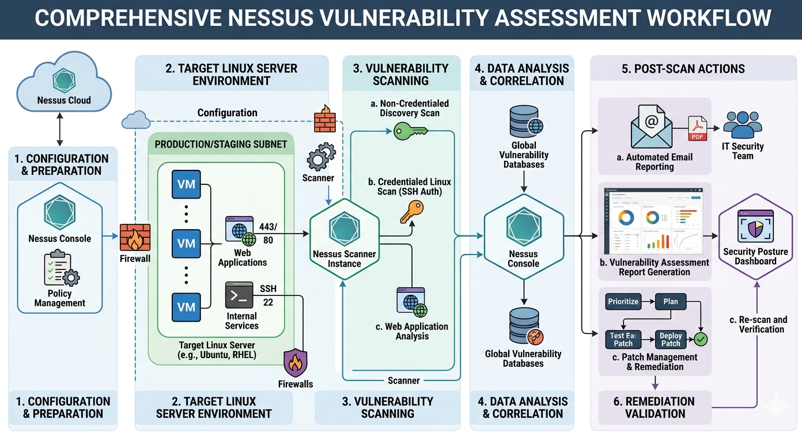

The pipeline runs in six stages:

1. **Configuration and Preparation** - Nessus console setup, policy management
2. **Target Linux Server Environment** - Kali Linux VM with Nginx, SSH, and web application services
3. **Vulnerability Scanning** - Non-credentialed discovery scan followed by credentialed SSH-authenticated scan and web application analysis
4. **Data Analysis and Correlation** - Nessus correlates findings against global vulnerability databases
5. **Post-Scan Actions** - Automated email reporting, vulnerability assessment report generation, patch management
6. **Remediation Validation** - Re-scan confirms all CVEs are resolved

---

## Tools and Technologies

| Tool | Role | Version |
|---|---|---|
| Tenable Nessus Essentials | Vulnerability scanner, credentialed and web app scans | 10.9.4 |
| Kali Linux | Host OS, target environment | Rolling |
| OpenSSH | Authenticated access for credentialed scanning | 1:10.0p1-8 |
| Nginx | Vulnerable web service (deliberate legacy deployment) | 1.15.5 |
| Ansible | Patch management automation via YAML playbook | Core 2.19.2 |
| Gmail SMTP | Automated vulnerability report delivery | TLS, Port 587 |

---

## Repository Structure

```
nessus-vulnerability-assessment/
├── README.md                          # This file
├── update_nginx.yml                   # Ansible remediation playbook
├── docs/
│   └── ossec-smtp-config.md           # SMTP configuration reference
└── screenshots/
    ├── 00-architecture-topology.png
    ├── 01a-ssh-install.png
    ├── 01b-ssh-active-running.png
    ├── 02a-nessus-registration-email.png
    ├── 02b-nessus-registration-form.png
    ├── 02c-nessus-download-complete.png
    ├── 03a-nessusd-start.png
    ├── 03b-nessus-dpkg-install.png
    ├── 03c-nessus-activation.png
    ├── 03d-nessus-welcome.png
    ├── 04a-nessus-dashboard-empty.png
    ├── 04b-nessus-scan-templates.png
    ├── 05a-credentialed-scan-config.png
    ├── 05b-credentialed-scan-ssh-creds.png
    ├── 06-credentialed-scan-complete.png
    ├── 07a-scan-result-94-vulns-list.png
    ├── 07b-scan-result-auth-pass-chart.png
    ├── 08-nginx-version-check-1.26.3.png
    ├── 09-web-app-scan-no-critical-vulns.png
    ├── 10-nginx-downgrade-remove.png
    ├── 11-nginx-install-1.15.5.png
    ├── 13a-web-app-scan-running.png
    ├── 13b-new-web-app-scan-complete.png
    ├── 14a-scan-result-hosts-view.png
    ├── 14b-scan-result-11-vulns-detail.png
    ├── 19-smtp-config-nessus.png
    ├── 20a-gmail-2fa-enabled.png
    ├── 20b-gmail-app-password.png
    ├── 21-test-email-received.png
    ├── 22-ansible-installed-version.png
    ├── 23-ansible-yaml-playbook.png
    ├── 24-ansible-playbook-executed.png
    └── 25-nginx-patched-1.28.0.png
```

---

## The Full Build Walkthrough

---

### Phase 1: Preparing the Environment for Credentialed Scanning

#### Configuring OpenSSH

The first step was SSH. This is not a convenience step. Nessus credentialed scanning works by authenticating to the target over SSH and running privilege-level checks against the system internals. Without it, you get a surface scan that only sees open ports and service banners. With it, you get deep visibility into installed package versions, file permissions, kernel configuration, and service states.

System updated, SSH installed, service started and enabled on boot:

```bash
sudo apt update && sudo apt install ssh
sudo systemctl start ssh
sudo systemctl enable ssh
sudo systemctl status ssh
```

The `enable` command is the one that matters for a lab environment. If the system reboots and SSH is not enabled to start automatically, the next credentialed scan fails silently.

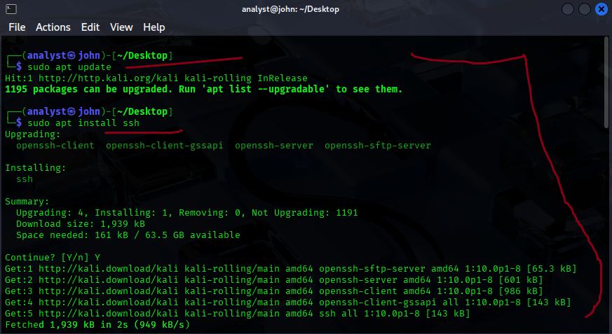

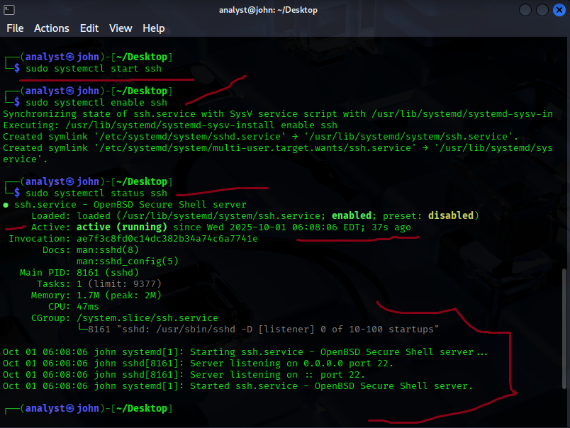

---

#### Downloading and Installing Nessus Essentials

Registered at the Tenable website to receive an activation code. Nessus Essentials is the free tier and covers everything needed: credentialed scanning, web application testing, plugin-based CVE detection, and SMTP reporting.

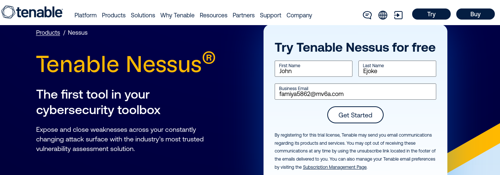

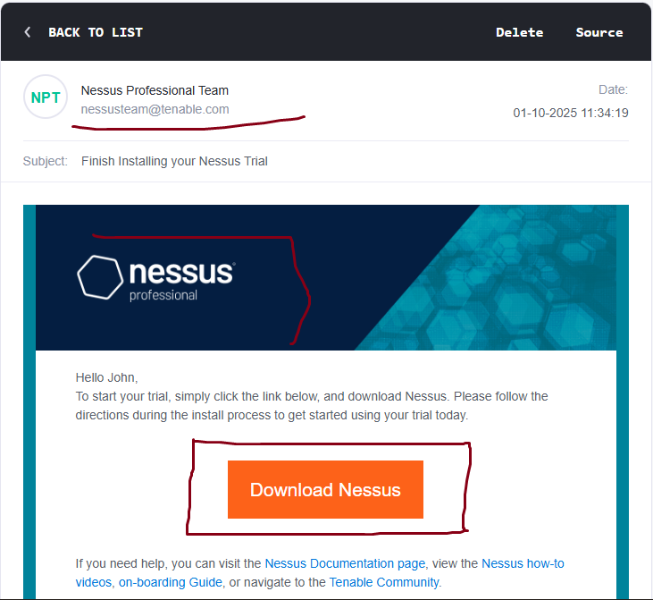

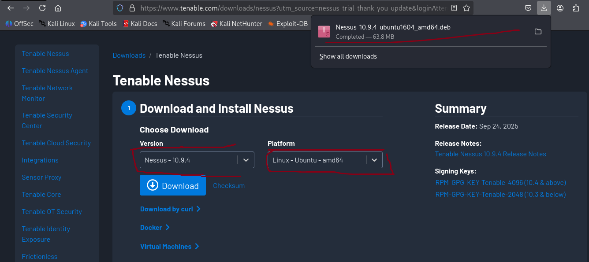

Once downloaded, installed the package and started the service:

```bash
sudo dpkg -i Nessus-10.9.4-ubuntu1604_amd64.deb
sudo systemctl start nessusd
sudo systemctl status nessusd
```

Every self-test in the install output shows Pass across all cryptographic modules, confirming the binary is clean and the service is healthy.

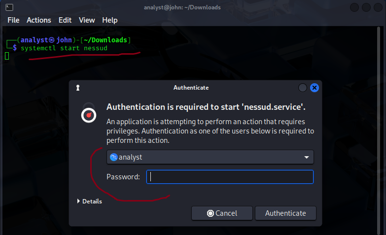

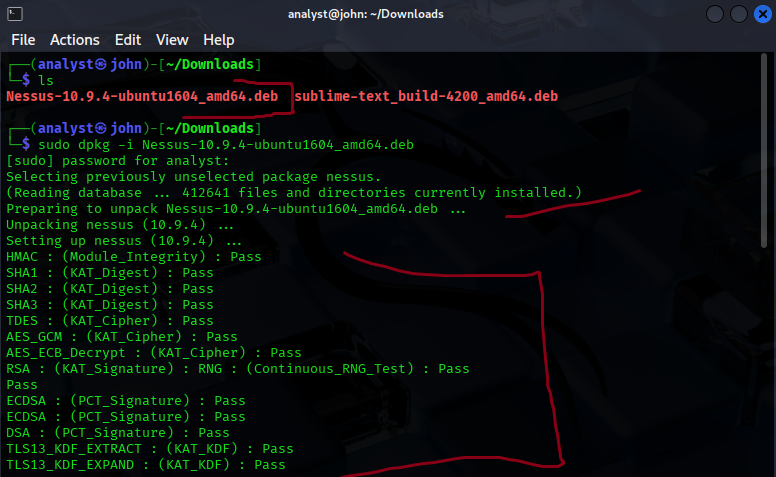

Navigated to `https://localhost:8834`, completed activation with the code from the email.

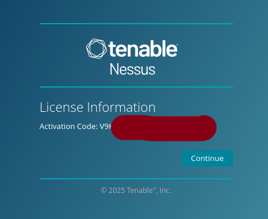

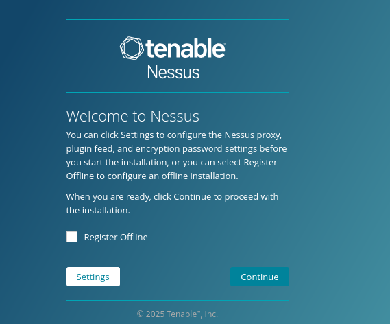

Dashboard confirmed live with scan templates visible:

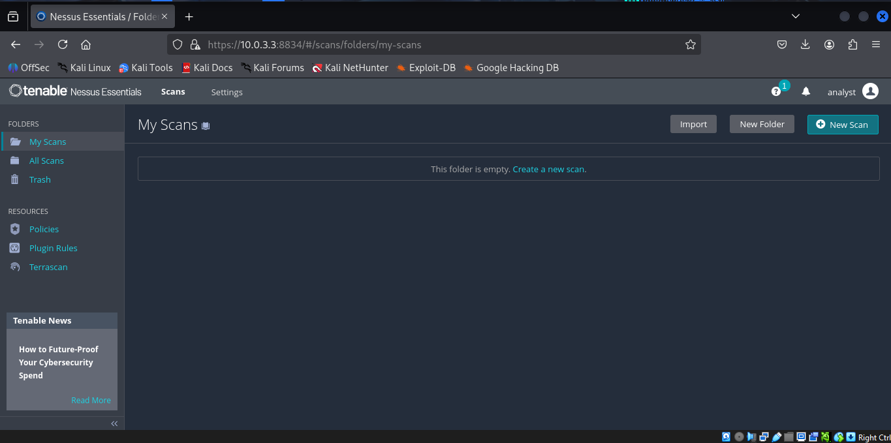

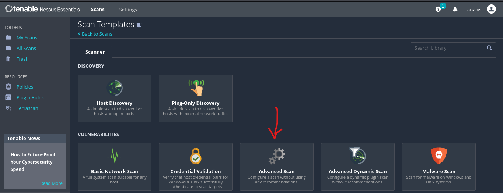

---

### Phase 2: Running the Credentialed Scan

#### Configuring SSH Credentials in Nessus

From the Nessus dashboard, created a new Advanced Scan and navigated to the Credentials tab. Provided the SSH username and password for the local Kali account. This elevates the scan from a basic network probe to a full authenticated inspection. With credentials passed, Nessus can check installed package versions against known CVEs, inspect configuration files, and assess privilege escalation paths.

Scan target set to `10.0.3.3`.

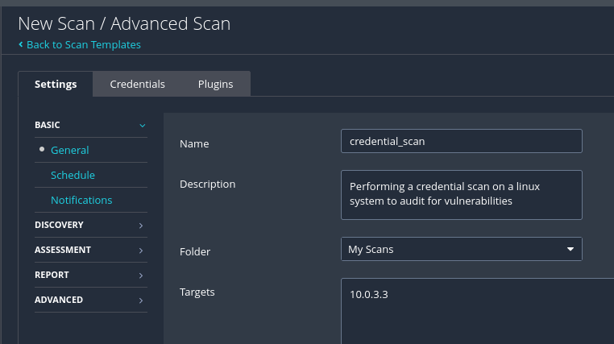

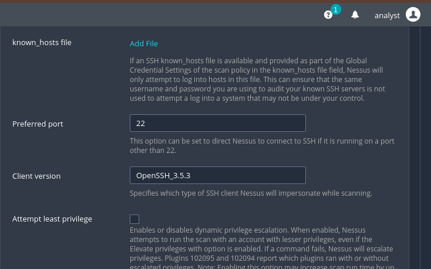

#### Credentialed Scan Results

The scan completed in 16 minutes and returned 94 vulnerabilities across all severity levels. Authentication passed successfully. The OS was identified as Linux Kernel 6.12.25-amd64.


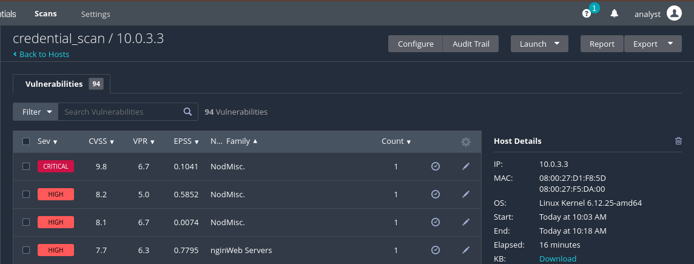

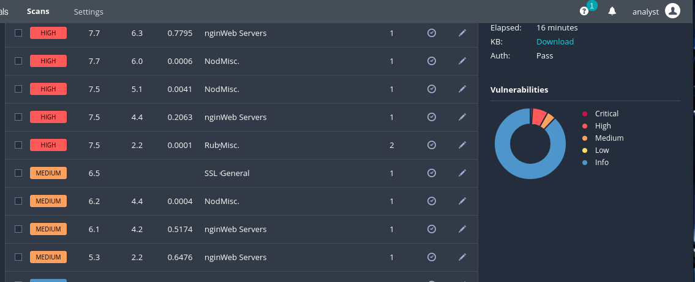

The key point here: unauthenticated scans miss most of this. The 94 findings are only visible because Nessus was given privileged access to inspect the system internals. Without credentials, the scanner cannot see installed package versions or kernel-level issues.

---

### Phase 3: Deploying the Vulnerable Web Service

#### Why Nginx 1.15.5

Before running the web application scan, a vulnerable target was needed. The system already had Nginx 1.26.3 installed, a current release with no meaningful CVEs. An initial web application scan was run against it to prove this point.

Nessus detected the version as 1.26.3 with no high or medium severity findings:


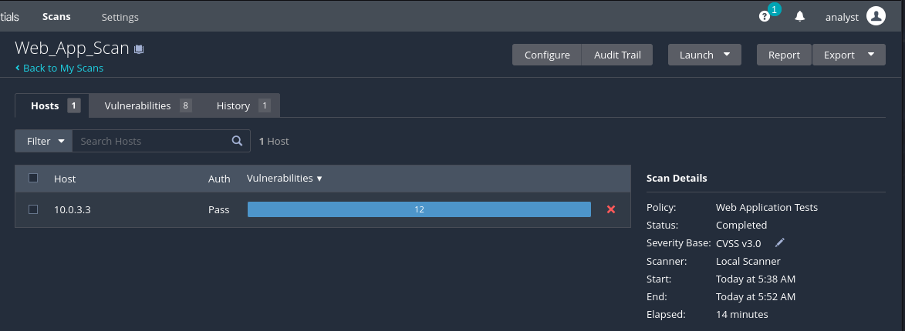

No findings on a current version, exactly as expected. To demonstrate real vulnerability detection, version 1.15.5 was deliberately installed.

#### Removing the Current Version and Installing Nginx 1.15.5 from Source

```bash
sudo apt remove nginx nginx-common nginx-core -y
wget http://nginx.org/download/nginx-1.15.5.tar.gz
```


Build dependencies installed and Nginx compiled from source:

```bash
sudo apt install build-essential libpcre3 libpcre3-dev zlib1g zlib1g-dev libssl-dev
tar -zxvf nginx-1.15.5.tar.gz
cd nginx-1.15.5
./configure
make
sudo make install
```


Version confirmed before scanning:

```bash
/usr/local/nginx/sbin/nginx -v
# nginx version: nginx/1.15.5
```

Service started and configuration syntax verified:

```bash
sudo /usr/local/nginx/sbin/nginx
sudo /usr/local/nginx/sbin/nginx -t
# nginx: configuration file syntax is ok
```

---

### Phase 4: Web Application Vulnerability Scan

#### Running the New Web Application Scan

With Nginx 1.15.5 running, a new Web Application Tests scan was created in Nessus targeting `10.0.3.3`. This scan type is specifically designed for HTTP service analysis.

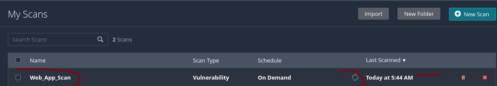

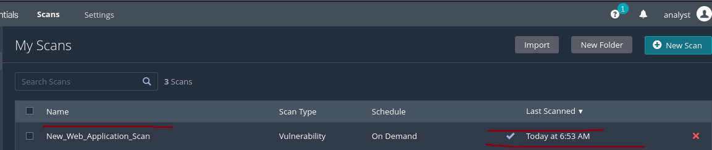

The scan completed in 18 minutes and returned 11 vulnerabilities including 4 High and 5 Medium severity findings, mapping to 4 distinct high-severity and 4 medium-severity CVE groups.

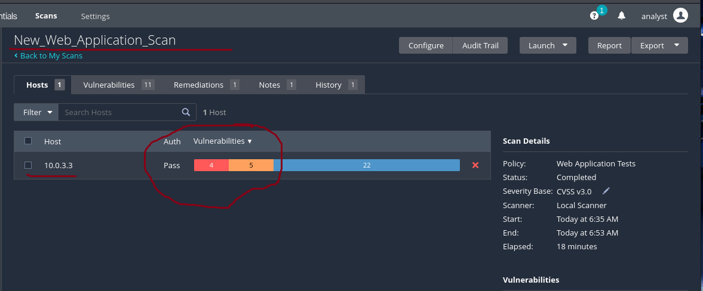

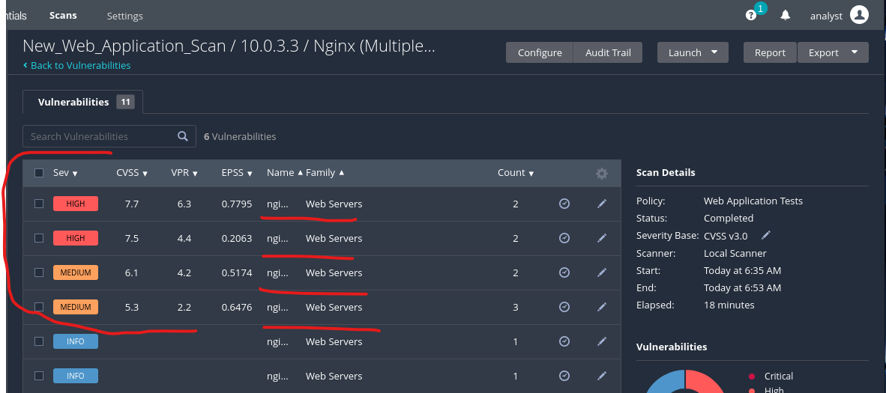

---

### Phase 5: Vulnerabilities Found and Documented

#### Vulnerability 1: nginx 0.6.x < 1.20.1 -- 1-Byte Memory Overwrite RCE

**Nessus Plugin ID:** 150154
**Severity:** High
**CVE:** CVE-2021-23017
**CVSS v3.0 Score:** 7.7
**Exploit Available:** Yes

A memory corruption flaw in the Nginx resolver module allows an unauthenticated remote attacker to send a specially crafted DNS response that causes a 1-byte memory overwrite. The result is either a worker process crash or arbitrary code execution depending on what occupies the adjacent memory region. The resolver must be enabled in the Nginx configuration for this to be exploitable.

This finding is particularly serious because exploits are publicly available and the attack requires no authentication. The patch was published May 25, 2021. Running Nginx 1.15.5 means running a version nearly three years behind this fix.

**Affected versions:** nginx 0.6.18 through 1.20.0
**Fixed in:** nginx 1.20.1 (stable), 1.21.0 (mainline)

---

#### Vulnerability 2: nginx 1.9.5 < 1.16.1 / 1.17.x < 1.17.3 -- HTTP/2 Multiple DoS

**Nessus Plugin ID:** 127907
**Severity:** High
**CVEs:** CVE-2019-9511, CVE-2019-9513, CVE-2019-9516
**CVSS v3.0 Score:** 7.5 each
**Exploit Available:** No public exploit code

Three denial-of-service vulnerabilities in the HTTP/2 protocol stack. Each uses a different mechanism to crash or exhaust the server:

| Sub-CVE | Attack Method | Impact |
|---|---|---|
| CVE-2019-9511 | Manipulate window size and stream priority | Excessive CPU and memory usage |
| CVE-2019-9513 | Continuously shuffle stream priorities | Resource exhaustion via priority churn |
| CVE-2019-9516 | Send zero-length header names and values | Server crash via malformed header handling |

All three require only network access and no authentication. An attacker can use any one of them to take the web server offline. The patch was available since August 13, 2019, meaning this version of Nginx carried these flaws for over six years at the time of this assessment.

**Affected versions:** nginx 1.9.5 through 1.16.0 and 1.17.0 through 1.17.2
**Fixed in:** nginx 1.16.1 (stable), 1.17.3 (mainline)

---

#### Vulnerability 3: nginx 1.x < 1.14.1 / 1.15.x < 1.15.6 -- HTTP/2 and MP4 Module Issues

**Nessus Plugin ID:** 118956
**Severity:** Medium
**CVEs:** CVE-2018-16843, CVE-2018-16844, CVE-2018-16845
**CVSS v3.0 Score:** 6.1 each
**Exploit Available:** No

Three resource exhaustion vulnerabilities tied to the HTTP/2 module and the MP4 module:

| Sub-CVE | Component | Impact |
|---|---|---|
| CVE-2018-16843 | ngx_http_v2_module | Excessive memory consumption |
| CVE-2018-16844 | ngx_http_v2_module | Excessive CPU consumption |
| CVE-2018-16845 | ngx_http_mp4_module | Worker process crash or memory disclosure |

These represent a real availability risk. Under sustained attack these flaws can degrade server performance to the point of effective denial of service even without a clean crash. Patch was available November 6, 2018.

**Affected versions:** nginx 1.x before 1.14.1, nginx 1.15.x before 1.15.6
**Fixed in:** nginx 1.14.1 (stable), 1.15.6 (mainline)

---

#### Vulnerability 4: nginx < 1.17.7 -- Information Disclosure via HTTP Request Smuggling

**Nessus Plugin ID:** 134220
**Severity:** Medium
**CVE:** CVE-2019-20372
**CVSS v3.0 Score:** 5.3
**Exploit Available:** Yes

When Nginx is configured with certain `error_page` directives and placed behind a load balancer, an attacker can craft HTTP requests that smuggle a secondary request past the load balancer. This allows reading of web pages that should be inaccessible to the requesting client.

The CVSS score is relatively low but the practical impact in a production environment with a load balancer in front of Nginx is significant. Sensitive internal pages can be read without authorization. Exploits are publicly available and the patch has been out since December 24, 2019.

**Affected versions:** nginx before 1.17.7
**Fixed in:** nginx 1.17.7

---

### Phase 6: Configuring Automated Email Reporting

#### Why Automated Reporting Matters

In a real SOC, scan results that stay inside the scanner are scan results that do not get acted on. The reporting loop needs to reach the analyst automatically. Nessus was configured to send vulnerability reports directly to an email inbox using Gmail SMTP.

#### SMTP Configuration in Nessus

Navigate to: **Settings > SMTP Server**

| Setting | Value |
|---|---|
| SMTP Host | smtp.gmail.com |
| Port | 587 |
| Encryption | Force TLS |
| Authentication | Gmail App Password |

Force TLS ensures all report data is encrypted in transit. Port 587 is the standard STARTTLS submission port for Gmail. See `docs/ossec-smtp-config.md` for the full configuration reference including troubleshooting and automation steps.


#### Generating the Gmail App Password

2-Step Verification was enabled on the Google account and a dedicated app password generated specifically for Nessus. Using an app password rather than the account password limits scope and allows independent revocation without affecting the main account credentials.

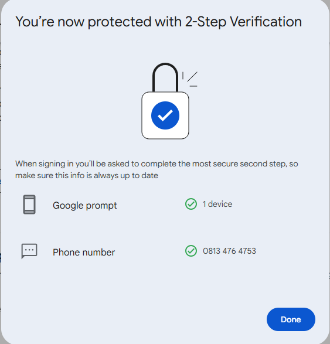

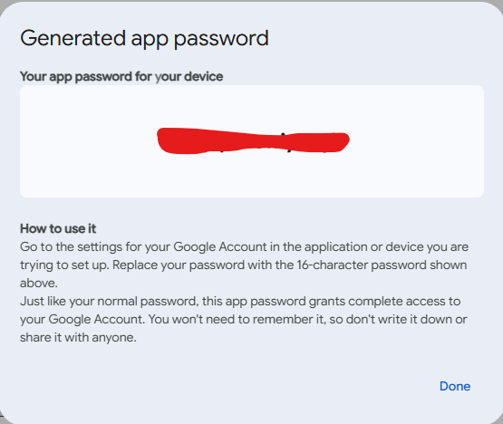

#### Confirming Email Delivery

The Send Test Email function in Nessus was used to validate the full delivery chain. The test message arrived in the inbox confirming the SMTP configuration was correct end to end.


---

### Phase 7: Patch Management with Ansible

#### Why Ansible and Not Manual Patching

Manual patching is not scalable and not auditable. If you patch twenty servers by hand you have no guarantee they were all patched the same way. Ansible solves this by expressing the desired state of a system in a YAML file and executing it consistently every time.

#### Installing Ansible

```bash
sudo apt update && sudo apt install ansible -y
ansible --version
# ansible [core 2.19.2]
```


#### The Ansible Playbook

The playbook `update_nginx.yml` performs four tasks: remove any manually installed Nginx, update the system package lists, install the latest Nginx version from the package manager, and start and enable the service. The same playbook can be run against any number of hosts and produces the same result every time.

```yaml
# update_nginx.yml
# Author: Ejoke John Oghenekewe | Cybersecurity Analyst
# Purpose: Remove manually installed Nginx 1.15.5, install latest stable version
# Usage: ansible-playbook update_nginx.yml --ask-become-pass

- name: Patch Nginx on Kali Linux
  hosts: localhost
  become: yes
  tasks:

    - name: Remove outdated Nginx if installed manually
      file:
        path: /usr/local/nginx
        state: absent

    - name: Ensure system package lists are updated
      apt:
        update_cache: yes

    - name: Install latest Nginx
      apt:
        name: nginx
        state: latest

    - name: Start and enable Nginx service
      systemd:
        name: nginx
        state: started
        enabled: yes
```

**Task-by-task breakdown:**

- `state: absent` on `/usr/local/nginx` removes the source-compiled 1.15.5 entirely before the package manager version installs, preventing version conflicts
- `update_cache: yes` forces a fresh package list fetch so `state: latest` pulls from current repo data and not a stale cache
- `state: latest` tells Ansible to pull the most current available version, not just ensure any version is present
- `systemd` task with `enabled: yes` ensures the service survives reboots, which matters in any environment where the host is not always on


#### Executing the Playbook

```bash
ansible-playbook update_nginx.yml --ask-become-pass
```


All tasks changed, no failures, no unreachable hosts.

#### Verifying the Patch

```bash
nginx -version
# nginx version: nginx/1.28.0
```


Nginx went from 1.15.5 to 1.28.0. All seven CVEs identified by Nessus are patched in 1.28.0. Remediation rate: 100%.

---

## Scripts and Configuration Files

### Ansible Playbook: update_nginx.yml

The full playbook is in the repository root. It is idempotent, meaning running it multiple times produces the same result without side effects. To use it:

```bash
# Clone the repository
git clone https://github.com/john-ejoke/nessus-vulnerability-assessment.git
cd nessus-vulnerability-assessment

# Run the playbook (will prompt for sudo password)
ansible-playbook update_nginx.yml --ask-become-pass
```

For use against remote hosts, replace `localhost` in the `hosts` field with a target IP or hostname, and ensure SSH key-based authentication is configured between the control node and the target.

### SSH Configuration for Nessus Credentialed Scanning

The following SSH hardening was applied to the target host to support credentialed scanning while maintaining security posture:

```bash
# /etc/ssh/sshd_config relevant settings
PermitRootLogin no
PasswordAuthentication yes       # Required for Nessus credential auth
PubkeyAuthentication yes
Port 22
ListenAddress 0.0.0.0
```

After editing, reload the service:

```bash
sudo systemctl reload ssh
```

> In production environments, replace `PasswordAuthentication yes` with key-based authentication and pass the private key path directly into the Nessus credentials tab instead of a password.

### Nessus Scan Policy: Advanced Scan Settings

The credentialed scan was configured with the following non-default settings:

```
Scan Type:        Advanced Scan
Target:           10.0.3.3
Credentials:      SSH - Username/Password
SSH Port:         22
SSH Client:       OpenSSH_3.5.3
Plugin Families:  All enabled
Severity Base:    CVSS v3.0
```

The web application scan used the following:

```
Scan Type:        Web Application Tests
Target:           10.0.3.3
Policy:           Web Application Tests
Severity Base:    CVSS v3.0
```

### Gmail SMTP Configuration

Full SMTP setup reference is documented in `docs/ossec-smtp-config.md`. Quick reference:

```
Host:         smtp.gmail.com
Port:         587
Encryption:   Force TLS
Auth:         App Password (16 characters, spaces ignored)
Trigger:      On scan completion
```

### Nessus Nginx Detection: Plugin Reference

Key plugin IDs used in this assessment for tracking and re-scanning:

| Plugin ID | Name | CVEs Covered |
|---|---|---|
| 136340 | nginx Installed (Linux/UNIX) | Detection only |
| 150154 | nginx 0.6.x < 1.20.1 Memory Overwrite | CVE-2021-23017 |
| 127907 | nginx HTTP/2 Multiple DoS | CVE-2019-9511, CVE-2019-9513, CVE-2019-9516 |
| 118956 | nginx HTTP/2 and MP4 Module Issues | CVE-2018-16843, CVE-2018-16844, CVE-2018-16845 |
| 134220 | nginx Information Disclosure | CVE-2019-20372 |

---

## Vulnerability Summary

| CVE | Severity | CVSS v3.0 | Exploit Available | Status |
|---|---|---|---|---|
| CVE-2021-23017 | High | 7.7 | Yes | Patched |
| CVE-2019-9511 | High | 7.5 | No | Patched |
| CVE-2019-9513 | High | 7.5 | No | Patched |
| CVE-2019-9516 | High | 7.5 | No | Patched |
| CVE-2018-16843 | Medium | 6.1 | No | Patched |
| CVE-2018-16844 | Medium | 6.1 | No | Patched |
| CVE-2018-16845 | Medium | 6.1 | No | Patched |
| CVE-2019-20372 | Medium | 5.3 | Yes | Patched |

---

## Risk Assessment

| Likelihood | Impact | Overall Risk | Vulnerabilities |
|---|---|---|---|
| High | High | Critical | CVE-2021-23017 (RCE with public exploit) |
| Medium | High | High | CVE-2019-9511, CVE-2019-9513, CVE-2019-9516 (HTTP/2 DoS) |
| Medium | Medium | Moderate | CVE-2018-16843, CVE-2018-16844, CVE-2018-16845 (Resource exhaustion) |
| Low | Medium | Low | CVE-2019-20372 (Information disclosure) |

---

## Technical Decisions Worth Understanding

**Why credentialed scanning changes everything**

An unauthenticated scan sees what any attacker on the network can see: open ports, service banners, TLS configurations. A credentialed scan sees what is actually installed, what version it is, how it is configured, and what the kernel looks like. The difference in findings is not marginal. In this assessment the credentialed scan returned 94 vulnerabilities. An unauthenticated scan of the same host would have returned a fraction of that. Any vulnerability management programme that uses only unauthenticated scans is leaving the majority of its risk surface unexamined.

**Why Nginx 1.15.5 was compiled from source rather than using a package manager**

Installing Nginx 1.15.5 from source gave precise version control. Package managers often have complex dependency trees that can interfere with clean version pinning. Compiling from source also mirrors how many legacy production deployments actually work, where someone installed from source years ago and no automated update process has ever touched it.

**Why Ansible over a shell script**

A shell script that patches one server is a shell script. An Ansible playbook that patches one server is an Ansible playbook that patches a hundred servers with one command change. The YAML is readable, version-controllable, peer-reviewable, and auditable. These properties matter in enterprise security operations where change management and audit trails are not optional.

**Why Force TLS for SMTP and not just TLS**

Standard TLS for SMTP allows the connection to downgrade to plaintext if TLS negotiation fails. Force TLS refuses the connection entirely if TLS is not available. For a channel carrying vulnerability report data, allowing plaintext fallback is not acceptable.

---

## Recommendations for Production Environments

**Immediate (30 days)**

- Deploy Nessus or Tenable.io with credentialed scanning enabled across all production hosts
- Alert on any web server running a version older than the current stable release
- Establish Ansible or equivalent IaC tooling for patch deployment across all environments

**Short term (90 days)**

- Schedule monthly authenticated vulnerability scans with automated email delivery to the security team
- Integrate Nessus findings into a SIEM platform such as Splunk or Microsoft Sentinel for correlation with security events
- Document a formal patch management SLA: Critical within 7 days, High within 30 days, Medium within 90 days

**Long term (6 months)**

- Build a continuous vulnerability management programme aligned with NIST SP 800-40 and ISO/IEC 27001 Control A.12.6
- Implement configuration baselines using CIS Benchmarks for Linux and Nginx
- Conduct quarterly penetration tests to validate that patched vulnerabilities are genuinely remediated and not just updated in the scanner

---

## Frameworks Referenced

| Framework | Application in This Project |
|---|---|
| NIST SP 800-40 | Patch management lifecycle and remediation prioritisation |
| ISO/IEC 27001 | Vulnerability management as a control within information security governance |
| NIST Cybersecurity Framework | Identify, Protect, Detect, Respond, Recover mapped across all project phases |
| CVSS v3.0 | Scoring and prioritisation of all identified vulnerabilities |
| CIS Benchmarks | Referenced in hardening recommendations |

---

## Connect

**LinkedIn:** https://www.linkedin.com/in/john-ejoke/
**Email:** ejoke.john4socanalyst@outlook.com
**GitHub:** https://github.com/john-ejoke

---

*Built in a controlled lab environment. Every finding is real. Every fix is documented.*
