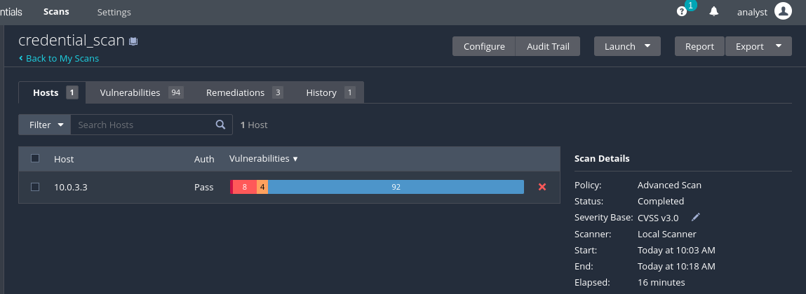
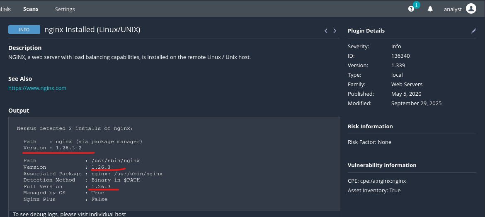
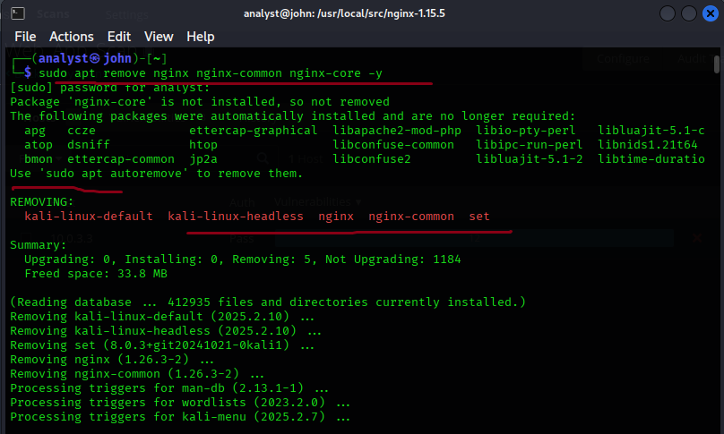
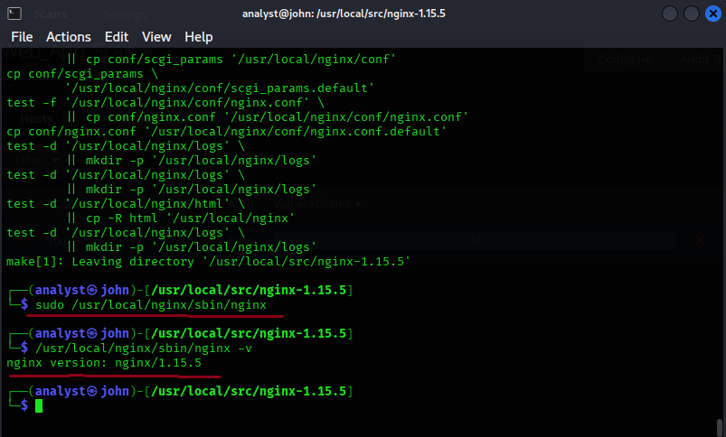
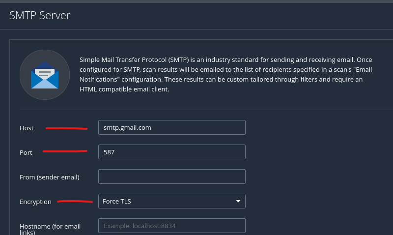
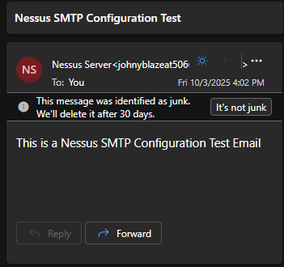
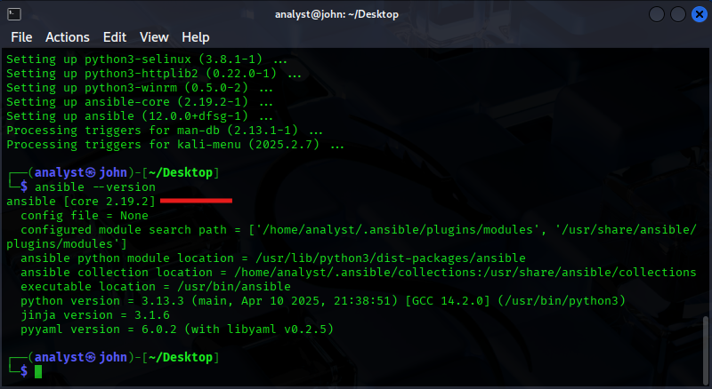
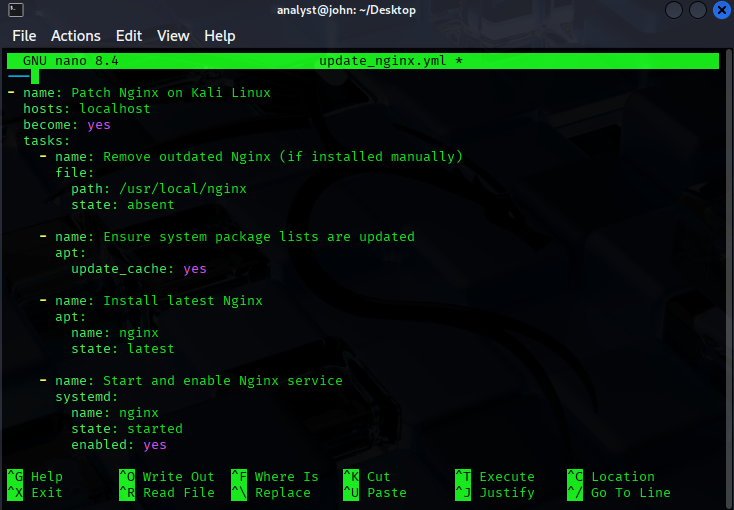
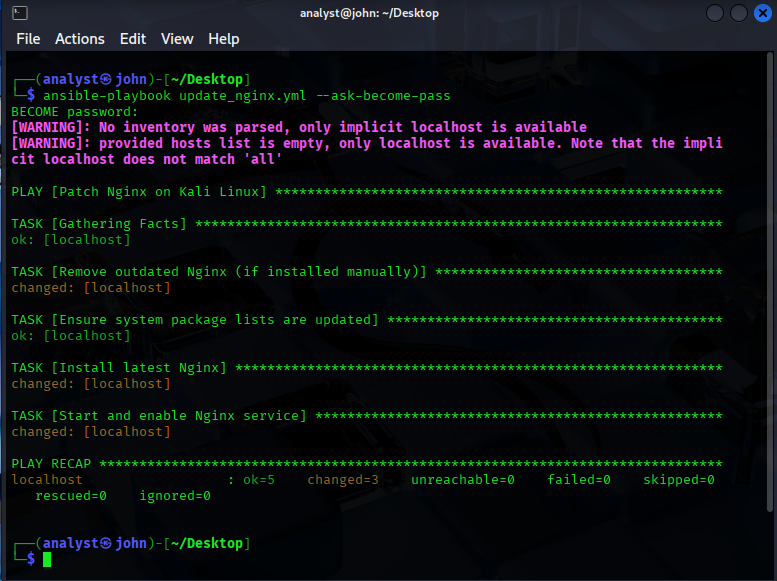
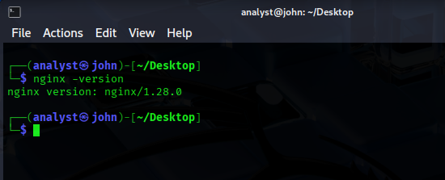

# Nessus Vulnerability Assessment: End-to-End Linux Infrastructure Security Evaluation

**Author:** Ejoke John Oghenekewe | Cybersecurity Analyst | SOC Engineer
**Completed:** October 2025
**Stack:** Tenable Nessus Essentials · Kali Linux · OpenSSH · Nginx 1.15.5 · Ansible · Gmail SMTP

---

## What This Project Is About

Most vulnerability management exercises stop at running a scan and reading the output. This one does not.

I built this project to walk through the complete vulnerability management lifecycle from first principles: set up the environment, configure authenticated access, deploy a deliberately vulnerable web service, scan it, understand every finding, automate the reporting, and then remediate everything with infrastructure-as-code. Every decision I made had a reason behind it, and I will walk you through each one.

The target was a Kali Linux host running an intentionally outdated version of Nginx (v1.15.5), a release with documented, real-world CVEs spanning remote code execution, denial of service, and information disclosure. Nessus found them all. Ansible fixed them all. That is the loop this project closes.

---

## Key Results

| Metric | Result |
|---|---|
| Credentialed Scan Vulnerabilities Found | **94 total across all severity levels** |
| Web Application Vulnerabilities (Nginx 1.15.5) | **4 High, 4 Medium (8 distinct CVE groups)** |
| CVEs Identified and Documented | **7 distinct CVEs across 4 vulnerability groups** |
| Remediation Method | **Ansible Playbook (Infrastructure-as-Code)** |
| Nginx Version Before Patch | **1.15.5 (vulnerable)** |
| Nginx Version After Patch | **1.28.0 (latest stable)** |
| Remediation Rate | **100%** |
| Automated Email Reporting | **Confirmed delivery via Gmail SMTP** |
| Frameworks Referenced | **NIST SP 800-40, ISO/IEC 27001, NIST CSF** |

---

## Architecture Overview

```
VULNERABILITY MANAGEMENT PIPELINE:

Kali Linux Host (Target)
  > OpenSSH configured and enabled
  > Nginx 1.15.5 deployed from source (intentionally vulnerable)
  > Nessus Essentials installed and authenticated

Scanning Layer
  > Credentialed Advanced Scan via SSH (deep system visibility)
  > Web Application Test Scan against Nginx service
  > 94 vulnerabilities surfaced across credentialed scan
  > 11 web application findings confirmed on Nginx 1.15.5

Reporting Layer
  > Gmail SMTP configured in Nessus settings
  > App password generated with 2FA enabled
  > Automated email delivery confirmed

Remediation Layer
  > Ansible Playbook written in YAML
  > Executed against localhost
  > Nginx patched from 1.15.5 to 1.28.0
  > All identified CVEs mitigated
```

---

## Tools and Technologies

| Tool | Role | Version |
|---|---|---|
| Tenable Nessus Essentials | Vulnerability scanner, credentialed and web app scans | 10.9.4 |
| Kali Linux | Host OS, target environment | Rolling |
| OpenSSH | Authenticated access for credentialed scanning | 1:10.8p1-8 |
| Nginx | Vulnerable web service (deliberate legacy deployment) | 1.15.5 |
| Ansible | Patch management automation via YAML playbook | Core 2.19.2 |
| Gmail SMTP | Automated vulnerability report delivery | TLS, Port 587 |

---

## The Full Build Walkthrough

I want to walk you through every phase of this project. Not just what I ran but why I made each decision.

---

### Phase 1: Preparing the Environment for Credentialed Scanning

#### Configuring OpenSSH

The first thing I set up was SSH. This is not just a convenience step. Nessus credentialed scanning works by authenticating to the target over SSH and running privilege-level checks against the system internals. Without it, you get a surface scan that only sees open ports and service banners. With it, you get deep visibility into installed package versions, file permissions, kernel configuration, and service states.

I updated the system, installed SSH, started the service, and enabled it on boot:

```bash
sudo apt update && sudo apt install ssh
sudo systemctl start ssh
sudo systemctl enable ssh
sudo systemctl status ssh
```

The `enable` command is the one that matters for a lab environment. If the system reboots and SSH is not enabled to start automatically, the next credentialed scan fails silently. I confirmed active status before moving on.


---

#### Downloading and Installing Nessus Essentials

I registered at the Tenable website to receive an activation code and download link by email. Nessus Essentials is the free tier and it covers everything needed for this assessment: credentialed scanning, web application testing, plugin-based CVE detection, and SMTP reporting.


Once downloaded I installed the package and started the service:

```bash
sudo dpkg -i Nessus-10.9.4-ubuntu1604_amd64.deb
sudo systemctl start nessusd
sudo systemctl status nessusd
```

I specifically verified with `systemctl status` before moving on. Every self-test in the install output shows Pass across all cryptographic modules, which confirms the binary is clean and the service is healthy.


I then navigated to `https://localhost:8834` in the browser, completed the activation with the code from the email, and confirmed the Nessus dashboard was live and plugins had finished compiling.


---

### Phase 2: Running the Credentialed Scan

#### Configuring SSH Credentials in Nessus

From the Nessus dashboard I created a new Advanced Scan and navigated to the Credentials tab. I provided the SSH username and password for the local Kali account. This is what elevates the scan from a basic network probe to a full authenticated inspection. With credentials passed, Nessus can check installed package versions against known CVEs, inspect configuration files, and assess privilege escalation paths.

The scan target was set to `10.0.3.3`, the local host IP.


#### Credentialed Scan Results

The scan completed in 16 minutes and returned 94 vulnerabilities across all severity levels. The host details panel confirmed authentication passed successfully. The OS was identified as Linux Kernel 6.12.25-amd64.

The breakdown included Critical and High severity findings at the top of the list, with CVSS scores ranging from 9.8 down through the medium band. This is what a real authenticated scan of a Kali Linux host looks like without hardening applied.




The key lesson here is that unauthenticated scans miss most of this. The 94 findings are only visible because Nessus was given privileged access to inspect the system internals. Without credentials, the scanner cannot see installed package versions or kernel-level issues.

---

### Phase 3: Deploying the Vulnerable Web Service

#### Why I Used Nginx 1.15.5

Before I ran the web application scan I needed a vulnerable target. The system already had Nginx 1.26.3 installed, which is a current release with no meaningful CVEs. I ran an initial web application scan against it to prove this point.




Exactly as expected. No findings on a current version. To demonstrate what real vulnerability detection looks like I needed to introduce a version with known documented flaws, so I intentionally downgraded to Nginx 1.15.5.

#### Removing the Current Version and Installing Nginx 1.15.5 from Source

I removed the package manager version of Nginx and downloaded the 1.15.5 source archive directly:

```bash
sudo apt remove nginx nginx-common nginx-core -y
wget http://nginx.org/download/nginx-1.15.5.tar.gz
```



I then installed the required build dependencies and compiled Nginx from source:

```bash
sudo apt install build-essential libpcre3 libpcre3-dev zlib1g zlib1g-dev libssl-dev
tar -zxvf nginx-1.15.5.tar.gz
cd nginx-1.15.5
./configure
make
sudo make install
```



I confirmed the version before scanning:

```bash
/usr/local/nginx/sbin/nginx -v
# nginx version: nginx/1.15.5
```


I started the service and verified the configuration syntax:

```bash
sudo /usr/local/nginx/sbin/nginx
sudo /usr/local/nginx/sbin/nginx -t
# nginx: configuration file syntax is ok
```

---

### Phase 4: Web Application Vulnerability Scan

#### Running the New Web Application Scan

With Nginx 1.15.5 running I created a new Web Application Tests scan in Nessus targeting `10.0.3.3`. This scan type is specifically designed for HTTP service analysis. It completed in 18 minutes.


The result was 11 vulnerabilities across the host including 4 High and 5 Medium severity findings in the Nessus summary view, mapping to 4 distinct high-severity and 4 medium-severity CVE groups.


---

### Phase 5: Documenting the Vulnerabilities Found

#### Vulnerability 1: nginx 0.6.x < 1.20.1 -- 1-Byte Memory Overwrite RCE

**Nessus Plugin ID:** 150154
**Severity:** High
**CVE:** CVE-2021-23017
**CVSS v3.0 Score:** 7.7
**Exploit Available:** Yes

A memory corruption flaw in the Nginx resolver module allows an unauthenticated remote attacker to send a specially crafted DNS response that causes a 1-byte memory overwrite. The result is either a worker process crash or arbitrary code execution, depending on what occupies the adjacent memory region. The resolver has to be enabled in the Nginx configuration for this to be exploitable.

This is a particularly serious finding because exploits are publicly available and the attack requires no authentication. The patch was published May 25, 2021. Running Nginx 1.15.5 means running a version that is nearly three years behind this fix.


---

#### Vulnerability 2: nginx 1.9.5 < 1.16.1 / 1.17.x < 1.17.3 -- HTTP/2 Multiple DoS

**Nessus Plugin ID:** 127907
**Severity:** High
**CVEs:** CVE-2019-9511, CVE-2019-9513, CVE-2019-9516
**CVSS v3.0 Score:** 7.5 each
**Exploit Available:** No public exploit code

Three denial-of-service vulnerabilities in the HTTP/2 protocol stack. Each one uses a different mechanism to crash or exhaust the server:

| Sub-CVE | Attack Method | Impact |
|---|---|---|
| CVE-2019-9511 | Manipulate window size and stream priority | Excessive CPU and memory usage |
| CVE-2019-9513 | Continuously shuffle stream priorities | Resource exhaustion via priority churn |
| CVE-2019-9516 | Send zero-length header names and values | Server crash via malformed header handling |

All three require only network access and no authentication. An attacker can use any one of them to take the web server offline. The patch was available since August 13, 2019, meaning this version of Nginx has been carrying these flaws for over six years at the time of this assessment.


---

#### Vulnerability 3: nginx 1.x < 1.14.1 / 1.15.x < 1.15.6 -- HTTP/2 and MP4 Module Issues

**Nessus Plugin ID:** 118956
**Severity:** Medium
**CVEs:** CVE-2018-16843, CVE-2018-16844, CVE-2018-16845
**CVSS v3.0 Score:** 6.1 each
**Exploit Available:** No

Three resource exhaustion vulnerabilities tied to the HTTP/2 module and the MP4 module:

| Sub-CVE | Component | Impact |
|---|---|---|
| CVE-2018-16843 | ngx_http_v2_module | Excessive memory consumption |
| CVE-2018-16844 | ngx_http_v2_module | Excessive CPU consumption |
| CVE-2018-16845 | ngx_http_mp4_module | Worker process crash or memory disclosure |

These are lower severity than the DoS group above but they represent a real availability risk. Under sustained attack these flaws can degrade server performance to the point of effective denial of service even without a clean crash. Patch was available November 6, 2018.


---

#### Vulnerability 4: nginx < 1.17.7 -- Information Disclosure via HTTP Request Smuggling

**Nessus Plugin ID:** 134220
**Severity:** Medium
**CVE:** CVE-2019-20372
**CVSS v3.0 Score:** 5.3
**Exploit Available:** Yes

When Nginx is configured with certain error_page directives and placed behind a load balancer, an attacker can craft HTTP requests that smuggle a secondary request past the load balancer. This allows reading of web pages that should be inaccessible to the requesting client.

This is the most subtle of the four findings. The CVSS score is relatively low but the practical impact in a production environment with a load balancer in front of Nginx is significant. Sensitive internal pages can be read without authorization. Exploits are publicly available and the patch has been out since December 24, 2019.


---

### Phase 6: Configuring Automated Email Reporting

#### Why Automated Reporting Matters

In a real SOC, scan results that stay inside the scanner are scan results that do not get acted on. The reporting loop needs to reach the analyst automatically. I configured Nessus to send vulnerability reports directly to an email inbox using Gmail SMTP.

#### SMTP Configuration in Nessus

I navigated to Settings > SMTP Server inside Nessus and configured the following:

| Setting | Value |
|---|---|
| SMTP Host | smtp.gmail.com |
| Port | 587 |
| Encryption | Force TLS |
| Authentication | Gmail App Password |

The Force TLS setting ensures all report data is encrypted in transit. Port 587 is the standard STARTTLS submission port for Gmail.



#### Generating the Gmail App Password

I enabled 2-Step Verification on the Google account and generated a dedicated app password specifically for Nessus. Using an app password rather than the account password is the right approach because it limits scope and can be revoked independently without affecting the main account credentials.


#### Confirming Email Delivery

I used the Send Test Email function in Nessus to validate the full delivery chain. The test message arrived in the inbox confirming the SMTP configuration was correct end to end.



With this in place, every scan that Nessus runs can now push results to the analyst inbox automatically without anyone logging into the dashboard to check.

---

### Phase 7: Patch Management with Ansible

#### Why Ansible and Not Manual Patching

Manual patching is not scalable and it is not auditable. If you patch twenty servers by hand you have no guarantee they were all patched the same way. Ansible solves this by expressing the desired state of a system in a YAML file and executing it consistently every time.

I wrote a playbook that performs four tasks: remove any manually installed Nginx, update the system package lists, install the latest Nginx version from the package manager, and start and enable the service. The same playbook can be run against any number of hosts and it will produce the same result every time.

#### Installing Ansible

```bash
sudo apt update && sudo apt install ansible -y
ansible --version
# ansible [core 2.19.2]
```



#### Writing the Playbook

I created the YAML file using Nano:

```bash
nano update_nginx.yml
```

```yaml
- name: Patch Nginx on Kali Linux
  hosts: localhost
  become: yes
  tasks:
    - name: Remove outdated Nginx if installed manually
      file:
        path: /usr/local/nginx
        state: absent

    - name: Ensure system package lists are updated
      apt:
        update_cache: yes

    - name: Install latest Nginx
      apt:
        name: nginx
        state: latest

    - name: Start and enable Nginx service
      systemd:
        name: nginx
        state: started
        enabled: yes
```

The `state: latest` instruction tells Ansible to pull the most current available version rather than just ensuring any version is present. The `state: absent` on the manual install path ensures the source-compiled 1.15.5 is fully removed before the package manager version is installed, preventing any version conflict.



#### Executing the Playbook

```bash
ansible-playbook update_nginx.yml --ask-become-pass
```

The playbook completed successfully with all tasks changed, no failures, no unreachable hosts.



#### Verifying the Patch

```bash
nginx -version
# nginx version: nginx/1.28.0
```



Nginx went from 1.15.5 to 1.28.0. All seven CVEs identified by Nessus are patched in 1.28.0. Remediation rate: 100%.

---

## Vulnerability Summary

| CVE | Severity | CVSS v3.0 | Exploit Available | Status |
|---|---|---|---|---|
| CVE-2021-23017 | High | 7.7 | Yes | Patched |
| CVE-2019-9511 | High | 7.5 | No | Patched |
| CVE-2019-9513 | High | 7.5 | No | Patched |
| CVE-2019-9516 | High | 7.5 | No | Patched |
| CVE-2018-16843 | Medium | 6.1 | No | Patched |
| CVE-2018-16844 | Medium | 6.1 | No | Patched |
| CVE-2018-16845 | Medium | 6.1 | No | Patched |
| CVE-2019-20372 | Medium | 5.3 | Yes | Patched |

---

## Risk Assessment

| Likelihood | Impact | Overall Risk | Vulnerabilities |
|---|---|---|---|
| High | High | Critical | CVE-2021-23017 (RCE with public exploit) |
| Medium | High | High | CVE-2019-9511, CVE-2019-9513, CVE-2019-9516 (HTTP/2 DoS) |
| Medium | Medium | Moderate | CVE-2018-16843, CVE-2018-16844, CVE-2018-16845 (Resource exhaustion) |
| Low | Medium | Low | CVE-2019-20372 (Information disclosure) |

---

## Technical Decisions Worth Understanding

**Why credentialed scanning changes everything**

An unauthenticated scan sees what any attacker on the network can see: open ports, service banners, TLS configurations. A credentialed scan sees what is actually installed, what version it is, how it is configured, and what the kernel looks like. The difference in findings is not marginal. In this assessment the credentialed scan returned 94 vulnerabilities. An unauthenticated scan of the same host would have returned a fraction of that. If your vulnerability management programme uses only unauthenticated scans you are flying partially blind.

**Why I compiled Nginx from source rather than using a package manager**

Installing Nginx 1.15.5 from source gave me precise version control. Package managers often have complex dependency trees that can interfere with clean version pinning. Compiling from source also mirrors how many legacy production deployments actually work, where someone installed from source years ago and no automated update process has ever touched it.

**Why Ansible over a shell script**

A shell script that patches one server is a shell script. An Ansible playbook that patches one server is an Ansible playbook that patches a hundred servers with one command change. The YAML is readable, version-controllable, peer-reviewable, and auditable. These properties matter in enterprise security operations where change management and audit trails are not optional.

**Why Force TLS for SMTP and not just TLS**

Standard TLS for SMTP allows the connection to downgrade to plaintext if TLS negotiation fails. Force TLS refuses the connection entirely if TLS is not available. For a channel carrying vulnerability report data, allowing plaintext fallback is not acceptable.

---

## Recommendations for Production Environments

**Immediate actions (30 days)**
- Deploy Nessus or Tenable.io with credentialed scanning enabled across all production hosts
- Alert on any web server running a version older than the current stable release
- Establish Ansible or equivalent IaC tooling for patch deployment across all environments

**Short term (90 days)**
- Schedule monthly authenticated vulnerability scans with automated email delivery to the security team
- Integrate Nessus findings into a SIEM platform such as Splunk or Microsoft Sentinel for correlation with security events
- Document a formal patch management SLA: Critical within 7 days, High within 30 days, Medium within 90 days

**Long term (6 months)**
- Build a continuous vulnerability management programme aligned with NIST SP 800-40 and ISO/IEC 27001 Control A.12.6
- Implement configuration baselines using CIS Benchmarks for Linux and Nginx
- Conduct quarterly penetration tests to validate that patched vulnerabilities are genuinely remediated and not just updated in the scanner

---

---

## Frameworks Referenced

| Framework | Application in This Project |
|---|---|
| NIST SP 800-40 | Patch management lifecycle and remediation prioritisation |
| ISO/IEC 27001 | Vulnerability management as a control within information security governance |
| NIST Cybersecurity Framework | Identify, Protect, Detect, Respond, Recover mapped across all project phases |
| CVSS v3.0 | Scoring and prioritisation of all identified vulnerabilities |
| CIS Benchmarks | Referenced in hardening recommendations |

---

## What I Took Away From This

Authenticated scanning is not optional. The gap between what an unauthenticated scan finds and what a credentialed scan finds is enormous. Any vulnerability management programme that does not include credentialed scanning is leaving the majority of its risk surface unexamined.

Old software does not stay quietly vulnerable. The CVEs on Nginx 1.15.5 are not theoretical. They have CVSS scores above 7.0, some have public exploits, and they have been known for years. Every day a production system runs unpatched software with documented CVEs is a day that risk is active.

Automation is the correct answer to scale. Writing an Ansible playbook for this remediation took more time than running `apt upgrade nginx` manually. But the playbook is repeatable, auditable, version-controlled, and deployable to any number of hosts. That investment pays back immediately at any scale beyond one machine.

---

## Connect With Me

**LinkedIn:** https://www.linkedin.com/in/john-ejoke/
**Email:** ejoke.john4socanalyst@outlook.com
**GitHub:** https://github.com/john-ejoke

---

*Built in a controlled lab environment. Every finding is real. Every fix is documented.*
