# Qualys Vulnerability Management

**Using Qualys to Identify and Remediate Vulnerabilities on Windows Machines**

**Author:** Ejoke John | Cybersecurity Analyst
**LinkedIn:** [linkedin.com/in/john-ejoke](https://www.linkedin.com/in/john-ejoke/)

---

## Overview

This project walks through a complete vulnerability management lifecycle using the Qualys Cloud Platform against a deliberately vulnerable Windows 10 virtual machine. I built the lab environment, deployed a Qualys Virtual Scanner Appliance, ran three scans in sequence : unauthenticated, authenticated, and post-remediation verification : and then remediated the findings between scans.

The numbers tell the story: the authenticated scan surfaced 132 confirmed vulnerabilities including four Severity 5 (Critical) findings tied to real-world CVEs. After targeted, priority-driven remediation, the verification scan confirmed a reduction to 22 vulnerabilities with zero critical findings remaining. That is an 83% reduction in confirmed risk on a single endpoint.

Alongside the technical documentation, I produced a formal executive report written for C-level stakeholders under a fictional organisation called GlobalTech Security : translating raw scan data into business risk language. That deliverable is included in the `reports/` folder and reflects the communication layer that separates a technical practitioner from an analyst who can work across an organisation.

---

## Skills Demonstrated

`Qualys VMDR` `TruRisk Platform` `Virtual Scanner Appliance Deployment` `Unauthenticated Scanning` `Authenticated Scanning` `CVSS Scoring` `Vulnerability Prioritisation` `Attack Surface Reduction` `SMB Hardening` `Windows Patch Management` `Configuration Hardening` `Executive Reporting` `Risk Communication`

---

## Environment

| Component | Details |
|---|---|
| Scanning Platform | Qualys Community Edition (qualysguard.qg2.apps.qualys.eu) |
| Virtual Scanner | Qualys Virtual Scanner Appliance deployed in VirtualBox, named JohnsVA |
| Target Machine | Windows 10 Home 64-bit VM : IP 172.20.10.2 (DESKTOP-O8C0H2E) |
| Hypervisor | Oracle VirtualBox with Bridged Adapter networking |
| Intentional Vulnerabilities | VLC Media Player 1.1.1, Firefox 94.0, SMBv1 enabled, weak security policy |

---

## Phase 1: Account Setup and Platform Access

I signed up for a Qualys partnership account and received credentials directly from a Qualys account manager. This gave me access to the full VMDR platform including TruRisk dashboards, asset management, scan configuration, and reporting modules.

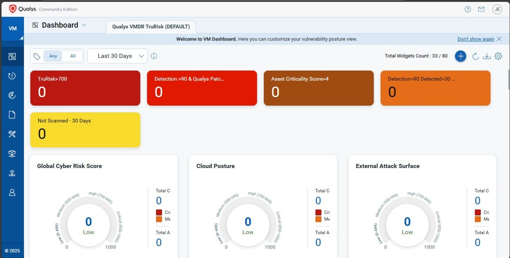

The VMDR dashboard below shows the initial state before any assets were registered. All risk scores read zero at this point : this is the clean baseline before the lab environment was connected to the scanner.

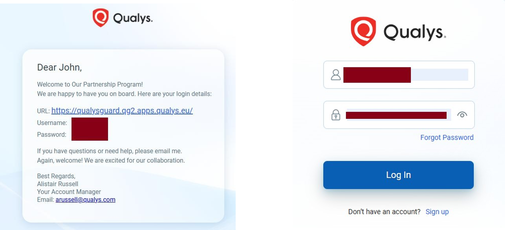

---

## Phase 2: Lab Environment Setup

I configured a Windows 10 virtual machine with intentionally outdated software to simulate the kind of security debt commonly found in real enterprise environments. The installed applications included VLC Media Player 1.1.1 and Firefox 94.0 : both carrying known critical vulnerabilities at the time of scanning.

The choice of these specific versions was deliberate. VLC 1.1.1 carries a stack-smashing vulnerability in SMB/CIFS access (VideoLAN-SA-1006). Firefox 94.0 is affected by MFSA2022-47 and the Use-After-Free vulnerability MFSA2024-51. SMBv1 was left enabled on the OS, the same protocol exploited by EternalBlue and the WannaCry ransomware outbreak. These reflect the kind of findings that appear regularly in real vulnerability scans of environments where updates and hardening have been deprioritised.

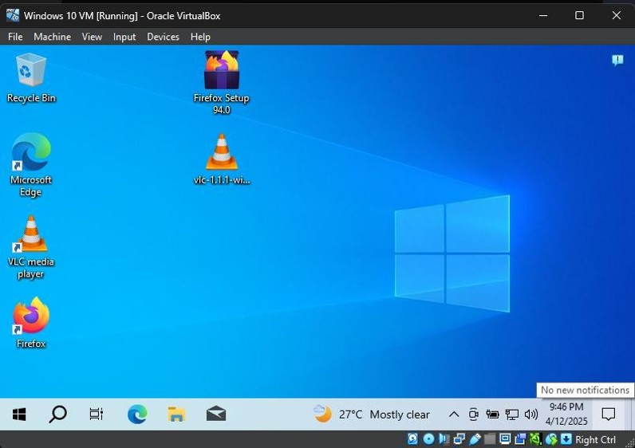

---

## Phase 3: Qualys Virtual Scanner Deployment

I downloaded the Qualys Virtual Scanner Appliance OVA and imported it into VirtualBox. During activation I entered the personalisation code from the Qualys web portal, which registered the scanner (JohnsVA) to my account. The scanner console showed the vulnerability signature database and engine components downloading and syncing in real time.

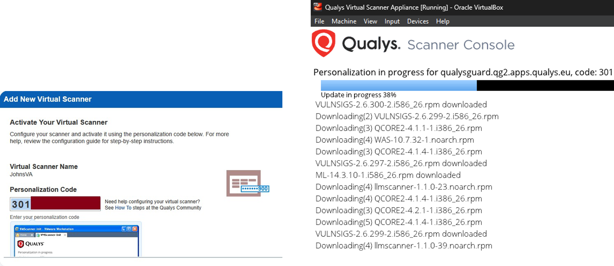

For the scanner to reach the target VM, both machines needed to sit on the same subnet. I configured both the Windows 10 VM and the Qualys Scanner Appliance to use Bridged Adapter mode attached to my Intel Wireless AC 9560 interface, placing them on the same network segment as my host machine.

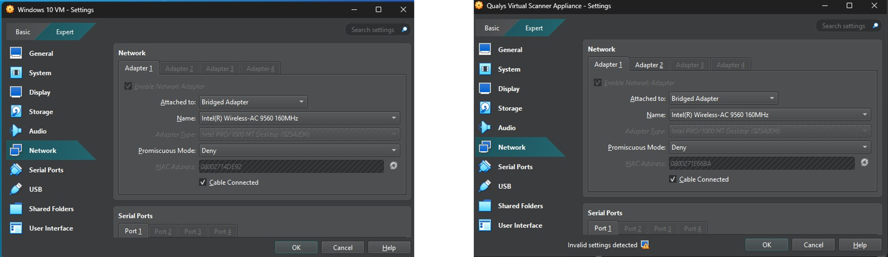

After completing the network configuration, the activation workflow confirmed JohnsVA had connected to the Qualys Enterprise TruRisk Platform and was ready to scan.

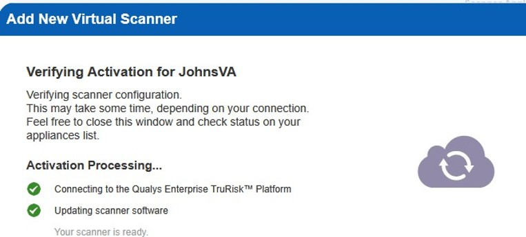

---

## Phase 4: Unauthenticated Scan

The first scan ran without credentials, simulating what an external attacker can observe from the network before gaining any access to the system.

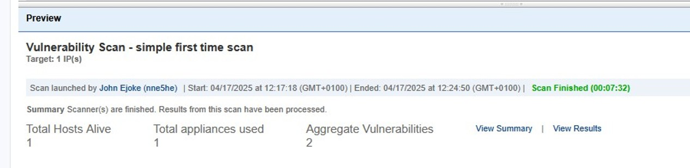

The scan returned 22 total findings but only 2 confirmed vulnerabilities, with a security risk average of 3.0. Findings were concentrated in TCP/IP, SMB/NetBIOS, and Windows categories.

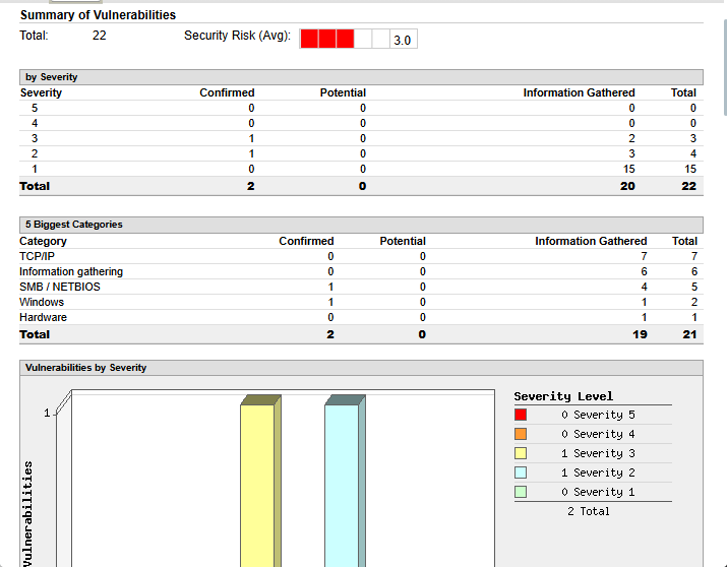

The two confirmed findings visible without credentials were SMBv2 Signing Not Required (Severity 3) and NetBIOS Name Accessible (Severity 2) : both network-level exposures usable for reconnaissance or SMB relay attacks.

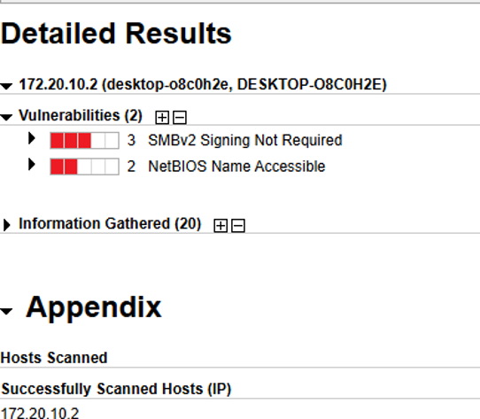

This limited result is expected and is the point. An unauthenticated scan cannot see installed software versions, missing patches, or local configuration weaknesses. The comparison with the authenticated scan below makes the case for credentialed scanning better than any documentation could.

---

## Phase 5: Authenticated Scan

The authenticated scan used Windows credentials to access the target machine internally. The difference was stark.

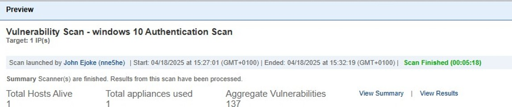

The scan returned 313 total findings with 132 confirmed vulnerabilities and a security risk average of 5.0. The severity breakdown included 4 Critical (Severity 5), 75 High (Severity 4), and 45 Medium (Severity 3) findings across the Local, Windows, Security Policy, and Information Gathering categories.

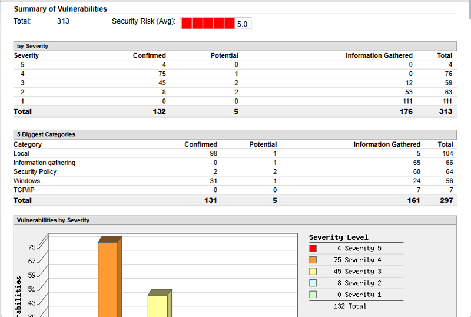

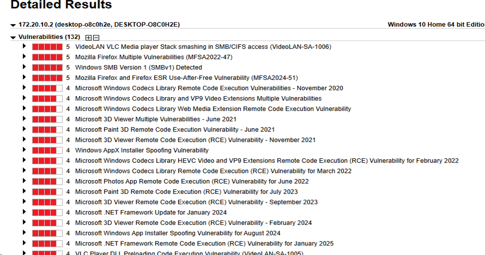

---

## Critical Findings : Pre-Remediation

| Severity | Finding | What an Attacker Could Do |
|---|---|---|
| 5 (Critical) | VLC 1.1.1 Stack Smashing in SMB/CIFS : VideoLAN-SA-1006 | Remote code execution via crafted SMB network request |
| 5 (Critical) | Firefox Multiple Vulnerabilities : MFSA2022-47 | Remote code execution and privilege escalation |
| 5 (Critical) | Firefox Use-After-Free : MFSA2024-51 | Memory corruption enabling arbitrary code execution |
| 5 (Critical) | Windows SMB Version 1 (SMBv1) Detected | Full system compromise via EternalBlue-style exploit |
| 4 (High) | Microsoft Windows Codecs Library RCE : Nov 2020 | RCE via crafted media file opened by a user |
| 4 (High) | Microsoft 3D Viewer RCE : Nov 2021 | Remote code execution through malicious 3D file |
| 4 (High) | Windows AppX Installer Spoofing | Privilege escalation via installer manipulation |
| 4 (High) | Microsoft .NET Framework RCE : Jan 2025 | Remote code execution in the .NET runtime |
| 4 (High) | Microsoft Paint 3D RCE : Jul 2023 | Code execution through crafted file |
| 4 (High) | VLC Player DLL Preloading RCE : VideoLAN-SA-1005 | Arbitrary code execution via malicious DLL sideloading |
| 3 (Medium) | SMBv2 Signing Not Required | Enables SMB relay attacks for credential theft |
| 3 (Medium) | Microsoft .NET Framework multiple updates (2023-2024) | Information disclosure and potential RCE |
| 2 (Low) | NetBIOS Name Accessible | Network reconnaissance and name poisoning |
| 2 (Low) | Enabled Cached Logon Credential | Offline credential extraction risk |
| 2 (Low) | Default Windows Administrator Account Name Present | Simplifies brute force targeting |

The presence of SMBv1 is worth calling out specifically. This is the protocol targeted by the EternalBlue exploit used in WannaCry and NotPetya. Microsoft disabled SMBv1 by default in Windows 10 from version 1709 onward, but it can be re-enabled manually or persist on systems that were upgraded rather than clean-installed. Finding it active on a Windows 10 machine in 2025 is not unusual in environments with poor configuration governance.

---

## Phase 6: Remediation

With 132 confirmed vulnerabilities ranked by severity, I worked through remediation in priority order rather than attempting to fix everything at once.

**Software removal and upgrade:** Uninstalled VLC 1.1.1 and Firefox 94.0, replaced with current secure versions. This single action eliminated all four Severity 5 findings.

**OS patching:** Applied all outstanding Windows security updates, closing the backlog of Microsoft RCE vulnerabilities across .NET Framework, Windows Codecs, 3D Viewer, Paint 3D, and Photos App.

**Protocol hardening:** Disabled SMBv1 entirely, enforced SMB signing, and disabled NetBIOS over TCP/IP.

**Policy hardening:** Addressed weak password policy settings, disabled Telnet, and enforced stricter access controls on sensitive paths.

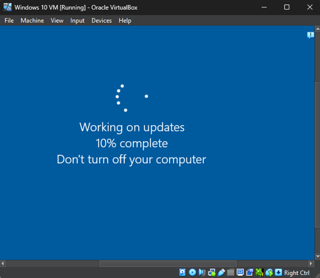

---

## Phase 7: Post-Remediation Verification Scan

After completing remediation, I ran a final authenticated scan to close the loop and produce evidence of the improvement.

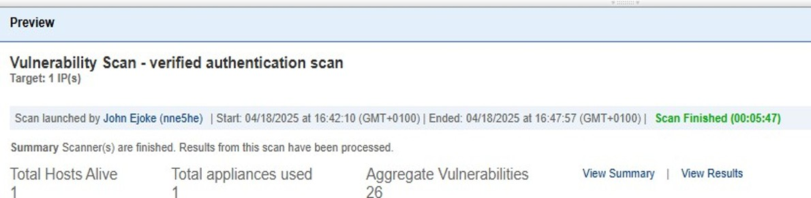

Total confirmed vulnerabilities dropped from 132 to 22. Zero Severity 5 findings remained. The security risk average fell from 5.0 to 4.0.

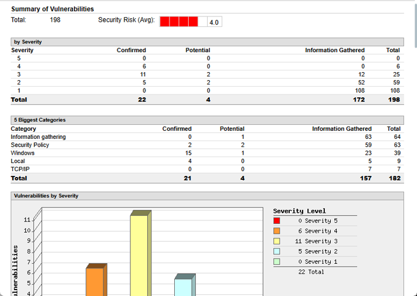

The remaining 22 findings consisted of lower-severity items including residual .NET Framework gaps, SMB configuration items, and informational findings. None represented the critical remote code execution exposure present before remediation.

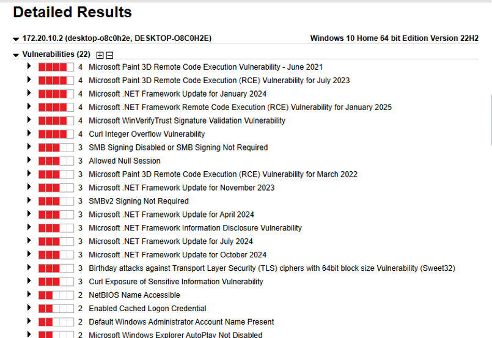

---

## Results Summary

| Metric | Pre-Remediation | Post-Remediation | Change |
|---|---|---|---|
| Confirmed Vulnerabilities | 132 | 22 | -83% |
| Severity 5 (Critical) | 4 | 0 | -100% |
| Severity 4 (High) | 75 | 6 | -92% |
| Severity 3 (Medium) | 45 | 11 | -76% |
| Security Risk Average | 5.0 | 4.0 | -1.0 |
| Total Aggregate Findings | 313 | 198 | -37% |

The complete elimination of all critical findings and a 92% reduction in high-severity vulnerabilities demonstrates what a prioritised remediation approach achieves. By targeting the four Severity 5 findings first : all of which traced back to two applications that had not been updated : the most dangerous attack surface was closed before addressing the longer tail of lower-severity items.

---

## Executive Deliverable

In a real enterprise environment, the technical work of running a vulnerability scan is only part of the job. The other part is communicating what the findings mean to people who make budget and risk decisions. I produced a formal executive report for GlobalTech Security, written for C-level stakeholders rather than technical staff.

The report covers the business case for proactive vulnerability management, a plain-language summary of the pre and post-remediation findings, ROI analysis referencing the IBM Security Cost of a Data Breach 2024 benchmark, and a five-point strategic roadmap for maturing the program. Key figures from the report: 83% vulnerability reduction, 100% of critical issues resolved, zero days of system downtime during the remediation process.

This is the kind of document I would produce for a security manager or CISO after completing a scanning initiative : bridging the gap between what the tool found and what the business needs to act on.

Available here: [`reports/GlobalTech_Security_Vulnerability_Management_Executive_Report.pdf`](reports/GlobalTech_Security_Vulnerability_Management_Executive_Report.pdf)

---

## Key Learnings

**Unauthenticated scanning gives you a perimeter view. Authenticated scanning gives you the truth.** Going from 2 visible network-level findings to 132 confirmed internal vulnerabilities on the same machine : without changing a single thing on the target : demonstrates this more clearly than any whitepaper. Any vulnerability management program that relies only on external scanning is working with an incomplete picture.

**Outdated software is the highest-impact, lowest-effort risk to fix.** All four Severity 5 findings traced back to two applications that had not been updated. Upgrading VLC and Firefox took minutes and eliminated the most dangerous attack vectors on the system. Software currency is not a glamorous control but the data from this project shows exactly why it matters.

**Remediation is only complete when it is verified.** Running the post-remediation scan closes the loop and produces the evidence needed to report meaningful risk reduction to stakeholders. Without that final scan, you have actions taken : not risk reduced. In a real environment, the verification scan is what you bring to your manager, your auditor, or your client.

---

## Related Projects

- [Nessus Vulnerability Assessment](https://github.com/john-ejoke/john-ejoke/tree/main/Vulnerability_Management/nessus-vulnerability-assessment) : Parallel vulnerability assessment using Tenable Nessus on the same lab infrastructure, providing a tool comparison perspective
- [SOC Home Lab Build](https://github.com/john-ejoke/john-ejoke/tree/main/SOC_Operations/soc-home-lab-build) : The SIEM and detection infrastructure that complements this vulnerability management work
- [Advanced Endpoint Telemetry with Splunk](https://github.com/john-ejoke/john-ejoke/tree/main/SOC_Operations/advanced-endpoint-telemetry-splunk) : Sysmon-to-Splunk telemetry pipeline covering the endpoint detection side of the same security operations picture
